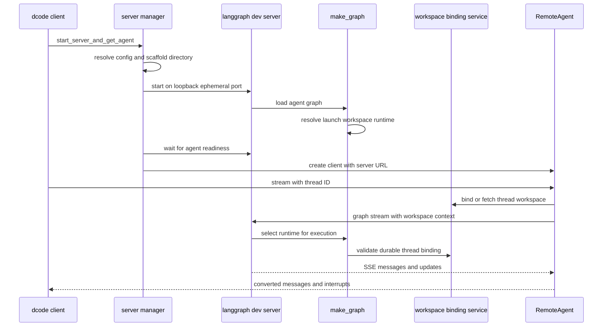

# dcode Runtime Behavior and Failure Handling

This page describes the normal interactive dcode path: a client owns a loopback `langgraph dev` subprocess and talks to its `agent` graph through `RemoteAgent` over HTTP and SSE. ACP's in-process stdio path is outside this page. See [Deep Agents Code Architecture](/openwiki/architecture/code-agent.md) for topology, [Configuration Layering](/openwiki/concepts/config-layering.md) for resolved policy, [State Persistence](/openwiki/concepts/state-persistence.md) for checkpoint ownership, and [Run a dcode session](/openwiki/workflows/run-dcode-session.md) for the operator flow.

**Evidence convention.** “Source-backed” below means an implemented control-flow contract. “Test-observed” means what a named test establishes with its fixture; it does not imply a live provider or external server unless the test actually uses one.

## Startup, binding, and request routing

`start_server_and_get_agent` captures the selected workspace, pre-validates an explicit MCP config, writes the resolved `ServerConfig`, scaffolds a temporary server directory, and starts `langgraph dev`. Its defaults bind to `127.0.0.1` on port `0`; the OS supplies an ephemeral port. It waits for `agent` readiness, creates `RemoteAgent`, and sets the workspace policy plus fingerprint. Until it returns successfully, it owns the process: its `finally` stops it after any startup/setup failure and after cancellation.

This sequence shows the startup handoff and the later per-request routing boundary. Startup uses the configured launch runtime; a context-bearing execution is routed by its durable thread workspace binding.

The `langgraph.json` graph factory is `make_graph`. When LangGraph provides execution context, `make_graph` requires a nonempty `config.configurable.thread_id` and a workspace context, validates that context against the durable thread binding, and selects a binding-specific runtime. Without execution context, it returns the launch/configured server runtime. This is deliberately not a single, indiscriminate global agent.

A `ServerRuntime` couples the compiled agent, its `CompositeBackend`, and the offload operation obtained from that same backend. The process runtime is constructed once behind a lock. Workspace runtimes have their own lock-protected LRU cache, keyed by immutable binding resource key and capped at 32 entries. Before building a missing entry, the server compares the current configuration fingerprint and workspace payload with the persisted binding. A process-wide sandbox may be claimed by only one workspace, preventing accidental cross-workspace sharing.

### Startup failures and construction constraints

Graph construction first snapshots the selected workspace environment and credentials, then uses that immutable environment while resolving project context, model, tools, extensions, and `create_cli_agent`. Filesystem/path resolution, model construction, plugin discovery, and synchronous agent construction are offloaded from the server event loop where necessary. Built-in `fetch_url` and thread-ID tools are present; web search depends on workspace credentials, MCP discovery is skipped with `no_mcp`, and criteria/rubric contexts retain only explicitly coherent read-only MCP tools.

Startup-barrier failures emit the `DEEPAGENTS_STARTUP_ERROR:` marker and exit nonzero. Parent health polling detects early child exit, extracts the marker from captured output, and includes the summary in the raised error. Request-scope users of `get_server_runtime` must contain `SystemExit`; the graph factory's startup behavior must not terminate an already-serving server in response to a request.

The child environment is also a safety boundary: server startup strips `PYTHONPATH` and other denylisted startup-influencing values. It retains the original `PYTHONPATH` only in the dedicated inherited carrier used later by agent execute commands, rather than placing it on the server interpreter's import path. Generated custom routes opt into LangGraph route auth when a deployment configures it; local launch sets noop auth and relies on loopback binding.

## Remote streaming and state lifecycle

`RemoteAgent.astream` requires a thread ID. `RemoteGraph` owns SSE parsing, `messages-tuple` negotiation, namespace extraction, and upstream interrupt detection. dcode adds the per-thread workspace descriptor to runtime context, requests `messages` and `updates` by default, converts serialized message dictionaries for the UI, and converts `__interrupt__` update payloads to `Interrupt` objects. State snapshots are intentionally left serialized. A malformed message is dropped and counted; a warning is emitted after the stream rather than terminating every subsequent event.

Workspace policy configuration and durable binding are separate steps. `set_workspace` requires policy and fingerprint together and clears cached per-thread descriptors. On first use of a thread, the client posts the requested workspace to `/dcode/threads/{thread_id}/workspace` and caches the server-validated response. On the server, that durable response governs runtime selection.

A checkpoint and the dev server's HTTP thread row also have independent lifecycles. `aget_state` treats a missing remote thread and the SDK's known no-checkpoint state-shape `TypeError` as empty state, but re-raises other state-read failures. `aensure_thread` registers the live HTTP row idempotently (`if_exists="do_nothing"`), allowing state mutation after a server restart when persistence retained a checkpoint but the server has not yet materialized its thread row.

For a state-update `409`, `RemoteAgent.aupdate_state` lists pending and running runs, cancels them concurrently with a per-run wait bound, then retries the update once. Cancellation is best effort: inability to obtain the SDK client or list runs is logged, and the one retry may still surface the conflict.

## Retries and interrupts

`CodeModelRetryMiddleware` wraps a model-node handler, not an entire agent turn. It is placed inside automatic compaction, so retrying a failed provider attempt does not replay completed tools, summary generation, or archive append. The middleware remains installed with a zero startup budget because a runtime-selected model can supply its own request-time retry budget.

`GraphBubbleUp` is passed through as graph control flow. Other failures are retried only while budget remains and classification identifies a transient `ModelError`, selected transport/SDK fault, HTTP `408`, `409`, `429`, or `5xx` status; terminal errors are re-raised rather than converted into fabricated AI output. A usable `Retry-After` is capped at 60 seconds; otherwise retry uses jittered exponential backoff starting at 0.2 seconds and capped at 10 seconds. Interactive model-node retries also have a cumulative 60-second delay guard.

Every model call has a `call_id`. The middleware emits correlated `model_attempt` start/complete events and a `model_retry` event. It tracks whether a failed attempt may already have sent a visible message chunk and records that as `output_may_have_started`, enabling the UI to mark a superseded partial answer as incomplete. Failure to write a diagnostic event is logged without failing the model run; `GraphBubbleUp` from the stream writer remains control flow.

Graph interrupts are likewise control flow, not provider failures. Unless `auto_approve` is enabled, the configured interrupt policy installs `AsyncApprovalHITLMiddleware`; an `interrupt_shell_only` configuration uses the restrictive shell allow-list path when available. Remote interrupt updates cross the same SSE updates stream.

## Recovering stale pending work

After a cancelled or lost run, `state_has_pending_work` considers queued nodes, tasks, and interrupts unfinished. `aabandon_pending_work` first requests cancellation of active runs, reads the checkpoint, computes error `ToolMessage` values only for unanswered tool calls in the trailing AI-message turn, and writes `__end__` to discard queued graph work. It then re-reads state and raises if a queued node, task, or interrupt remains. Using the trailing turn only preserves required adjacency between a tool use and its result and avoids appending invalid results for earlier interrupted turns.

This is a destructive recovery operation, not a resume. A caller must not compact or represent cancellation as successful until the final verification succeeds.

## Shutdown and operations

`ServerProcess` owns the local child lifecycle. On POSIX it starts the server in a dedicated session/process group; shutdown sends `SIGTERM` to that group, waits for the entire group, then escalates to `SIGKILL` if needed. It will not target dcode's own process group. Windows first sends Ctrl+Break and then terminates the root process on escalation; unlike the POSIX path, a surviving descendant can be orphaned. Startup failure cleanup is idempotent, but an OS signaling failure can still leave a process running and is logged accordingly.

For diagnosis, start with the boundary that owns the failed contract: launch/readiness and captured child logs for startup; `RemoteAgent` for thread ID, workspace binding, HTTP/SSE and conversion; server graph construction for policy/cache mismatch; and model retry events plus provider logs for a failed model attempt. Preserve the startup marker, workspace fingerprint checks, retry placement, and post-recovery verification when changing these paths.

## Focused test-observed regression evidence

- **Server graph unit tests.** Injected builders show repeated/concurrent factory access builds once. The suite checks startup-marker-plus-exit behavior, off-loop configuration bootstrap, `no_mcp` skipping the resolver, workspace-bound Tavily tool construction, and fail-closed criteria-tool selection.
- **Remote client unit tests.** Doubles exercise stream conversion, serialized interrupt updates, state behavior, and conflict/recovery paths. They are client contract tests, not a live LangGraph server test.
- **Model retry unit tests.** Fake models and transport errors cover retry classification, `GraphBubbleUp` propagation, correlated lifecycle/retry events, and streaming attempt behavior without contacting a provider.
- **Pending-work recovery integration test.** An in-memory `StateGraph` with `InMemorySaver` is seeded with a queued `tools` node. Recovery clears queue and tasks, does not execute the side-effecting tool, and appends an error result for its dangling call. Despite its integration-test location, this is an in-process graph regression test rather than an external-server/provider test.

## Safe-change checklist

1. Keep the model-node retry middleware inside compaction; broadening it to a full turn can replay side effects.
2. Keep thread ID, durable workspace binding, payload/fingerprint validation, and cache key semantics aligned; they select the server runtime.
3. Preserve the parseable startup marker and contain `SystemExit` at request routes.
4. Treat interrupt and `GraphBubbleUp` paths as graph control flow, not generic retries.
5. Keep abandonment ordered as cancel, trailing-turn repair, `__end__`, then verification; prove that it cannot execute queued tools.
6. Preserve process-group shutdown semantics and test platform-specific escalation behavior when changing process ownership.
