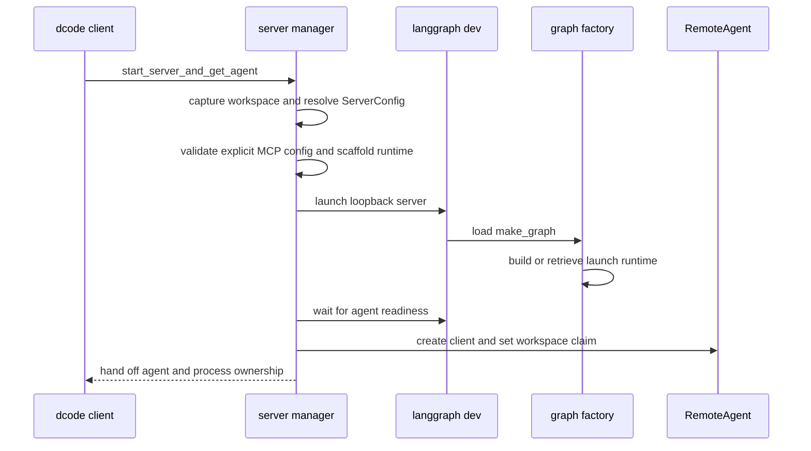
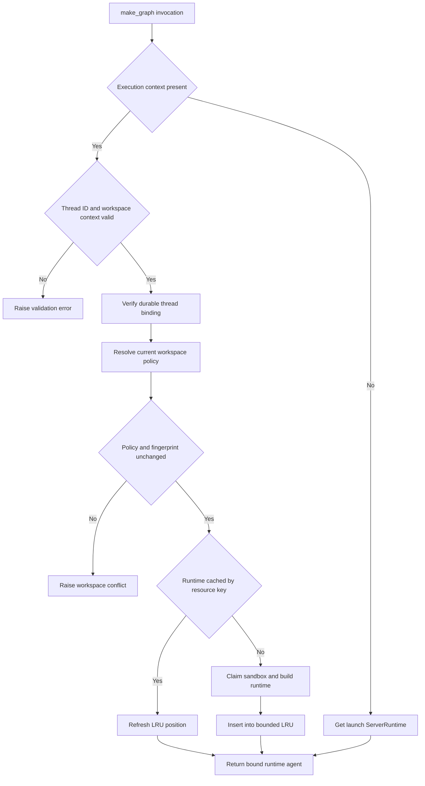

# dcode Runtime Behavior and Failure Handling

Interactive dcode runs its agent in an owned, loopback `langgraph dev` subprocess and accesses the `agent` graph through `RemoteAgent` over HTTP and SSE. The client retains UI and session concerns; the server owns the compiled graph, backend, MCP sessions, sandbox lifetime, workspace-specific runtime selection, and server-side offload operation. ACP's in-process stdio path is outside this page. See [Deep Agents Code Architecture](/openwiki/architecture/code-agent.md), [Context Management](/openwiki/concepts/context-management.md), [State Persistence](/openwiki/concepts/state-persistence.md), [Security](/openwiki/operations/security.md), and [Run a dcode session](/openwiki/workflows/run-dcode-session.md).

## Launch, handoff, and construction

`start_server_and_get_agent` captures an explicit or current project context, pre-validates an explicit MCP configuration, resolves a `ServerConfig`, exports its `DEEPAGENTS_CODE_SERVER_*` representation, and scaffolds a temporary server project. It launches `langgraph dev` on `127.0.0.1` with port `0` by default, waits for the `agent` graph to be ready, then configures `RemoteAgent` with the workspace's session-policy claim and fingerprint. If any step before handoff fails—including cancellation—the manager stops the process in `finally`; after a successful return, ownership transfers to the caller or `server_session`.

This shows the successful handoff; the manager reaps the child on every earlier exit. An explicit malformed or missing MCP configuration fails before process creation. Project- and user-discovered MCP configuration is instead handled by server-side discovery, where it can be reported as MCP metadata.

`ServerConfig` is the process-boundary contract: the parent serializes it and the server reconstructs it using the same schema. It carries model and model parameters, interaction and tool options, sandbox selection, MCP and extension settings, and project context. Crucially, it partitions workspace data into a client-claimable **session** policy and a server-resolved **project** policy. A client cannot enable checkout-scoped or other project settings merely by submitting a workspace claim.

At construction, `_make_graphs` snapshots the selected workspace environment and credentials, then activates that immutable environment while it builds the runtime. It pins process-wide LangSmith tracing and secret-redaction settings on the first runtime: another workspace whose tracing settings differ is refused rather than silently redirecting process-global tracing. Dotenv/path work, model construction, plugin discovery, and synchronous graph construction are offloaded from the event loop.

The runtime creates the configured model; provides `fetch_url` and thread-ID tools; conditionally adds web search when workspace credentials provide a Tavily key; and discovers MCP tools unless `no_mcp` is set. Criteria and rubric agents get only read-only built-ins plus MCP tools explicitly and coherently annotated read-only. A configured sandbox is opened during construction, retained for process-lifetime cleanup, and passed to `create_cli_agent`; absent support, invalid configuration, or creation failure is a startup failure. Experimental extensions receive workspace, mode, project-trust, and explicit-path inputs. Load errors are warnings, but active extensions are shut down when later graph construction fails.

A `ServerRuntime` couples the compiled agent to the exact `CompositeBackend` that built it and to an offload operation derived from that backend. Failing to expose that operation aborts construction rather than serving an agent whose `/offload` route has unrelated archive state.

## Durable workspace binding and runtime selection

A thread's workspace is a durable, server-authoritative binding, stored in the sessions SQLite database. Binding canonicalizes an existing absolute directory, records workspace identity, project root, policy JSON, and a fingerprint-derived resource key. Binding is atomic: a thread cannot be rebound to a different workspace or policy. Legacy rows can be migrated only after compatible identity and session-policy checks.

`RemoteAgent` keeps the launch policy separate from this durable binding. On a thread's first use it posts `cwd` and, when configured, the session claim plus fingerprint to `/dcode/threads/{thread_id}/workspace`, validates the returned descriptor, and caches it by thread. `set_workspace` requires policy and fingerprint together and clears the cache. The route resolves the target's trusted project policy itself and rejects a client claim that differs from the session policy; the cache reduces requests but is never authorization.

`make_graph` must route each actual run, not simply return the graph built at startup. With execution context it requires a nonempty thread ID and workspace descriptor, verifies that descriptor against the durable binding, and selects the binding's runtime. Without execution context it returns the configured launch runtime.

This is the security boundary between an untrusted request context and a workspace runtime. Before reuse or construction, the server resolves current policy and compares project-policy fields and the full fingerprint to the binding. It preserves bound extension trust during resolution, but rejects remaining policy drift, fingerprint changes, and even extension-trust-store read failures as `WorkspaceConflictError`.

The launch runtime is built once under a lock. Its cache is load-bearing: rebuilding would repeat MCP discovery, leak sandbox sessions, register duplicate `atexit` handlers, and let graph and offload state diverge. Workspace runtimes use a second lock-protected LRU keyed by `resource_key`; accesses refresh recency and insertion evicts the oldest entry above 32. A process-wide sandbox can be claimed by only one workspace ID, and this reservation survives failed builds and LRU eviction. The same restriction applies to process-global tracing settings.

## Remote execution, state, and cancellation

`RemoteAgent.astream` requires a thread ID, obtains that thread's workspace descriptor, adds it to execution context, and delegates SSE framing, `messages-tuple` negotiation, namespace extraction, and interrupt detection to `RemoteGraph`. It defaults to `messages` and `updates`, converts streamed message dictionaries and `__interrupt__` updates for the UI, and deliberately leaves snapshots serialized. Failed message conversion is counted and logged after the stream rather than aborting unrelated events. Remote exceptions with serialized error payloads can be rendered as an error type and message instead of a Python dictionary representation.

Checkpoint data and the development server's live HTTP thread row have different lifecycles. `aget_state` treats a missing remote thread and the SDK's known no-checkpoint `TypeError` as empty state, but logs and re-raises other read failures. `aensure_thread` idempotently creates the live row with `if_exists="do_nothing"`, so state mutations and server-owned offload can follow a server restart.

On an HTTP 409 state-update conflict, `RemoteAgent` lists pending and running runs, cancels them concurrently with `wait=True` and bounded per-run waits, then retries the update exactly once. Per-run cancellation failures are best-effort; inability to acquire or list the SDK client is logged and the retry exposes any continuing conflict.

Lost or cancelled work is abandoned, not resumed. `aabandon_pending_work` cancels active runs, creates error `ToolMessage` results only for unanswered calls in the trailing AI-message turn, writes `__end__` to discard queued work, then reads state again and raises if queued nodes, tasks, or interrupts remain. The trailing-turn rule preserves required tool-use/result adjacency.

The custom `/offload` route is an authenticated operation boundary, not a second graph. The generated configuration opts into custom-route authentication when deployment auth is configured; local launch uses noop auth and loopback binding. The remote client ensures the HTTP thread exists, forwards the binding in operation context, validates typed completion data, and makes a missing route a server-compatibility error. It uses one operation ID across hook-interrupt/resume rounds, caps fulfillment at 32 distinct hook rounds, and, if cancelled, waits for a server acknowledgement of `cancelled` or `finished` before propagating cancellation.

## Model retry, startup failure, and shutdown

`CodeModelRetryMiddleware` wraps model-node calls rather than an entire agent turn, and reads the retry budget from the request model when present. It is installed inside automatic compaction, so a provider retry does not replay completed tools, summary generation, or archive appends. `GraphBubbleUp` is preserved as graph control flow. Only classified transient failures retry while budget remains; terminal or exhausted failures are re-raised rather than fabricated as an AI response. Delays honor usable `Retry-After` values or use jittered exponential backoff, and interactive retries impose a cumulative delay limit.

Every model call receives correlated `model_attempt` start/complete events; retries emit a correlated `model_retry` event that says whether visible output may already have started. Event-write failures are logged but do not fail the run, enabling consumers to mark superseded partial output as incomplete without turning diagnostics into an availability dependency.

Runtime construction is a startup barrier. The process runtime factory checks managed configuration health, emits `DEEPAGENTS_STARTUP_ERROR:` and exits nonzero on construction failure; early child-exit polling extracts the marker and adds it to the parent error. Request-scope operation handlers must contain `SystemExit` and map it to a service failure rather than killing an already-serving process.

The child environment strips `PYTHONPATH` and other startup-influencing variables so an untrusted project path cannot affect server imports. It preserves the original `PYTHONPATH` only in a dedicated carrier for downstream, approval-gated execute commands, and protects profile and carrier values from later environment overrides.

`ServerProcess` owns shutdown. On POSIX it starts the child in a dedicated session/process group, sends group `SIGTERM`, waits for the group, then escalates with `SIGKILL` when needed while refusing to target dcode's own group. Windows sends Ctrl+Break and then terminates the root process; descendants can remain orphaned. Cleanup signal failures are logged because shutdown cannot guarantee that a child is gone.

## Focused regression coverage and safe changes

Focused tests inject runtime builders to verify cache, startup-marker, and nonblocking-construction contracts; test retries and stream behavior with fake models and transport errors; exercise remote conversion, thread registration, conflict recovery, offload cancellation, and pending-work abandonment with doubles; and run an in-memory queued-tools graph to prove abandonment clears pending work without executing its tool.

When changing this area:

1. Keep session/project policy partitioning, workspace canonicalization, durable-binding validation, and cache keys aligned.
2. Do not permit a process-wide sandbox or process-global tracing configuration to silently cross workspace boundaries.
3. Keep graph and offload construction bound to the same `ServerRuntime` backend.
4. Preserve startup-marker parsing, request-scope `SystemExit` containment, and cancellation-safe launch cleanup.
5. Keep model retries inside compaction and pending-work recovery ordered as cancel, trailing-turn repair, `__end__`, then verification.
6. Test process-group shutdown on both platform paths when changing ownership or escalation.
