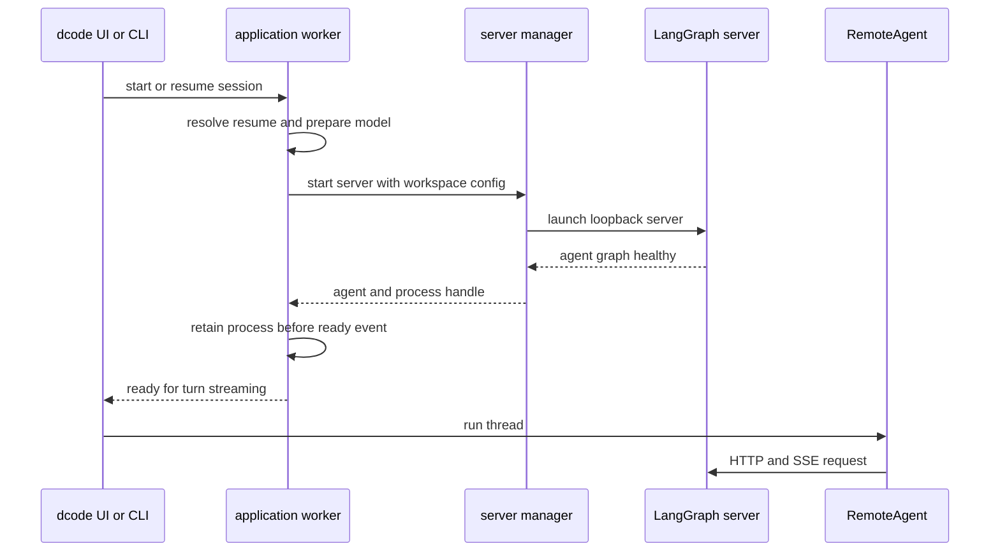
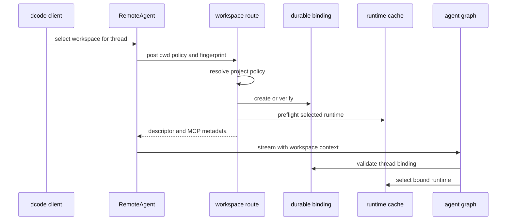

# Code Runtime and Session Behavior

A dcode session separates presentation from execution. The TUI or headless client owns input, rendering, approval interaction, and session selection. A local LangGraph server owns compiled agent runtimes, tools, sandbox and MCP resources, durable workspace validation, checkpoints, and server-side compaction. A durable thread-to-workspace binding—not a directory asserted on an individual request—selects the runtime permitted to execute a thread. For the user workflow, see [Run a dcode Session](/openwiki/workflows/run-dcode-session.md); for retained state and operational concerns, see [State Persistence](/openwiki/concepts/state-persistence.md) and [Cost and Sessions](/openwiki/operations/cost-and-sessions.md).

## Launch and ownership

Interactive startup builds the lightweight app first and performs expensive model initialization and server startup in `_start_server_background`, keeping first paint responsive. That worker resolves a requested resume thread before launch, persists the chosen recent agent/model on a best-effort basis, installs managed `rg` before the child snapshots its environment, and starts the server concurrently with optional MCP metadata preload. A failure becomes a `ServerStartFailed` message; a failed metadata preload is only a warning. As soon as launch returns, the process handle is stored before `ServerReady` is posted so application teardown can still stop it.

`start_server_and_get_agent` captures the workspace and resolved `ServerConfig`, validates explicit MCP configuration, scaffolds a temporary `langgraph dev` project with a SQLite checkpointer, and launches a loopback server on an ephemeral port by default. It waits for the `agent` graph and returns a `RemoteAgent` configured with the launch workspace policy. Until that handoff succeeds, including if cancelled, its `finally` path stops the child; `server_session` extends ownership for a successful caller session.

`ServerConfig` divides the workspace data into a client-claimable session policy and server-resolved project policy. The workspace endpoint resolves the latter from its directory and refuses project fields in the client claim. Thus a client cannot use a claim to apply another checkout's MCP, sandbox, extension, or trust settings. Local launch uses loopback/noop auth; generated dcode operation routes opt into custom-route auth where a deployment has configured it. The child removes `PYTHONPATH` from server startup and relays it only through a dedicated carrier for approved downstream execution.

This shows ownership transfer: the launch helper cleans up before handoff, while the app owns the returned process afterwards.

## Bound runtime construction

`make_graph` is the server graph factory. Without execution context it returns the configured server runtime. With context it requires a nonempty thread ID and workspace context, validates the durable workspace binding, then selects the binding-specific runtime. Runtime building snapshots environment and credentials for the selected workspace, offloads blocking setup from the event loop, conditionally adds web/MCP tooling, and reports a `DEEPAGENTS_STARTUP_ERROR` marker before exiting on construction failure. The parent health check extracts that marker if the child exits early; workspace and offload request paths contain `SystemExit` and return an unavailable response rather than kill an already-serving server.

A `ServerRuntime` groups the compiled agent, its `CompositeBackend`, and an offload operation derived from that same backend. Process construction is lock-protected and cached to avoid duplicate process-lifetime resources. Workspace runtime construction is also lock-protected and cached in an LRU of at most 32 entries keyed by workspace and runtime identity. Runtime-only changes can rebuild a permitted workspace runtime, but each selection revalidates policy and workspace identity; policy drift is rejected. A process-wide sandbox is claimed by one workspace and cannot be shared by another. Experimental extensions receive workspace, mode, project-trust, and explicit-path inputs; load failure is warned, while successfully loaded extensions are shut down if later graph construction fails and during application lifespan teardown.

## Bind before execution and stream a turn

`RemoteAgent` keeps workspace policy configuration separate from the per-thread binding. Policy and fingerprint must be supplied together. On first use it posts the workspace payload to the thread workspace route, which validates the narrow request shape, resolves trusted project policy, validates the client policy, creates or verifies durable binding, and preflights the chosen runtime. A committed request mirrors workspace metadata to the live LangGraph thread; `validate_only` does not commit. Returned descriptors and MCP metadata are cached per thread.

The binding comes before runtime preflight, so a later preflight failure does not imply that no durable binding was created. The server will refuse incompatible policy/runtime selection rather than silently change a thread's execution authority.

For normal runs, `RemoteAgent` delegates SSE parsing, stream negotiation, namespace handling, and interrupt detection to `RemoteGraph`. It requires a thread ID, forwards workspace context, converts streamed message dictionaries and interrupt updates for the UI, and keeps snapshots serialized. Missing remote threads and the known SDK no-checkpoint state-shape failure read as empty state; other state-read failures propagate. It idempotently registers a live HTTP thread so persisted checkpoints remain mutable after a server restart. On state-update conflict it cancels pending/running runs with bounded concurrent waits and retries once. Deliberate abandonment cancels active runs, adds error results only for unanswered calls in the trailing AI turn, writes `__end__`, and verifies there is no queued node, task, or interrupt; it never resumes stale queued tools.

The non-interactive runner consumes `messages`, `updates`, and `custom` stream modes with subgraphs enabled and `durability="exit"`. It records transcript data and usage from nested streams while rendering only main-agent content, routes main interrupts into approval/hook continuation state, and finalizes its request ledger in `finally` so replayed interruption chunks cannot double-count usage. It also recognizes compaction completion in the stream and runs post-compaction maintenance once per result ID.

## Retry contract and partial-stream recovery

`CodeModelRetryMiddleware` wraps model-node calls, rather than an entire turn, and is placed inside compaction. Therefore a transient provider failure can retry without replaying completed tools, summary generation, or archive append. The effective budget is read from the request model when present, allowing a runtime model switch to carry its provider-specific retry setting.

The middleware immediately re-raises `GraphBubbleUp`. It retries only classified transient provider/transport failures while budget remains; permanent model taxonomy errors win within their exception branch, but a transport-failure sibling in an exception group can still justify retry. It honors usable bounded `Retry-After` hints or applies jittered exponential backoff, and an interactive call has a 60-second cumulative-delay guard. Terminal failures are re-raised rather than turned into a fabricated AI response.

Each model invocation receives a fresh `call_id`; every attempt emits a validated `model_attempt` start event and successful attempts emit complete. A decided retry emits correlated `model_retry` data containing the failed attempt and whether visible output may have started. The middleware wraps message stream handlers to mark the attempt before forwarding a chunk, so even a downstream write failure is treated as potentially visible. Event-writer failures are logged without failing the run, but `GraphBubbleUp` from that writer remains control flow.

Consumers treat these events as an output-reconciliation protocol. The headless client validates untrusted lifecycle fields, tracks active attempt scopes by namespace, marks a superseded visible attempt incomplete before replay, and restarts its spinner around the retry status. Nested output is filtered from rendering, so nested calls set `stream_output_is_visible=False` and do not claim a visible supersession. Older correlation-free retry events retain a conservative legacy path.

## Durable session records

Local session discovery reads the LangGraph SQLite checkpoint database at the hardened default state directory. New thread IDs are UUIDv7, so their full IDs have time-oriented ordering. `list_threads` derives thread metadata from checkpoint metadata, supports agent/branch/exact-`cwd` filters, and can enrich rows with message count and initial prompt. The `cwd` filter is exact and excludes old rows with no stored path.

To make thread listing usable with large checkpoint blobs, sessions creates an idempotent covering index over the metadata fields needed by the group-and-sort query; index creation failure is logged and falls back to a correct but slower scan. Recent unfiltered lists and checkpoint-derived fields are cached in memory. Count and prompt entries are keyed by the latest-checkpoint freshness token, so prewarming or repeated display avoids deserialization for unchanged threads and invalidates on a new checkpoint. Enrichment batches latest summaries and, when requested, earliest message writes; it falls back to checkpoint-derived prompt text when writes do not provide one.

## Server-owned offload and shutdown

The offload route serializes per-thread server-owned compaction. It refuses active/pending-work threads and stale checkpoints, requires the durable binding, rechecks the checkpoint before commit, and allowlists writable channels so it cannot overwrite conversation messages. At the HTTP boundary it strips client transport/endpoint settings and restores checkpointed model configuration, preventing a client from redirecting credentialed provider calls or selecting the model for server-owned compaction.

The protocol retains one operation ID across hook-resume posts, stores bounded terminal outcomes for cancellation races, and delays cancellation completion until checkpoint/archive settlement finishes. Cost-reservation settlement is conservative: a confirmed unchanged failed write rolls back; an advanced or unreadable checkpoint commits to avoid double charging. A deferred archive append similarly rolls back only if its checkpoint link is confirmed absent.

`ServerProcess` owns final child shutdown. POSIX uses a dedicated process group for graceful shutdown followed by `SIGKILL` escalation. Windows sends Ctrl+Break then terminates the root process, which can leave a descendant orphaned.

## Regression coverage and safe changes

Focused tests inject builders, fake models, and transport failures to cover startup markers/cache invariants, remote conversion/recovery, retry classification and deadline behavior, correlation validation, sync/async mid-stream retries, and visible versus hidden output. Session tests cover metadata filters, exact `cwd` behavior, deletion cleanup, batched checkpoint/write reconstruction, cache freshness, corrupt history tolerance, and display prewarm boundaries. Non-interactive tests exercise server-option forwarding, incremental versus buffered output, and stream processing.

When modifying this area:

1. Keep server-resolved project policy separate from client-claimable session policy.
2. Require the durable binding for both graph execution and offload.
3. Preserve the shared backend relationship between graph runtime and offload.
4. Do not broaden retries to replay a completed turn or suppress graph control flow.
5. Keep lifecycle events backward-tolerant and preserve superseded-output reconciliation.
6. Treat cancellation and failed writes as settlement cases, not simple early returns.
7. Keep session-list caches freshness-bound and keep large-blob reads off the common metadata-list path.
