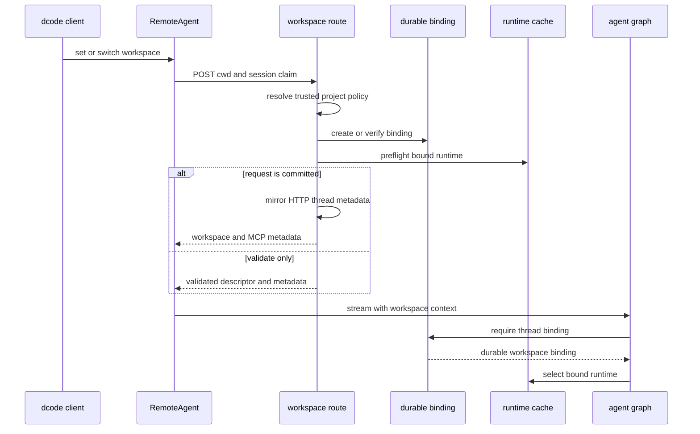

# Code Runtime and Session Behavior

Interactive and non-interactive dcode runs execute through a LangGraph server and a `RemoteAgent` HTTP/SSE adapter. The client owns presentation and session interaction; the server owns compiled agent runtimes, backends, MCP and sandbox resources, durable workspace validation, and server-side offload. A thread's durable workspace binding—not merely a client-supplied directory—selects the runtime allowed to execute it. See [Configuration Layering](/openwiki/concepts/config-layering.md), [Context Management](/openwiki/concepts/context-management.md), [State Persistence](/openwiki/concepts/state-persistence.md), [Security](/openwiki/operations/security.md), and [Run a dcode Session](/openwiki/workflows/run-dcode-session.md).

## Launch and process lifetime

`start_server_and_get_agent` captures a project context, validates an explicit MCP configuration before spawning, builds a `ServerConfig`, serializes it through `DEEPAGENTS_CODE_SERVER_*` variables, and scaffolds a temporary `langgraph dev` project with a SQLite checkpointer. It starts a loopback server at `127.0.0.1` using an ephemeral port by default, waits for the `agent` graph, then creates a `RemoteAgent` configured with the launch workspace's session claim and fingerprint. Until that handoff succeeds, the helper owns the child and stops it in `finally`, including on cancellation. `server_session` extends that ownership through the caller's session.

`ServerConfig` deliberately separates the claimable, command-scoped session policy from project-scoped policy. The workspace route resolves project policy for the requested directory on the server and rejects a claim containing project fields. This prevents a local caller from applying one checkout's MCP configuration, sandbox setup, or extension trust to another workspace. The configuration also distinguishes durable access-policy compatibility from runtime identity: model, prompt, and runtime-only changes can rebuild a runtime without invalidating a thread binding, while policy or workspace-identity drift is refused.

The server process removes `PYTHONPATH` and other startup-sensitive inherited variables from the interpreter environment. It preserves the original `PYTHONPATH` only in a dedicated carrier for approval-gated downstream execution commands. Local server startup uses noop authentication with a loopback bind; generated dcode operation routes enable LangGraph custom-route auth so deployments that configure auth can protect them.

## Runtime construction, caching, and startup failure

`make_graph` is the LangGraph graph factory. At ordinary graph-load time it returns the configured server runtime. During an execution, it requires a nonempty `thread_id` and workspace context, verifies the thread's durable binding, and selects that binding's workspace runtime.

Runtime construction snapshots the workspace environment and credentials before agent construction, activates that environment for the build, and sends blocking filesystem/bootstrap, model, sandbox, and synchronous agent work to worker threads where needed. It conditionally loads web and MCP tools. Criteria and rubric agents receive only known read-only built-ins and MCP tools explicitly marked read-only without contradictory annotations.

A `ServerRuntime` bundles the compiled agent, the exact `CompositeBackend` used to build it, its backend-derived offload operation, and workspace MCP metadata. The process factory is lock-protected and caches its result because repeated MCP discovery, sandbox creation, and `atexit` registration would leak or duplicate process-lifetime resources. Workspace runtimes use a second lock-protected LRU capped at 32 entries. Its key combines workspace identity with the current runtime fingerprint: runtime-only changes rebuild an allowed workspace runtime, while current project and access policy are revalidated on every selection and incompatible drift is rejected. A process-wide sandbox is claimed by the first workspace that uses it and cannot be reused by another workspace, even after a failed build. Server tracing has a comparable process-lifetime reservation: workspaces with incompatible tracing settings must use a separate server.

When enabled, experimental extensions are loaded with workspace, mode, project trust, and explicit-path inputs. Load failures are warnings; active extensions are shut down if subsequent graph construction fails and during the HTTP application's lifespan teardown.

Construction failures emit `DEEPAGENTS_STARTUP_ERROR:` before exiting nonzero, allowing parent health polling to extract an actionable failure. The workspace and offload request paths contain `SystemExit` and return a 503 instead of killing an already-serving process.

## Bind before execution

`RemoteAgent.set_workspace` accepts a session-policy claim only when its fingerprint is also supplied, clears descriptor caches, and binds lazily when a thread first runs. The client posts `cwd`, optional claim, and fingerprint to `/dcode/threads/{thread_id}/workspace`; the route validates its narrow request shape, resolves trusted directory policy, validates the client claim, and creates or verifies durable binding. It then preflights the selected runtime and, for a committed request, mirrors workspace metadata to the LangGraph HTTP thread row. `validate_only` performs the validation and runtime preflight without committing the binding or metadata. The returned workspace descriptor and MCP metadata are cached per thread; switching a committed workspace clears other cached descriptors.

This sequence shows the normal binding and execution path. Runtime or policy refusal returns a conflict or unavailable response; because durable binding precedes runtime preflight, callers must not assume every later preflight failure leaves no durable binding behind.

## Streaming, state, and recovery

`RemoteAgent` delegates SSE parsing, `messages-tuple` negotiation, namespace extraction, and interrupt detection to `RemoteGraph`. `astream` requires `config.configurable.thread_id`, retrieves the thread descriptor, forwards it in runtime context, requests `messages` and `updates` by default, and converts streamed message dictionaries and interrupt updates for the UI. State snapshots remain serialized. A failed streamed-message conversion drops that message and reports a warning after the stream rather than aborting unrelated events.

Persistence and the development server's live HTTP thread registry are separate. `aget_state` treats a missing remote thread and the SDK's known no-checkpoint subscriptability `TypeError` as empty state, but logs and re-raises other failures. `aensure_thread` creates a live thread row idempotently with `if_exists="do_nothing"`, allowing persisted state to be changed after a server restart.

On an update-state conflict, the client best-effort cancels pending and running runs, waits for those cancellations concurrently with a ten-second per-run bound, and retries once. `aabandon_pending_work` is a deliberate discard path: it cancels active runs, adds error `ToolMessage` values only for unanswered calls belonging to the trailing AI-message turn, writes `__end__`, and verifies that no queued node, task, or interrupt remains. It does not resume stale queued tools.

## Server-owned offload

`/dcode/threads/{thread_id}/offload` is a server-owned compaction operation, not a graph clients can invoke directly. Before the first POST, `RemoteAgent` ensures the HTTP thread row exists; it supplies a stable operation ID, workspace context, and accumulated hook replies. A hook interrupt is resumed by a new POST that re-executes the operation and reuses prior responses. Client cancellation calls the matching cancel route and waits for a `cancelled` or `finished` acknowledgement. The server retains a bounded LRU of terminal outcomes to close cancellation races.

The route serializes operations per thread. It accepts only idle or error thread rows, rejects active/interrupted rows and checkpointed pending work, hydrates serialized messages and summary state, requires the durable workspace binding, and rechecks the checkpoint after compaction before committing. A changed checkpoint is a conflict rather than a stale merge. Only channels declared by `OffloadStateUpdate` may be written, so offload cannot write conversation `messages` and clobber a turn.

The HTTP boundary validates consumed context fields and strips endpoint, proxy, transport, and injected-client keys from request `model_params`. It then discards request model selection and restores model and parameters from the checkpoint; request-selected `summarization_model` is dropped. A client able to reach the loopback service therefore cannot redirect credentialed provider calls or choose a provider/model for server-owned compaction.

Settlement is fail-closed and conservative. The operation drains a cost reservation before a state write. On a failed write, it rolls the reservation back only when rereading proves the checkpoint unchanged; it keeps it claimed when the checkpoint advanced or cannot be reread, avoiding a double charge and reporting indeterminate outcomes where appropriate. Deferred archive appends are similarly linked by a follow-up checkpoint write: a confirmed missing link rolls the append back, while an unreadable link is indeterminate. Cancellation is deferred until checkpoint and archive settlement finishes.

## Shutdown, retries, and focused tests

`ServerProcess` owns shutdown. POSIX launches use a dedicated process group, signal it gracefully, then escalate to `SIGKILL`; Windows uses Ctrl+Break then root-process termination, so a descendant can remain orphaned. The server application's lifespan also shuts down active extensions and attempts a bounded trace flush.

`CodeModelRetryMiddleware` wraps model-node calls inside compaction rather than a whole agent turn. It obtains retry budget from the request model where available, preserves `GraphBubbleUp`, retries only classified transient failures while budget remains, uses usable `Retry-After` or jittered exponential backoff, and re-raises terminal failures. Correlated attempt/retry stream events indicate whether a failed attempt could have emitted visible partial output; event-emission failure itself does not fail the run.

Focused tests inject builders and fakes to verify single-flight runtime construction, startup markers, event-loop-safe setup, workspace policy and sandbox invariants, remote conversion and recovery, and offload preflight, checkpoint, trusted-model, archive, cost, hook, and cancellation paths. Non-interactive tests cover forwarding server configuration and buffered versus incremental output.

When changing this area:

1. Keep client claims separate from server-resolved project policy.
2. Require and validate durable thread bindings for graph execution and offload.
3. Keep graph and offload tied to the same `ServerRuntime` backend.
4. Preserve cache locking, policy revalidation, and process-wide sandbox ownership.
5. Treat cancellation and failed writes as settlement cases; do not lose cost accounting or leave unlinked archives.
6. Preserve startup markers and request-scope `SystemExit` containment.
