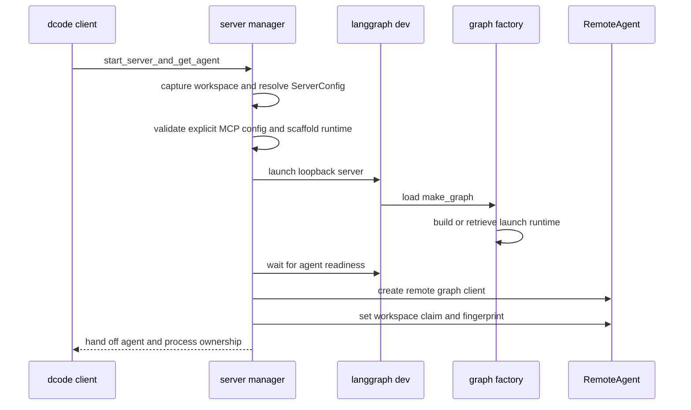
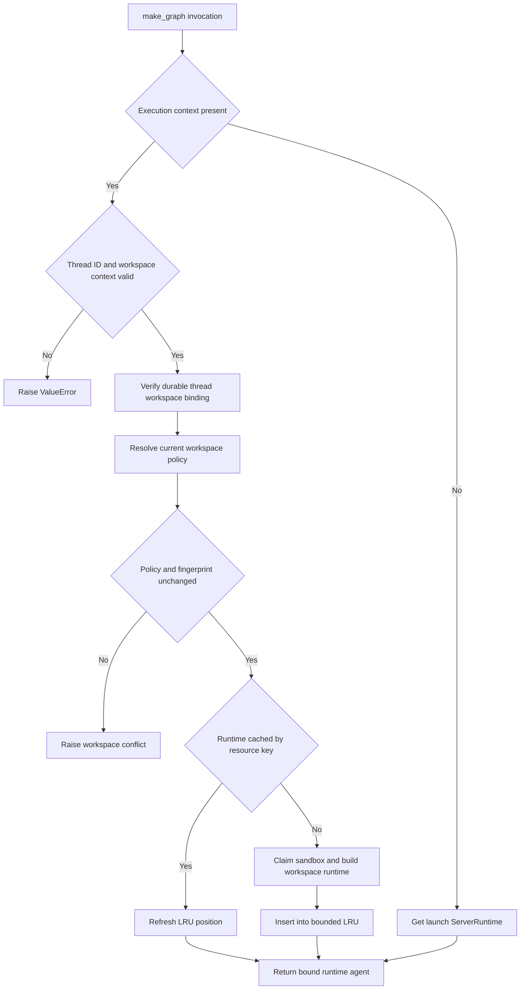
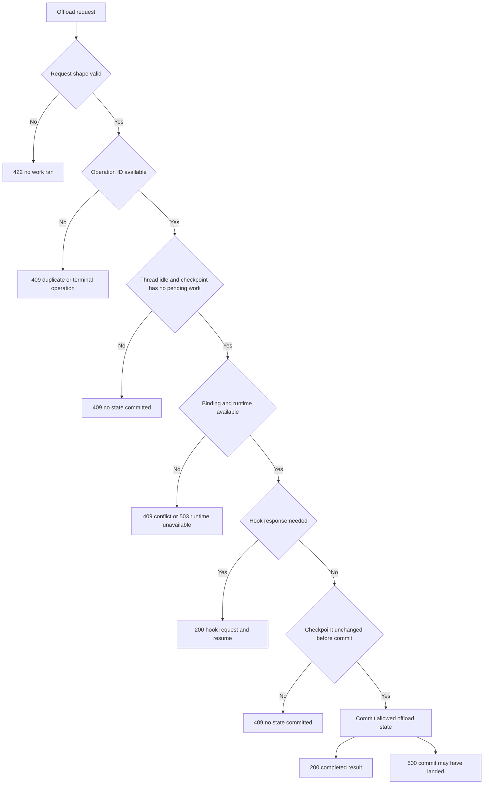

# dcode Runtime Behavior and Failure Handling

Interactive dcode runs its agent in an owned, loopback `langgraph dev` subprocess and accesses the `agent` graph through `RemoteAgent` over HTTP and SSE. The split is intentional: the client retains UI and session concerns, while the server owns the compiled graph, its backend, MCP sessions, sandbox lifetime, and server-side offload operation. ACP's in-process stdio path is outside this page. See [Deep Agents Code Architecture](/openwiki/architecture/code-agent.md), [Configuration Layering](/openwiki/concepts/config-layering.md), [State Persistence](/openwiki/concepts/state-persistence.md), [MCP](/openwiki/integrations/mcp.md), [Sandbox partners](/openwiki/integrations/sandbox-partners.md), and [Run a dcode session](/openwiki/workflows/run-dcode-session.md).

## Launch and runtime construction

`start_server_and_get_agent` captures an explicit or current project context, pre-validates an explicit MCP configuration, derives `ServerConfig` from the invocation, exports its `DEEPAGENTS_CODE_SERVER_*` representation, and scaffolds a temporary server project. It starts `langgraph dev` on `127.0.0.1` and port `0` by default, waits for the `agent` graph, then configures the returned `RemoteAgent` with the workspace's **session** policy claim and fingerprint. Project-scoped policy is not included in that claim: it is resolved and trusted by the server for the target directory.

This sequence shows the construction handoff. Before a successful return, the manager owns the child; its `finally` invokes idempotent cleanup after every setup failure, including cancellation. An explicit malformed or missing MCP config fails before process creation, whereas project- and user-discovered MCP configuration is handled by server-side discovery.

`ServerConfig` is the process-boundary contract: the parent serializes it to environment variables and the server reconstructs it from the same prefix. It carries the model and model parameters, interaction and tool choices, sandbox selection, MCP settings, extension settings, and project context. A supplied filesystem-tool allowlist is a security control: malformed, empty, or unknown values received from the environment fail closed, and an explicit list must include `read_file`.

At server construction, `_make_graphs` snapshots dotenv-derived workspace environment and credentials before activating that immutable environment for runtime assembly. Blocking path/bootstrap, model, plugin-discovery, and synchronous graph-construction work is moved off the event loop. It creates the configured model; adds built-in `fetch_url` and thread-ID tools; conditionally adds web search when workspace credentials provide a Tavily key; and discovers MCP tools unless `no_mcp` is set. Criteria and rubric agents receive only read-only built-ins and MCP tools explicitly and coherently annotated read-only, rather than a name-based approximation.

Sandbox creation is server-process lifetime state. A configured provider is opened while building the runtime, held for cleanup through `atexit`, and passed into `create_cli_agent`; unsupported, absent, invalid, or failed sandbox setup emits a startup error and exits. With experimental extensions enabled, the server loads extensions using the workspace path, interactive/headless mode, project-trust decision, and explicit extension paths; load errors are warnings, while an active registry is bound to server extensions and shut down if graph construction later fails.

`create_cli_agent` receives the resolved model, tool/MCP set, sandbox, approval and shell policy, filesystem and interpreter choices, memory/skills/subagents, rubric settings, extension registry, environment, and credential snapshot. The resulting `ServerRuntime` keeps the compiled agent, the exact `CompositeBackend` used to construct it, its MCP metadata, and an offload operation derived from that backend. Failure to expose that operation is a construction failure, not a partially functional server: `/offload` must share the same backend and archive policy as the agent.

## Workspace selection, caching, and policy drift

The initial graph load is not enough to select a request runtime. `make_graph` receives LangGraph execution context when serving a run; it requires a nonempty thread ID and workspace context, verifies the durable thread-to-workspace binding, then selects that binding's runtime. Calls without execution context use the configured launch runtime. This prevents an arbitrary request from selecting a workspace merely by naming a directory.

This flow distinguishes launch-time construction from execution-time workspace routing.

The process runtime is lock-protected and constructed once. Its cache is load-bearing: rebuilding per request would repeat MCP discovery, create/leak sandbox sessions, register duplicate `atexit` handlers, and make the graph and offload route disagree about backend state. Workspace-specific runtimes use a second lock-protected LRU keyed by the binding resource key; an access refreshes recency and insertion evicts the oldest entry once the cache exceeds 32 entries.

Before reusing or building a workspace runtime, the server resolves current policy for the binding and compares both project-policy fields and the full workspace fingerprint against the durable binding. It preserves bound extension trust while resolving current policy, but reports any remaining project policy drift or fingerprint change as `WorkspaceConflictError`; even a trust-store read failure is treated as a policy change. A process-wide sandbox may be claimed only by one workspace ID, so a second workspace cannot silently share it.

On first use of a thread, `RemoteAgent` posts `cwd`, and when configured the session claim plus fingerprint, to `/dcode/threads/{thread_id}/workspace`; it validates and caches the returned descriptor per thread. `set_workspace` requires the policy and fingerprint together and clears that cache. This client cache avoids repeated binding requests but is not the authority: the durable server binding and per-request validation govern selection.

## Streaming, state, and operation failures

`RemoteAgent.astream` requires a thread ID, gets that thread's workspace descriptor, adds it to the runtime context, and delegates SSE framing, `messages-tuple` negotiation, namespace extraction, and interrupt detection to `RemoteGraph`. It defaults to `messages` and `updates`, deserializes message dictionaries for the UI, converts `__interrupt__` update data, and deliberately leaves state snapshots serialized. A message conversion failure is counted and reported after streaming rather than aborting unrelated events.

Checkpoint data and the development server's HTTP thread row have separate lifecycles. `aget_state` returns empty state for a missing remote thread or the SDK's known no-checkpoint `TypeError`, but logs and re-raises other errors. `aensure_thread` idempotently creates the live HTTP row, allowing a persisted thread to receive state mutations after a server restart. For a state-update conflict, the client cancels pending/running runs concurrently with bounded per-run waits and retries the update once.

Lost or cancelled work is recovered destructively, not resumed. `aabandon_pending_work` cancels active runs, calculates error `ToolMessage` values only for unanswered calls in the trailing AI-message turn, writes `__end__` to discard queued work, then re-reads state and fails if queued nodes, tasks, or interrupts remain. The trailing-turn restriction preserves tool-use/result adjacency and avoids producing invalid history for older interrupted calls.

### Server-owned offload

Offload is a custom HTTP operation, not a second client-addressable graph. The built-in `langgraph.json` registers `deepagents_code.offload_api:app` with custom-route authentication enabled; a locally launched child selects noop auth and loopback binding. The operation resolves the same binding-specific `ServerRuntime` and `CompositeBackend` as the graph, so its archive and compaction policy remain readable by the agent. The `/extensions` provenance route is available only when experimental mode is enabled and the request originates from loopback.

`RemoteAgent.aoffload` requires a thread ID, obtains its workspace descriptor, idempotently registers the live HTTP thread row, and posts a UUID operation ID, runtime context, and accumulated hook responses. A hook interrupt is returned to the client for fulfillment; the client reposts all responses under the same operation ID and permits at most 32 hook fulfillments. Cancellation is not assumed to have stopped server work: after local cancellation it calls the operation cancellation route, waits up to 10 seconds for a `cancelled` or `finished` acknowledgement despite repeated caller cancellation, then re-raises cancellation. A missing route is explicitly reported as an incompatible custom server; malformed responses and invalid completed result fields fail locally rather than reaching renderers.

This decision path shows the operation's state-commit boundary. It refuses active, interrupted, unregistered, checkpoint-less, or pending-work threads and serializes each thread with a weakly held lock. Before committing it rereads the checkpoint; an advance means the completed compaction is discarded rather than overwriting a newer turn. The boundary hydrates serialized messages itself, uses checkpointed model settings rather than client-selected model or transport settings, and permits only `OffloadStateUpdate` channels—never `messages`—to prevent an un-attributed operation from clobbering concurrent conversation data. A 422 means validation prevented work, a 409 means no state was committed, a 503 means runtime construction failed before work, and a 500 can explicitly mean the write outcome is indeterminate.

Cost and archive settlement are deliberately conservative. If the state write fails and a readback shows an advance, or cannot be read back, drained cost records stay claimed to avoid a later double charge; the latter case can understate the thread total. For a deferred archive, state is reserved before append; a failed archive-link update is verified, rolls the append back when known absent, and reports indeterminate linkage when it cannot be read. See [Cost and sessions](/openwiki/operations/cost-and-sessions.md) for accounting and [Security](/openwiki/operations/security.md) for deployment boundaries.

## Retry, startup, and shutdown semantics

`CodeModelRetryMiddleware` wraps the model-node handler rather than an entire agent turn and is installed inside side-effecting automatic compaction. Thus a transient provider retry does not replay completed tools, summary generation, or archive append. It remains installed even with a zero startup budget because a runtime-selected model can provide a request-time budget. `GraphBubbleUp` passes through as graph control flow; classified transient failures are retried while budget remains using usable `Retry-After` guidance or jittered exponential backoff, while terminal failures are re-raised rather than turned into artificial AI output. Correlated attempt and retry events record whether visible output may already have started, without allowing diagnostic-event failure to fail the run.

Runtime construction is a startup barrier. The process runtime factory checks managed configuration health, emits `DEEPAGENTS_STARTUP_ERROR:` and exits nonzero when construction fails; early child-exit health polling extracts that marker and adds it to the parent error. Request-scoped callers must catch `SystemExit` and map it appropriately rather than terminating an already-serving child. This is especially relevant to operation routes.

The child environment strips `PYTHONPATH` and other startup-influencing values before launching the server interpreter. It preserves the launch `PYTHONPATH` only in a dedicated carrier for downstream agent execute commands, and protects immutable profile/carrier values from later environment overrides.

`ServerProcess` owns shutdown. On POSIX the child starts in a dedicated session/process group; stop sends `SIGTERM` to that group, waits for the whole group, then escalates with `SIGKILL` if necessary, refusing to target dcode's own group. Windows sends Ctrl+Break for graceful shutdown and escalates by killing the root process; a surviving descendant can therefore be orphaned. Signaling failures are logged because cleanup cannot guarantee that the child is gone.

## Focused regression coverage and safe changes

Server-graph unit tests inject builders to verify one construction under repeated and concurrent factory access, the startup marker/exit contract, and nonblocking bootstrap. They also exercise ordered, identity-based criteria tool selection and fail-closed MCP annotations. Server-manager tests cover config serialization, filesystem allowlist rejection, project-relative MCP path normalization, session-only workspace claims, scaffold forwarding, generated built-in graph/operation registration, and option forwarding. Remote-client tests use fake graphs and transports to cover stream conversion, state-update conflict recovery, durable workspace binding, offload hook/cancellation/protocol behavior, and recovery. The integration test constructs an in-memory graph with queued tools and verifies abandonment clears the queue, emits an error result for the dangling call, and never runs the side-effecting tool.

When changing this area:

1. Keep policy partitioning and durable binding validation aligned with the workspace cache key.
2. Do not make a process-wide sandbox reusable across workspace IDs.
3. Keep graph and offload construction on the same `ServerRuntime` backend.
4. Preserve startup-marker parsing, request-scope `SystemExit` containment, and cancellation-safe launch cleanup.
5. Keep model retries inside compaction and pending-work recovery ordered as cancel, trailing-turn repair, `__end__`, then verification.
6. Test both platform shutdown scopes when changing process ownership or escalation.
