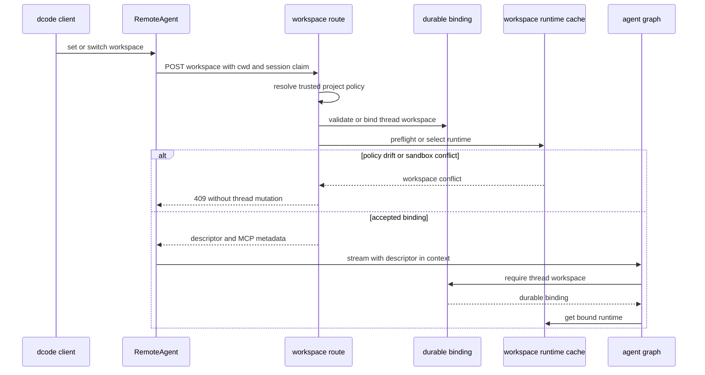

# Code Runtime and Session Behavior

Interactive and non-interactive dcode sessions use an owned loopback LangGraph server. The client owns terminal/UI behavior and talks to the server through `RemoteAgent`; the server owns the compiled graph, its `CompositeBackend`, workspace resources, MCP sessions, sandbox lifetime, and the server-side offload operation. This division makes the durable thread binding—not a client-supplied working directory—the authority for selecting a runtime. See [Code Agent Architecture](/openwiki/architecture/code-agent.md), [Context Management](/openwiki/concepts/context-management.md), [State Persistence](/openwiki/concepts/state-persistence.md), [MCP](/openwiki/integrations/mcp.md), and [Cost and Sessions](/openwiki/operations/cost-and-sessions.md).

## Startup and the process-owned runtime

`start_server_and_get_agent` captures the launch workspace and resolves `ServerConfig`, prepares a temporary server project, and starts `langgraph dev` on loopback (`127.0.0.1`) with an ephemeral port by default. It waits for the `agent` graph, creates the `RemoteAgent`, and configures its session workspace policy claim and fingerprint. Until it returns successfully, it owns the child process; cleanup in `finally` stops it on setup failure or cancellation.

`ServerConfig` crosses this process boundary through `DEEPAGENTS_CODE_SERVER_*` environment variables. The client can carry only the session claim. The server resolves project-scoped policy for the requested directory, so client input cannot enable project configuration such as checkout-scoped execution merely by claiming it.

At graph construction, `_make_graphs` snapshots the selected workspace environment and credentials and activates that environment around construction. Path/bootstrap work, model creation, sandbox setup, plugin discovery, and synchronous agent construction are moved off the server event loop where necessary. It builds built-in tools and optional web/MCP tools, then constructs the CLI agent. Criteria and rubric agents receive only the known read-only built-ins plus MCP tools explicitly and coherently annotated read-only; missing, malformed, or contradictory annotations do not grant access.

The resulting `ServerRuntime` contains the compiled agent, the exact `CompositeBackend` used to build it, and an offload operation derived from that backend. This is an integrity boundary: graph execution and `/offload` must use the same backend and archive policy. Sandbox setup is process-lifetime state, with cleanup registered after successful creation. Experimental extensions are loaded with workspace, mode, project trust, and explicit paths; load errors are warnings, while active extensions are shut down if later construction fails and again during application lifespan shutdown.

A startup build failure emits `DEEPAGENTS_STARTUP_ERROR:` and exits nonzero, allowing parent health polling to surface the failure. Request handlers that can trigger a workspace build contain `SystemExit` and return an unavailable response instead of terminating an already-serving process.

## Workspace binding and cached runtime selection

The server has two related caches. A lock-protected factory constructs the process runtime once, preserving singleton MCP discovery, sandbox resources, and `atexit` registration. Workspace-specific runtimes are held in a second lock-protected LRU, keyed by durable binding resource key and capped at 32 entries; lookup refreshes recency. Before reuse **and** before construction, the server resolves current workspace policy and rejects project-policy or fingerprint drift. A configured process-wide sandbox is permanently claimed by its first workspace ID and cannot be silently reused for a different workspace, including after a failed build.

`make_graph` returns the configured server runtime only when it has no execution context. For a graph execution it requires a nonempty thread ID and workspace context, loads and validates the durable thread workspace binding, then returns that binding's workspace runtime. The workspace route validates its narrow request shape, resolves trusted policy server-side, preflights the runtime, and only then persists the binding and mirrors workspace metadata to the HTTP thread row. `validate_only` preflights without changing durable binding or thread metadata.

`RemoteAgent.set_workspace` requires the client policy and fingerprint together, clears cached descriptors, and establishes a binding lazily on first thread use. It posts `cwd`, and when configured the session claim and fingerprint, to `/dcode/threads/{thread_id}/workspace`; the returned validated descriptor and MCP metadata are cached by thread. `aswitch_workspace` can preflight (`validate_only=True`) or commit a new workspace, clearing descriptors for other threads after a committed switch.

This sequence shows that a workspace descriptor travels with a request, but the durable binding and server-side policy validation decide which runtime may execute.

## Remote streaming, state, and recovery

`RemoteAgent` is a thin HTTP/SSE adapter over `RemoteGraph`. It requires `config.configurable.thread_id`; `astream` retrieves that thread's workspace descriptor, sends it in runtime context, and delegates SSE parsing, `messages-tuple` negotiation, namespace extraction, and interrupt detection to `RemoteGraph`. It requests `messages` and `updates` by default, converts streamed message dictionaries and `__interrupt__` update data for the UI, but intentionally leaves `aget_state` snapshots serialized. Failed message conversion drops only that message and produces a warning after the stream instead of aborting other events.

Checkpoint persistence and the development server's live HTTP thread registration are separate. `aget_state` treats a missing remote thread and the SDK's known no-checkpoint subscriptability `TypeError` as empty state, but logs and re-raises other failures. `aensure_thread` creates the live row idempotently with `if_exists="do_nothing"`, so a persisted session can be mutated after a server restart.

A state write that conflicts with a still-active run triggers best-effort cancellation of pending and running runs, with concurrent per-run waits bounded at ten seconds, then retries the update once. If a session must discard stale graph work, `aabandon_pending_work` cancels runs, adds error `ToolMessage` values only for unanswered calls in the trailing AI-message turn, writes `__end__`, and reads state again to require that no queued node, task, or interrupt remains. It deliberately abandons rather than resumes queued work.

## Server-owned offload and fail-closed persistence

`/dcode/threads/{thread_id}/offload` is a server-owned operation rather than another graph. The client ensures the HTTP thread exists, sends its workspace descriptor and a stable operation ID, and fulfills hook interrupts in repeated POST rounds. Cancellation asks the server to cancel the same operation ID and waits for a terminal `cancelled` or `finished` acknowledgement. The server retains bounded terminal outcomes to close races between a request and its cancellation.

The operation serializes each thread with a per-thread lock. It accepts only idle or error thread rows, rejects pending graph work, hydrates serialized messages and stored summary messages, requires the durable workspace binding, and rechecks the checkpoint immediately before commit. A changed checkpoint yields a conflict rather than merging a stale compaction result. It also allowlists writable offload channels, refusing message writes that could clobber a concurrent turn.

The HTTP boundary validates consumed context fields and strips endpoint, proxy, transport, and injected-client keys from client `model_params`. More importantly, it replaces requested model selection with the target checkpoint's recorded model and parameters, and drops a request-selected summarization model. Thus a local process that can reach the loopback server cannot redirect credentialed provider calls or select an arbitrary provider for a thread's archive.

Persistence is deliberately conservative. Before writing, the operation drains a cost reservation. If the checkpoint write fails without advancing the checkpoint, it rolls that reservation back; if the checkpoint advanced or cannot be reread, it commits the reservation to avoid double charging and reports an indeterminate outcome where appropriate. For deferred archives, it reserves summary state, appends under an archive lock, then links the archive path in a follow-up checkpoint; a confirmed failed link rolls back the append, while an unreadable link is reported as indeterminate. Cancellation is deferred until this settlement completes, so it cannot leave drained cost or an archive transaction unresolved.

## Operational failure and shutdown behavior

Local launch uses loopback binding and noop auth; generated custom operation routes opt into custom-route authentication when a deployment configures it. Server launch strips `PYTHONPATH` from the server interpreter environment and relays it only through a dedicated inherited carrier for downstream execute commands.

`ServerProcess` owns child shutdown. POSIX launch creates a dedicated process group, then shutdown signals the group with `SIGTERM`, waits, and escalates to `SIGKILL` while avoiding dcode's own group. Windows uses Ctrl+Break and then root-process termination, so descendants may survive as orphans. Shutdown errors are logged because cleanup cannot guarantee termination.

`CodeModelRetryMiddleware` is installed around model-node calls inside compaction, not around an entire agent turn. It re-raises graph control flow, retries classified transient provider failures only while budget remains, uses usable `Retry-After` guidance or jittered exponential backoff, and re-raises terminal failures rather than fabricating an AI response. Its stream events correlate attempts and retries and record whether a failed attempt may have produced visible output; diagnostics failing to emit do not fail the run.

## Focused regression coverage and change guidance

`test_server_graph.py` verifies single and concurrent process-runtime construction, startup marker/exit behavior, event-loop-safe setup, workspace policy revalidation, bounded cache behavior, and sandbox ownership. `test_offload_api.py` exercises request validation, workspace preflight, hook-round and cancellation behavior, checkpoint conflicts, writable-channel enforcement, trusted checkpoint model selection, archive rollback, and cost settlement. `test_non_interactive.py` confirms that headless sessions forward server configuration such as sandbox and filesystem tool policy and distinguishes incremental streaming from buffered output.

When changing this area:

1. Preserve the distinction between a client session claim and server-resolved project policy.
2. Validate a durable thread binding on every execution path, including offload.
3. Keep graph and offload bound to the same `ServerRuntime` backend.
4. Do not relax drift checks, LRU locking, or process-wide sandbox ownership.
5. Treat cancellation and failed persistence as settlement problems: do not lose cost records, append unlinked archives, or resume stale queued tools.
6. Retain startup-marker reporting and request-scope `SystemExit` containment.
