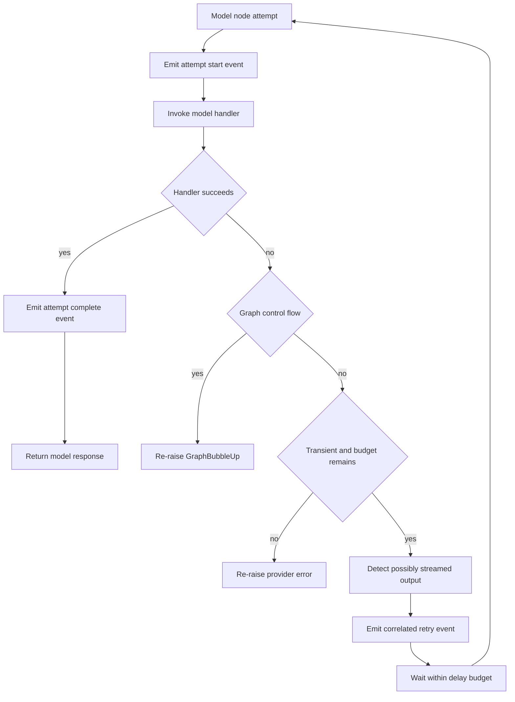

# Runtime Behavior & Failure Findings

This page records the runtime contracts that can be verified in the current dcode implementation, rather than treating construction-time intent as observed production behavior. Normal dcode runs a loopback `langgraph dev` subprocess and reaches the `agent` graph through `RemoteAgent` over HTTP and SSE; ACP is a separate in-process stdio mode and is not the path described here. See [Deep Agents Code Architecture](/openwiki/architecture/code-agent.md) for the overall topology, [State Persistence](/openwiki/concepts/state-persistence.md) for checkpoint ownership, and [Run a dcode session](/openwiki/workflows/run-dcode-session.md) for operator workflow.

## Evidence labels

- **Source-backed behavior** describes a control-flow or failure contract implemented in the cited source. It is the safe-change model.
- **Test-observed finding** describes what a focused test proves using its stated fixture or double. It is regression evidence, **not** a claim that a live provider or server was exercised unless the test is in `integration_tests/` and does so.

## Runtime ownership and execution entrypoints

`start_server_and_get_agent` is the normal client-side startup entrypoint. It captures or accepts a workspace, pre-validates explicit MCP configuration, serializes resolved launch policy into `ServerConfig`, scaffolds a temporary server directory, starts `langgraph dev`, waits for graph readiness, then creates a `RemoteAgent` configured with the workspace policy and fingerprint. The normal defaults bind to `127.0.0.1` and request port `0`, so the OS selects an ephemeral port. If startup, readiness, remote-client setup, or workspace configuration fails—or the caller is cancelled before handoff—the function's `finally` stops the owned server instead of leaving it behind.

On the server, `make_graph` is the graph-factory entrypoint registered by `langgraph.json`. A context-bearing execution must include both a nonempty thread ID and a valid workspace payload. The factory verifies the thread's durable workspace binding, then selects a workspace runtime. Calls without execution context use the configured launch workspace/process runtime. This corrects a stale simplification that there is one indiscriminate global agent: the implementation has a process runtime plus a bounded workspace-runtime cache selected from durable bindings.

A server runtime bundles the compiled graph, its `CompositeBackend`, and the offload operation derived from that exact backend. The process runtime is built once behind an async lock because construction can discover MCP tools, create a sandbox, and register cleanup. Workspace runtimes are separately cached by binding resource key in an LRU capped at 32 entries; before a new workspace runtime is built, the current configuration's fingerprint and policy must still match the persisted binding. A configured sandbox is process-wide: the first workspace claims it and a second workspace is rejected rather than silently sharing it.

## Streaming boundary and state seam

`RemoteAgent.astream` requires `config.configurable.thread_id`. It delegates SSE parsing, stream-mode negotiation, namespace extraction, and upstream interrupt detection to LangGraph `RemoteGraph`; dcode forwards a workspace descriptor in the runtime context and converts streamed message dictionaries to LangChain message objects for the Textual adapter. It defaults to `messages` and `updates` stream modes. Update events containing `__interrupt__` are converted to `Interrupt` objects, while state snapshots deliberately remain serialized server data.

This yields useful diagnostic boundaries:

| Symptom | First boundary to inspect | Source-backed handling |
| --- | --- | --- |
| No events or an SSE/HTTP exception | `RemoteAgent` / server process | Remote exceptions are normalized for display; server graph/model/tool failures originate beyond the client wrapper. |
| Malformed streamed message | `RemoteAgent.astream` conversion | The message is dropped, a count is retained, and one warning is logged after the stream instead of aborting every event. |
| Missing or empty remote state | `RemoteAgent.aget_state` | A 404 and the SDK's known no-checkpoint `TypeError` are treated as `None`; network/auth/other server failures are re-raised. |
| Thread state mutation returns 409 | `RemoteAgent.aupdate_state` | The client cancels pending/running server runs, waits with a per-run bound, then retries the update once. |

A remote checkpoint and the LangGraph HTTP thread registry are different lifecycles. `aensure_thread` idempotently materializes the HTTP thread with `if_exists="do_nothing"`, allowing a client to mutate a checkpointed thread after a server restart even when its live server row was not yet recreated. Workspace binding is also separate: `set_workspace` configures the client policy, and the first use of a thread posts it to `/dcode/threads/{thread_id}/workspace`; the returned descriptor is cached per thread.

## Model retry: bounded, node-local, and stream-aware

`CodeModelRetryMiddleware` wraps the **model node**, not an entire agent turn. It is placed inside automatic compaction, so a retry repeats the failed final model handler rather than replaying completed tools, summary generation, or archive append. It remains installed even with a zero startup budget because a runtime-selected model can carry its own provider-specific budget. The per-request model metadata wins over the middleware fallback.

A retry is eligible for LangChain `ModelError.is_retryable`, known transient transport/SDK errors, HTTP 408/409/429 and 5xx responses, including recognized faults nested in exception groups or cause/context chains. Permanent model errors and status-bearing non-retryable 4xx failures are surfaced. `GraphBubbleUp` is re-raised as graph control flow, not classified as a model failure. A successful retry uses `Retry-After` when usable (capped at 60 seconds), otherwise capped exponential backoff beginning at 0.2 seconds with modest jitter. Interactive model-node retries also have a cumulative 60-second sleep budget; refusing a retry beyond that budget surfaces the original error.

Each call has an opaque `call_id`; middleware emits custom-stream `model_attempt` start/complete events and a `model_retry` event before retrying. It wraps the message-stream handler to conservatively determine whether a failed attempt may already have emitted visible output. The retry event then carries `output_may_have_started`, allowing renderers to mark a partial response as incomplete rather than presenting it as a complete answer followed by a second answer. Failure to write this diagnostic event is logged but does not itself fail the agent run. Auxiliary non-streaming model calls use the same classifier/backoff policy, with the model's attached budget (or the normal default if unstamped) and an optional cumulative-delay guard.

This source-backed failure flow shows why retry does not replay tools and how a client can distinguish a superseded partial stream from a second independent answer.

## Interrupts and recovery of stale work

Human approval is graph-level control flow. Unless `auto_approve` is enabled, the configured interrupt policy uses `AsyncApprovalHITLMiddleware`; `interrupt_shell_only` instead uses an inline restrictive shell allow-list when one is actually available. The normal remote stream carries interrupt updates across SSE. A client should not treat a graph interrupt as a retryable provider failure: the retry middleware explicitly lets `GraphBubbleUp` pass through.

After a cancelled or lost run, `state_has_pending_work` considers queued nodes, tasks, or interrupts as unfinished work. `aabandon_pending_work` first makes best-effort cancellation requests, reads the checkpoint, appends error `ToolMessage` values only for unanswered calls in the **trailing** AI-message turn, then writes `__end__` to discard queued graph work. It re-reads state and raises if any pending work remains. This ordering matters: it prevents resumed execution of an old tools step, while preserving a protocol-valid terminal answer for calls immediately associated with the trailing turn. The Textual app invokes this recovery only after a user chooses cancellation of pending resumed work; if recovery fails, it reports that the operation could not be cancelled safely and does not compact the conversation.

## Startup failures, cleanup, and operating constraints

Graph construction is a startup barrier. The server reads `ServerConfig` from environment, snapshots workspace environment/credentials, resolves model and tools, and calls `create_cli_agent`. Blocking filesystem/provider setup is explicitly moved to worker threads when building on the server event loop. Built-in `fetch_url` and thread-ID tools are always assembled; web search is conditional on workspace credentials; MCP discovery is skipped with `no_mcp`. Criteria/rubric contexts admit only explicitly coherent read-only MCP tools.

Construction failures emit human-readable stderr plus `DEEPAGENTS_STARTUP_ERROR:` and exit with status 1. The parent health/readiness logic watches for early process exit, extracts that marker from captured output, and includes it in the raised startup error rather than waiting until a generic health timeout. A request-scope offload consumer must contain `SystemExit`, because a startup-barrier exit must not kill an already-serving server during a request.

Server-launch environment handling is also an execution-safety boundary. `PYTHONPATH` and other startup-influencing inherited variables are removed before the child interpreter runs, avoiding imports from an untrusted project during server startup. The original `PYTHONPATH` is relayed separately only to the approval-gated shell backend. The generated configuration enables custom-route auth when a deployment configures it; normal local operation relies on the loopback bind and uses noop auth.

For changes here, run the closest tests first, then the dcode package targets documented in [Testing Guide](/openwiki/testing/testing-guide.md). The unit tree is the right contract suite for conversion, retry, cache, and marker behavior; process/network expectations belong in `tests/integration_tests/`.

## Focused test-observed findings

The following are deliberately scoped observations, not claims of live-provider behavior:

- **Unit: `test_server_graph.py`.** Repeated and concurrent factory requests using injected builders return the same graph and invoke construction once. The same suite proves marker-plus-exit behavior with a mocked failing builder, that `no_mcp=True` avoids the MCP resolver, and that ambiguous/mutating/unannotated MCP tools are excluded from criteria context.
- **Unit: `test_remote_client.py`.** Mocked streams demonstrate conversion of serialized interrupt updates and message forms. Its remote-state/recovery tests exercise the 409 cancellation-and-single-retry path and checkpoint-clearing behavior through doubles, not a real LangGraph server.
- **Unit: `test_model_retry.py`.** Fake models and transport exceptions cover retry classification, propagation of `GraphBubbleUp`, retry event validation, and streaming-attempt behavior. They validate dcode's policy mechanics without contacting a provider.
- **Integration: `test_pending_work_recovery.py`.** An in-memory compiled `StateGraph` is deliberately seeded with a queued `tools` node. Calling `RemoteAgent.aabandon_pending_work` leaves no queued node/task, does not execute the side-effecting tool, and appends an error result for the dangling tool call. This is an integration-tree regression test, but it is still an in-process graph with an `InMemorySaver`, not an external server or provider test.

## Safe-change checklist

1. Preserve the model-node retry boundary; moving it outside compaction or around a whole turn can replay side effects.
2. Preserve the thread ID, workspace binding, and policy-fingerprint checks when changing remote execution. They determine server-side runtime selection.
3. Treat `SystemExit` from graph construction differently from ordinary request failure, and keep the startup marker parseable by the parent.
4. Keep cancellation recovery idempotent and verify that it clears pending graph work without running the queued tool.
5. When adding stream payloads, make old-client handling defensive; remote conversion already treats provider-shaped stream data as untrusted.
6. Test both source-level contracts and the appropriate runtime tier; do not overstate unit doubles as live-server or live-model observations.
