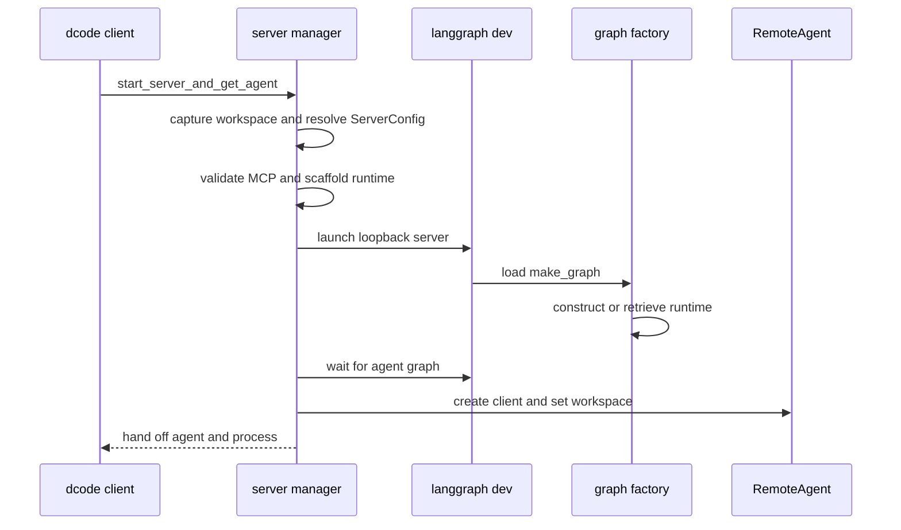
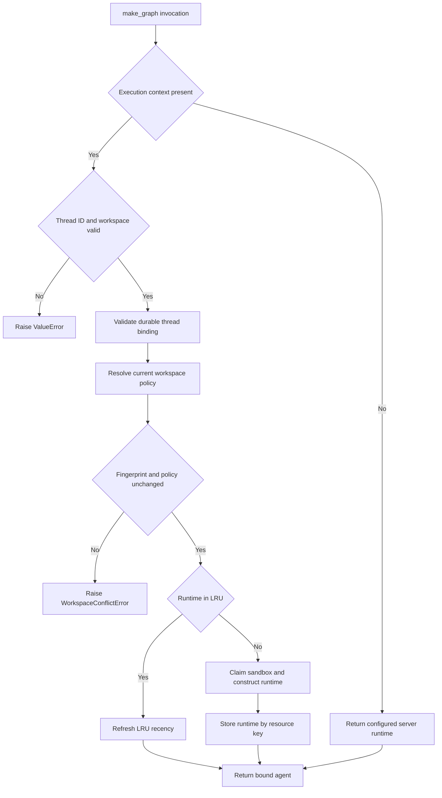
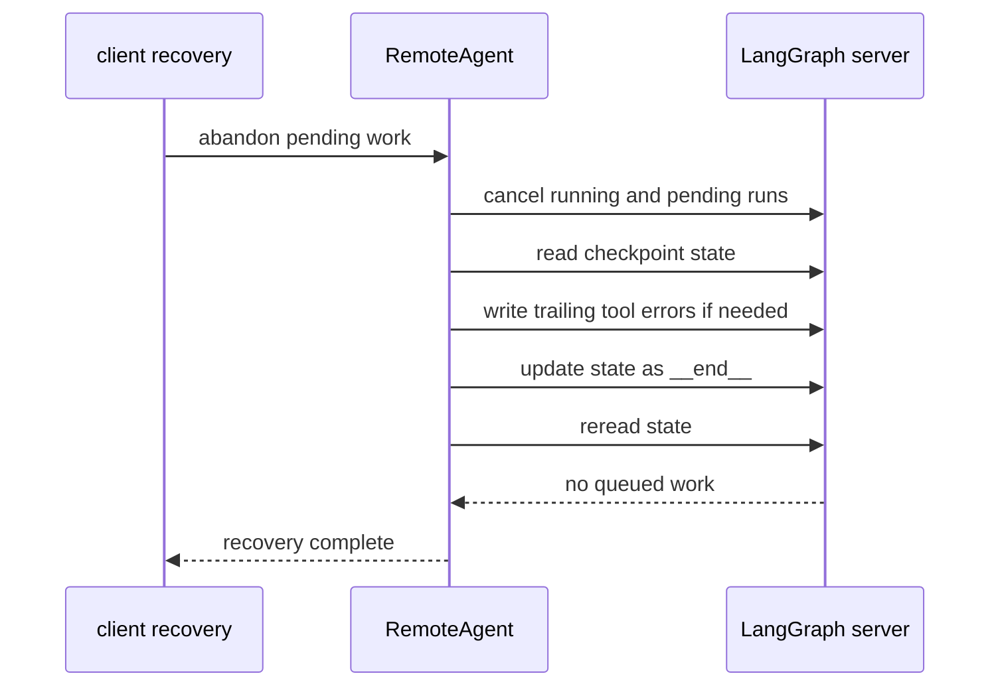

# dcode Runtime Behavior and Failure Handling

Interactive dcode runs its agent in an owned, loopback `langgraph dev` subprocess and uses `RemoteAgent` over HTTP and SSE. The client owns UI/session behavior; the server owns the compiled graph, backend, MCP sessions, sandbox lifetime, and offload operation. This page covers that boundary, not ACP's in-process stdio path. See [Deep Agents Code Architecture](/openwiki/architecture/code-agent.md), [Configuration Layering](/openwiki/concepts/config-layering.md), [State Persistence](/openwiki/concepts/state-persistence.md), [MCP](/openwiki/integrations/mcp.md), [Sandbox partners](/openwiki/integrations/sandbox-partners.md), and [Run a dcode session](/openwiki/workflows/run-dcode-session.md).

## Startup and handoff

`start_server_and_get_agent` captures the explicit or current workspace, pre-validates an explicitly supplied MCP configuration, resolves a `ServerConfig`, writes its `DEEPAGENTS_CODE_SERVER_*` representation, and scaffolds a temporary server directory. The scaffold supplies `langgraph.json`, a SQLite checkpointer module, and a minimal runtime project whose graph reference is `deepagents_code.server_graph:make_graph`.

It starts `langgraph dev` on `127.0.0.1` and an ephemeral port by default, waits until the `agent` graph can be resolved, then creates `RemoteAgent` and configures its workspace claim. The server process is handed to the caller only after that succeeds. Until then the manager owns it and its `finally` calls idempotent `stop()`, including when cancellation interrupts setup. `server_session` extends that ownership through its context-manager lifetime and emits any deferred preserved-log notices after teardown.

This is the successful launch and ownership handoff. A malformed or unavailable *explicit* MCP file fails before spawning the child; discovered project and user MCP configurations are instead handled by server-side discovery.

`ServerConfig` is the process-boundary contract. It partitions the workspace payload into a client-claimable session policy and server-resolved project policy, so client input cannot alone enable checkout-scoped execution. Relative MCP, sandbox-setup, and extension paths are made absolute before serialization because the child runs in the scaffold directory.

## Server construction and resource ownership

The factory reconstructs `ServerConfig` from the environment. Before assembly it snapshots the selected workspace dotenv environment and credentials, activates that immutable environment for the build, and pins process-wide tracing settings. Because LangSmith clients and environment caches are process-wide, a workspace with different tracing/redaction settings is refused rather than rerouting cached or concurrent runtimes.

Blocking environment, path, model, and synchronous graph setup run in worker threads rather than the server event loop. Construction creates the model, `fetch_url` and thread-ID tools, optionally web search when the workspace has a Tavily key, and MCP tools unless `no_mcp` is set. Criteria and rubric agents receive only built-ins explicitly designated read-only plus MCP tools with coherent explicit read-only annotations.

`ServerRuntime` joins the compiled agent with the exact `CompositeBackend` used to construct it and an offload operation derived from that backend. The graph and `/offload` therefore share backend and archive policy; no offload operation is a construction failure. A configured sandbox is opened as process-lifetime state and registered for `atexit` cleanup. Sandbox setup errors print a `DEEPAGENTS_STARTUP_ERROR:` marker and exit. Experimental extensions receive workspace, mode, project trust, and explicit paths; load errors are warnings, while active extensions are shut down if later graph construction fails.

The ordinary process runtime is constructed once behind an async lock. This is correctness, not just performance: recreating it could repeat MCP discovery, leak sandbox sessions, duplicate `atexit` handlers, and split graph/offload backend state. Startup construction failures emit the marker and exit nonzero; the parent health/readiness paths extract that marker from an early child exit. Request-scope offload handling contains this `SystemExit` and maps it to a service-unavailable response instead of killing an already serving child.

## Workspace binding, selection, and caches

A workspace is a durable, server-authoritative binding per thread. The workspace module validates untrusted `cwd` as an existing canonical absolute directory without traversal, derives an identity from its canonical directory and project root, and stores binding data in `dcode_thread_workspaces`. The resource key incorporates workspace identity and configuration fingerprint.

`RemoteAgent.set_workspace` stores only launch policy for future binds, requiring policy and fingerprint together and clearing its per-thread descriptor cache. On first use, the client posts `cwd` and, when configured, the session policy and fingerprint to `/dcode/threads/{thread_id}/workspace`; it validates the returned descriptor and caches it by thread. The cache is a transport optimization, not authorization: durable binding and server-side validation decide every execution.

This flow shows execution-time routing rather than merely launch-time construction. With execution context, `make_graph` requires a nonempty thread ID and workspace context, verifies the binding, and selects that binding's runtime. Without it, it returns the configured server runtime.

Workspace runtimes are a lock-protected LRU of at most 32 entries keyed by resource key; reads refresh recency and insertion evicts the oldest item. Before reuse or construction, the server resolves current policy and rejects changed project fields or a changed fingerprint. It preserves the binding's extension-trust decision while checking current policy; even a failed trust-store read is handled as policy drift. A process-wide sandbox is reserved for one workspace ID and cannot be silently shared with another.

## Streaming, state mutation, and recovery

`RemoteAgent` requires `config.configurable.thread_id` for streams and state operations. For `astream`, it obtains the bound workspace descriptor and adds it to runtime context, while `RemoteGraph` handles SSE framing, `messages-tuple` negotiation, namespace extraction, and interrupt detection. The wrapper converts streamed message dictionaries and interrupt updates for the UI, but leaves state snapshots serialized. Failed message conversion is counted and logged after the stream rather than aborting other events.

Checkpoint persistence and the development server's live HTTP thread row are distinct. `aget_state` treats a missing remote thread and the SDK's known no-checkpoint `TypeError` shape as empty state, but re-raises other reads. `aensure_thread` uses `if_exists="do_nothing"` to restore the HTTP row before state-mutating operations after a server restart. An HTTP 409 state update cancels pending and running runs concurrently, with a bounded wait for each, then retries the update once; other errors propagate.

When a session ends with queued graph work, `aabandon_pending_work` does not resume it. It cancels active runs, emits error `ToolMessage` values only for unanswered calls in the trailing AI-message turn, writes `__end__`, then rereads state and raises if queued nodes, tasks, or interrupts remain.

This verified recovery path deliberately avoids executing the queued tool. The trailing-turn limitation preserves the adjacency required between a tool use and its result.

Server-owned offload follows the same workspace boundary: the client ensures the live thread row, forwards workspace context, validates operation responses, and on caller cancellation asks the server to acknowledge a terminal offload status. An absent `/offload` route is reported as server compatibility failure rather than an ambiguous 404.

## Model retries and failure visibility

`CodeModelRetryMiddleware` wraps model-node calls, not an entire agent turn, and is installed inside compaction. Retrying a transient provider failure therefore does not replay completed tools, summary generation, or archive append. The retry budget is read from the request model when present, allowing a runtime-selected model to override the startup fallback.

`GraphBubbleUp` is re-raised as graph control flow. Transient classifications include retryable `ModelError`, selected provider/HTTP transport failures, HTTP 408/409/429 and 5xx responses, including recognized faults nested in exception groups or cause chains. Retries use a positive, usable `Retry-After` value capped at 60 seconds or jittered exponential backoff. Interactive calls also have a cumulative delay guard. Terminal errors and exhausted budgets are re-raised; they are never converted into synthetic AI answers.

Every model attempt produces correlated start/complete events, and retries carry the failed attempt and whether output may already have been streamed. Event-writer errors are logged but do not fail the agent run; `GraphBubbleUp` from the writer still propagates. This lets consumers mark superseded partial output incomplete without making diagnostics a second failure path.

## Shutdown and operational guidance

The child startup environment removes `PYTHONPATH`; its original value is conveyed only through a dedicated inherited carrier for downstream execute commands. Local launch uses noop auth on loopback. Generated dcode operation routes opt into custom-route authentication when a deployment configures authentication.

`ServerProcess.stop()` is idempotent and synchronized with restart so terminal shutdown wins over an in-flight restart. On POSIX, the child starts in a new session/process group; shutdown signals the group with `SIGTERM`, waits, then escalates to `SIGKILL` without targeting dcode's own group. On Windows it sends Ctrl+Break and then terminates the root process, so a descendant may survive orphaned. Failed signaling is logged, and debug mode preserves server logs for later notice rather than deleting them.

Focused tests use injected builders and doubles to cover runtime cache/startup-marker behavior, retry and stream behavior, workspace conversion and recovery, and cancellation of an in-memory queued-tools graph without running its tool. When changing this area, preserve policy partitioning and durable binding validation, keep graph and offload on the same backend, test cancellation-safe cleanup, and retain recovery ordering: cancel, repair the trailing turn, write `__end__`, then verify.
