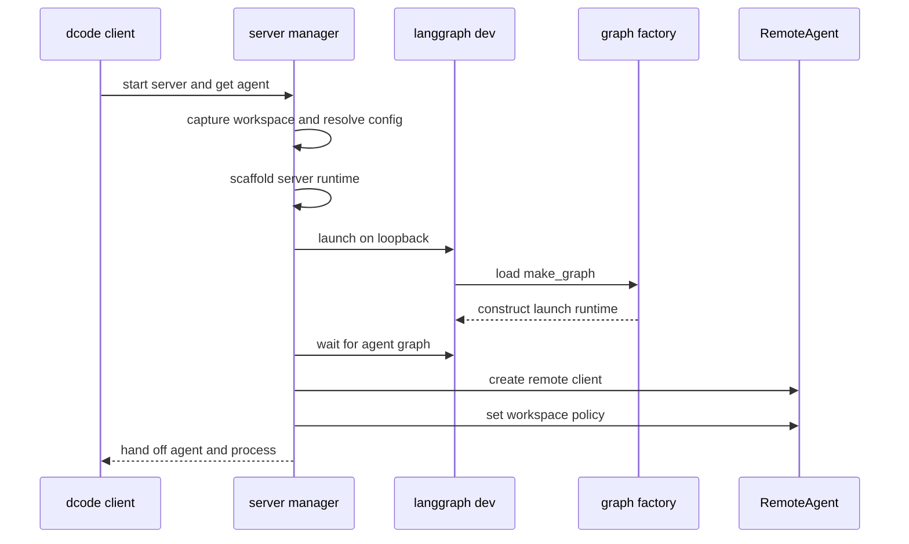
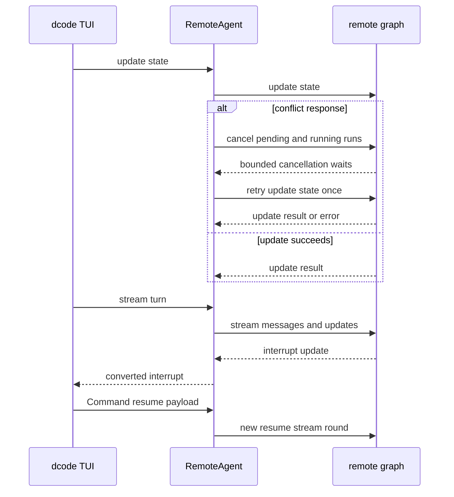
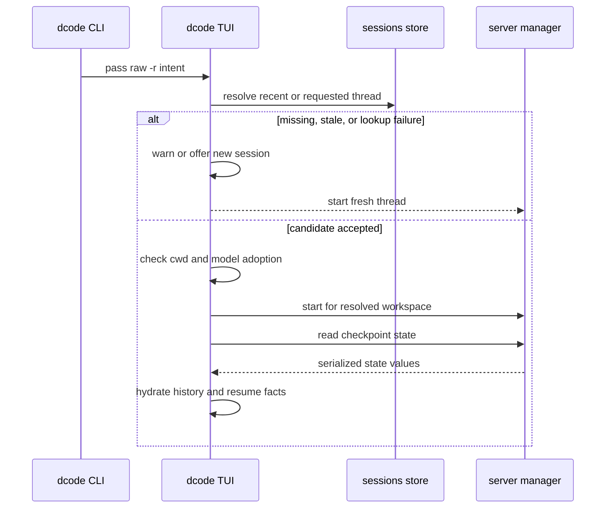

# dcode Runtime Behavior and Failure Handling

Interactive dcode runs the `agent` graph in an owned loopback `langgraph dev` subprocess. The client owns the TUI, session selection, and HTTP/SSE adaptation; the server owns graph construction, the backend, MCP sessions, sandbox lifetime, and server-side offload. This page concerns that remote interactive path. For agent composition, context policy, approvals, persistence, and operator workflows, see [Deep Agents Code Architecture](/openwiki/architecture/code-agent.md), [Context Management](/openwiki/concepts/context-management.md), [Permissions and HITL](/openwiki/concepts/permissions-hitl.md), [State Persistence](/openwiki/concepts/state-persistence.md), [Testing Guide](/openwiki/testing/testing-guide.md), and [Run a dcode session](/openwiki/workflows/run-dcode-session.md).

## Startup and ownership

`start_server_and_get_agent` captures the workspace and resolved `ServerConfig`, scaffolds a temporary server project, and launches `langgraph dev` on `127.0.0.1` with an ephemeral port by default. It waits for the `agent` graph, then applies the workspace policy to the returned `RemoteAgent`. Until that handoff succeeds, the manager owns the child and cleans it up in `finally`, including when setup is cancelled.

`ServerConfig` deliberately splits client-claimable session policy from server-resolved project policy. On first use, the client sends `cwd` and, when configured, the session claim and fingerprint to the thread-workspace route; the server returns and the client caches a descriptor for that thread. The durable binding, not the client cache, is authoritative. The policy and fingerprint must be configured together, and a configuration change clears cached descriptors.

The server snapshots the selected workspace environment and credentials before it builds a runtime, moves blocking setup off the event loop, conditionally assembles web and MCP tools, and emits `DEEPAGENTS_STARTUP_ERROR:` before exiting on construction failure. Parent readiness checking extracts that marker when the child exits early. Experimental extension loading receives workspace, mode, project-trust, and explicit-path inputs; load failures are warnings, but active extensions are shut down if later construction fails.

This sequence shows the ownership transfer. Failed setup and cancellation occur before the final handoff, so the manager stops the server rather than leaving it behind.

### Runtime selection and lifecycle

With LangGraph execution context, `make_graph` requires both a nonempty thread ID and workspace context, validates the durable thread/workspace binding, and selects its binding-specific runtime. Without that context it returns the configured launch runtime. Server runtime construction returns the compiled agent, its `CompositeBackend`, and an offload operation derived from that same backend.

Process construction is lock-protected and cached. Workspace runtimes are a separate lock-protected LRU of at most 32 entries. Before reuse or creation, current policy and fingerprint are compared with the binding; drift fails with a workspace conflict. A process-wide sandbox cannot be shared by different workspace IDs. These constraints prevent a request from choosing a workspace just by naming a directory, and prevent the graph and offload route from observing divergent backend state.

The child strips `PYTHONPATH` when it starts the server, carrying it separately only for downstream execute commands. Local launch uses noop authentication; generated dcode operation routes enable custom-route authentication when a deployment configures it. `ServerProcess` uses a POSIX process group for graceful shutdown and SIGKILL escalation. On Windows it sends Ctrl+Break and ultimately terminates only the root process, so a descendant may survive as an orphan.

## A model and tool turn

`RemoteAgent.astream` requires a thread ID, ensures the thread workspace descriptor is available, adds it to the server runtime context, and requests `messages` and `updates` by default. `RemoteGraph` owns SSE framing, `messages-tuple` negotiation, namespace extraction, and interrupt detection. `RemoteAgent` turns streamed message dictionaries into LangChain message objects for the UI and converts `__interrupt__` data, while state snapshots remain in server serialization. Failed message conversion is counted and logged after the stream instead of terminating unrelated events.

The compiled agent can pause at a LangGraph interrupt for approvals, `ask_user`, or server-owned hook work. The client renders and resolves those requests, then submits a `Command(resume=payload)` keyed by interrupt ID. This is a new graph invocation/resume round, not a continuation of a held remote coroutine; client code must therefore treat replayed stream events as possible. A cancellation before that command discards the pending response rather than assuming a remote graph cancellation protocol.

`CodeModelRetryMiddleware` wraps only the model-node call and is installed inside compaction. A transient provider failure therefore does not replay already completed tools, summary generation, or archive append. `GraphBubbleUp` is re-raised; only classified transient failures retry while budget remains, using useful `Retry-After` hints or jittered exponential backoff. Terminal errors are re-raised rather than converted into invented assistant content. Correlated attempt/retry events tell consumers whether partial visible output may have been superseded; diagnostic-event failures do not fail the run.

## Remote conflicts, cancellation, and recovery

Checkpoint state and the development server's live HTTP thread row are separate. `aget_state` treats a missing remote thread and the SDK's known no-checkpoint `TypeError` shape as empty state, but re-raises other state-read errors. `aensure_thread` idempotently registers the live row, which lets a persisted thread accept state mutation after a server restart.

A state-update conflict is handled narrowly: `RemoteAgent` cancels pending and running runs with bounded concurrent waits, then retries the state update once. It does not infer that arbitrary remote work has completed or retry indefinitely. Offload similarly requires the live thread, forwards workspace context, validates operation protocol responses, and reports a missing `/offload` route as a server-compatibility error; a 500 may be indeterminate and must be surfaced because its commit might have landed.

When a user chooses recovery for stale pending graph work, `aabandon_pending_work` cancels active runs, adds error results only for unanswered calls in the trailing AI-message turn, writes `__end__`, and re-reads state to verify that no queued node, task, or interrupt remains. This is destructive abandonment, not an attempt to resume unknown work; it preserves history/tool-call adjacency while preventing queued tools from executing later.

This request/retry sequence documents only client behavior implemented by dcode: cancellation is best-effort conflict preparation, and the sole automatic update retry follows it.

## Resuming a persisted thread

At CLI startup, `-r` represents either the most recent thread or a requested ID; the TUI resolves that intent asynchronously before server startup. A normal launch resets the startup-update deferral, whereas a resume launch may defer automatic update only for its bounded grace period. Missing history, no matching recent thread, or a lookup failure falls back to a new thread with a warning.

Before adopting a candidate, the TUI applies the strictest of `threads.resume_after` and `threads.max_resume_age`. An unavailable or invalid `updated_at` blocks resumption rather than treating the thread as fresh. The user can start a new session or exit. If a resumed thread has another working directory, the launch-time prompt can switch directory or abort the resume into a fresh thread. A failure to display that prompt does not discard the resolved thread; dcode continues with a warning that local context may be stale.

On successful resume, dcode may adopt the saved thread agent for this session and, unless `--model` explicitly pinned a model, restores its persisted model choice. A one-off resume does not change the user's persisted default agent. The graph stores resume facts as private, checkpoint-versioned channels: successful model calls store effective model/specification and context-token information alongside the model response, while user-owned goal and rubric state may be written through `aupdate_state`. This lets the TUI restore session settings and token state without replaying or re-tokenizing history.

For a resumed thread above `threads.compact_on_resume_threshold`, the TUI offers compaction before the next turn. It first checks for queued work. If work is pending and the user confirms, it abandons that work before offload; failure to abandon leaves the conversation uncompacted and reports that the operation could not be cancelled safely. Integration coverage verifies that a thread persisted by one server can be resumed and compacted by a fresh server, with its archive readable through the agent backend.

## Safe changes and focused tests

Focused unit tests cover server-runtime caches and startup markers, retry timing and stream behavior with fake models/transport failures, remote stream conversion/conflict recovery with doubles, and resume-state coercion and token persistence. Integration tests cover queued-tool abandonment without executing the tool and persisted-thread compaction across a server restart.

When changing this path:

1. Keep workspace claim partitioning, durable-binding validation, cache keys, and sandbox ownership aligned.
2. Keep model retries inside compaction and do not retry an entire turn after tools have run.
3. Preserve the order for stale-work recovery: cancel, repair only trailing unanswered calls, write `__end__`, then verify.
4. Treat remote cancellation and indeterminate operation failures as explicit outcomes, not proof of server state.
5. Preserve resume age checks and fail-closed handling of unusable timestamps or persisted private-state values.
6. Exercise server restart, interrupted/resumed turns, and both shutdown platforms when changing lifecycle behavior.
