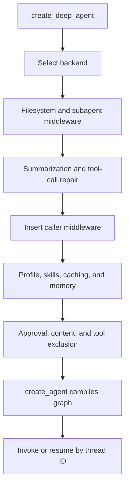
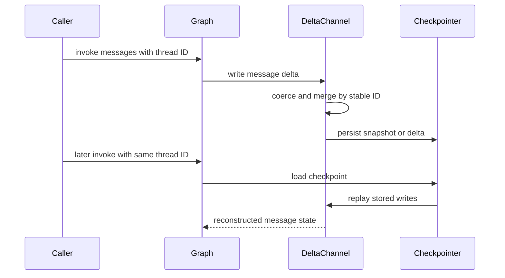

# Runtime Behavior and State Boundaries

`create_deep_agent()` is the runtime entrypoint. It produces a LangGraph `CompiledStateGraph` by calling LangChain's `create_agent()` with a Deep Agents state schema, a composed middleware stack, caller tools, and optional persistence facilities. The returned graph is the agent loop: model output can call tools, tool results return to the message state, and the loop continues until the underlying agent finishes. Deep Agents configures a high recursion limit (`9_999`) and attaches integration/version metadata, but leaves the choice of model, checkpointer, store, cache, and invocation `thread_id` to the caller.

This page describes runtime ownership. For context compaction and offloading policies, see [Context Management](/openwiki/concepts/context-management.md). For permission rules and human approval configuration, see [Permissions and Human-in-the-Loop](/openwiki/concepts/permissions-hitl.md). For choosing and operating persistence, see [State Persistence](/openwiki/concepts/state-persistence.md).

## Assembly: one graph, ordered middleware

A deep agent starts with a `StateBackend` unless a backend is supplied. Its built-in filesystem middleware supplies file operations and, when the backend implements the sandbox protocol, shell execution. Caller-supplied `tools=` are additive; they do not remove built-ins. The `task` tool exists when there are synchronous subagents, including the default `general-purpose` subagent unless the active harness profile disables it. Remote async subagents are a separate capability and add their own task-management tools.

The main stack is assembled in a deliberate order:

1. `FilesystemMiddleware` establishes file and execution tools and applies filesystem permissions.
2. `SubAgentMiddleware`, when inline subagents exist, exposes `task`.
3. Summarization and `PatchToolCallsMiddleware` manage context and repair incomplete historical tool exchanges before a run.
4. `AsyncSubAgentMiddleware`, if configured, adds non-blocking remote-task controls.
5. Caller middleware is inserted after those core layers and before the profile, skills, caching, and memory tail (unless it replaces a named built-in in place).
6. Human-in-the-loop, unsupported-content handling, and profile tool exclusion are installed at the end; exclusion runs after custom middleware so a wrapper cannot restore an excluded tool.

A harness profile can replace middleware by name, contribute extra middleware, rewrite tool descriptions, or exclude optional middleware/tools. It cannot remove the required filesystem or synchronous-subagent scaffolding: invalid, ambiguous, private-name, protected, or unmatched exclusions fail construction rather than silently creating a degraded graph.

```mermaid
flowchart TD
    Build["create_deep_agent"] --> Backend["Select backend"]
    Backend --> Core["Filesystem and subagent middleware"]
    Core --> Loop["Summarization and tool-call repair"]
    Loop --> Custom["Insert caller middleware"]
    Custom --> Tail["Profile, skills, caching, and memory"]
    Tail --> Guard["Approval, content, and tool exclusion"]
    Guard --> Compile["create_agent compiles graph"]
    Compile --> Invoke["Invoke or resume by thread ID"]
```

This is the assembly and invocation path; a middleware's position determines which request and state transformations it observes.

### Tool and permission boundary

Permissions are enforced by `FilesystemMiddleware` around its built-in filesystem tools, not by direct use of the backend. Filesystem rules are evaluated in declaration order and the first matching rule wins; unmatched calls are allowed. A rule can allow, deny with a tool error, or interrupt for review. Interrupt-mode rules are translated into tool-specific `interrupt_on` entries and then merged with explicit `interrupt_on`; explicit entries win for the same tool name.

The resulting `HumanInTheLoopMiddleware` pauses at configured tool calls. A checkpointer is therefore necessary when the application expects to preserve an interrupted run for later resume. Deep Agents passes the caller's checkpointer unchanged to the compiled LangGraph agent; it does not choose an implicit durable checkpointer.

## State, reducer, and checkpoints

`DeepAgentState` uses a LangGraph `DeltaChannel` for `messages`, with a snapshot frequency of 50. Rather than repeatedly checkpointing a full growing transcript, the channel replays message deltas between snapshots. This changes the growth pattern for message checkpoint data from quadratic to linear while retaining a normal `messages` state interface.

The local `_messages_delta_reducer` is the replay invariant:

- It accepts message-like values from API/over-the-wire inputs and coerces them to typed messages.
- A message with a new stable ID is appended; a later write with the same ID replaces the earlier message instead of duplicating it.
- `RemoveMessage` deletes a matching ID. `REMOVE_ALL_MESSAGES` discards the base state and all earlier writes in that batch; only writes after the last sentinel survive.
- It treats an absent replay base (`None`) as empty, which allows recovery of threads whose earliest checkpoint did not explicitly seed `messages: []`.

Stable IDs are assigned by LangGraph before checkpoint serialization, not by the reducer. That is essential for deterministic replay: generating IDs in a reducer would assign different IDs when reapplying stored writes. Tests exercise sync and async resumed threads, dict-style input, no-base replay, and eviction replacement to ensure state reads retain stable IDs and do not duplicate messages.

```mermaid
sequenceDiagram
    participant Caller
    participant Graph
    participant Channel as DeltaChannel
    participant Saver as Checkpointer
    Caller->>Graph: invoke messages with thread ID
    Graph->>Channel: write message delta
    Channel->>Channel: coerce and merge by stable ID
    Channel->>Saver: persist snapshot or delta
    Caller->>Graph: later invoke with same thread ID
    Graph->>Saver: load checkpoint
    Saver->>Channel: replay stored writes
    Channel-->>Graph: reconstructed message state
```

The graph receives `checkpointer`, `store`, `cache`, and `context_schema` as separate integration points. A checkpointer persists graph state between runs; a store is separately supplied when a backend such as `StoreBackend` needs persistent file storage. Run-scoped context belongs in `context_schema`, while durable graph values belong in the state schema or middleware state schema. Sharing a `thread_id` is the application-level decision that selects a checkpoint lineage and thus makes a later invocation a continuation rather than a new conversation.

## Middleware-owned and private state

Middleware may contribute state schemas. Deep Agents gathers the caller's state schema plus all assembled middleware schemas, discovers fields annotated with `PrivateStateAttr`, and gives their names to every `SubAgentMiddleware` in the final stack—including a caller replacement for the default task middleware.

Private state is a delegation boundary, not merely a type annotation. For a normal inline task, private keys are removed before the child receives the parent state and removed again from the child's returned state before it is merged into the parent. This prevents a secret or process-local value produced by one child from leaking to sibling children or back through the task result. If Deep Agents cannot resolve a schema's annotations at runtime, it logs a warning and cannot protect private fields from that schema; annotation dependencies must therefore be importable at runtime rather than only under `TYPE_CHECKING`.

The async middleware owns a distinct `async_tasks` state field. Its reducer merges task updates by task ID, so launch, poll, update, cancel, and list operations retain remote task identifiers and status across graph state changes and context compaction/offloading.

## Tool execution and interrupted histories

A model tool call runs through the assembled middleware and tool set. Middleware may return a LangGraph `Command` that updates state and supplies the matching `ToolMessage`; tools that use state should use this path so message and non-message updates remain one graph transition.

`PatchToolCallsMiddleware` runs before the agent loop. It scans prior AI tool calls and invalid tool calls, finds IDs without a corresponding tool result, and appends an error `ToolMessage` for each. The repair tells the model whether a call was malformed or may have been cancelled/interrupted, preventing an old checkpoint from containing an unresolved assistant tool request when the next invocation starts. The middleware replaces the message list atomically by writing `REMOVE_ALL_MESSAGES` followed by the repaired history.

Human approval is a different pause path: `HumanInTheLoopMiddleware` emits an interrupt before the protected tool runs. Resume is performed by the LangGraph application using the saved graph/thread state and its review decision; Deep Agents' responsibility is to install the interrupt configuration consistently for the main graph and declarative subagents. Do not assume an interrupt protects a `CompiledSubAgent` or remote async agent: those graphs own their own approval configuration.

## Cross-graph delegation boundaries

The `task` tool supports declarative `SubAgent` definitions and opaque `CompiledSubAgent` runnables. They have materially different state contracts:

| Form | Initial context | Schema and policy ownership | Result returned to parent |
| --- | --- | --- | --- |
| Isolated declarative subagent | Only a new `HumanMessage` containing the delegated description, plus non-private transferable state | Deep Agents compiles it with the parent custom state schema; it inherits parent tools, permissions, and `interrupt_on` unless overridden | A `ToolMessage` containing the structured response as JSON or the last non-empty AI text; eligible public state updates merge back |
| Forked declarative subagent | Parent conversation/state, with excluded transient fields removed and a new task message appended | Experimental; rebuilds the effective parent prompt and cannot define its own skills | Same task-result protocol; recursive `task` calls are refused |
| Compiled subagent | Isolated mode receives the delegated task and transferable state; a compiled fork gets a restricted inherited state | Caller owns its runnable and compatible schema; it does not inherit `state_schema` or top-level approval settings | Must return a state containing `messages`, or `task` raises `ValueError` |
| Async subagent | A remote Agent Protocol run with its own remote thread/run IDs | The remote graph owns its tools, state, and approval policy | Launch returns immediately; local `async_tasks` records status for later check, update, cancel, or list calls |

For an inline task, the parent invokes the selected child synchronously (or asynchronously through `atask`) and converts completion to a `ToolMessage` linked to the parent tool-call ID. A structured child response takes precedence; otherwise the final non-empty `AIMessage` text is used, avoiding an empty trailing end-turn response. Parent callbacks, tags, and compatible configuration propagate through the LangGraph runtime, while the child receives a subagent tracing marker.

Forking is intentionally narrower than ordinary inheritance. A declarative fork receives the parent's effective conversation so it can continue work, mirrors prompt-producing middleware, and marks itself as forked. Its task tool remains visible only to return a refusal at call time, which prevents recursive delegation without changing the inherited tool shape. Compiled runnables are opaque, so Deep Agents cannot safely pass their internal/private channels or retrofit their schemas.

Remote async subagents are not a continuation of the local graph. They communicate through the LangGraph SDK with an Agent Protocol server, return a task ID immediately, and may run concurrently. Local ASGI transport without a URL requires the parent to use an async entrypoint; synchronous invocation requires a reachable URL. Treat remote headers and the remote graph's configured capabilities as a separate trust and operational boundary.

## Safe-change checklist

- Preserve `DeepAgentState.messages` as a `DeltaChannel` when extending state schemas; replacing it loses the reducer and its checkpoint-growth/replay guarantees.
- Give stateful middleware explicit schemas, mark non-delegable fields with `PrivateStateAttr`, and ensure referenced annotation types resolve at runtime.
- Keep tool result messages correlated with their `tool_call_id`; preserve `PatchToolCallsMiddleware` or an equivalent repair strategy when resuming old checkpoints.
- Configure a checkpointer before relying on approval interrupts or multi-turn continuation, and test resume using the same `thread_id`.
- Treat `CompiledSubAgent` and `AsyncSubAgent` as graph ownership boundaries. Audit their state, tools, checkpointing, approvals, and credentials independently rather than expecting parent configuration to flow into them.
- When altering stack order or exclusions, test both the main graph and generated general-purpose subagent: required filesystem and task scaffolding must remain available, and exclusions must fail loudly when stale.
