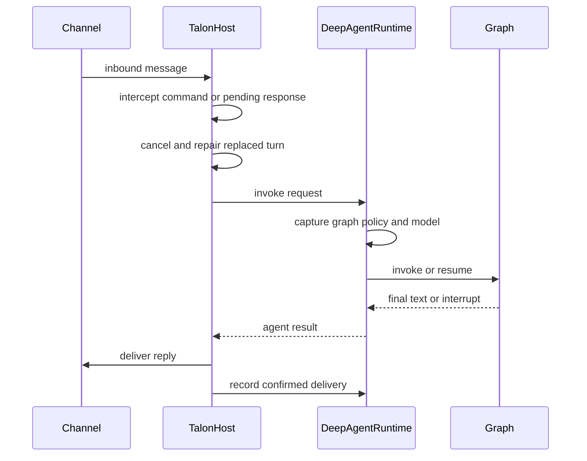
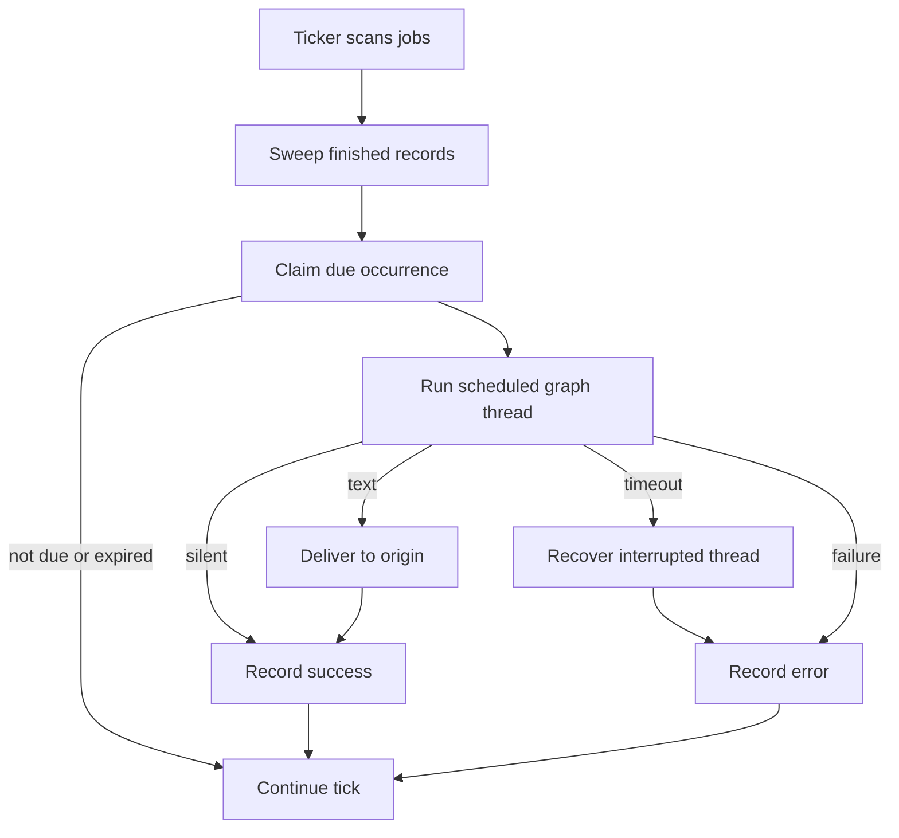

# Talon Runtime and Host Behavior

> **Experimental boundary:** Talon is experimental and subject to change or removal. It is **not** a production or multi-tenant security boundary. Its host-side admission, authority, and delivery checks reduce accidental capability transfer, but operators must still deploy it only in an environment appropriate for the tools, credentials, models, and channels configured.

`DeepAgentRuntime` owns graph construction, checkpoints, turn-local context, and agent execution. `TalonHost` owns managed startup and shutdown, channel dispatch, per-conversation serialization and replacement, host-confirmed delivery, background follow-ups, and scheduled dispatch. This division keeps a running turn on its captured graph, approval policy, and model even as later configuration changes take effect. See [Permissions and Human-in-the-Loop](/openwiki/concepts/permissions-hitl.md), [State Persistence](/openwiki/concepts/state-persistence.md), [Talon channel admission](/openwiki/concepts/talon-channel-admission.md), and [Talon scheduling](/openwiki/concepts/talon-scheduling.md).

## Host lifecycle and interactive turns

The host starts the runtime, binds each channel's message handler (and reaction handler where available), starts channels, and then starts the scheduler. Partial startup is unwound in reverse order. Stop cancels the background dispatcher and in-flight work, stops channels and the scheduler, then stops the runtime; failure in an individual component is logged without preventing the remaining cleanup.

For each inbound message, the host derives a provider-qualified conversation root and history scope, then takes the history and conversation locks. `/help` is answered before locking. Inside the locks, host commands, pending tool-approval replies, and pending OAuth authorization responses are handled before ordinary model input can replace a turn. Channel adapters enforce their exposure/admission policy before calling the host; open exposure requires explicit acknowledgement because arbitrary senders could otherwise trigger the agent.

```mermaid
sequenceDiagram
    participant Channel
    participant Host as TalonHost
    participant Runtime as DeepAgentRuntime
    participant Graph
    Channel->>Host: inbound message
    Host->>Host: intercept command or pending response
    Host->>Host: cancel and repair replaced turn
    Host->>Runtime: invoke request
    Runtime->>Runtime: capture graph policy and model
    Runtime->>Graph: invoke or resume
    Graph-->>Runtime: final text or interrupt
    Runtime-->>Host: agent result
    Host->>Channel: deliver reply
    Host->>Runtime: record confirmed delivery
```

This sequence distinguishes completed model work from a reply the host has confirmed as delivered.

Interactive model turns are serialized by conversation root. A normal incoming message supersedes an active turn: the host increments the generation, cancels the old task, repairs its graph thread, and starts the replacement. If bounded cancellation/recovery does not settle, the conversation is blocked until restart rather than allowing concurrent use of one graph thread. Before delivery the host reacquires the lock and checks the captured generation and thread identity, which prevents stale replies and progress from being emitted.

## Runtime assembly, persistence, and reload isolation

`DeepAgentRuntime.start()` resolves subagents, materializes the tool-approval snapshot, and compiles the graph. Graph assembly supplies the resolved model and subagents, built-in and runtime tools, approval-management tools and their `interrupt_on` policy, backend, prompt, skills, memory, middleware, task/background middleware, and checkpointer. The default is `InMemorySaver`, so same-process requests sharing a conversation `thread_id` share graph state.

`ConversationSaver` is the archival checkpointer option. It serializes checkpoint/archive writes, writes the checkpoint before committed archive revisions, and waits for both writes to settle if cancelled. Final assistant text is different state: it becomes semantic history only after the host receives a successful channel-delivery result.

The default shell backend uses a fixed safe `PATH`, an allowlisted and scrubbed child environment that excludes loader-hijack and credential-like keys, and an artifacts directory created and enforced with mode `0700`. This hardens the default local execution environment; it does not replace approval controls or make Talon a security boundary.

Before an invocation, runtime tools may refresh. MCP and subagent reloads build and validate a replacement graph before assigning it under `_tools_lock`; a failure leaves the earlier graph usable. While holding the lock, `invoke()` captures the graph and approval snapshot in context variables, then releases the lock before graph work. Thus a running request is isolated from a later reload or approval-file change; inspection reports saved changes as inactive for work that retains prior capabilities.

Cancellation recovery reads the latest checkpoint, repairs dangling assistant tool calls with `PatchToolCallsMiddleware`, and appends an interruption marker. At shutdown the runtime first cancels background workers. If workers outlive their cancellation wait, it refuses to close graph/checkpoint resources they could still write and raises for the host to contain as a component-stop failure.

## Invocation behavior, retries, and progress

Each graph call uses the request conversation ID as LangGraph `thread_id` and the configured recursion limit. Whole graph payload invocations retry only classified transient connection, timeout, status, parsing, context-limit, or message-marker failures, with capped exponential backoff. Cancellation and unclassified/terminal errors propagate. Separately, an empty final text causes a bounded set of continuation nudges and finally a forced-summary prompt.

The graph includes `ProgressMessages` and the `send_message` tool. Before a main-agent tool call, visible nonblank narration is forwarded to the request-local progress handler unless the model explicitly calls `send_message`; subagent narration is not forwarded. `send_message` rejects blank content and has no destination outside a host-bound request. It catches transport exceptions and returns a generic status to model context rather than transport details.

The host binds progress delivery to the originating chat and makes it inactive once the turn is superseded, complete, or terminally authorized. Progress uses `send_with_retry`, as do final replies, commands, and scheduled deliveries. That helper converts transport exceptions to failed `SendResult` values and retries retryable/recognized network failures twice with exponential delay, so a send failure does not crash the host loop.

## Approval and OAuth authorization routing

Tool approval policy is a bounded, non-symlink regular JSON document with validated exact tool names and byte-revision compare-and-swap updates. An `ApprovalSnapshot` freezes a request's policy and compiles interrupts only for enabled names, so an edit applies on a later invocation. The runtime batches interrupts, audits action names/counts rather than arguments, resumes aligned decisions, and limits approval rounds.

An attended channel request receives host approval and authorization handlers. Cron, background-delivery, and detached worker execution do not: the runtime clears approval-operator authority for unattended work, and protected interrupts without an eligible handler are rejected rather than held for a human.

OAuth/MCP authorization is also host-mediated and outside model context. A request-local handler receives typed events for an authorization URL, callback request, device code, completion, or failure. The host binds a flow to the MCP server/invocation expiry **and** the provider, channel conversation, and sender that initiated it. It delivers browser or device instructions directly, accepts a pasted callback only from that bound sender/location before expiry, and otherwise intercepts the message with a safe reminder or rejection rather than passing it to the agent. A terminal completion notice can intentionally suppress the redundant model reply. The host clears pending flows when the turn finishes or is cancelled.

## Background subagents and result follow-up

For ordinary channel turns, `task` and `start_async_task` create bounded, in-memory jobs associated with the owner thread. Jobs use separate task thread IDs, cannot delegate recursively, clear approval-operator and authorization-handler context, produce bounded/sanitized output, and have a one-hour timeout. Completed output is injected as data into an owner follow-up turn; it is not sent directly to the channel.

The host scans for results once per second and starts an unattended follow-up only when the owner is still current, idle, and unlocked. It spaces repeated attempts with capped exponential delay. Runtime acknowledgement occurs only after the main agent completes the consuming turn, but result IDs travel in `AgentResult` because only the host knows whether the user saw that turn's reply. If a consuming turn is superseded or cancelled before delivery, the host requeues those IDs; intentionally suppressed output remains acknowledged. Failed consumption increments a bounded delivery count, after which the result is dropped rather than retried forever.

## Scheduled execution and history scope

Cron jobs persist their origin, prompt, parsed minute-granularity schedule, repeat/run state, optional expiry, delivery target, and claim state. Job-management tools are scoped to the current `CronOrigin`, preventing one conversation from administering another's jobs. The scheduler sweeps finished records, claims a due occurrence by advancing `next_run_at` before execution, records its outcome, suppresses `[SILENT]` delivery, and logs tick failures while continuing. A run beyond the `until` grace expires instead of being delivered late; finished records are retained only for error or unresolved-claim retention before later pruning.

```mermaid
flowchart TD
    Scan["Ticker scans jobs"] --> Sweep["Sweep finished records"]
    Sweep --> Claim["Claim due occurrence"]
    Claim -->|"not due or expired"| Continue["Continue tick"]
    Claim --> Run["Run scheduled graph thread"]
    Run -->|"timeout"| Repair["Recover interrupted thread"]
    Repair --> Failure["Record error"]
    Run -->|"failure"| Failure
    Run -->|"silent"| Success["Record success"]
    Run -->|"text"| Deliver["Deliver to origin"]
    Deliver --> Success
    Success --> Continue
    Failure --> Continue
```

This flow shows that the occurrence is claimed before agent work, while success for textual output follows channel delivery.

A scheduled run uses a dedicated `<job-id>:talon-cron` thread and holds its conversation lock for the entire run. Its host timeout repairs the interrupted thread before reporting timeout. It receives neither approval nor authorization handler. Delegations run inline—rather than leaving detachable work for a later chat turn—with no recursion, a separate queued concurrency limit, bounded timeout, sanitized failure result, and output clamp.

A scheduled request receives trusted origin-history scope only when persistent history is enabled and an origin channel is reachable. It may read that scope, but its cron-thread archive session is read-only: it is not indexed as a conversation entry and cannot delete conversations. After successful non-silent delivery, the host records the reply under the origin history chat. `deliver_to` can choose the origin thread or parent/top-level channel for channel adapters that support threads; it does not alter history scope.

## Model selection and diagnostics

`/model` persists a non-default selection under a global key and attaches it to later interactive requests across chats; only an operator can switch/reset it. The setting survives `/new` and restart, while a running `_Turn` keeps its captured selection. The runtime discovers catalog models only from credentialed providers plus the startup default, exact-validates selection, builds/caches selected models lazily, and falls back to the default for a turn if a saved selection becomes unavailable.

The selected main model is bound in turn-local `ACTIVE_MODEL` context and substituted by middleware rather than recompiling the graph. Summarization uses the selected main model's context budget; delegated subagents retain the startup model/summarizer. `context_doctor` is an optional read-only capability: `/context-doctor` reads the active checkpoint under a ten-second host bound and returns bounded token estimates without invoking a model or changing state.

## Focused change checks

When changing this area, preserve candidate-before-replacement graph construction and capture graph, approval snapshot, selected model, request-local handlers, and host generation per turn. Do not transfer attended authority into cron, detached workers, or background delivery. Repair a cancelled thread before reuse, treat host-confirmed delivery as the semantic-history boundary, and requeue background results only when unintended loss prevented delivery.

Focused tests cover graph refresh isolation, shell hardening, approval and interruption recovery, model persistence/selection, host replacement and requeueing, scheduled history/delivery targeting and scheduler resilience. Messaging tests specifically verify narration ordering, no duplicate automatic narration for explicit `send_message`, request-local routing during concurrent invokes, generic failure responses, and expiration of a progress handler after the turn ends.
