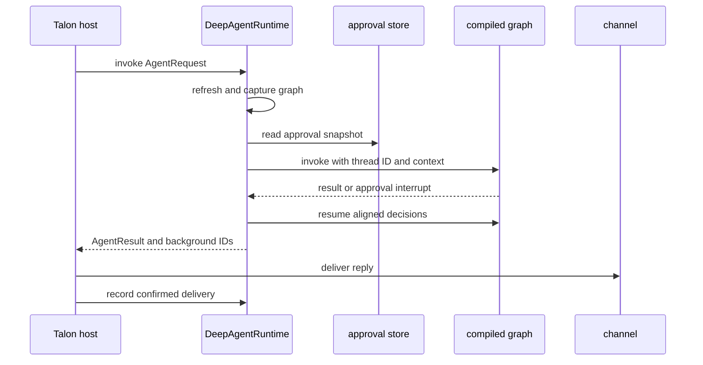
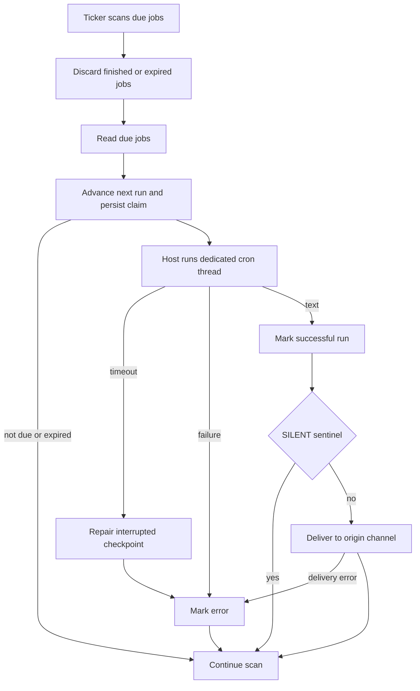

# Long-Running Runtime Behavior

Talon is an **experimental** Deep Agents runtime; its APIs and behavior can change or be removed. `DeepAgentRuntime` owns graph construction and durable runtime collaborators, while `TalonHost` owns channel delivery, turn ordering, cancellation, and scheduled dispatch. That boundary is important: a graph invocation can retain its configuration snapshot while later invocations safely adopt a replacement graph. See [Permissions and Human-in-the-Loop](/openwiki/concepts/permissions-hitl.md), [State Persistence](/openwiki/concepts/state-persistence.md), and [Talon scheduling](/openwiki/concepts/talon-scheduling.md) for adjacent concerns.

## Runtime assembly and durable state

At `start()`, the runtime resolves subagents, ensures the approval-policy snapshot, and compiles a Deep Agents graph. Assembly combines the resolved model and subagents with runtime and approval tools, filesystem/shell backend, system prompt, skills, memory, caller middleware, task/background middleware, and the checkpointer. Approval interrupts are compiled from that snapshot. The default checkpointer is `InMemorySaver`, which preserves same-process graph history for a shared conversation ID.

`ConversationSaver` is the persistence option that couples checkpointing to an archive. It serializes writes, commits the checkpoint before committed archive revisions, and waits for both writes to settle if the caller is cancelled. A generated final reply is not semantic history merely because the graph returned it: the host records it only after successful channel delivery.

The default shell backend is deliberately not the parent process environment. It uses a fixed safe `PATH` plus an allowlisted, scrubbed child environment, removes loader-hijack and credential-indicating variables, and creates/enforces an artifacts directory with mode `0700`. This is defense in depth, not a replacement for tool approval.

```mermaid
sequenceDiagram
    participant Host as Talon host
    participant Runtime as DeepAgentRuntime
    participant Policy as approval store
    participant Graph as compiled graph
    participant Channel as channel
    Host->>Runtime: invoke AgentRequest
    Runtime->>Runtime: refresh and capture graph
    Runtime->>Policy: read approval snapshot
    Runtime->>Graph: invoke with thread ID and context
    Graph-->>Runtime: result or approval interrupt
    Runtime->>Graph: resume aligned decisions
    Runtime-->>Host: AgentResult and background IDs
    Host->>Channel: deliver reply
    Host->>Runtime: record confirmed delivery
```

This sequence shows the turn and delivery boundary. The invocation graph and approval snapshot are stable during the turn; delivery remains a host decision.

### Refresh and invocation isolation

Before a turn, an optional `refresh_tools` callback may produce replacement runtime tools. Tool, MCP, and subagent reload paths compile a candidate graph before swapping it under `_tools_lock`; a refresh failure keeps the old graph active. The invocation captures the active graph in a context variable before releasing that lock, so an in-progress invocation—including an approval resume—cannot be redirected to a subsequently swapped graph. Saved policy changes are likewise adopted only by a later invocation.

Graph invocations use the conversation ID as the LangGraph `thread_id`, the configured recursion limit, and optional history/activity context. Whole invocations retry only classified transient connection, timeout, status, parse, context-limit, or message-marker errors, with capped exponential backoff. Cancellation and terminal failures propagate. An empty final text follows a different bounded path: continuation nudges, then a forced summary rather than a retry.

When the host cancels a turn or a scheduled run times out, `recover_interrupted()` reads the latest checkpoint, repairs dangling tool calls, and appends an interruption marker. Reusing the thread therefore does not present a provider with an assistant tool call that has no result. During shutdown, runtime teardown refuses to close graph/checkpoint resources if a cancelled background worker remains alive and may still write.

## Read-only context diagnostics

`DeepAgentRuntime.context_doctor(conversation_id)` is an optional runtime capability, surfaced by the host's `/context-doctor` command. It reads the active graph's checkpoint and creates a bounded, plain-text estimate without invoking the model or changing checkpoint state. The report estimates configured system prompt, loaded memory and skills, all tool schemas including MCP, current effective conversation tokens, and the last provider input-token count. It deliberately reports counts/details rather than source contents or paths; middleware additions and provider overhead are called out as excluded.

The diagnostic configuration is paired with the graph at compilation. It reads configured memory/skills through middleware and observes the current thread checkpoint; when summarization state is present, it estimates the effective compacted conversation. A graph/tool reload therefore changes the report for subsequent calls. The host resolves the current conversation thread, applies a ten-second bound, and returns a generic unavailable/failure message rather than exposing diagnostic exceptions. The command does not invoke or interrupt active agent work.

## Approval and authority boundaries

Tool approval policy is an exact-name JSON policy with a validated, immutable per-invocation snapshot. The backing file is bounded, non-symlink, regular JSON; edits use byte-revision compare-and-swap. Approval interrupts are batched and audited by action names/counts rather than argument values, then resumed with aligned decisions. The runtime caps approval rounds to prevent an endless approval loop.

Only an eligible interactive request can carry approval or authorization handlers. A cron request has **no interactive approval or authorization path**: the host withholds both handlers, the runtime clears approval-operator context, and approval-gated tools are auto-rejected. The same non-transfer principle applies to background delivery and detached workers. Unattended cron work must therefore be designed to complete with its installed capabilities or fail/skip a gated action; it cannot wait for a human to authorize it later.

## Background subagents and host delivery

For ordinary turns, detached background subagents are in-memory jobs owned by a thread. They have bounded capacity, separate task thread IDs, no recursive delegation, approval operator, or authorization handler, bounded/sanitized output, and a one-hour timeout. Finished results are injected into a later owner turn and acknowledged when that turn completes.

That acknowledgement means the model consumed the result, not necessarily that the user saw it. If the host supersedes or cancels a completed turn before delivery, it requeues its background-result IDs. Intentionally suppressed output remains acknowledged. Repeated failed consumption is bounded by the background delivery counter, preventing indefinite re-delivery.

## Persistent cron lifecycle

Cron jobs are persisted in a versioned JSON envelope. A record includes its self-contained prompt, origin conversation/channel/message, parsed minute-granularity schedule, enabled/repeat state, next and last run state, outcome/error, optional `until`, and claim timestamp. Agent-facing create, list, edit, and remove tools are scoped to the current `CronOrigin`; a job cannot be managed from another conversation scope. Supported schedules include relative one-shot/recurring forms, timezone-explicit wall-clock forms, and timezone-explicit five-field cron expressions or supported macros.

```mermaid
flowchart TD
    Scan["Ticker scans due jobs"] --> Sweep["Discard finished or expired jobs"]
    Sweep --> Due["Read due jobs"]
    Due --> Claim["Advance next run and persist claim"]
    Claim -->|"not due or expired"| Next["Continue scan"]
    Claim --> Run["Host runs dedicated cron thread"]
    Run -->|"timeout"| Repair["Repair interrupted checkpoint"]
    Repair --> Error["Mark error"]
    Run -->|"failure"| Error
    Run -->|"text"| MarkOK["Mark successful run"]
    MarkOK --> Silent{"SILENT sentinel"}
    Silent -->|"yes"| Next
    Silent -->|"no"| Deliver["Deliver to origin channel"]
    Deliver -->|"delivery error"| Error
    Deliver --> Next
    Error --> Next
```

This lifecycle shows claim-before-run persistence and the fact that an occurrence is advanced before agent execution, then receives an outcome after execution or delivery.

`PersistentCronScheduler` ticks every 60 seconds by default and processes due jobs sequentially. It first sweeps finished/expired records, then asks the store to advance the due job before calling the host. A claim advances `next_run_at` before execution, so a process crash or failure does not leave that same occurrence claimable again. A run past its `until` window beyond the short tick-latency grace is disabled rather than delivered late. Finished/expired jobs are removed unless retained because their latest run errored or was claimed without an outcome; completed disabled records can later be pruned by retention policy.

The scheduler marks a run successful before delivery; empty output and output beginning or ending in `[SILENT]` are not delivered. A failed agent invocation or delivery overwrites outcome with an error. Unexpected ticker failures are logged and the ticker continues, leaving unclaimed due work for a later scan. Since dispatch is sequential, the host applies the scheduled-run timeout so one stalled run does not silence the remaining due jobs.

The host invokes each claimed job on a dedicated `<job-id>:talon-cron` graph thread and holds that thread's conversation lock throughout the run, so two fires of one job do not overlap. Timeout triggers interruption recovery before the exception reaches the scheduler. Non-silent results are delivered to the recorded origin channel and only then recorded as delivered history.

### Scheduled delegation is inline

A cron turn cannot leave work awaiting a later chat turn. Its subagent delegation runs inline, with no recursive delegation and no detachable approval/authorization authority. A separate queued concurrency limit and bounded timeout constrain fan-out; timeout/failure is converted to sanitized tool output, and output is clamped. The agent therefore receives the delegation result in the same scheduled invocation instead of creating orphaned work.

## Change and test checklist

When changing this area, preserve these invariants:

1. Compile before graph replacement and retain the invocation graph until the turn exits.
2. Keep approval snapshots immutable per invocation; never transfer interactive authority into cron, detached workers, or delivery turns.
3. Repair a cancelled or timed-out thread before reuse.
4. Treat host-confirmed delivery as the semantic-history boundary and requeue background results only for unintentional loss.
5. Claim cron occurrences before running them, preserve origin scoping, enforce expiry, and bound each scheduled turn.
6. Keep context diagnostics read-only, content-redacting, bounded, and independent of model execution.

Focused tests cover graph refresh atomicity, environment hardening, retry classification, approval behavior, interruption recovery, background scheduling and requeueing, scheduled timeout repair, per-job exclusion, cron ticker resilience, and context diagnostics' read-only/redacted behavior across graph reloads.
