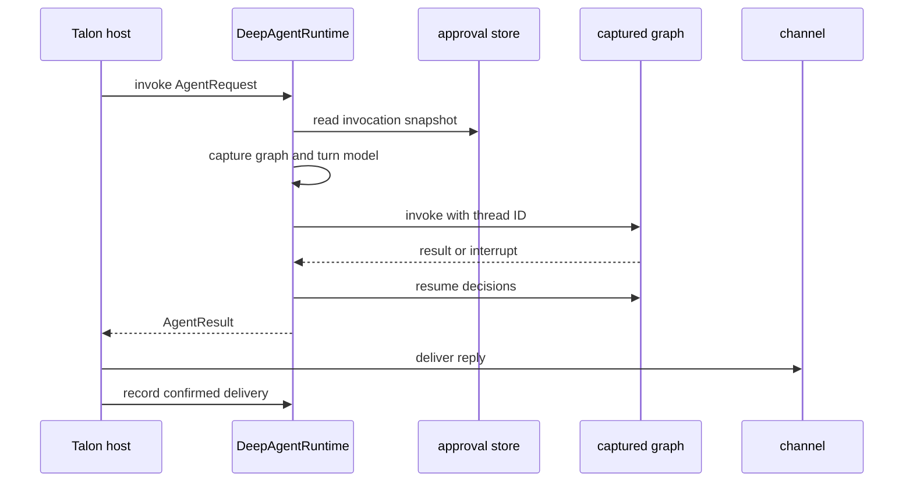

# Long-Running Runtime Behavior

Talon is an experimental Deep Agents runtime. `DeepAgentRuntime` owns graph construction, checkpoints, turn-local context, and agent execution. `TalonHost` owns channel admission and commands, per-conversation serialization and replacement, delivery, and scheduled dispatch. This separation is intentional: configuration may change for later work without changing a graph, model, or approval policy already captured by an active turn. See [Permissions and Human-in-the-Loop](/openwiki/concepts/permissions-hitl.md), [State Persistence](/openwiki/concepts/state-persistence.md), [Talon channel admission](/openwiki/concepts/talon-channel-admission.md), and [Talon scheduling](/openwiki/concepts/talon-scheduling.md).

## Startup, graph assembly, and durable state

`DeepAgentRuntime.start()` resolves configured subagents, materializes/reads the tool-approval policy, and compiles the initial graph. Assembly supplies resolved model and subagents, built-in and runtime tools, approval-management tools and `interrupt_on` policy, backend, prompt, skills, memory, caller middleware, task/background middleware, and a checkpointer to `create_deep_agent`. The default checkpointer is `InMemorySaver`, so same-process turns sharing a conversation `thread_id` share graph history.

`ConversationSaver` is the archival checkpointer option. It serializes writes, persists the checkpoint before committed archive revisions, and—if cancelled—waits for both operations to settle before re-raising cancellation. This does not make reply text delivered: the host records a final reply in semantic history only after channel delivery succeeds.

The default local shell backend is deliberately separated from the parent process environment. It uses a fixed safe `PATH`, an allowlisted/scrubbed child environment that excludes loader-hijack and credential-like values, and an artifacts directory created and enforced with mode `0700`. This reduces exposure but does not replace approval policy.

```mermaid
sequenceDiagram
    participant Host as Talon host
    participant Runtime as DeepAgentRuntime
    participant Policy as approval store
    participant Graph as captured graph
    participant Channel as channel
    Host->>Runtime: invoke AgentRequest
    Runtime->>Policy: read invocation snapshot
    Runtime->>Runtime: capture graph and turn model
    Runtime->>Graph: invoke with thread ID
    Graph-->>Runtime: result or interrupt
    Runtime->>Graph: resume decisions
    Runtime-->>Host: AgentResult
    Host->>Channel: deliver reply
    Host->>Runtime: record confirmed delivery
```

This sequence shows the durable turn boundary: graph and approval context are captured for the invocation, while delivery remains a host decision.

## Reload and invocation isolation

Before an invocation, `refresh_tools` may provide runtime-tool replacements. Explicit MCP and subagent reloads follow the same safe shape: resolve/validate inputs and build a candidate graph before assigning the replacement under `_tools_lock`. A build failure leaves the previous tools and usable graph in place. Policy-file changes similarly cause a replacement graph only at the next invocation.

While holding that lock, `invoke()` records the current graph in a context variable and binds the approval snapshot. The graph remains the source for the initial call and approval resumes after the lock is released. Therefore an active turn retains its captured graph and approval/model snapshot even if MCP tools, subagents, or policy are reloaded; later turns use the replacement. `get_agent_tools` exposes whether saved changes are inactive and warns that running work retains its original capabilities.

Each graph call uses the conversation ID as LangGraph `thread_id` and the configured recursion limit. Whole calls retry only classified transient connection, timeout, status, parsing, context-limit, or message-marker failures, with capped exponential backoff; cancellation and terminal failures escape. Empty final text is handled separately through bounded continuation nudges and then a forced-summary request.

## Per-conversation model selection

`/model` is host state, not graph configuration. The host stores a non-default `provider:model` selection by conversation root in its model-state JSON and places it on each later `AgentRequest`; `/new` does not discard it, and it survives host restart. Listing is available without changing state, but an operator is required to switch or reset a selection. A selection changed while a turn has already started applies to the next turn.

The runtime discovers selectable provider models from the shared catalog but includes only providers with their required credentials in Talon's own environment; it always includes the startup default. Untrusted requested text must match that catalog exactly. Non-default models are constructed lazily on first preparation/use, cached under a lock, and a stale or unbuildable selection falls back to the default for the turn rather than failing the chat.

A selected model is bound through the `ACTIVE_MODEL` turn context variable. `ModelSelectionMiddleware`, installed outermost, substitutes it into every main-agent model call; no graph recompilation occurs. `SelectedModelSummarization` occupies Deep Agents' summarizer slot and lazily maintains per-model summarizers, so compaction thresholds use the selected model's context budget. Delegated subagents retain the startup model and its summarizer.

## Read-only context diagnostics

`DeepAgentRuntime.context_doctor(conversation_id)` is an optional, read-only capability served by the host's `/context-doctor` command. It reads the active graph checkpoint and produces bounded token estimates without calling a model or changing state. The host resolves the current thread, applies a ten-second bound, and returns generic unavailable/failure responses instead of diagnostic exceptions. The report is intended to expose counts rather than prompt, memory, skill, or conversation contents; a later graph reload changes the diagnostics used by later requests.

## Approval and unattended authority

The approval file is a bounded, non-symlink regular JSON document with validated exact names and byte-revision compare-and-swap updates. An `ApprovalSnapshot` freezes the policy for an invocation and compiles interrupts only for enabled names. Updates deliberately apply on a later invocation. The runtime batches tool interrupts, audits action names/counts rather than arguments, resumes aligned decisions, and caps approval rounds.

An attended channel turn may have channel approval and authorization handlers. **Cron and background-delivery requests are unattended:** the host supplies neither interactive approval nor authorization handler, and the runtime clears approval-operator authority for them. A protected tool interrupt without an eligible handler is auto-rejected; scheduled work therefore fails closed rather than waiting for a human. Detached background workers also clear the authorization handler and approval operator, so they cannot carry authority past their owner turn.

## Host turn replacement, delivery, and recovery

Inbound messages are serialized by conversation root. Except for commands and pending approval/authorization replies, a new message replaces the active agent turn: the host cancels the old task, recovers its graph thread, advances the generation, and starts the replacement. If cancellation does not settle within the bound, the conversation is blocked until restart rather than risking concurrent use of the thread. If recovery itself fails, the replacement is marked with degraded-recovery metadata.

`recover_interrupted()` reads the latest graph state, uses `PatchToolCallsMiddleware` to repair dangling assistant tool calls, and appends an interruption marker at the checkpoint configuration. This makes a cancelled or timed-out thread usable again. Runtime shutdown first cancels background workers; if a worker survives the wait, it refuses to close graph/checkpoint resources that worker might still write.

After a model turn, the host re-enters the conversation lock and confirms that its generation/thread is still current before delivery. Successful channel output is then passed to `record_delivered_reply`; failures or supersession do not become semantic final replies.

## Background subagents and follow-up delivery

For ordinary channel turns, `task` and `start_async_task` create in-memory jobs associated with the owner thread. Capacity and running-work limits apply; jobs use separate task thread IDs, cannot delegate recursively, have no approval operator or authorization handler, have bounded/sanitized results, and are limited to one hour. A completed result is injected as data into an owner follow-up turn. The runtime acknowledges IDs only after that main-agent turn completes, and returns the IDs in `AgentResult` because only the host knows whether the user saw its reply.

Background delivery is itself unattended and only starts when the owner is idle. Failed consumption increments a bounded delivery counter; after the limit the result is dropped rather than retried forever. If a result-consuming turn is superseded or cancelled before delivery, the host requeues its IDs. A deliberately suppressed result is not requeued, because the host intentionally withheld a reply after the model consumed it.

## Scheduled execution

Cron jobs persist their origin, prompt, parsed minute-granularity schedule, enabled/repeat and next/last-run state, outcome/error, optional expiry, and claim state. Management tools are scoped to the current `CronOrigin`, preventing one conversation from administering another's jobs. The scheduler sweeps finished records, claims a due occurrence by advancing `next_run_at` before execution, and records an outcome afterward. It suppresses `[SILENT]` output, logs unexpected ticker failures and continues, and leaves failed/unclaimed due work for a later tick. Claims beyond the `until` grace are expired; finished records are retained only where error or unresolved-claim retention needs them before pruning.

```mermaid
flowchart TD
    Scan["Ticker scans jobs"] --> Sweep["Sweep finished records"]
    Sweep --> Claim["Claim due occurrence"]
    Claim -->|"expired or not due"| Next["Continue tick"]
    Claim --> Run["Run scheduled graph thread"]
    Run -->|"timeout"| Repair["Recover interrupted thread"]
    Repair --> Error["Record error"]
    Run -->|"failure"| Error
    Run -->|"silent"| Success["Record success"]
    Run -->|"text"| Deliver["Deliver to origin"]
    Deliver --> Success
    Success --> Next
    Error --> Next
```

This flow shows that claiming advances the occurrence before agent execution, while success or error is recorded after execution and, for text, delivery.

The host uses a dedicated `<job-id>:talon-cron` thread and holds its conversation lock for each run, preventing a job's fires from overlapping. A scheduled-run timeout invokes interruption recovery before it escapes to the scheduler. Scheduled requests have no approval/authorization handlers and do not use a chat-selected model.

Scheduled delegation is inline because no later interactive turn is guaranteed. It disables recursive delegation, hides detached-job management tools, queues behind a separate inline-concurrency limit, and bounds each delegation. Failure or timeout becomes sanitized tool output and returned output is clamped, rather than creating orphaned detached work.

## Focused change checks

When modifying this area, preserve candidate-before-replacement graph construction; capture graph, approval, and selected model per invocation; and do not transfer attended authority into cron, detached workers, or background delivery. Repair threads after cancellation before reuse, treat host-confirmed delivery as the semantic-history boundary, and requeue background results only when unintentional loss prevented delivery. Tests cover refresh transactional behavior and captured graphs, approval and recovery, shell hardening, host replacement/delivery/requeueing, background and scheduled delegation, cron ticker resilience, and per-chat model catalog, persistence, lazy binding, and selected-model summarization.
