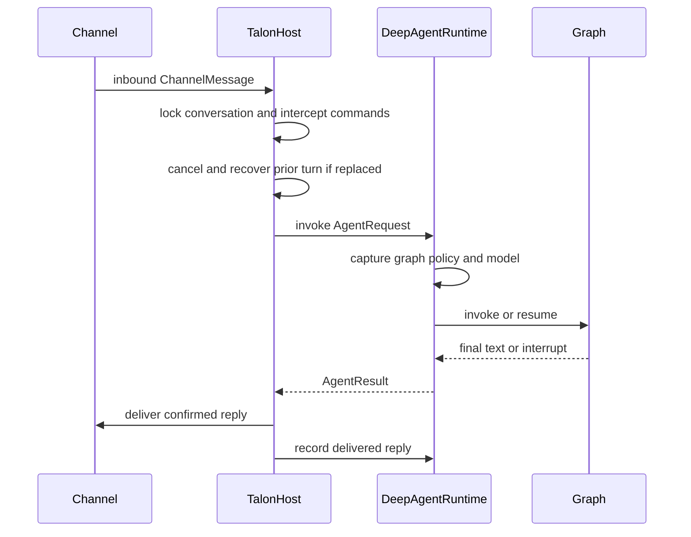
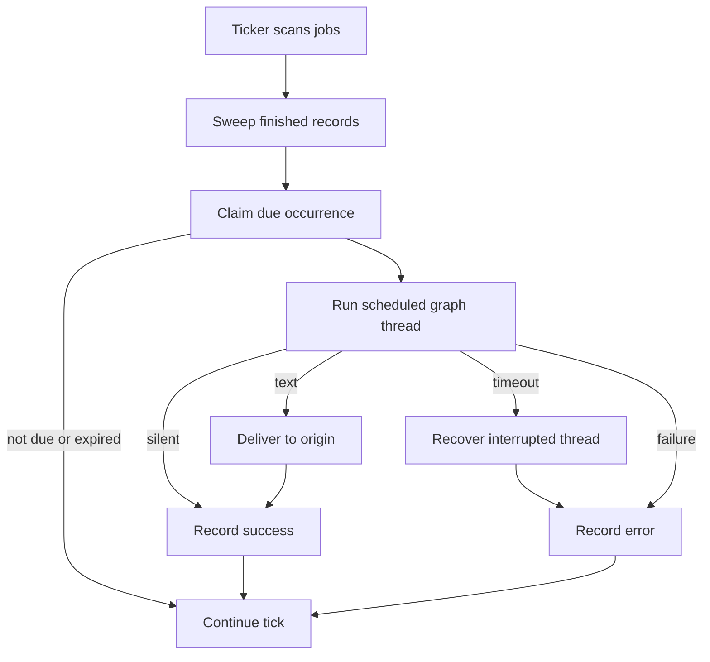

# Talon Host Runtime Behavior

Talon is an experimental Deep Agents runtime. `DeepAgentRuntime` owns graph construction, checkpoints, turn-local context, and agent execution. `TalonHost` owns managed startup and shutdown, channel commands and admission-facing dispatch, per-conversation serialization and replacement, delivery, background follow-ups, and scheduled dispatch. This boundary lets later configuration changes take effect without altering a graph, model, or approval policy already captured by a running turn. See [Permissions and Human-in-the-Loop](/openwiki/concepts/permissions-hitl.md), [State Persistence](/openwiki/concepts/state-persistence.md), [Talon channel admission](/openwiki/concepts/talon-channel-admission.md), and [Talon scheduling](/openwiki/concepts/talon-scheduling.md).

## Host lifecycle and inbound dispatch

On start, the host starts the runtime, binds each channel's message handler (and reaction handler where supported), starts channels, then starts the scheduler. A partial start is unwound in reverse. On stop it cancels its background dispatcher and in-flight work, stops channels and scheduler, and finally asks the runtime to stop; a failure stopping one component is logged but does not prevent cleanup of the others. `run_until_stopped()` installs signal handlers around this lifecycle.

For each inbound message, the host derives a provider-qualified conversation root, serializes processing with the conversation lock, and records the history scope. It handles `/help` before that lock, then—inside it—handles host commands, pending approval replies, and authorization replies before treating the message as model input. Thus `/new`, `/stop`, `/mcp-reload`, `/context-doctor`, `/model`, `/smart-model`, `/pair`, and history reset do not reach the agent graph. Channel adapters separately enforce their configured exposure policy before dispatching messages to the host; an `open` policy requires an explicit risk acknowledgement because arbitrary senders can otherwise trigger the agent with host access.

```mermaid
sequenceDiagram
    participant Channel
    participant Host as TalonHost
    participant Runtime as DeepAgentRuntime
    participant Graph
    Channel->>Host: inbound ChannelMessage
    Host->>Host: lock conversation and intercept commands
    Host->>Host: cancel and recover prior turn if replaced
    Host->>Runtime: invoke AgentRequest
    Runtime->>Runtime: capture graph policy and model
    Runtime->>Graph: invoke or resume
    Graph-->>Runtime: final text or interrupt
    Runtime-->>Host: AgentResult
    Host->>Channel: deliver confirmed reply
    Host->>Runtime: record delivered reply
```

This sequence shows the important delivery boundary: a completed model invocation is not yet a delivered reply.

## Startup, graph assembly, and durable state

`DeepAgentRuntime.start()` resolves configured subagents, materializes the tool-approval policy, and compiles the initial graph. Assembly gives `create_deep_agent` the resolved model and subagents, built-in and runtime tools, approval-management tools and `interrupt_on` policy, backend, prompt, skills, memory, caller middleware, task/background middleware, and a checkpointer. The default checkpointer is `InMemorySaver`, so same-process turns using a conversation `thread_id` share graph history.

`ConversationSaver` is the archival checkpointer option. It serializes writes, persists the checkpoint before committed archive revisions, and—if cancelled—waits for both operations to settle before re-raising cancellation. This does not make reply text delivered: the host records a final reply in semantic history only after channel delivery succeeds.

The default local shell backend is deliberately separated from the parent process environment. It uses a fixed safe `PATH`, an allowlisted and scrubbed child environment that excludes loader-hijack and credential-like values, and an artifacts directory created and enforced with mode `0700`. This reduces exposure but does not replace approval policy.

## Reload, invocation isolation, and execution recovery

Before an invocation, `refresh_tools` may replace runtime tools. Explicit MCP and subagent reloads use the same candidate-before-replacement shape: resolve and validate inputs, construct a graph, then assign it under `_tools_lock`. A build failure leaves the previous graph usable. An approval-file revision also compiles a replacement graph at the next invocation.

While holding that lock, `invoke()` captures the graph in a context variable and binds the approval snapshot. Initial graph calls and approval resumes use that captured graph after the lock is released. An active turn is therefore insulated from later MCP, subagent, or approval reloads; `get_agent_tools` reports inactive saved changes and warns that running work retains its original capabilities.

Every graph call uses the request conversation ID as LangGraph `thread_id` and the configured recursion limit. Whole calls retry only classified transient connection, timeout, status, parsing, context-limit, or message-marker failures with capped exponential backoff; cancellation and terminal failures escape. Empty final text follows a separate bounded continuation-nudge path and then a forced summary.

`recover_interrupted()` reads the latest checkpoint, uses `PatchToolCallsMiddleware` to repair dangling assistant tool calls, and appends an interruption marker at the checkpoint configuration. The runtime stops background workers before teardown; if a worker survives cancellation, it refuses to close graph/checkpoint resources that worker might still write.

## Per-conversation replacement and delivery containment

Inbound model turns are serialized by conversation root. Except for commands and pending approval or authorization responses, a new message replaces the active turn: the host increments its generation, cancels it, recovers its graph thread, and starts the replacement. If cancellation or recovery cannot settle within the bound, the conversation is blocked until restart rather than risking concurrent use of its graph thread. A recovery failure still permits the replacement, marked with degraded-recovery metadata.

After model work, the host reacquires the conversation lock and verifies both the current graph thread and generation before delivery. Superseded output is dropped. Successful delivery is passed to `record_delivered_reply`; delivery failure or supersession is not written as a semantic final reply.

All host channel sends, including commands, progress updates, agent replies, and scheduled delivery, use `send_with_retry`. It converts transport exceptions to failed `SendResult` values, retries retryable or recognized transient-network failures twice with exponential delays, and returns a non-retryable failure without raising into the host loop. This confines channel transport faults to the particular delivery decision.

## Model selection and context diagnostics

`/model` is host-wide state, not graph configuration: a non-default selection is stored under a global key in the model-state JSON and attached to subsequent interactive `AgentRequest`s for **all chats**. Only an operator may switch or reset it; listing is available to others. A selection captured in `_Turn` remains fixed for that already-started turn, and the persisted setting survives `/new` and host restart. Scheduled jobs do not receive this chat selection.

The runtime discovers selectable models from the shared catalog, including only providers with required credentials in Talon's environment, plus the startup default. Requested text must match that catalog exactly. Non-default models are lazily built and cached under a lock; a stale or unbuildable saved selection falls back to the default for that turn rather than failing the chat.

A selected model is bound in the `ACTIVE_MODEL` turn context variable. Outer `ModelSelectionMiddleware` substitutes it into main-agent model calls without recompiling the graph. `SelectedModelSummarization` occupies Deep Agents' summarizer slot and maintains per-selected-model summarizers, so compaction uses the selected model's input budget. Delegated subagents retain the startup model and summarizer.

`DeepAgentRuntime.context_doctor(conversation_id)` is an optional, read-only capability served by `/context-doctor`. It reads the active graph checkpoint and produces bounded token estimates without calling a model or changing state. The host resolves the current thread, applies a ten-second bound, and returns generic unavailable/failure responses instead of diagnostic exceptions.

## Approval and unattended authority

The approval file is a bounded, non-symlink regular JSON document with validated exact names and byte-revision compare-and-swap updates. An `ApprovalSnapshot` freezes policy for an invocation and compiles interrupts only for enabled names; updates apply on a later invocation. The runtime batches tool interrupts, audits action names and counts rather than arguments, resumes aligned decisions, and caps approval rounds.

An attended channel turn can receive channel approval and authorization handlers. **Cron and background-delivery requests are unattended:** the host supplies neither interactive handler, and the runtime clears approval-operator authority. A protected-tool interrupt without an eligible handler is auto-rejected, so unattended work fails closed instead of waiting for a human. Detached background workers also clear authorization and approval authority, so they cannot carry it past their owner turn.

## Background subagents and follow-up delivery

For ordinary channel turns, `task` and `start_async_task` create in-memory jobs associated with the owner thread. Capacity and running-work limits apply; jobs use separate task thread IDs, cannot delegate recursively, have no approval operator or authorization handler, have bounded/sanitized results, and have a one-hour timeout. A completed result is injected as data into an owner follow-up turn. The runtime acknowledges result IDs only after that main-agent turn completes, and returns their IDs in `AgentResult` because only the host knows whether the user saw its reply.

The host background loop checks once per second and only launches an unattended follow-up when the owner is idle, current, and unlocked. It spaces repeated attempts with capped exponential delay. Failed consumption increments a bounded delivery counter; after the limit, the result is dropped rather than retried forever. If a result-consuming turn is superseded or cancelled before delivery, the host requeues its IDs. A deliberately suppressed result remains acknowledged because the host intentionally withheld output after the model consumed it.

## Scheduled execution

Cron jobs persist an origin, prompt, parsed minute-granularity schedule, repeat/run state, optional expiry, and claim state. Management tools are scoped to the current `CronOrigin`, preventing one conversation from administering another's jobs. The scheduler first sweeps finished records, then claims a due occurrence by advancing `next_run_at` before execution, records its outcome, suppresses `[SILENT]` output, and logs ticker failures while continuing on the normal tick interval. A claim beyond the `until` grace expires; finished records are retained only where error or unresolved-claim retention needs later pruning.

```mermaid
flowchart TD
    Scan["Ticker scans jobs"] --> Sweep["Sweep finished records"]
    Sweep --> Claim["Claim due occurrence"]
    Claim -->|"not due or expired"| Next["Continue tick"]
    Claim --> Run["Run scheduled graph thread"]
    Run -->|"timeout"| Repair["Recover interrupted thread"]
    Repair --> Error["Record error"]
    Run -->|"failure"| Error
    Run -->|"silent"| Success["Record success"]
    Run -->|"text"| Deliver["Deliver to origin"]
    Deliver --> Success
    Success --> Next
    Error --> Next
```

This flow shows that claiming advances the occurrence before agent execution, while the scheduler records success or error after execution and, for text, after delivery.

The host uses a dedicated `<job-id>:talon-cron` thread and holds its conversation lock for each run, preventing overlap. A scheduled-run timeout invokes interruption recovery before it reaches the scheduler. Scheduled requests have no approval or authorization handlers and run subagent delegations inline rather than leaving detached work for a later turn. Inline delegation disables recursion and detached-job management tools, queues behind a separate concurrency limit, has a bounded timeout, converts failures to sanitized output, and clamps returned text.

## Focused change checks

When changing this area, preserve candidate-before-replacement graph construction and capture graph, approval, selected model, and host generation per turn. Do not transfer attended authority into cron, detached workers, or background delivery. Repair a cancelled thread before reuse; treat host-confirmed delivery as the semantic-history boundary; and requeue background results only when unintended loss prevented delivery. Focused tests exercise graph refresh isolation, approvals and interruption repair, shell hardening, global model persistence and selected-model summarization, host timeout/replacement/delivery/requeue behavior, scheduled delegation, and scheduler resilience.
