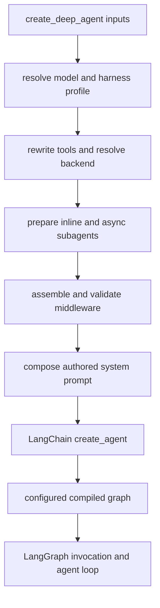

# SDK Construction & Execution

[`create_deep_agent`][create_deep_agent] is the public assembly entry point for
Deep Agents. It is an opinionated constructor over LangChain's `create_agent()`:
it resolves Deep Agents configuration and passes an assembled model, prompt,
tools, middleware, schemas, and persistence options to LangChain for graph
compilation. It does **not** implement a separate agent runtime.

This distinction is important when changing or operating an agent:

- **Construction time** is the synchronous `create_deep_agent` call. It chooses
  defaults, materializes profile middleware, validates profile exclusions, and
  returns a configured compiled graph (or raises before a graph is returned).
- **Runtime** begins only when the caller invokes that graph. LangChain and
  LangGraph own the model/tool loop; Deep Agents influences it through the
  middleware and configuration installed during construction.

## Assembly boundary

Caption: `create_deep_agent` owns the construction steps through compilation;
the returned graph enters the LangChain/LangGraph execution boundary when
invoked.

The package re-exports `create_deep_agent`, `DeepAgentState`, subagent types,
and profile registration APIs from `deepagents`. The constructor accepts a
model, caller tools, `system_prompt`, middleware and subagents, plus skills,
memory, permissions, backend, interrupts, schemas, persistence, debugging,
name, and cache options.

## Model, profile, tools, and backend

### Model and profile selection

A supplied `BaseChatModel` is retained. A string is initialized by
`init_chat_model` with settings from the matching provider profile, so provider
profiles are the extension point for provider-specific initialization behavior.
If `model=None`, the constructor emits a deprecation warning and builds
`ChatAnthropic(model_name="claude-sonnet-4-6")`; explicit models will be
required when support for `None` is removed in version 1.0.0.

The resolved model and, when supplied, the original model string select a
harness profile. A profile is construction policy: it can supply prompt base and
suffix text, tool-description overrides, tool exclusions, extra middleware, a
default-general-purpose-subagent configuration, and middleware exclusions.
A declarative subagent resolves its model and profile independently, rather than
inheriting its parent's model-specific profile.

### Tools and backend

Before compilation, profile description overrides are applied to caller tools
without mutating caller-owned dict tools or `BaseTool` instances. Plain
callables remain unchanged. This prepares the tools passed to `create_agent`;
built-in filesystem and subagent tools are contributed by middleware.

When `backend` is omitted, one `StateBackend()` instance is created and shared
by filesystem, skills, memory, and summarization middleware in the main agent
and constructed subagents. Caller tools are additive to the built-in suite.
A profile's `excluded_tools` is enforced by an exclusion middleware appended
last, after custom middleware, so it filters the request tool surface including
tools injected by middleware rather than merely removing the original input
list.

## Prompt and subagent construction

### Authored system prompt

The harness profile first produces its prompt contribution from an empty base.
For the main agent the authored ordering is **USER → BASE → SUFFIX**, with blank
lines between present parts:

- `system_prompt=None` produces the profile contribution alone (and is empty
  when the profile has no prompt fields).
- A string is followed by the profile contribution.
- A `SystemMessage` preserves its existing content blocks, including
  `cache_control` markers; nonempty profile text is added as a new text block.

Middleware may add dynamic prompt material at runtime. The prompt assembled here
is therefore the authored starting point, not a claim that every eventual model
request contains only this text.

### Three subagent forms

The constructor processes caller subagents before deciding whether to add the
default. It partitions specs as follows:

- A spec containing `graph_id` is an `AsyncSubAgent`; it is collected for
  `AsyncSubAgentMiddleware`, rather than the inline `task` tool.
- A spec with `runnable` is a precompiled `CompiledSubAgent` and is retained as
  an inline subagent.
- Other specs are declarative `SubAgent`s. The constructor resolves their model
  and profile, applies tool overrides, builds their middleware, resolves
  permissions and interrupts, and supplies their prompt.

Declarative subagents inherit parent tools unless they declare `tools`, and
inherit parent permissions and `interrupt_on` unless they declare their own.
Their own permissions replace the parent's list rather than merging it. A
precompiled or remote subagent is already configured elsewhere and does not
inherit the parent's interrupt or state schema. A forked declarative subagent is
an exception to normal isolation: it continues the parent conversation, rebuilds
from the parent's prompt-producing middleware, and appends its own prompt as an
addendum.

Unless a caller supplied an inline subagent named `general-purpose` or the
profile sets its default-general-purpose `enabled` field to `False`, construction
inserts a default general-purpose inline subagent at the front. Inline subagents
cause `SubAgentMiddleware` to expose `task`; when none exist, that tool is not
installed. Async subagents are independent and are exposed through their async
middleware.

## Middleware assembly and construction failures

The main stack's core order is: optional `SkillsMiddleware`,
`FilesystemMiddleware`, optional `SubAgentMiddleware`, summarization,
`PatchToolCallsMiddleware`, and optional `AsyncSubAgentMiddleware`. Profile
extra middleware and provider-appropriate prompt-caching middleware form the
start of the tail; optional `MemoryMiddleware` and a
`HumanInTheLoopMiddleware` follow. Caller middleware is merged after the core:
a middleware with the same `.name` replaces that slot in place, while a new name
is inserted after the last core member and before the tail.

Filesystem permission rules are enforced by `FilesystemMiddleware`, not by the
backend. Permission-derived interrupt settings are merged with caller
`interrupt_on` settings, with an explicit caller setting winning for the same
tool; a resulting nonempty mapping adds `HumanInTheLoopMiddleware`. Thus,
construction configures the interrupt boundary but the pause itself is runtime
graph behavior.

Harness exclusions are applied after base assembly and again after caller
middleware merge. Class exclusions use exact type and string exclusions use the
middleware `.name`. An exclusion must match somewhere across the main and
default-general-purpose stacks; a name that matches multiple concrete classes,
or an exclusion matching no middleware, raises `ValueError`. This makes stale
profile policy a construction failure rather than silent runtime drift.

`FilesystemMiddleware` and `SubAgentMiddleware` are protected scaffolding:
the former backs built-in file tools and permission enforcement, and the latter
backs `task` dispatch. A harness profile cannot exclude either; doing so raises
`ValueError`. Tool exclusion is distinct from removing middleware: it is the
safe mechanism for withholding a tool from the model while retaining required
scaffolding.

For the detailed ordering and hook responsibilities, see
[middleware-stack.md](middleware-stack.md). For backend behavior and permission
scope, see [backends.md](../concepts/backends.md).

## Compilation, state, and invocation

`create_agent()` receives the assembled model, authored prompt, caller tools,
main middleware stack, response format, context schema, checkpointer, store,
debug flag, name, cache, and state schema. With no custom schema,
`DeepAgentState` is used. It extends `AgentState` and gives `messages` a
`DeltaChannel` reducer with snapshot frequency 50, reducing checkpoint growth
for message history from O(N²) to O(N).

A custom `state_schema` is passed both to the parent graph and to
`SubAgentMiddleware`, so declarative subagents can compile with those fields.
The API's type contract requires a `DeepAgentState` extension to preserve the
message reducer, but the constructor deliberately does not runtime-validate the
`TypedDict` subclass constraint. Prefer middleware state schemas for fields that
are private to a middleware feature; private state keys are identified and
provided to `SubAgentMiddleware` for handoff isolation.

The compiled graph is immediately wrapped with `.with_config(...)` to set
`recursion_limit` to `9_999` and attach LangSmith metadata: `ls_integration` is
`deepagents`, `lc_versions` records the Deep Agents version, and `lc_agent_name`
uses the supplied name. The checkpointer, store, cache, and debug settings are
passed through to LangChain; their runtime semantics remain owned by LangChain
and LangGraph.

## Runtime handoff

When the caller invokes the returned graph, LangGraph drives the per-turn agent
loop. The model sees the system prompt, current message history, and the tool
surface produced by middleware. It can return a final response or request tools;
tool results are added to graph state and the loop continues until no more tool
calls are requested (subject to the configured recursion limit).

Deep Agents changes that execution indirectly through middleware. Middleware can
prepare or wrap model calls, alter the available tools and prompt, summarize or
offload history, write typed state, and enforce filesystem permissions around
tool execution. In contrast, a plain `tools=` callable runs only after the model
selects it and cannot alter the preceding model request. This is the core
extension boundary: add a tool for a callable capability, or add middleware when
the capability must govern context, tool availability, state, or execution
policy.

## Focused verification

`libs/deepagents/tests/unit_tests/test_graph.py` exercises the assembly
contract without treating the upstream runtime as Deep Agents code. Its focused
coverage includes profile lookup, immutable tool-description rewrites, authored
prompt ordering and `SystemMessage` block preservation, default subagent and
`task`-tool presence, provider prompt-caching wiring, tool exclusion, profile
exclusion failure modes, custom middleware replacement/order, per-subagent
profile isolation, state-schema propagation, and compiled-graph metadata. See
[testing-guide.md](../testing/testing-guide.md) for repository test execution
and [build-a-deep-agent.md](../workflows/build-a-deep-agent.md) for user-facing
construction guidance.

## Related pages

- [overview.md](overview.md) — system-level architecture.
- [profiles-models.md](../concepts/profiles-models.md) — registering and
  selecting provider and harness profiles.
- [subagents-skills.md](../concepts/subagents-skills.md) — subagent and skill
  concepts.
- [middleware-stack.md](middleware-stack.md) — stack ordering and hooks.

[create_deep_agent]: https://reference.langchain.com/python/deepagents/graph/create_deep_agent
