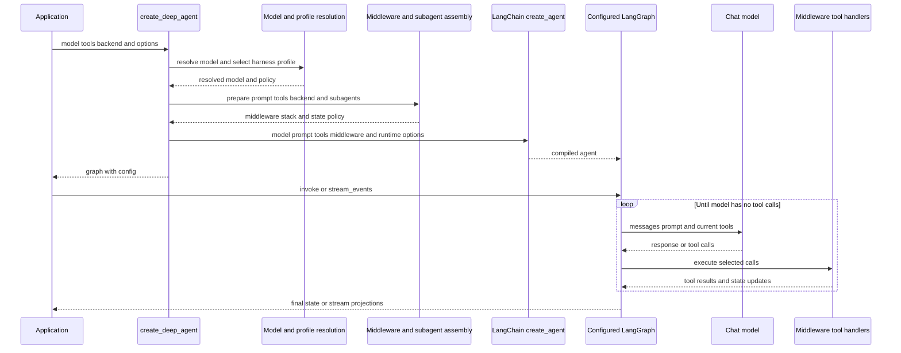

# SDK Construction and Execution

`create_deep_agent` is the public Deep Agents assembly API. It resolves Deep Agents configuration and delegates graph compilation to LangChain `create_agent()`; the returned configured `CompiledStateGraph` remains a LangGraph/LangChain agent, not a separate Deep Agents runtime. The `deepagents` package re-exports the constructor, `DeepAgentState`, subagent types, filesystem types, and profile registration APIs.

## Construction to execution

Caption: construction ends at LangChain compilation; LangGraph subsequently drives the model/tool loop, while installed middleware determines the effective prompt, tools, policy, and state updates.

## Resolution and shared dependencies

### Model and harness policy

If `model` is a `BaseChatModel`, `resolve_model` returns it unchanged. For a string such as `provider:model`, it calls `init_chat_model` with initialization settings supplied by the registered provider profile. The resolved model plus the original string specification select a harness profile. Provider profiles therefore affect model initialization, while harness profiles supply prompt text, tool-description overrides and exclusions, additional middleware, general-purpose-subagent settings, and excluded middleware.

`model=None` is deprecated and currently builds `ChatAnthropic(model_name="claude-sonnet-4-6")`; callers should construct and pass a model explicitly. A declarative subagent performs its own model and harness-profile resolution, so its model-specific policy need not be the parent policy.

Profile tool-description overrides copy and rewrite dictionary tools and `BaseTool` instances, rather than mutating caller-owned tools. Plain callable tools are not rewritten. Profile tool exclusions are different: a final `_ToolExclusionMiddleware` filters the runtime model request, including tools injected by custom middleware.

### Backend ownership and prompt composition

When no backend is supplied, construction creates one `StateBackend()` and shares that object with the filesystem, skills, memory, and summarization middleware constructed for the main agent and its subagents. The backend supplies storage and execution behavior; filesystem authorization is enforced by `FilesystemMiddleware`, not by direct backend access.

The main authored prompt starts with the harness contribution computed from an empty base. `None` produces that profile text alone. A string caller prompt is followed by a blank line and profile text. For a `SystemMessage`, existing content blocks remain intact and profile text is appended as a text block, preserving fields such as existing `cache_control` markers. Middleware may add runtime prompt material later, notably skills and memory.

## Subagents and middleware assembly

### Delegation boundaries

The constructor partitions supplied subagents by shape:

- A spec containing `graph_id` is an `AsyncSubAgent`, handled by `AsyncSubAgentMiddleware` as a non-blocking remote/background task.
- A spec with `runnable` is a `CompiledSubAgent`, retained as its caller-compiled runnable for the synchronous `task` path.
- Other specifications are declarative `SubAgent`s. They receive a resolved model, profile, prompt, middleware, permissions, interrupt policy, and tools. Absent tools, permissions, and `interrupt_on` inherit the parent values; supplied permissions replace the parent list.

Unless the active harness profile disables it or an inline subagent is already named `general-purpose`, a default synchronous general-purpose subagent is inserted first. Inline subagents install `SubAgentMiddleware` and expose `task`; async subagents are independent. The default subagent can have profile-specific description and prompt overrides.

A declarative `mode="fork"` subagent is experimental. It continues with parent conversation/state, mirrors parent prompt-producing middleware, and appends its prompt to the inherited prompt. Forks may not define their own skills and recursive `task` delegation is refused. By contrast, compiled and remote subagents retain the schema and approval behavior of their own graphs.

### Ordering and policy failures

The main core stack is ordered as optional `SkillsMiddleware`, `FilesystemMiddleware`, optional `SubAgentMiddleware`, summarization, `PatchToolCallsMiddleware`, and optional `AsyncSubAgentMiddleware`. Its tail is profile extra middleware, prompt caching, optional `MemoryMiddleware`, and optional `HumanInTheLoopMiddleware`. Caller middleware replaces a same-named stack member in place; otherwise it is inserted after core middleware and before the tail. Exclusions are applied around caller middleware, and tool exclusion is appended last.

`FilesystemMiddleware` and `SubAgentMiddleware` are protected scaffolding: a harness profile cannot exclude either. Exclusion validation is deliberately construction-time: unmatched exclusions and an ambiguous string name raise `ValueError`, instead of silently compiling a degraded agent.

Filesystem permission rules are evaluated by the filesystem middleware. Permission-derived interrupt configuration merges with `interrupt_on`, with a caller entry winning for a duplicate tool name. A nonempty result installs `HumanInTheLoopMiddleware`; at runtime its approval request becomes a graph interruption. A checkpointer is needed when approval must survive/resume across execution.

## Compilation, state, checkpoints, and interrupts

The final `create_agent()` call receives the resolved model, prompt, rewritten caller tools, assembled middleware, response format, context schema, checkpointer, store, debug setting, name, cache, and state schema. These runtime services are passed through to LangChain. The returned graph has `recursion_limit` `9999` and LangSmith metadata for the Deep Agents integration, version, and agent name.

Without a custom schema, the graph uses `DeepAgentState`, which extends `AgentState` and places `messages` on a `DeltaChannel` with snapshot frequency 50. This changes message-checkpoint growth from quadratic to linear. Its reducer accepts raw message-like input, deduplicates/replaces messages by stable ID, honors removal tombstones and `REMOVE_ALL_MESSAGES`, and treats a missing replay base as empty. Stable message IDs are assigned by LangGraph before checkpoint serialization, rather than randomly by the reducer, so replay and resumed threads retain identity.

A custom `state_schema` is passed as the main graph schema and to `SubAgentMiddleware`, allowing declarative subagents to use shared fields. The constructor derives private field names from this schema and middleware schemas to isolate delegated state. The schema relationship to `DeepAgentState` is typing-only because `TypedDict` inheritance cannot be runtime-checked; callers should preserve the message reducer when extending it.

## Runtime, streaming, and extension choices

On `invoke`, `ainvoke`, or stream execution, LangGraph runs model turns against message history, the effective system prompt, and the middleware-produced tool surface. A final model response ends the loop; tool calls run and append results/state, then the model is called again. Middleware can alter a request before or around model/tool execution, govern tool visibility, summarize or offload history, write typed state, and enforce permissions. A callable in `tools=` only runs after the model selects it, so it cannot alter the preceding request.

The compiled graph exposes upstream streaming. Tests use `stream_events(..., version="v3")` and `astream_events(..., version="v3")`, whose runs provide projections including messages, tool calls, values, subgraphs, and subagents. A delegated subagent appears as a typed child stream with its name, originating tool-call ID, status, and output. Parent and forked-subagent message projections remain separate; consumers should drain the relevant projections, and concurrent parent/subagent iteration is tested. If a subagent model raises, the child stream reaches `failed` with an error and the upstream runtime error can propagate while projections are drained.

## Focused verification

`test_graph.py` covers assembly: profiles, prompt ordering, immutable tool rewrites, middleware ordering/exclusion, default and custom subagents, permission interrupt wiring, custom state propagation, and metadata. `test_messages_reducer.py` checks message IDs and replay behavior with an `InMemorySaver`. `test_deep_agent_streaming.py` runs scripted parent, regular subagent, fork, and failing-subagent cases through synchronous and asynchronous v3 stream projections. The integration suite additionally verifies normal delegation and structured output through a constructed graph.

## Related pages

- [Middleware stack](middleware-stack.md) — hook responsibilities and ordering.
- [Backends](../concepts/backends.md) — storage and execution implementations.
- [State persistence](../concepts/state-persistence.md) — checkpointer and resume concepts.
- [Filesystem tools](../concepts/tools-filesystem.md) — filesystem capabilities and policy.
- [Build a Deep Agent](../workflows/build-a-deep-agent.md) — application-level construction workflow.
