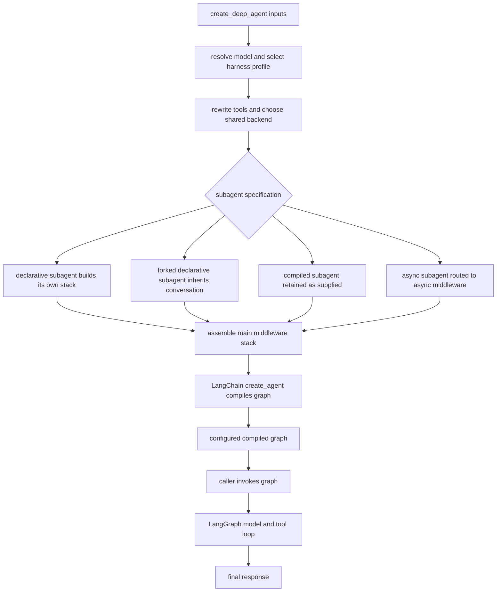

# SDK Construction & Execution

[`create_deep_agent`][create_deep_agent] is Deep Agents' public assembly API. It is an opinionated constructor over LangChain's `create_agent()`: it resolves Deep Agents policy and dependencies, then delegates graph compilation and invocation semantics to LangChain and LangGraph. It does not define a separate agent runtime.

Construction is synchronous: it resolves defaults, materializes stacks, and validates profile policy before returning a configured compiled graph. Runtime starts only when a caller invokes that graph. The package re-exports the constructor, `DeepAgentState`, subagent types, filesystem types, and provider/harness profile registration APIs from `deepagents`.

## Construction and execution boundary

Caption: the main agent is compiled by `create_deep_agent`; declarative and forked subagents are prepared for `SubAgentMiddleware`, compiled subagents remain external compiled runnables, and async subagents cross an asynchronous remote-task boundary before LangGraph executes the returned graph.

## Resolution policy: model, profile, tools, and backend

### Model and profile selection

A supplied `BaseChatModel` is retained. A string is passed to `init_chat_model` together with settings from the registered provider profile. Provider profiles therefore affect **model construction**; harness profiles are selected after model resolution and affect prompt assembly, tool visibility, middleware, and default-subagent behavior. Both profiles can be registered as extension points.

Passing `model=None` is deprecated and emits a warning; for now it constructs `ChatAnthropic(model_name="claude-sonnet-4-6")`. The warning says that `None` support will be removed in 1.0.0. The original string spec is retained for harness-profile selection, while a supplied instance is inspected as the resolved model.

A harness profile can contribute a base prompt and suffix, tool-description overrides and exclusions, extra middleware, middleware exclusions, and settings for the auto-added general-purpose subagent. A declarative subagent resolves its model and harness profile independently; it does not automatically reuse the parent's model-specific policy.

### Tool preparation and storage ownership

Profile description overrides copy dict tools and `BaseTool` instances before changing their descriptions, leaving caller-owned objects untouched. Plain callables are deliberately left unchanged. The resulting caller tools go to `create_agent`; filesystem, task, and async-task capabilities are middleware-provided rather than added to that input list.

If `backend` is omitted, construction makes one `StateBackend()` and supplies that instance to the filesystem, skills, memory, and summarization middleware it creates for the main agent and subagents. This is the storage/execution boundary: a backend supplies file storage and execution behavior, while filesystem permissions are separately enforced in middleware.

## Prompt and subagent assembly

### Authored prompt versus runtime prompt

The main profile contribution is calculated from an empty base. For a string prompt, the result is the caller text followed by two newlines and the profile text; the profile text itself is **BASE then SUFFIX**. Thus the complete authored ordering is **USER → BASE → SUFFIX**. With `None`, only the profile text is used. For a `SystemMessage`, its existing content blocks are retained and nonempty profile text is appended as a new text block, preserving such fields as `cache_control` on existing blocks.

This is the authored starting prompt, not the entire eventual model request. Installed middleware can add dynamic prompt material, including loaded skills and memory, during execution.

### Main agent and four subagent boundaries

The constructor first partitions caller subagents, then decides whether the default synchronous subagent is needed:

- **Declarative `SubAgent`** specifications are completed locally: the constructor resolves model/profile, tools, permissions and interrupts; creates a middleware stack; and produces the prompt passed to `SubAgentMiddleware`. They inherit parent tools when `tools` is absent, and inherit parent permissions and `interrupt_on` unless they specify those fields. A supplied permissions list replaces, rather than merges with, the parent's rules.
- A **forked declarative subagent** (`mode="fork"`) is a special declarative path. It receives the parent conversation and state, mirrors prompt-producing parent middleware, and appends its own prompt as an addendum. It cannot declare its own skills, avoiding a divergent reconstructed prompt. The mode is experimental; it remains a subagent and must not recursively delegate.
- A **`CompiledSubAgent`** has `runnable` and is used as supplied through the synchronous `task` path. It is responsible for its own graph configuration, including state schema and approval behavior.
- An **`AsyncSubAgent`** is recognized by `graph_id`, collected separately, and exposed by `AsyncSubAgentMiddleware`, not `SubAgentMiddleware`. It represents a non-blocking background task, currently for LangSmith-deployed agents, with tools to launch, inspect, update, cancel, and list tasks.

Unless the active harness profile disables it or an inline subagent is already named `general-purpose`, a default general-purpose declarative subagent is inserted at the front of the inline list. Inline subagents install `SubAgentMiddleware` and therefore the `task` capability. If the default is disabled and there are no other inline subagents, no `task` tool is installed; async subagents are independent of that decision. A general-purpose profile can override that default subagent's description and prompt; its prompt override takes precedence over the harness base prompt, while the harness suffix still applies.

## Middleware, permissions, and failure invariants

### Main-stack ordering

The main core is assembled in this order: optional `SkillsMiddleware`, `FilesystemMiddleware`, optional `SubAgentMiddleware`, summarization middleware, `PatchToolCallsMiddleware`, then optional `AsyncSubAgentMiddleware`. The tail is profile extra middleware, provider-appropriate prompt-caching middleware, optional `MemoryMiddleware`, and optional `HumanInTheLoopMiddleware`.

Caller middleware is merged after the core is established: an item whose `.name` matches an existing slot replaces it in place; a new name is inserted after the final core item and before the tail. Profile exclusions are applied both before and after caller middleware. Finally, if the profile excludes tools, `_ToolExclusionMiddleware` is appended last, so a custom middleware cannot restore an excluded tool in a runtime model request.

The default general-purpose stack and each declarative stack are related but not identical. The general-purpose stack uses the parent profile and backend; a declarative subagent uses its own resolved profile. Only caller middleware that replaces an original general-purpose stack slot is inherited by the default subagent, preventing main-only additions from leaking into delegated work.

### Permission and exclusion safeguards

`FilesystemMiddleware`, not the backend, evaluates filesystem permission rules for built-in filesystem tools. Rules are evaluated in declaration order and the first match wins; no matching rule allows the call. A deny rule returns a permission error. An interrupt rule yields generated `interrupt_on` configuration; this is merged with caller `interrupt_on`, with the caller's entry winning for a duplicate tool. A nonempty result installs `HumanInTheLoopMiddleware`, which makes approval a runtime graph interruption. Direct backend use does not enforce these rules.

`FilesystemMiddleware` and `SubAgentMiddleware` are protected scaffolding. A harness profile may not exclude either by class or name, because that would remove filesystem/permission support or `task` dispatch; construction raises `ValueError` instead. Exclusions otherwise match exact middleware type or exact `.name`. An excluded entry must match a constructed stack (aggregated across the main and default-general-purpose stacks for the main profile); an unmatched entry, a private name, or a string name that maps to multiple concrete middleware classes is an error. These checks turn stale or ambiguous profile policy into a construction-time failure rather than silently changing runtime behavior.

## Compilation, state, and operational configuration

The final `create_agent()` call receives the resolved model, authored prompt, rewritten caller tools, main stack, response format, context schema, checkpointer, store, debug flag, name, cache, and state schema. Checkpoint, store, cache, and debug behavior is thereby passed through to the upstream runtime. `state_schema` is a typing-only contract: it should extend `DeepAgentState`, but the constructor cannot runtime-check the `TypedDict` subclass relationship.

Without a supplied schema, the graph uses `DeepAgentState`. Its `messages` channel uses `DeltaChannel` with the Deep Agents reducer and snapshot frequency 50, reducing checkpoint growth for message history from O(N²) to O(N). A supplied schema is passed to `SubAgentMiddleware`, allowing declarative subagents to compile with shared custom fields. Compiled and async/remote subagents retain the schemas of their own graphs. The constructor also identifies private state fields from the graph and middleware schemas and gives that set to `SubAgentMiddleware` for delegation isolation.

The returned compiled graph is wrapped with `.with_config(...)`: it sets `recursion_limit` to `9_999` and attaches LangSmith metadata identifying the Deep Agents integration, Deep Agents version, and agent name.

## Runtime handoff and extension decisions

On invocation, LangGraph drives the turn loop. The model receives message history, the system prompt, and the current middleware-produced tool surface. It either returns a final response or requests tools; tool results are appended to graph state and the loop continues, subject to the recursion limit.

Deep Agents shapes this loop principally through middleware. Middleware can run before or around model calls and tool execution, alter tools and prompts, summarize or offload history, write typed state, and enforce filesystem policy. In contrast, a callable from `tools=` runs only after the model selects it and cannot rewrite the preceding request. Use a tool for a callable capability; use middleware when the capability must govern context, state, tool visibility, or execution policy.

## Focused verification

`libs/deepagents/tests/unit_tests/test_graph.py` verifies the assembly contract: immutable tool-description rewrites; profile prompt ordering and `SystemMessage` block preservation; profile tool exclusion at model-request time; custom middleware replacement and ordering; default subagent construction; exclusion failures; state-schema propagation into declarative subagents; and compiled-graph configuration metadata. Representative runtime behavior is deliberately upstream-owned, while this suite checks the Deep Agents wiring that determines it.

See [middleware-stack.md](middleware-stack.md) for hook ordering, [backends.md](../concepts/backends.md) for backend behavior, [permissions-hitl.md](../concepts/permissions-hitl.md) for approval policy, and [subagents-skills.md](../concepts/subagents-skills.md) for delegation and skills concepts.

## Related pages

- [overview.md](overview.md) — system-level architecture.
- [middleware-stack.md](middleware-stack.md) — middleware hook responsibilities.
- [backends.md](../concepts/backends.md) — storage and execution backends.
- [permissions-hitl.md](../concepts/permissions-hitl.md) — filesystem permissions and approval interrupts.
- [subagents-skills.md](../concepts/subagents-skills.md) — subagent and skill behavior.

[create_deep_agent]: https://reference.langchain.com/python/deepagents/graph/create_deep_agent
