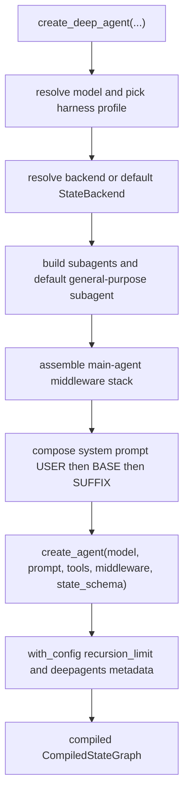
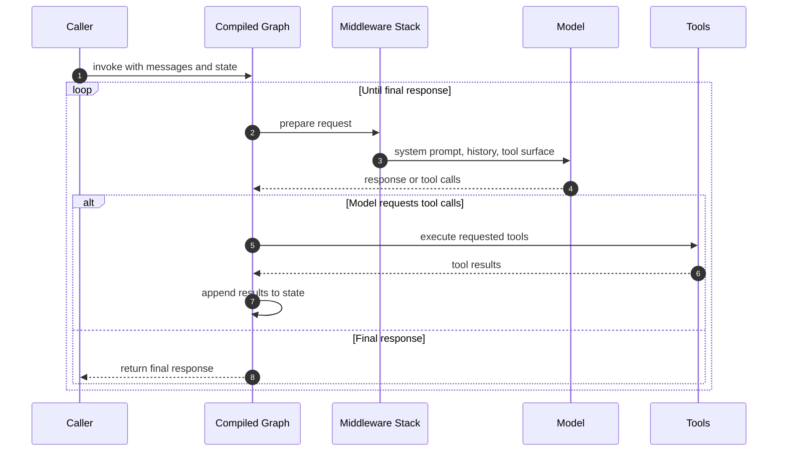

# SDK: Construction & Execution (create_deep_agent)

[`create_deep_agent`][create_deep_agent] is the single public entry point for
building a Deep Agent. It does not introduce a new runtime: Deep Agents is an
opinionated harness *on top of* LangChain's `create_agent()`, so
`create_deep_agent` is primarily an **assembly point** that resolves a model and
profile, resolves a backend, composes a middleware stack, builds subagents,
assembles a system prompt, and delegates the actual graph compilation to
`create_agent()`.

There are two phases worth separating:

- **Construction** — the one-time body of `create_deep_agent` that produces a
  compiled graph.
- **Execution** — what happens each turn when application code invokes the
  returned graph, driven by LangGraph.

This page documents both. For *observed* runtime characteristics such as turn
counts and how many model calls happen per turn, see
[runtime-behavior.md](../runtime-behavior.md); those are measured behaviors, not
code-level facts, and are intentionally not restated here.

## Construction

Construction runs entirely inside `create_deep_agent`. The function signature
accepts a model, tools, a system prompt, middleware, subagents, and a set of
capability/config parameters (`skills`, `memory`, `permissions`, `backend`,
`interrupt_on`, `response_format`, `state_schema`, `checkpointer`, `store`, and
more), and returns a `CompiledStateGraph`.

### 1. Resolve model and harness profile

If `model` is `None`, a deprecation warning is emitted and the default
`ChatAnthropic(model_name="claude-sonnet-4-6")` is constructed. Otherwise the
argument is passed through [`resolve_model`][resolve_model], which returns a
`BaseChatModel` unchanged when one is already supplied, and otherwise resolves a
`provider:model` string via `init_chat_model` composed with any registered
provider profile. The original string spec (if any) is retained so that harness
profile resolution can key on it.

The resolved model and spec select a **harness profile**
(`_harness_profile_for_model`), which supplies profile-specific prompt text,
tool description overrides, tool exclusions, extra middleware, an optional
general-purpose subagent configuration, and a set of excluded middleware.

### 2. Resolve the backend

If no `backend` is passed, a `StateBackend()` is constructed as the default.
This backend is shared by every filesystem-, skills-, memory-, and
execution-oriented middleware built later, both for the main agent and for
subagents.

### 3. Build subagents

Caller-supplied `subagents` are partitioned by shape: entries with `graph_id`
become async/remote `AsyncSubAgent`s, entries with `runnable` become
`CompiledSubAgent`s (used as-is), and the rest are declarative `SubAgent`s. Each
declarative subagent has its own model resolved, its own harness profile
selected, its own middleware stack assembled (filesystem, summarization,
patch-tool-calls, optional skills, profile extras, prompt caching), its
permissions resolved (own rules override inherited parent rules entirely), and
its system prompt overlaid with the profile.

Unless the profile disables it or a caller already supplied a subagent named
`general-purpose`, a default general-purpose synchronous subagent is built and
inserted at the front of the inline subagent list, with its own middleware stack
mirroring the main agent's core stack.

### 4. Assemble the main-agent middleware stack

The main stack is built in a fixed order: optional `SkillsMiddleware`,
`FilesystemMiddleware`, `SubAgentMiddleware` (only when inline subagents exist),
summarization middleware, `PatchToolCallsMiddleware`, then optional
`AsyncSubAgentMiddleware`. The *core* names are captured, after which the tail is
appended: profile `extra_middleware`, prompt-caching middleware, optional
`MemoryMiddleware`, and optional `HumanInTheLoopMiddleware`. Caller `middleware`
is spliced in after the core stack but before the tail, and profile
`excluded_middleware` is filtered out. The exact ordering and filtering rules are
documented in [middleware-stack.md](middleware-stack.md).

`FilesystemMiddleware` and `SubAgentMiddleware` are protected scaffolding that a
profile's `excluded_middleware` cannot strip; attempting to exclude them raises
`ValueError` rather than producing a silently degraded agent.

### 5. Compose the system prompt

The profile's prompt overlay is computed first (`_apply_profile_prompt` applied
to an empty base). The final prompt is then assembled from the caller's
`system_prompt`: a `None` prompt yields just the profile base; a `str` prompt is
concatenated with the base separated by a blank line; a `SystemMessage` prompt
has the profile base appended as an additional text content block, preserving any
existing `cache_control` markers. See [profiles-models.md](../concepts/profiles-models.md)
for how profiles supply their prompt fragments.

### 6. Delegate to create_agent and attach config

Finally the assembled model, prompt, tools, middleware, and pass-through options
(`response_format`, `context_schema`, `checkpointer`, `store`, `debug`, `name`,
`cache`) are handed to LangChain's `create_agent(...)`. When no custom
`state_schema` is supplied, [`DeepAgentState`][DeepAgentState] is used as the
graph's base state schema. `DeepAgentState` extends LangChain's `AgentState` and
wraps `messages` with a `DeltaChannel` reducer so checkpoint growth stays linear
(O(N)) rather than quadratic (O(N²)) across long threads; see
[state-persistence.md](../concepts/state-persistence.md).

The compiled graph returned by `create_agent` is then wrapped with a tail
`.with_config(...)` call that sets a very high `recursion_limit` of `9_999` and
attaches Deep Agents metadata (`ls_integration: "deepagents"`, the deepagents
version under `lc_versions`, and `lc_agent_name`). The recursion limit is what
allows a deep agent to take many internal steps per invocation before LangGraph
aborts, and the metadata is how runs are attributed to the deepagents
integration in tracing.

Caption: The single construction pass of `create_deep_agent`, from model
resolution to the config-wrapped compiled graph.

## Execution

Once compiled, the graph is invoked per conversation turn and LangGraph drives
the agent loop. The model receives the assembled system prompt, the current
message history from state, and the tool surface produced by middleware. It
either produces a final response or requests one or more tool calls; tool
results are written back into state, and the loop repeats until the model returns
a response with no further tool calls.

Deep Agents shapes this loop almost entirely through the installed middleware
rather than through the loop itself. Middleware can run before a model call,
around a model call, or around tool execution — adding or removing tools from the
current request, injecting filesystem/skills/memory/subagent instructions into
the final prompt, summarizing or offloading history as context grows, writing
typed values into graph state, and enforcing filesystem permissions before a
built-in filesystem tool runs. A plain callable passed via `tools=` is different:
it only runs after the model *chooses* to call it and cannot alter the tool list
or prompt beforehand.

Caption: One invocation of the compiled deep agent — each iteration is a model
call, optional tool calls, and a state update, looping until the model produces a
final response.

The `recursion_limit` set during construction bounds how many of these internal
loop steps a single invocation may take. State updates between iterations flow
through the graph's channels, and `DeepAgentState`'s `DeltaChannel` on `messages`
governs how the growing history is checkpointed.

## Related pages

- [middleware-stack.md](middleware-stack.md) — the full ordering and filtering of
  the assembled middleware.
- [profiles-models.md](../concepts/profiles-models.md) — model resolution and
  harness/provider profiles.
- [state-persistence.md](../concepts/state-persistence.md) — `DeepAgentState`,
  the `DeltaChannel` reducer, and checkpointing.
- [runtime-behavior.md](../runtime-behavior.md) — observed turn counts and
  model-calls-per-turn (measured, not code facts).

[create_deep_agent]: https://reference.langchain.com/python/deepagents/graph/create_deep_agent
[DeepAgentState]: https://reference.langchain.com/python/deepagents/graph/DeepAgentState
[resolve_model]: repo://libs/deepagents/deepagents/_models.py
