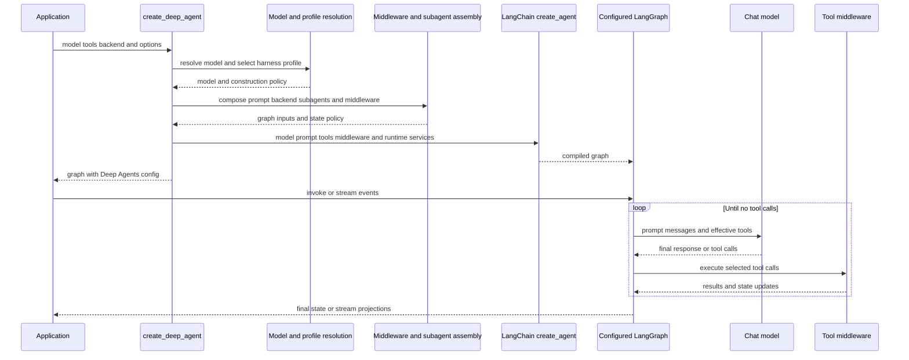

# SDK Construction and Execution

`create_deep_agent` is Deep Agents' public assembly API. It is re-exported from `deepagents`, resolves Deep Agents defaults and policy, then delegates graph compilation to LangChain `create_agent()`. The result is a configured LangGraph `CompiledStateGraph`, not a separate Deep Agents runtime: LangChain owns the agent loop and LangGraph owns state transitions, checkpointing, interrupts, and streaming. Deep Agents owns the opinionated construction of the prompt, middleware, backend wiring, and delegation surface.

## Construction and execution sequence

Caption: construction stops at LangChain compilation; the configured LangGraph later drives model/tool turns while middleware shapes each request and tool execution.

## Input resolution and policy

### Model and profile selection

A supplied `BaseChatModel` passes through `resolve_model` unchanged. A string model spec is initialized through `init_chat_model`, after a registered provider profile contributes provider-specific initialization settings. The original string spec is retained for harness-profile lookup; otherwise lookup can inspect the resolved model. This separates **provider profiles** (model construction) from **harness profiles** (post-construction agent behavior). Harness profiles can contribute prompt text, tool-description rewrites and exclusions, extra middleware, default-general-purpose-subagent settings, and middleware exclusions.

`model=None` remains a deprecated compatibility path: it warns and creates `ChatAnthropic(model_name="claude-sonnet-4-6")`. Pass an explicit model instead. Each declarative subagent resolves its own model and harness profile, so it can intentionally have provider-appropriate policy different from its parent.

Tool-description overrides are applied to copies of dictionary tools and `BaseTool` instances, never to caller-owned objects; plain callables are not wrapped or rewritten. Tool *exclusion* is deliberately later and runtime-oriented: the final `_ToolExclusionMiddleware` filters the model request after custom middleware has had a chance to inject tools.

### Backend and authored prompt

Absent `backend=`, the builder creates a single `StateBackend()` and gives that instance to the main and constructed-subagent filesystem, skills, memory, and summarization middleware. `StateBackend` is not a standalone file store: inside graph execution it reads and queues partial writes through LangGraph configuration keys and the `files` state channel. Its files last within a checkpointed conversation thread, not across threads; calls outside a graph context fail with `RuntimeError`. Initialize state-backed files through graph input, for example `agent.invoke({"messages": [...], "files": {...}})`.

The authored system prompt begins with the harness profile applied to an empty base. With `system_prompt=None`, that is the entire authored prompt. A caller string precedes it, separated by a blank line. A caller `SystemMessage` retains its existing content blocks and receives profile text as another text block, preserving caller cache-control markers. Skills and memory middleware can subsequently inject their dynamic prompt content at execution time.

## Subagents: construction and ownership

The builder partitions `subagents=` by shape:

- A spec with `graph_id` becomes an `AsyncSubAgent` managed by `AsyncSubAgentMiddleware`. It launches a background run through the LangGraph SDK and returns a task ID; the main agent can later check, update, cancel, or list it. Remote approval and schema belong to that remote graph. A URL-less local ASGI transport requires an asynchronous parent entrypoint.
- A spec with `runnable` is a caller-compiled `CompiledSubAgent`. Its graph, state schema, and approval policy remain caller-owned; its runnable must have a `messages` state key to return a result.
- Every other spec is a declarative synchronous `SubAgent`, compiled by delegation middleware with a resolved model/profile, tools, permissions, prompt, and middleware. Omitted tools, permissions, and `interrupt_on` inherit parent values; a supplied permission list replaces the inherited rules.

Unless the active profile disables it or a synchronous subagent is already named `general-purpose`, construction inserts a default general-purpose synchronous subagent at the front of the inline list. This supplies the `task` path; when it is disabled and no other inline subagent exists, no `task` tool is exposed. Profile-specific general-purpose description and prompt can override the default; that specific prompt wins over a profile base prompt, while the profile suffix still applies.

`mode="fork"` is experimental. Unlike an isolated declarative subagent, it receives the parent conversation/state, mirrors parent prompt-producing middleware, and appends its own prompt as an addendum. A fork cannot declare its own skills and refuses recursive task delegation. Its output is still isolated as a child projection rather than becoming the parent projection.

## Middleware assembly and policy guards

The main stack has a meaningful order:

1. optional `SkillsMiddleware`, `FilesystemMiddleware`, optional `SubAgentMiddleware`, summarization, `PatchToolCallsMiddleware`, and optional `AsyncSubAgentMiddleware` form the core;
2. profile extra middleware, provider-aware prompt-caching middleware, optional `MemoryMiddleware`, and optional `HumanInTheLoopMiddleware` form the tail;
3. caller middleware replaces an existing same-name entry in place, or is spliced after the core and before the tail;
4. exclusions are applied before and after caller insertion, then `_ToolExclusionMiddleware` is appended last when required.

The caching helper always installs Anthropic prompt caching in ignore-unsupported mode; Bedrock and Fireworks caching are added only when their integration middleware can be imported, and also ignore unsupported models. This permits one assembled stack to support several model families without making optional integrations mandatory. Memory follows caching so memory-driven prompt changes do not invalidate the cached prefix.

A profile cannot remove `FilesystemMiddleware` or `SubAgentMiddleware`: they back filesystem tools, permission enforcement, and synchronous dispatch. Exclusion is guarded at construction time. A protected exclusion, an unmatched configured exclusion, or a name matching multiple concrete middleware classes raises `ValueError` rather than silently changing the capability/security boundary. Exclusions aggregate across the main and default-general-purpose stacks, because a profile may legitimately target middleware present in only one.

Filesystem permissions are enforced in `FilesystemMiddleware`, not by direct backend operations. Permission-derived interruption settings merge with `interrupt_on`; a caller setting wins for the same tool name. Any resulting configuration adds `HumanInTheLoopMiddleware`, which interrupts the LangGraph run for approval. Supply a checkpointer when an approval must survive and resume a later execution.

## Graph assembly, state, and lifecycle

The final `create_agent()` receives the resolved model, composed prompt, rewritten caller tools, middleware, response format, context schema, checkpointer, store, debug option, name, cache, and either custom `state_schema` or `DeepAgentState`. The returned graph is configured with recursion limit `9999` plus Deep Agents LangSmith integration, version, and agent-name metadata.

`DeepAgentState` extends LangChain `AgentState`; its `messages` field uses a `DeltaChannel` reducer with snapshot frequency 50, changing checkpoint growth from quadratic to linear. The reducer accepts raw message-like values, replaces/deduplicates by message ID, honors individual removal tombstones and `REMOVE_ALL_MESSAGES`, and treats an absent replay state as empty. LangGraph assigns stable IDs before checkpoint serialization, avoiding replay-time random IDs.

A custom `state_schema` is forwarded to `SubAgentMiddleware`, allowing declarative subagents to share application fields. Before compilation, private fields marked by graph or middleware schemas are derived and assigned to the delegation middleware so they are not forwarded across delegation. Annotation-resolution failures only warn, however; affected fields will not remain private. Precompiled and remote subagents retain their own schemas. Custom schemas are a typed contract rather than runtime-checked `TypedDict` inheritance, so extensions must preserve the `messages` reducer.

## Running and observing the graph

During `invoke`, `ainvoke`, or streaming, LangGraph repeatedly gives the model message history, the effective prompt, and the middleware-produced tool surface. A model response without calls completes the loop. Otherwise the selected tools run, their results and state updates are appended, and the next model turn begins. Middleware can transform requests before model calls, add or remove visible tools, summarize or offload history, write typed state, and enforce a policy around tool runs. Ordinary callables in `tools=` run only after model selection and cannot alter the preceding request.

The compiled graph supports synchronous and asynchronous v3 event streams. Consumers can use parent projections such as messages, tool calls, values, and subgraphs, plus typed subagent handles identifying the subagent, originating tool-call ID, status, and output. Drain relevant projections—concurrent parent and child draining is supported. Fork output stays separate from the parent message projection. If a delegated subagent fails, its child handle reaches `failed` with an error and the upstream runtime exception can propagate while projections drain.

## Focused verification

`test_graph.py` exercises profile selection, prompt ordering, non-mutating tool rewrites, caching wiring, middleware ordering/exclusion, default and caller-provided subagents, interruption configuration, state propagation, and graph metadata. `test_messages_reducer.py` covers replacement, removal, reset, and replay behavior. `test_deep_agent_streaming.py` executes regular, forked, and failing subagents through synchronous and asynchronous v3 projections. `backends/test_state_backend.py` verifies the graph-context failure boundary of the default backend.

## Related pages

- [Architecture overview](overview.md) — layer ownership across Deep Agents, LangChain, and LangGraph.
- [Middleware stack](middleware-stack.md) — middleware hooks and feature behavior.
- [Backends](../concepts/backends.md) — backend choices and storage/execution capabilities.
- [Profiles and models](../concepts/profiles-models.md) — provider and harness profile configuration.
- [State persistence](../concepts/state-persistence.md) — checkpoints, threads, and resumption.
- [Build a Deep Agent](../workflows/build-a-deep-agent.md) — application-level construction workflow.
