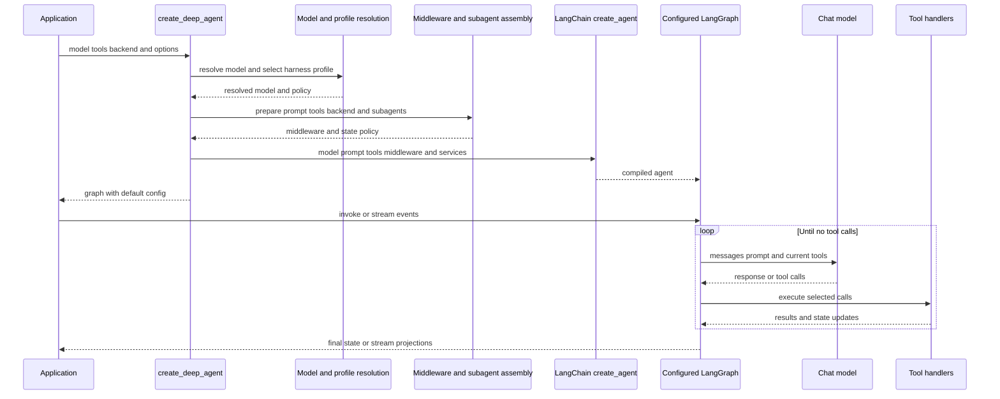

# SDK Construction and Agent Execution

`create_deep_agent` is the public Deep Agents assembly API. It resolves Deep Agents configuration and delegates graph compilation to LangChain `create_agent()`; the configured result remains a LangGraph/LangChain agent, rather than a separate Deep Agents runtime. The package re-exports this constructor together with its main state, subagent, filesystem, and profile APIs.

## Construction and turn execution

Caption: Deep Agents completes construction before LangChain compiles the graph; LangGraph then controls the model and tool loop while middleware shapes each request and update.

## Resolution, policy, and shared services

### Model and harness policy

`resolve_model` returns a supplied `BaseChatModel` unchanged. For a string such as `provider:model`, it calls `init_chat_model` with initialization settings from the registered provider profile. The resolved model and the original string specification then select a harness profile. Thus provider profiles affect model construction, whereas harness profiles shape the already-constructed agent: prompt text, tool-description overrides and exclusions, extra middleware, general-purpose-subagent configuration, and middleware exclusions.

`model=None` is deprecated and currently constructs `ChatAnthropic(model_name="claude-sonnet-4-6")`; applications should pass a model explicitly. A declarative subagent resolves its own model and harness profile, so it can use model-specific policy different from its parent.

Tool description overrides make copies: dictionary tools and `BaseTool` instances are rewritten without mutating caller-owned objects, while plain callable tools are left unchanged. Tool exclusion is deliberately later: `_ToolExclusionMiddleware` filters the runtime model request after custom middleware, so a custom middleware tool injection cannot restore an excluded name.

### Backend and prompt ownership

When `backend` is omitted, the constructor creates one `StateBackend()` and shares it with filesystem, skills, memory, and summarization middleware for the main agent and constructed subagents. The backend provides storage and execution behavior, but filesystem authorization belongs to `FilesystemMiddleware`.

The authored prompt begins with the harness contribution computed from an empty base. With `system_prompt=None`, that is the complete prompt. A string prompt is followed by a blank line and the profile text. For a `SystemMessage`, existing content blocks are preserved and profile text becomes an additional text block, preserving properties on existing blocks such as `cache_control`. Skills and memory middleware can add their dynamic prompt material at request time.

## Subagent resolution and delegation

The constructor partitions supplied subagent specifications by shape:

- A specification with `graph_id` is an `AsyncSubAgent`, exposed through `AsyncSubAgentMiddleware` for non-blocking remote/background work.
- A specification with `runnable` is a `CompiledSubAgent`, used as the caller-provided runnable on the synchronous `task` path.
- All other specifications are declarative `SubAgent`s. Construction resolves their model/profile, tools, middleware, permissions, interrupt policy, and prompt. Omitted tools, permissions, and `interrupt_on` inherit the parent values; explicit permissions replace the parent list.

Unless the profile disables it or an inline subagent is already named `general-purpose`, construction inserts a default synchronous general-purpose subagent at the front of the inline list. Inline subagents cause `SubAgentMiddleware` to expose `task`; async subagents are separate. The profile can override the default subagent's description and prompt.

A declarative `mode="fork"` subagent is experimental. It receives parent conversation/state, mirrors the parent prompt-producing middleware, and appends its own prompt to the inherited prompt rather than replacing it. A fork cannot define its own skills and a `task` call made from fork context returns a refusal rather than recursively delegating. Compiled and remote subagents instead retain the schema and approval behavior configured for their own graphs.

The `task` middleware compiles declarative specs with `create_agent`, invokes the selected runnable, and returns a `Command` that appends a `ToolMessage` to the parent. It also merges eligible returned state fields, strips private fields, and serializes a non-`None` `structured_response`; otherwise it uses the last non-empty AI text. A compiled subagent must return a state containing `messages` or delegation fails with `ValueError`.

## Middleware ordering and construction-time safeguards

The main stack has a fixed core order:

1. optional `SkillsMiddleware`;
2. `FilesystemMiddleware`;
3. `SubAgentMiddleware` only when inline subagents exist;
4. summarization middleware;
5. `PatchToolCallsMiddleware`; and
6. optional `AsyncSubAgentMiddleware`.

The tail is profile extra middleware, prompt caching middleware, optional `MemoryMiddleware`, and optional `HumanInTheLoopMiddleware`. A caller middleware whose `.name` matches an existing member replaces that member in place. A new caller middleware is inserted after the core and before the tail. Exclusions are applied both before and after caller middleware; finally, tool exclusion is appended last. This ordering is important: profile exclusions also apply to replacements, while excluded tools remain excluded despite middleware that changes the request tool list.

`FilesystemMiddleware` and `SubAgentMiddleware` are protected scaffolding. A profile cannot exclude either class or equivalent name because they back built-in filesystem tools, filesystem permission enforcement, and `task` dispatch. Validation fails at construction rather than silently compiling a degraded agent: protected exclusions, unmatched entries, and string exclusions that match multiple concrete middleware classes raise `ValueError`. Class exclusions match exact types; string exclusions match the middleware `.name`.

Filesystem permissions are enforced by the filesystem middleware. Permission-derived interrupt configuration is merged with caller `interrupt_on`, and a caller entry wins for a duplicate tool name. If the resulting mapping is nonempty, the main stack receives `HumanInTheLoopMiddleware`; an approval request then becomes a graph interrupt. Use a checkpointer when an interrupted approval must be persisted and resumed.

## Compilation, state, and checkpoints

The final `create_agent()` call receives the resolved model, composed system prompt, rewritten tools, assembled middleware, response format, context schema, checkpointer, store, debug flag, name, cache, and state schema. Its result is configured with `recursion_limit` `9999` and LangSmith metadata identifying the `deepagents` integration, Deep Agents version, and agent name.

Absent a custom `state_schema`, the graph uses `DeepAgentState`, an `AgentState` whose `messages` channel is a `DeltaChannel` using `_messages_delta_reducer` and snapshot frequency 50. Delta writes avoid storing the entire accumulated message list at every checkpoint, changing message checkpoint growth from quadratic to linear while `get_state()` can reconstruct the full history.

The reducer accepts raw message-like values, replaces or deduplicates by ID, handles individual removal tombstones and `REMOVE_ALL_MESSAGES`, and treats a missing replay base as empty. LangGraph assigns stable message IDs before checkpoint serialization; the reducer intentionally does not invent IDs, so replayed and resumed threads preserve identity.

A supplied `state_schema` is forwarded to the main `create_agent` call and `SubAgentMiddleware`, allowing declarative subagents to receive its fields. Precompiled and remote subagents retain their own graph schemas. Before compilation, the constructor scans the supplied schema and middleware schemas for fields marked `PrivateStateAttr` and assigns their names to `SubAgentMiddleware`, preventing those fields from being handed to or merged back from delegated work. A schema whose annotations cannot be resolved at runtime is warned about and contributes no private fields, so applications must make annotation names runtime-importable.

## Runtime and streams

On `invoke`, `ainvoke`, or streaming execution, LangGraph calls the model with message history, the effective system prompt, and the middleware-produced tool surface. A direct model response ends the turn. If the model requests tools, their results and state updates are appended and the model is called again. Middleware can intercept model calls or tool execution, filter visible tools, inject prompt context, compact/offload history, write typed state, and enforce permissions before built-in filesystem tools run. A callable supplied in `tools=` runs only after the model selects it, so it cannot rewrite the preceding request.

The compiled graph supports synchronous and asynchronous LangChain v3 event streams. A stream exposes projections including messages, tool calls, values, subgraphs, and typed subagent handles. A child handle records its name, originating tool-call ID, status, and output. Fork child messages remain distinct from the parent message projection. Consumers should drain the relevant projections; concurrent draining of parent and subagent projections is tested. If a subagent fails, its handle reaches `failed` with an error and the runtime error can propagate from projection drains.

## Focused verification

`test_end_to_end.py` drives a fake model through a filesystem tool call followed by a final response, demonstrating that a graph constructed by `create_deep_agent` performs the model/tool loop. `test_graph.py` covers prompt assembly, tool rewriting/exclusion, stack ordering and exclusions, default/custom subagents, state-schema wiring, and compiled metadata. Its delta-channel tests also verify that messages and files reconstruct through `get_state()` from an `InMemorySaver`. `test_messages_reducer.py` checks coercion, replay, and stable IDs across synchronous and asynchronous resumed threads. `test_deep_agent_streaming.py` exercises v3 projections, regular and forked subagents, concurrent drains, and failure status.

## Related pages

- [Middleware stack](middleware-stack.md) — hook responsibilities and ordering.
- [Backends](../concepts/backends.md) — storage and execution implementations.
- [Profiles and models](../concepts/profiles-models.md) — profile selection and model setup.
- [State persistence](../concepts/state-persistence.md) — checkpointer and resume concepts.
- [Build a Deep Agent](../workflows/build-a-deep-agent.md) — application-level construction workflow.
