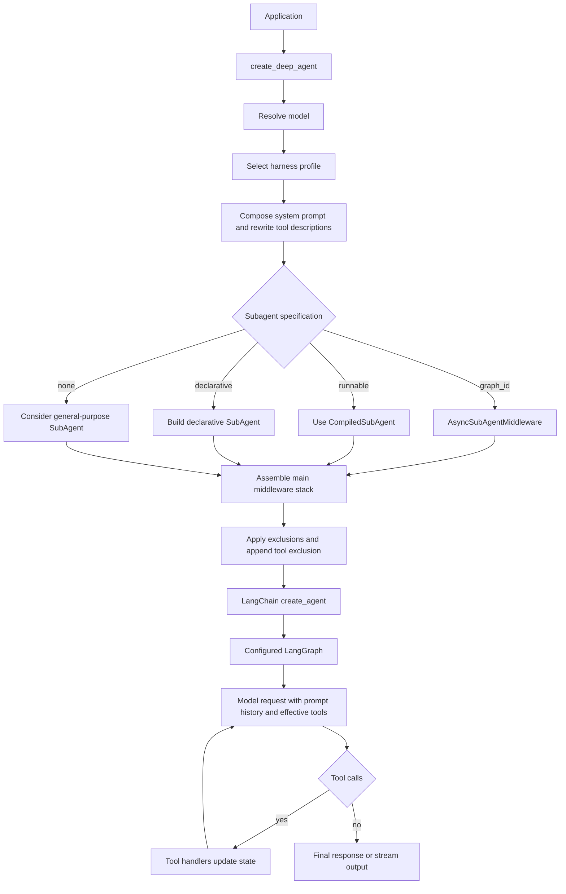

# SDK Construction and Execution

`create_deep_agent` is the public Deep Agents builder. It is an assembly layer over LangChain's `create_agent()`, not a separate runtime: it selects policy and components, then returns the compiled LangGraph with Deep Agents defaults. The package exports this entrypoint and the principal state, profile, filesystem, and subagent types.

## Construction and request flow

```mermaid
flowchart TD
    App["Application"] --> Builder["create_deep_agent"]
    Builder --> Model["Resolve model"]
    Model --> Profile["Select harness profile"]
    Profile --> Prompt["Compose system prompt and rewrite tool descriptions"]
    Prompt --> Split{"Subagent specification"}
    Split -->|"graph_id"| Async["AsyncSubAgentMiddleware"]
    Split -->|"runnable"| Compiled["Use CompiledSubAgent"]
    Split -->|"declarative"| Declarative["Build declarative SubAgent"]
    Split -->|"none"| General["Consider general-purpose SubAgent"]
    Async --> Stack["Assemble main middleware stack"]
    Compiled --> Stack
    Declarative --> Stack
    General --> Stack
    Stack --> Exclusions["Apply exclusions and append tool exclusion"]
    Exclusions --> Compile["LangChain create_agent"]
    Compile --> Graph["Configured LangGraph"]
    Graph --> Request["Model request with prompt history and effective tools"]
    Request --> Decision{"Tool calls"}
    Decision -->|"yes"| Handlers["Tool handlers update state"]
    Handlers --> Request
    Decision -->|"no"| Result["Final response or stream output"]
```

Caption: Builder branches establish the subagent surface before the compiled graph repeatedly requests a model response and executes requested tools.

## Entry point, model resolution, and profile policy

When `model` is a `BaseChatModel`, `resolve_model` retains it. For a string, it calls `init_chat_model` with settings from the matching provider profile. Passing `None` is a deprecated compatibility path: the builder emits a warning and builds `ChatAnthropic(model_name="claude-sonnet-4-6")`; applications should provide the model explicitly.

The builder keeps the original string spec as well as the resolved model when it selects a harness profile. A harness profile controls assembly policy: prompt material, tool-description overrides, excluded tools, extra middleware, the general-purpose subagent configuration, and excluded middleware. Each declarative subagent resolves its own model and profile, so a child can have a different profile from its parent.

The final authored system prompt starts with caller instructions and appends profile prompt material. With `system_prompt=None`, the profile text is the prompt. A string prompt is followed by profile text separated by blank lines. With a `SystemMessage`, the builder preserves existing content blocks and appends profile text in a new text block, retaining caller metadata such as `cache_control`.

Tool-description overrides copy dictionary tool specifications and `BaseTool` instances rather than mutate caller objects; plain callables remain unchanged. This rewriting is distinct from exclusion: `_ToolExclusionMiddleware` filters the final request tool list, after custom middleware has run.

## Backend, skills, and approvals

Unless supplied, `backend` is one `StateBackend()` instance. The builder passes that instance into filesystem, summarization, skills, and memory middleware it constructs for the main graph and constructed subagent graphs. Filesystem permission rules, however, are enforced by `FilesystemMiddleware`, not by direct backend access.

`skills=` identifies backend-relative, POSIX-style source directories. `SkillsMiddleware` uses backend APIs rather than direct filesystem access; it loads sources in order and later sources override an earlier skill with the same name. A caller can also supply a middleware named `SkillsMiddleware`: when no `skills=` value is provided, its sources fill the skills slot. This lets the explicit middleware replace the default slot rather than creating a competing skills layer.

Permission-derived approval settings are built from filesystem rules and merged with `interrupt_on`; an explicit caller entry wins for the same tool. A nonempty result installs `HumanInTheLoopMiddleware`. The interrupt itself is part of graph execution, so a checkpointer is needed to persist and resume it.

## Subagent construction branches

The input `subagents` collection is classified before the main stack is built:

- A specification containing `graph_id` is an `AsyncSubAgent`, exposed through `AsyncSubAgentMiddleware` rather than the synchronous `task` tool.
- A specification containing `runnable` is a `CompiledSubAgent` and is used as its supplied graph.
- Every other specification is a declarative `SubAgent`. The builder resolves its model and profile; constructs filesystem, summarization, patching, profile, skills, and cache middleware; derives prompt, tools, permissions, and approval settings; then supplies the specification to `SubAgentMiddleware`.

The builder prepends a default `general-purpose` declarative subagent unless the active profile disables it or an inline synchronous specification already uses that name. If no synchronous subagent remains, no `SubAgentMiddleware` and no `task` tool are installed; asynchronous subagents are independent.

A declarative child inherits parent tools, permissions, and `interrupt_on` unless its specification supplies each setting; a child permissions list replaces the parent list. `SubAgentMiddleware` compiles declarative specifications when it creates its `task` tool. It requires a model and tools, adds `HumanInTheLoopMiddleware` if the resolved specification has approvals, and ensures `UnsupportedContentMiddleware` exists. Compiled and remote subagents remain responsible for their own graphs, state schemas, and approval configuration.

A `mode="fork"` declarative child is experimental. It receives the effective parent conversation and rebuilt prompt context, with its own prompt appended; it inherits parent skills and may not declare skills of its own. Its task surface retains `task` but rejects recursive delegation at call time. In contrast, an isolated child receives a fresh human message containing only the delegated description. In either mode, returned state excludes messages handled by the task result, standard excluded keys, and private fields; the task result becomes a `ToolMessage` containing either serialized structured output or the last nonempty AI text.

A custom `state_schema` is forwarded to `SubAgentMiddleware` and therefore declarative compilation, while compiled and remote graphs retain their own schemas. Before compilation, the builder gathers `PrivateStateAttr` fields from the graph schema and all middleware schemas and adds them to each installed `SubAgentMiddleware` private-key set, preventing those values from crossing the delegation boundary.

## Middleware composition and exclusion invariants

The main core is assembled in this order: `FilesystemMiddleware`, optional `SubAgentMiddleware`, summarization middleware, `PatchToolCallsMiddleware`, and optional `AsyncSubAgentMiddleware`. The profile tail is then materialized as profile extra middleware, optional `SkillsMiddleware`, prompt-caching middleware, optional `MemoryMiddleware`, optional `HumanInTheLoopMiddleware`, and `UnsupportedContentMiddleware`.

Caller middleware is merged by `.name`. A matching name replaces the existing slot in place; a new name is inserted immediately after the core and before the profile tail. Exclusions run once before and once after that caller splice, so a profile can remove both assembled defaults and an attempted replacement. The builder finally appends `_ToolExclusionMiddleware` if the profile names excluded tools. That final placement prevents a custom `wrap_model_call` middleware from restoring a prohibited tool.

The same broad policy is applied to constructed children, with important ownership differences. General-purpose children use the parent profile and inherit only caller middleware that replaces a default general-purpose slot; arbitrary main-agent middleware is not copied. A declarative child gets its own profile and its own spec middleware. A fork additionally mirrors parent caller middleware, with spec entries replacing inherited entries by name, so it can rebuild the parent prompt-producing context.

`FilesystemMiddleware` and `SubAgentMiddleware` are protected scaffolding: a profile cannot exclude either by class or by name. Filtering uses exact concrete type for a class entry and exact middleware name for a string entry. It raises `ValueError` for protected entries, names colliding across concrete middleware classes, or exclusions that match no assembled main or general-purpose stack. These failures prevent a profile typo or policy change from silently producing a degraded agent.

### Request-time content and skill behavior

`SkillsMiddleware` follows user and profile middleware but precedes prompt caching. Thus its disclosure sees the compacted conversation and the model selected after routing or fallback middleware. It loads skill metadata before the agent and keeps metadata out of propagated state; its private error and disclosed-tool fields are not delegated. Metadata is cached in graph state per thread: a non-`None` list, including an empty one, skips a subsequent load. Set `skills_metadata` to `None` in an invocation or state update to request a reload. Source-load failures are recorded as `skills_load_errors` and logged as warnings; the middleware can render bounded warnings into its system-prompt fragment.

`UnsupportedContentMiddleware` is at the end of the ordinary assembled stack, after caller middleware. For each model request it tests human and tool content blocks against the active request model profile. Unsupported blocks are replaced by a text notice in that outbound request only; original thread content remains available if a later model supports it. Declarative subagent compilation adds the middleware if the prepared child stack lacks it.

## Compilation, state, and execution

The final `create_agent()` call receives the resolved model, final prompt, rewritten caller tools, composed middleware, response format, context schema, checkpointer, store, debug value, agent name, cache, and state schema. The result is wrapped with `.with_config()` to set `recursion_limit` to `9999` and Deep Agents LangSmith metadata: `ls_integration`, the package version in `lc_versions`, and `lc_agent_name`.

Without a custom schema, the graph uses `DeepAgentState`. Its `messages` channel uses a `DeltaChannel` and `_messages_delta_reducer` with snapshots every 50 updates, avoiding repeated full growing-list checkpoint writes and changing expected checkpoint growth from quadratic to linear. The reducer coerces message-like values, replaces or deduplicates by ID, handles individual tombstones and `REMOVE_ALL_MESSAGES`, and treats absent replay state as empty. LangGraph assigns stable message IDs before serialization.

At runtime, LangGraph drives LangChain's model and tool loop. A model request receives the effective system prompt, history, and middleware-produced tool surface. A response with tool calls runs handlers and appends their results and state updates before another model request; a response without tool calls ends the turn. This makes middleware the request-time extension point for dynamic prompts, tool visibility, content filtering, history processing, approval, and state—not a callable passed in `tools=`, which runs only after a model selects it.

## Focused verification

`test_graph.py` covers model/profile selection, prompt composition, general-purpose construction, state-schema and private-state propagation, exclusion validation, tool exclusion ordering, and caller/profile/skills placement. The end-to-end fake-model test proves a constructed agent can execute a filesystem tool call and return the scripted final response. Subagent tests cover compilation, state handoff, fork behavior, and schema ownership; content-filter tests exercise request-safe multimodal filtering after a model switch.

## Related pages

- [Middleware stack](middleware-stack.md) — hook responsibilities and ordering.
- [Middleware catalog](../concepts/middleware-catalog.md) — feature middleware reference.
- [Permissions and human-in-the-loop](../concepts/permissions-hitl.md) — permission and approval behavior.
- [Subagents and skills](../concepts/subagents-skills.md) — delegation and skill concepts.
- [Build a Deep Agent](../workflows/build-a-deep-agent.md) — application-level construction workflow.
