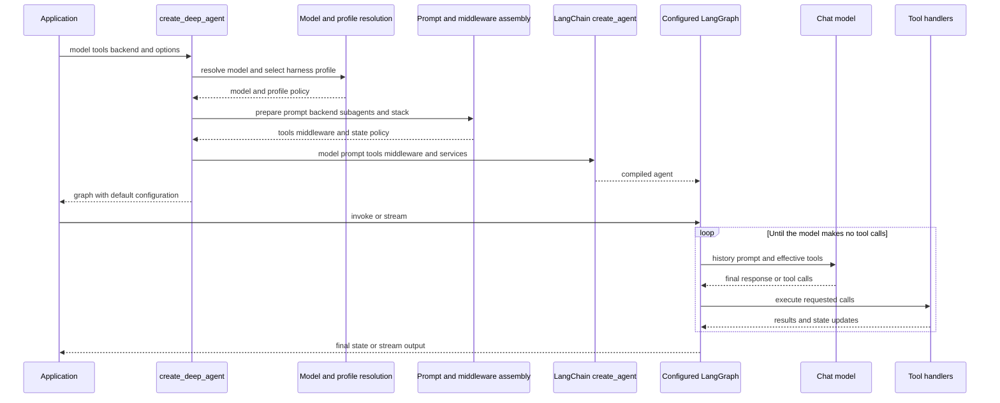

# SDK Construction and Execution

`create_deep_agent` is Deep Agents' public assembly API. It configures LangChain's `create_agent()` rather than supplying an independent execution engine: LangChain builds the agent loop and LangGraph owns graph state, checkpoints, streams, and interrupts. The package re-exports the constructor and principal state, profile, filesystem, and subagent types.

## Construction and request flow

```mermaid
sequenceDiagram
    participant App as Application
    participant Builder as create_deep_agent
    participant Resolve as Model and profile resolution
    participant Assemble as Prompt and middleware assembly
    participant LC as LangChain create_agent
    participant Graph as Configured LangGraph
    participant Model as Chat model
    participant Tools as Tool handlers

    App->>Builder: model tools backend and options
    Builder->>Resolve: resolve model and select harness profile
    Resolve-->>Builder: model and profile policy
    Builder->>Assemble: prepare prompt backend subagents and stack
    Assemble-->>Builder: tools middleware and state policy
    Builder->>LC: model prompt tools middleware and services
    LC-->>Graph: compiled agent
    Builder-->>App: graph with default configuration
    App->>Graph: invoke or stream
    loop Until the model makes no tool calls
        Graph->>Model: history prompt and effective tools
        Model-->>Graph: final response or tool calls
        Graph->>Tools: execute requested calls
        Tools-->>Graph: results and state updates
    end
    Graph-->>App: final state or stream output
```

Caption: `create_deep_agent` finishes configuration before LangChain compiles the graph; LangGraph then drives the model and tool loop.

## Resolution, profiles, and prompt ownership

`resolve_model` leaves a supplied `BaseChatModel` unchanged. For a string model specification, it calls `init_chat_model` with the initialization settings contributed by a registered provider profile. `model=None` remains a deprecated compatibility path: it warns and constructs `ChatAnthropic(model_name="claude-sonnet-4-6")`; callers should configure a model explicitly.

After resolution, the constructor selects a harness profile using the resolved model and, when supplied, the original string specification. Provider profiles therefore govern model initialization, while harness profiles govern agent assembly: profile prompt material, tool-description overrides, excluded tools, extra middleware, the default general-purpose subagent, and middleware exclusions. A declarative subagent resolves its own model and harness profile, allowing its policy to differ from its parent.

The authored prompt combines caller instructions with profile prompt material. With no caller prompt, the profile contribution is the complete authored prompt. A string caller prompt precedes it with a blank-line separator. For a `SystemMessage`, existing content blocks are retained and profile text is appended as a new text block, preserving caller metadata such as `cache_control`.

Tool-description overrides copy dictionary tools and `BaseTool` instances instead of mutating caller-owned objects; plain callable tools are retained unchanged. Tool exclusion is different: `_ToolExclusionMiddleware` filters the final model-request tool list, so profile-excluded names cannot be reintroduced by middleware that adds tools later.

## Shared backend and delegated work

If `backend` is omitted, construction creates one `StateBackend()` instance. That instance is passed to filesystem, summarization, skills, and memory middleware wherever those middleware are built for the main agent and constructed subagents. Storage and execution capabilities come from the backend, but filesystem authorization is enforced by `FilesystemMiddleware`.

Supplied subagent specifications are partitioned by shape:

- An entry containing `graph_id` is an `AsyncSubAgent`; `AsyncSubAgentMiddleware` exposes its remote or background operations.
- An entry with `runnable` is a caller-provided `CompiledSubAgent`, used directly on the synchronous `task` path.
- Every other entry is a declarative `SubAgent`. The constructor resolves its model and profile, builds its filesystem, summarization, patching, profile, skills or fork-inherited middleware, rewrites its tools, and determines permissions, prompt, and approval configuration.

Unless the active profile disables it, or the inline list already has a `general-purpose` entry, construction prepends a default general-purpose declarative subagent. Its profile can change its description and prompt. If that default is disabled and no other synchronous subagent is present, the main agent has no `task` tool; asynchronous subagents remain independent.

Declarative subagents inherit parent tools, permissions, and `interrupt_on` unless their spec overrides each setting. A permissions override replaces the parent list. Fork-mode declarative subagents are experimental: they rebuild the parent prompt-producing context and append their own prompt, cannot define their own skills, and are guarded from recursively delegating through `task`. Precompiled and remote graphs retain their own schemas and approval configuration.

`SubAgentMiddleware` compiles declarative specs only when dispatching them. Its `create_sub_agent` path validates that a spec has a model and tools, appends a human-in-the-loop middleware when the resolved spec requests it, and ensures `UnsupportedContentMiddleware` is present. A custom `state_schema` is forwarded to this middleware so declarative children can use its fields; compiled and remote children keep the schema of their own graph. Private state fields from graph and middleware schemas are withheld from delegation and merge-back.

## Middleware assembly and safety invariants

The main stack begins with `FilesystemMiddleware`; it adds `SubAgentMiddleware` when inline subagents exist, then summarization, `PatchToolCallsMiddleware`, and optional `AsyncSubAgentMiddleware`. This is the core stack.

The tail is assembled as profile extra middleware, optional `SkillsMiddleware`, prompt-caching middleware, optional `MemoryMiddleware`, optional `HumanInTheLoopMiddleware`, and `UnsupportedContentMiddleware`. Skills intentionally sit after caller and profile middleware but before caching, so disclosure observes the compacted conversation and the model actually selected by routing or fallback middleware. A caller-provided middleware with the same `.name` replaces an existing stack slot in place; otherwise caller middleware is inserted after the core and before the tail. Profile exclusions are applied both before and after that splice. Finally, `_ToolExclusionMiddleware` is appended when the profile excludes tools.

`FilesystemMiddleware` and `SubAgentMiddleware` are required scaffolding: they provide built-in filesystem tools and permissions, and `task` dispatch respectively. A harness profile cannot remove either by class or name. Exclusion processing matches class entries by exact type and string entries by middleware name, and raises `ValueError` for protected entries, an unmatched exclusion, or a string name that matches multiple concrete middleware classes. This turns an unsafe or stale profile into a construction failure rather than a silently degraded agent.

Filesystem permission rules are applied at built-in filesystem tool handling, not by direct backend access. Permission-derived approval rules are merged with `interrupt_on`; caller entries win for the same tool. Any nonempty result installs `HumanInTheLoopMiddleware`, making the tool call a graph interrupt. A checkpointer is needed to persist and resume such interrupts.

### Request-time multimodal filtering

`UnsupportedContentMiddleware` is placed at the end of the assembled stack so it sees the final request model. On each model call, it examines human and tool-message content blocks against `request.model.profile`. It substitutes a text notice for unsupported content in an outgoing request only; the persisted conversation remains unchanged, allowing a later capable model to receive the original block. Declarative subagent compilation adds the same middleware when absent.

## Compilation, state, and execution lifecycle

The final `create_agent()` call receives the resolved model, composed prompt, rewritten caller tools, assembled middleware, response format, context schema, checkpointer, store, debug setting, name, cache, and graph state schema. The returned graph is wrapped with `.with_config()` to set a `9999` recursion limit and LangSmith metadata for the Deep Agents integration, version, and agent name.

When no `state_schema` is given, the graph uses `DeepAgentState`. Its `messages` field uses a `DeltaChannel` with `_messages_delta_reducer` and a snapshot frequency of 50, avoiding a full growing message-list checkpoint on every write and yielding linear rather than quadratic checkpoint growth. The reducer coerces message-like input, replaces or deduplicates IDs, honors individual removal tombstones and `REMOVE_ALL_MESSAGES`, and accepts a missing replay state as empty. It does not create IDs: LangGraph assigns stable IDs before checkpoint serialization, which keeps replay identity stable.

At execution time, LangGraph runs the LangChain loop: the model receives history, the effective system prompt, and middleware-produced tools; a direct response ends the turn, while tool calls append results and state updates before the next model call. Middleware is the request-time extension boundary for dynamic prompt content, tool visibility, history handling, permission enforcement, approval, typed state, and content filtering. A callable supplied through `tools=` runs only after the model selects it, so it cannot alter the preceding model request.

## Focused verification

The graph unit tests exercise prompt composition, profile selection, middleware placement and replacement, excluded-middleware validation, tool exclusion, state-schema propagation, prompt caching, and the default general-purpose subagent. An end-to-end fake-model test constructs an agent, asks it to call `ls`, and asserts that the next scripted AI message is returned. Subagent tests cover compilation and state handoff; the content-filter tests cover model changes and request-safe multimodal handling.

## Related pages

- [Middleware stack](middleware-stack.md) — hook responsibilities and ordering.
- [Architecture overview](overview.md) — layer ownership and runtime boundaries.
- [Backends](../concepts/backends.md) — storage and execution implementations.
- [Middleware catalog](../concepts/middleware-catalog.md) — feature middleware reference.
- [Subagents and skills](../concepts/subagents-skills.md) — delegation and skills concepts.
- [Build a Deep Agent](../workflows/build-a-deep-agent.md) — application-level construction workflow.
