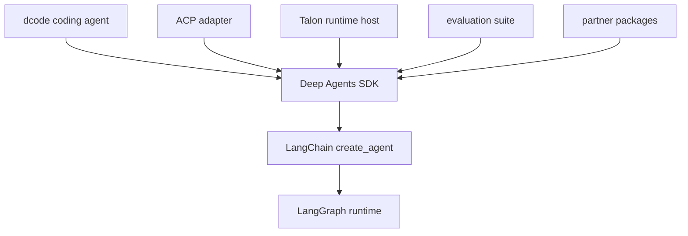

# Source Map

This is an ownership navigator, not a source-tree inventory. Start with [Architecture Overview](/openwiki/architecture/overview.md), [Code Agent](/openwiki/architecture/code-agent.md), and the package-local architecture documents for behavior; use this page to select the code owner and test boundary.

`libs/ARCHITECTURE.md`, `libs/code/ARCHITECTURE.md`, and `libs/DEVELOPMENT.md` are the in-repository maps for SDK behavior, dcode, and development workflow. Package READMEs define supported integration boundaries.

## Choose the owning layer first

Packages under `libs/` are independently versioned and each owns its `pyproject.toml`, `Makefile`, README, and tests. There is no root `pyproject.toml`; work from the package being changed and use its Make targets.

The package relationships and runtime layers that determine ownership.

Deep Agents is the harness over LangChain `create_agent()`, which uses the LangGraph runtime. SDK defaults, profiles, middleware, and backends belong to `libs/deepagents`; LangGraph owns graph state, checkpoints, streaming, and interrupts. Trace a `create_deep_agent()` argument to the middleware or backend it installs, then follow its execution hook. A missing tool generally indicates assembly or a profile exclusion; a visible tool that fails indicates backend capability or permission enforcement.

## SDK public surface and harness: `libs/deepagents/`

**Start at the supported import boundary.** `deepagents/__init__.py` re-exports `create_deep_agent`, `DeepAgentState`, selected filesystem, memory, rubric, and subagent middleware types, plus provider and harness profile registration helpers. Use these imports for supported consumer-facing API; change an internal module only when deliberately changing implementation rather than public API.

**Assembly owner.** `deepagents/graph.py:create_deep_agent()` is the SDK construction seam. It accepts model, tools, prompt, middleware, subagents, skills, memory, permissions, backend, interruption, schemas, checkpointing, store, and runtime options; it resolves model/profile/backend choices, composes prompts, assembles middleware and subagents, then delegates to LangChain `create_agent()`. Caller tools are additive. Required middleware cannot be removed through harness-profile exclusions: attempting that raises `ValueError` instead of silently constructing a degraded agent.

**Execution and access control.** `middleware/` owns behavior that must alter a model request or survive in graph state: tool filtering, prompt context, message transformation, and typed cross-turn state. A `tools=` callable runs only after a model selects it and therefore cannot alter the tool list or prompt seen by that model call. `filesystem.py` owns built-in filesystem tools and `FilesystemPermission`; shell-capable behavior requires a `SandboxBackendProtocol` backend, while the filesystem permission policy controls calls rather than merely hiding tools. `permissions.py` is a compatibility re-export. Delegation belongs in `subagents.py` for declarative/compiled nested agents and `async_subagents.py` for async or remote work.

**Storage and profiles.** `backends/protocol.py` is the uniform file/backend contract, including standardized recoverable file-operation errors; concrete backends make state-, store-, filesystem-, composite-route-, local-shell-, LangSmith-sandbox-, or Context-Hub-backed behavior interchangeable behind that contract. `profiles/` is the provider/model extension seam: provider profiles control model construction and pre-initialization effects, while harness profiles control prompt assembly, tool visibility, middleware, and default subagents. Built-ins and third-party entry-point profiles load lazily when the registry is first accessed; keys are `provider` or `provider:model`.

**Tests.** Start with `libs/deepagents/tests/unit_tests/` for graph assembly, middleware, backends, and profiles; use `integration_tests/` only where model-backed behavior is material. See [Build a Deep Agent](/openwiki/workflows/build-a-deep-agent.md) for the consumer workflow.

## dcode entrypoints and server graph: `libs/code/`

`deepagents-code` is the prebuilt terminal coding agent built over the SDK. Its terminal client owns presentation and input while the server owns graph execution, tools, model setup, memory, and checkpoints; they communicate through streaming. Diagnose and test the side that authors the state or behavior rather than creating competing implementations.

**Public and operational entrypoints.** `deepagents_code/__init__.py` exposes `cli_main` lazily from `main.py`; imports of configuration or other submodules avoid main-loop startup machinery. `agent.py` builds the coding agent with `create_deep_agent()`. `server_graph.py:make_graph()` is the LangGraph-server factory named by generated `langgraph.json`. It reads `ServerConfig.from_env()`, the inverse of the CLI's `ServerConfig.to_env()`, so both processes use one configuration schema.

**Server lifecycle.** The factory asynchronously builds built-in and configured MCP tools, using a process-wide MCP session manager so real sessions are bound lazily to the server event loop. It resolves project/settings and model creation off the event loop where blocking work may occur, applies runtime model state, and creates the CLI agent plus its composite backend and server-owned offload operation. If configured sandbox construction fails, it emits a machine-readable startup error and exits; a successfully constructed sandbox is held for the server process lifetime and cleaned up at exit. Read `server_graph.py` when a dcode change affects remote serving, MCP loading, sandbox startup, or server-owned resources.

**Durable and extension state.** `sessions.py` uses LangGraph checkpoint persistence for threads. `resume_state.py` declares checkpoint channels, including effective model information, allowing `dcode -r` to restore the model associated with a resumed thread. Cost tracking writes the per-thread total into graph/checkpoint state; clients render its streamed result. Configuration resolves user, project, session, and runtime scopes into one first-read, process-wide generation. MCP discovery/loading is in `mcp_tools.py`; `tool_catalog.py` derives `/tools` and `dcode tools list` from actual bound tools, not a duplicate list. `offload.py` and `offload_middleware.py` own history storage and dcode-specific compaction; `approval_mode.py` shares per-thread approval state across client and server, and `auto_mode.py` provides its classifier-backed Auto policy.

**Tests.** Use `libs/code/tests/unit_tests/` for the smallest owning module and `integration_tests/` for external services. Add a client/server regression only when state crosses that boundary. See [Run a dcode session](/openwiki/workflows/run-dcode-session.md).

## ACP: `libs/acp/`

`AgentServerACP` in `deepagents_acp.server` adapts a compiled Deep Agent to the Agent Client Protocol: it is the owner for editor-facing messages, content and tool updates, session modes, and editor MCP configuration. It can advertise `session/load` only when the agent has a durable checkpointer. On load, it restores the LangGraph thread, verifies the original working directory, and replays conversation updates before responding. The package module entrypoint (`python -m deepagents_acp`) runs the test ACP server via `_serve_test_agent`; a production adapter normally constructs an agent and calls `run_agent` as shown in the README.

`dcode --acp` instead serves the prebuilt coding agent. Do not assign a general ACP adapter change to dcode merely because both can speak ACP. Use ACP protocol tests for adapter behavior and command-policy tests for execution safety. See [ACP integration](/openwiki/integrations/acp.md).

## Evaluations: `libs/evals/`

`deepagents-evals` is end-to-end behavioral validation against real LLMs. Each eval captures the trajectory—including tool calls, file mutations, and final response—and scores correctness and efficiency. Correctness assertions fail cases; efficiency expectations are non-failing observations. The CLI owns runs, trials, aggregation, and catalog/model-group management. `EVAL_CATALOG.md` locates existing categories, while Harbor integration covers sandboxed benchmark workflows. These evaluations need the credentials and tracing setup documented by the package, unlike ordinary unit tests. See [Run evals](/openwiki/workflows/run-evals.md).

## Talon: `libs/talon/`

Talon is an experimental local host for long-running agents. `deepagents_talon.__main__:main` is its composition root: it loads `TalonConfig`, prepares state and persistent cron storage, cleans sensitive state, selects channel adapters and an agent runtime, creates `TalonHost`, and attaches a persistent scheduler when channels are present. It then performs a one-shot bootstrap or runs the host until stopped. `AGENT_MODEL` unset selects the echo runtime, useful for lifecycle/channel wiring without provider credentials.

The host owns lifecycle, cancellation, scheduler coordination, and per-conversation behavior; channel, cron, MCP, and runtime modules own their respective boundaries. Talon is alpha and lacks production-grade isolation, complete HITL policy, administrator controls, and multi-tenant boundaries. Channel access must be treated as access to the operator's model credentials, MCP tools, and local resources. Test security or lifecycle changes at the host/runtime/channel boundary. See [Talon integration](/openwiki/integrations/talon.md).

## Partner sandbox packages: `libs/partners/`

Partner integrations are independently versioned packages that own their own dependency declarations, README, tests, and vendor behavior. Keep vendor-specific sandbox behavior in the relevant package rather than embedding it in the core SDK. Adding a partner also requires repository wiring: release configuration, CI and change detection, labels and scopes, relevant secrets, and sandbox/integration workflows described in `libs/partners/AGENTS.md`.

## Focused change checklist

1. Find the public argument or operational command, then its assembly owner.
2. Preserve boundaries: SDK policy belongs in middleware/backends/profiles; dcode behavior follows its server/client ownership; ACP translates protocol; Talon owns host/channel lifecycle; evals measure behavior.
3. Test at the lowest sufficient layer and cross a streaming or protocol boundary only when the behavior crosses it.
4. Use the local package README and Makefile for supported commands and environment requirements.
