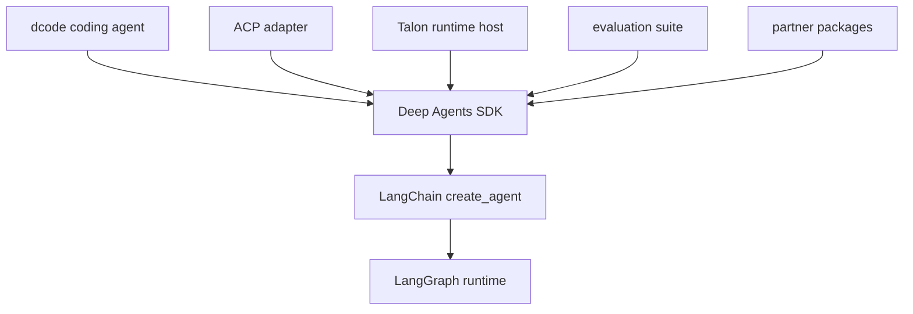

# Source Map

This is an ownership and entrypoint navigator, not a source-tree inventory. Start with [Architecture Overview](/openwiki/architecture/overview.md), [SDK construction and execution](/openwiki/architecture/sdk-construction-execution.md), and [Code Agent](/openwiki/architecture/code-agent.md) for behavior; use this page to choose where to make or test a change.

The in-repository orientation documents are `libs/ARCHITECTURE.md` for the SDK, `libs/code/ARCHITECTURE.md` for dcode, and `libs/DEVELOPMENT.md` for repository workflow. Package `README.md` files define the supported integration boundary.

## First choose the owning layer

The repository is a monorepo of independently versioned packages under `libs/`; each package has its own `pyproject.toml`, `Makefile`, and `README.md`. There is no root `pyproject.toml`, so install and run checks from the package being changed.

The package relationships and the runtime layers that determine ownership.

Deep Agents is the harness layer: it builds on LangChain's `create_agent()`, which builds on the LangGraph runtime. Thus harness defaults, profiles, middleware, and backends belong in `libs/deepagents`; agent-loop semantics belong upstream; checkpointing, streaming, and interrupts are LangGraph runtime concerns.

A useful investigation path is `create_deep_agent()` argument → installed middleware/backend → execution hook. A missing tool usually means assembly or profile exclusion; a visible tool that fails usually means backend capability or permission policy.

## SDK: `libs/deepagents/deepagents/`

**Public boundary.** Begin at `__init__.py` for supported imports. It re-exports `create_deep_agent`, `DeepAgentState`, selected middleware classes, and provider/harness profile registration helpers. Avoid making consumers import internal assembly modules unless deliberately expanding public API.

**Construction.** `graph.py:create_deep_agent()` is the primary SDK entrypoint. It resolves model/profile/backend choices, composes the prompt, creates built-in and supplied subagents, assembles middleware, and calls LangChain `create_agent()`. Its signature is the best starting point for a new SDK option. In particular, caller middleware sits between the base and tail stacks; profile exclusions are validated, including rejection of exclusions that would remove protected scaffolding. See [Middleware stack](/openwiki/architecture/middleware-stack.md) before changing ordering.

**Request-time behavior.** `middleware/` owns concerns that must run before a model call or persist in graph state: changing tool visibility, prompt injection, message transformation, and typed cross-turn state. Plain `tools=` callables are for consumer-specific operations after the model has selected them; they cannot rewrite the request that the model sees.

- Open `middleware/filesystem.py` for built-in file operations and `FilesystemPermission`; it is also where shell capability affects the `execute` surface.
- Open `middleware/subagents.py` for synchronous declarative or compiled delegation through `task`, and `async_subagents.py` for remote/background delegation.
- Open `summarization.py`, `skills.py`, and `memory.py` for context compaction, reusable instructions, and long-term recall. `permissions.py` is only a compatibility re-export, not a policy implementation.

**Storage and execution boundary.** `backends/protocol.py` defines the uniform backend contract, including sandbox capability and normalized recoverable file errors. `backends/` implementations select state-scoped, store-backed, local-filesystem, routed composite, local-shell, LangSmith sandbox, or Context Hub storage/execution. Choose a backend or routing change here, rather than changing filesystem tools. Shell execution requires `SandboxBackendProtocol`; tool visibility and backend behavior must remain aligned.

**Profiles.** `profiles/` is the extension seam for provider/model-specific behavior. Provider profiles control model initialization and pre-initialization side effects; harness profiles control prompt text, tool/middleware behavior, and default subagents. Built-ins and third-party entry-point plugins load lazily through the registry, while `_keys.py` validates `provider` and `provider:model` keys.

**SDK tests.** Use `libs/deepagents/tests/unit_tests/` for deterministic assembly, middleware, backend, and profile behavior; use `integration_tests/` only for model-backed coverage. `tests/utils.py` carries shared mock tools and middleware helpers. Follow [Testing guide](/openwiki/testing/testing-guide.md) for commands and test selection.

## dcode: `libs/code/deepagents_code/`

`deepagents-code` is a prebuilt terminal coding agent over the SDK. It is deliberately split: the client owns input/presentation and the server owns graph execution, tools, model setup, memory, and checkpoints. Debug the side that owns the observed failure; interactive and headless paths share the runtime rather than implementing separate agents.

**Entrypoints and transport.** `__init__.py` lazily exposes `cli_main` from `main.py` so importing a submodule does not pull in startup machinery. `agent.py` constructs the coding agent with `create_deep_agent`. `server_graph.py:make_graph()` is the LangGraph-server factory configured by the shared `ServerConfig` schema; it builds built-in/MCP tools asynchronously and retains MCP sessions on the server event loop. `client/` contains remote and non-interactive client paths; `app.py`, `tui/`, and UI modules own Textual presentation.

**Durability and cross-process state.** `sessions.py` manages dcode threads on LangGraph checkpoint persistence. `resume_state.py` defines checkpointed resume channels, including effective model information, so `dcode -r` can restore the model associated with a thread. `cost_tracking.py` keeps the durable per-thread total in graph state/checkpoints; clients render streamed state rather than owning the total.

**Configuration and extensions.** `config.py`, `model_config.py`, `configuration/`, and `config_manifest.py` own layered user, project, session, and runtime configuration. Shared-resolver readers use one first-read process generation; parse failures retain the last usable source snapshot and file edits need an explicit generation advance rather than being watched live. For capabilities, follow `tools.py`/`managed_tools.py`, then `mcp_tools.py` and `mcp_config.py` for MCP discovery/loading; `tool_catalog.py` derives `/tools` and `dcode tools list` from bound tools rather than a duplicate catalog. `skills/`, `built_in_skills/`, `subagents.py`, `hooks/`, `plugins/`, and `extensions/` are consumer extension seams—respect their trust/configuration boundaries.

**Context, approvals, and failure-sensitive customizations.** `offload.py` owns offloaded-history locations and reports when local fallback storage is ephemeral; `offload_middleware.py` adds dcode-specific compaction/offload around SDK summarization and deliberately fails loudly if an SDK helper slot it patches disappears. `approval_mode.py` shares per-thread approval state between client and server; `auto_mode.py` supplies classifier-backed Auto policy. These are server/runtime policy changes, not UI-only features.

**dcode tests.** Start in `libs/code/tests/unit_tests/` for the module boundary above and use `integration_tests/` for real external integrations. Keep a client/server regression on the side where state is authored, plus an end-to-end test where the streaming boundary is material.

## ACP: `libs/acp/`

`deepagents_acp` adapts a Python Deep Agent to Agent Client Protocol editors. Its entrypoint is `deepagents_acp.server:AgentServerACP`, which wraps a compiled agent and translates ACP messages, tool updates, content blocks, session modes, and MCP configuration at the editor boundary. The adapter can advertise session loading only when the graph uses a durable checkpointer; loading restores the thread, verifies the original working directory, and replays conversation updates. Use `tests/test_agent.py` for protocol/agent behavior, `test_command_allowlist.py` and `test_dangerous_patterns.py` for execution safety decisions, and `test_model_switching.py` for session model behavior.

`dcode --acp` is a separate route that exposes the prebuilt coding agent; do not confuse it with the general-purpose ACP adapter when choosing an owner.

## Evaluations: `libs/evals/`

`deepagents-evals` is end-to-end behavioral validation against real LLMs. Evals capture trajectories including tool calls, file changes, and final text; correctness assertions hard-fail while efficiency expectations are reported without failing a case. The `deepagents-evals` CLI in `deepagents_evals/cli.py` is the operational entrypoint for runs, trials, aggregation, catalog/model-group generation, and machine-readable output; it distinguishes evaluation failures, configuration errors, and absence of usable reports with separate exit codes.

Use `tests/evals/utils.py` and its `TrajectoryScorer` when adding an SDK behavior eval; use `EVAL_CATALOG.md` to find the existing category. `deepagents_harbor/` and `harbor_adapters/` own Harbor benchmark integration. These tests require credentials/tracing as documented in `CONTRIBUTING.md`, unlike normal unit tests.

## Talon: `libs/talon/`

Talon is an experimental local host for long-running agents. `deepagents_talon.__main__:main` is the CLI composition root: it reads `TalonConfig`, initializes state/cron storage, selects a runtime and channels, then runs `TalonHost`. `host.py` owns process lifecycle, per-conversation serialization, cancellation, and scheduler coordination; `runtime.py` owns the Deep Agent versus echo runtime; `channels/`, `cron/`, and `mcp.py` own channel adapters, persistent scheduled runs, and MCP loading. Target matching tests such as `test_host.py`, `test_runtime.py`, `test_mcp.py`, channel tests, or cron tests.

Treat Talon's security warning as an ownership constraint: it is alpha software without production-grade isolation, complete HITL policy, admin controls, or multi-tenant boundaries. Channel access can reach the operator's credentials, MCP tools, and local resources, so security-sensitive changes belong in the host/runtime/channel boundary and require explicit tests.

## Partner packages: `libs/partners/`

`daytona`, `modal`, `vercel`, `runloop`, and `quickjs` are independently versioned provider/sandbox integrations. Their package README, `pyproject.toml`, and tests are the authoritative implementation scope; start there rather than embedding vendor behavior in the SDK. Adding a partner is repository integration work as well as package work: `libs/partners/AGENTS.md` identifies the release, CI, change-detection, secret, labeling, and sandbox workflow surfaces that must be updated.

## Focused change checklist

1. Locate the public argument or operational command, then the assembly owner.
2. Preserve layer boundaries: SDK policy in middleware/backends/profiles, dcode product behavior in its server/client split, editor translation in ACP, host/channel lifecycle in Talon, and benchmark logic in evals.
3. Test at the lowest sufficient layer; cross the client/server or protocol boundary only when the behavior actually crosses it.
4. Use the package-local `Makefile` and `README.md` for supported commands and environment requirements.
