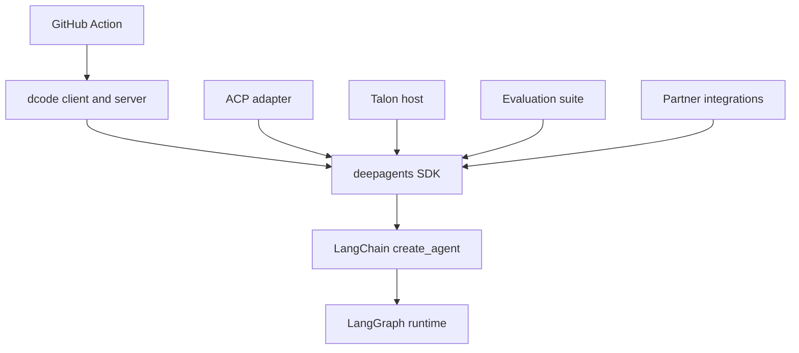
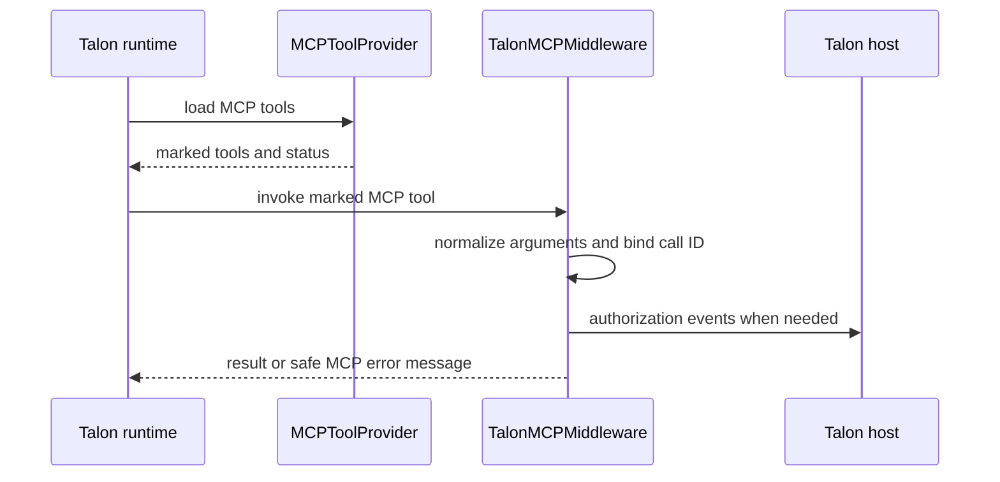

# Source Map and Ownership Boundaries

Start at the externally visible contract—an SDK import, console command, ACP operation, host behavior, or release package—and trace to the component that owns assembly or lifecycle. This page complements the [architecture overview](/openwiki/architecture/overview.md), [code-agent architecture](/openwiki/architecture/code-agent.md), [MCP integration](/openwiki/integrations/mcp.md), [Talon integration](/openwiki/integrations/talon.md), [development guide](/openwiki/operations/development.md), and [testing guide](/openwiki/testing/testing-guide.md).

## Package, review, and release boundaries

`libs/` is a monorepo of independently versioned packages. Each package owns its `pyproject.toml`, `Makefile`, README, dependencies, and tests; make changes and run `make help` from that package rather than assuming a root Python project. The current release-please units are `libs/deepagents` (`0.7.15`), `libs/acp` (`0.0.12`), `libs/code` (`0.1.71`), `libs/talon` (`0.0.8`), and the Daytona, Modal, Runloop, Vercel, and QuickJS partner packages. `libs/evals` is a package but has no manifest entry.

`CODEOWNERS` is review routing, not a complete product-ownership map: it covers `.github`, `libs/sdk`, `libs/talon`, and `libs/partners` (with an additional QuickJS owner). A package not named there still owns its validation and release integration.

This shows dependency and responsibility direction: reusable harness policy belongs in the SDK; presentation, protocol adaptation, host lifecycle, evaluation, vendor integration, and CI orchestration belong to their consuming surface.

## Change-routing map

| Change starts at | Owner and first implementation seam | Focused validation and release boundary |
| --- | --- | --- |
| Agent defaults, prompt, backend, middleware, delegation, or graph durability | **SDK**: `create_deep_agent()` in `libs/deepagents/deepagents/graph.py` assembles model/profile, backend, middleware, subagents, prompt, and LangChain agent. | `libs/deepagents/tests/unit_tests/test_graph.py`, then the nearest middleware/backend/profile test. SDK release unit. |
| Supported SDK import or type | **SDK**: `libs/deepagents/deepagents/__init__.py` is the import boundary; follow its export to the implementation. | Test import/signature behavior in `libs/deepagents`; SDK release unit. |
| Terminal flags, interactive TUI, headless input, rendering, or debug console | **dcode client**: `dcode`, `deepagents-code`, and `python -m deepagents_code` reach `deepagents_code:cli_main`; the client owns input and presentation. | `libs/code/tests/unit_tests/test_main.py`, `test_args.py`, `test_non_interactive.py`, and the matching `tui/` test. dcode release unit. |
| Per-thread debug file logging or log display | **dcode debug**: package import installs the in-memory buffer then configures the package logger; `_debug.py` owns path selection, handler rotation, and file hardening. | `libs/code/tests/unit_tests/test_debug.py`; use `test_debug_console.py` for the Textual console. dcode release unit. |
| dcode agent composition, server config, MCP startup, sandboxing, offload, or workspace binding | **dcode server**: follow `ServerConfig.to_env()` / `from_env()` to `server_graph.py:make_graph()` and its shared runtime factory. | `test_server_config.py`, `test_server_graph.py`, and matching MCP/sandbox/offload tests. dcode release unit. |
| ACP session, streamed update, mode/model switch, or persistence | **ACP**: `AgentServerACP` translates ACP to a compiled Deep Agent and graph events back to ACP. | `libs/acp/tests/test_agent.py`, `test_model_switching.py`, `test_command_allowlist.py`, or `test_dangerous_patterns.py`. ACP release unit. |
| Talon process startup, channel selection, cron, persistent host state, or MCP management command | **Talon CLI**: `deepagents-talon` invokes `deepagents_talon.__main__:main`; it composes config, cron store, channels, runtime, and `TalonHost`. | `libs/talon/tests/test_main.py`, plus `test_host.py`, `test_runtime.py`, or lifecycle/channel tests. Talon release unit. |
| Talon MCP configuration, discovery, tool inventory, reload, or OAuth login | **Talon MCP**: `mcp.py` owns `MCPToolProvider`, config loading, connection/authentication, and management tools; `mcp_auth.py` owns OAuth/token mechanics. | `libs/talon/tests/test_mcp.py` and `test_mcp_auth.py`. Talon release unit. |
| Talon MCP tool-call argument behavior, authorization context, or protocol-error presentation | **Talon MCP middleware**: `talon_mcp_middleware()` wraps only metadata-marked MCP tools. | `libs/talon/tests/test_mcp_middleware.py`, with `test_mcp.py` for authorization lifecycle. Talon release unit. |
| Talon local attachments or remote async-subagent definitions | **Talon subagents**: `subagents.py` compiles fresh local roles and wraps delegation; `async_subagents.py` reads remote definitions from `[async_subagents]`. | `libs/talon/tests/test_async_subagents.py` and applicable runtime/host tests. Talon release unit. |
| Evaluation trajectory, reports, catalog/model groups, or charts | **Evals**: `deepagents-evals` owns evaluation operations. Add deterministic behavior coverage to the product owner first. | `libs/evals/tests/unit_tests/test_cli.py` and relevant evaluation tests. Not release-managed. |
| Vendor sandbox/provider mechanics | **Partner package** under `libs/partners/<partner>`, plus required repository CI, labels, secrets, change detection, and release wiring. | Package tests and its integration workflow. Listed partner release unit. |
| Headless coding workflow inputs, caching, or outputs | **Repository Action**: `action.yml` invokes dcode and owns Action-level validation and cache/output semantics. | Validate changed workflow scenario and dcode flag compatibility. |

## SDK and dcode entrypoints

Deep Agents is layered: its harness sits above LangChain's `create_agent`, which sits above LangGraph. The SDK root re-exports the supported public surface. Provider profiles control model construction and pre-initialization effects; harness profiles control post-model behavior such as prompt assembly, visible tools, middleware, and default subagents. Repeated provider or provider-model registrations merge rather than replace an existing registration.

The SDK supplies filesystem, shell, and delegation tools by default, but a shell call returns an error if the backend is not sandbox-capable. Treat backend capability—not tool visibility alone—as the execution boundary.

`deepagents-code` is a prebuilt terminal coding agent with a terminal client and an agent server joined by a streaming protocol. Both console-script names lazily resolve `deepagents_code:cli_main`, while `python -m deepagents_code` delegates to it. The lazy resolver keeps ordinary imports from loading startup machinery and turns an unresolvable Deep Agents home into a message and exit code 2.

The dcode server validates the execution context's thread/workspace binding before selecting a runtime. It rejects policy or configuration-fingerprint drift; for another project it drops launch-project MCP and sandbox configuration. One cached runtime is shared by interactive and offload routes because rebuilding would repeat MCP discovery, leak sandbox sessions, and duplicate exit handlers. MCP discovery uses a process-wide session manager tied to the server event loop; sandbox startup failures use a machine-readable startup error.

### dcode debug logging and TUI work

`DEEPAGENTS_CODE_DEBUG` enables file-based debug logging. `configure_debug_logging()` records configured loggers, then `bind_debug_logging_to_thread()` chooses the active per-thread log path only when debug is enabled. The directory comes first from `DEEPAGENTS_CODE_DEBUG_DIRECTORY`, then the legacy `DEEPAGENTS_CODE_DEBUG_FILE` parent, then `config.toml`, then the default. `DEEPAGENTS_CODE_LOG_LEVEL` overrides the debug-or-info fallback only for recognized levels.

Debug files are a security boundary: on POSIX the code creates or tightens files to `0o600`, opens with `O_NOFOLLOW`, and requires an owner-only (`0o700`) real directory; unsafe thread IDs are hashed rather than used as path components. On Windows it applies a current-user-only DACL. Failure to secure a file or directory warns and disables/removes the debug handler rather than writing to an unsafe or stale destination. Test the relevant behavior in `test_debug.py`; test Textual rendering, interaction, and debug-console behavior in `test_debug_console.py` or the applicable `tests/unit_tests/tui/` test.

## ACP lifecycle boundary

`AgentServerACP` is an adapter, not another harness-policy layer. It adapts a compiled Deep Agent to ACP, tracks session CWD/options, and streams graph events and interrupts as ACP updates. Persisted `session/load` is exposed only when loading is enabled and the agent has a durable checkpointer. On load, it verifies ACP session metadata and that the requested CWD matches the original CWD, restores recognized options, and replays the conversation. The module entrypoint runs the test ACP server using `asyncio`; production code constructs `AgentServerACP(agent)` and serves it through ACP's `run_agent` API.

## Talon lifecycle, MCP, and subagent boundaries

Talon is an experimental local host, not a production security boundary. It lacks complete approval policy, administrator controls, sandbox isolation, and multi-tenant boundaries; treat channel access as access to the operator's agent, credentials, tools, and local resources. The command handles `import-fleet` and `mcp` management before host startup. Otherwise it creates persistent cron state, prepares/cleans home state, selects requested or enabled channels, and starts the host. No model selects `EchoAgentRuntime`; a model loads MCP tools and uses either a supplied checkpointer or SQLite/history-backed `ConversationSaver`. A scheduler is attached only when channels exist; `--once` starts then stops the host.

`MCPToolProvider.load()` discovers configured tools, prefixes each loaded tool with its server name, marks it with `_deepagents_talon_mcp`, and adds status, OAuth authorization, reload, and configuration-management capabilities as applicable. Duplicate names are rejected. Server failures are represented in `MCPServerInfo` rather than preventing other configured servers from loading. Refreshes are revision-gated and serialized: a config change schedules reload before a later turn, while a forced reload always attempts it.

This shows the Talon-owned MCP call path; non-MCP tools bypass the middleware.

The middleware omits empty optional string-like arguments but preserves required or explicitly non-string values, then scopes authorization invocation state to the tool call. It turns `MCPError` into a `ToolMessage` containing code and message but no error artifact; non-protocol exceptions propagate. `_run_authorized()` resets context on all paths and emits completion/failure status best-effort, so status-delivery failure cannot undo OAuth state.

Talon local subagents are deliberately fresh-context graphs. `TaskTools` replaces the SDK delegation middleware by name to expose additive, exact tool attachments for named local subagents; it rejects duplicates/unknown names and refuses delegation from a subagent. Fresh roles receive only selected tools, Talon's MCP middleware, applicable human approval middleware, and no checkpointer; a protected action returns a result saying it did not run. `prepare_subagents()` rejects unsupported `fork` mode and records a credential-free inventory. Remote async definitions are read from `~/.deepagents/config.toml` by default: absent config yields none, but malformed files, sections, or any definition fail closed rather than silently dropping an agent.

## Other consumers

`deepagents-evals` owns single and repeated trials, aggregation, charts, catalog/model-group work, discovery, JSON, and dry-run output. Exit code 1 means evaluation failure, 2 configuration/generated-file drift, and 3 no usable reports. Partner integrations are independently versioned and require repository-level release, CI, change-detection, secret, label, and applicable sandbox wiring. Examples are focused pattern projects; they own setup, should pin a compatible `deepagents` range, and should test reusable or non-trivial helpers.

The composite Deep Agents Code Action installs requested or latest dcode, can restore memory and install repository skills, then runs headless dcode and returns `response`, `exit_code`, and `cache_hit`. Its input contract validates numeric, boolean, and JSON-object values; rejects an empty prompt and `stdin` with `skill`; and falls back from an unknown memory scope to a PR/ref cache key.

## Safe change sequence

1. Identify the visible contract, package, and release boundary in the table.
2. Trace to the assembly/lifecycle owner; do not put generic SDK policy into a consumer that merely exposes the symptom.
3. Preserve the governing invariant: dcode workspace/runtime isolation and safe debug logging, ACP durable-session checks, Talon authorization context and fresh subagent isolation, or Action input validation.
4. Add the smallest observable owning-package test, then escalate only when the contract crosses an integration, UI, workflow, or evaluation boundary.
5. Run the package's documented `make` target; use `make help` within that package to discover it.
