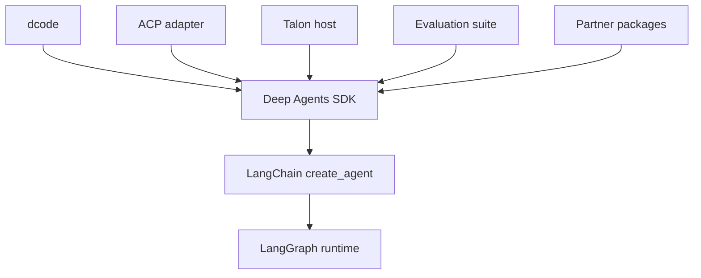

# Source Map & Change Boundaries

Use this page to choose the implementation owner and the smallest useful test boundary—not as a file inventory. For system behavior, see [Architecture Overview](/openwiki/architecture/overview.md); for dcode flow, see [Code Agent](/openwiki/architecture/code-agent.md); for protocol and host usage, see [ACP integration](/openwiki/integrations/acp.md) and [Talon integration](/openwiki/integrations/talon.md). The package Makefile and [testing guide](/openwiki/testing/testing-guide.md) remain the command authorities.

## Start with the ownership boundary

`libs/` is a monorepo of independently versioned packages. Each package owns its manifest, Makefile, README, environment, and tests; there is no root `pyproject.toml`. Make a change and run its narrow test from the owning package. Sibling dependencies are editable during development, so then cross into a dependent package only when the public contract actually crosses that boundary.

The dependency direction identifies the layer that should own a behavior.

- **LangGraph** owns durable graph execution: state, checkpoints, streaming, and interrupt/resume behavior.
- **LangChain `create_agent()`** owns the generic model/tool/middleware loop.
- **`deepagents`** owns the harness policy layered above it: default middleware, backends, profiles, subagents, skills, and memory.
- **dcode, ACP, Talon, evals, and partners** are consumers or adapters with their own operational boundaries; do not put their UI, protocol, host lifecycle, benchmark, or vendor-specific policy in the SDK without a reusable SDK reason.

A missing tool normally points to harness assembly or a profile exclusion. A visible tool that fails points to backend capability or permission enforcement. Tool visibility is not authorization.

## SDK: public API and harness policy

**Public surface — `libs/deepagents/deepagents/__init__.py`.** Consumer-facing imports are re-exported here: `create_deep_agent`, `DeepAgentState`, filesystem, memory, rubric, and subagent middleware types, and provider/harness profile registration helpers. Update this boundary deliberately when adding a supported SDK API; otherwise change the owning internal module.

**Construction — `deepagents/graph.py:create_deep_agent()`.** This is the SDK assembly seam. It resolves the model and applicable profiles, resolves the backend, constructs default and caller subagents, composes the prompt, assembles middleware, and calls LangChain `create_agent()`. `tools=` is additive to the built-in suite; it cannot remove a built-in. A caller tool runs only after model selection, so it cannot change the prompt or tool list presented to that model call.

The middleware order is a behavioral contract. Core filesystem and subagent middleware establish the built-in file and delegation capabilities; optional skills, async subagents, memory, and human interruption add their corresponding behavior. A harness profile can tune runtime prompt assembly, tool visibility, extra middleware, and default subagent behavior, but it cannot exclude protected filesystem or subagent scaffolding: invalid exclusions raise `ValueError` rather than creating a partial agent. Keep cross-turn behavior, request rewriting, tool filtering, and typed state in middleware; keep file/storage and execution capability behind backends.

**Model and harness extension — `deepagents/profiles/`.** Provider profiles affect model construction, including `init_chat_model` arguments and pre-initialization side effects. Harness profiles affect the resulting agent runtime. Both use `provider` or `provider:model` registry keys, load built-ins and entry-point plugins lazily on first registry access, and support additive registration.

**Focused SDK tests.** Start with `libs/deepagents/tests/unit_tests/test_graph.py` for assembly and validation, `test_harness_profiles.py` for profile selection/exclusions, `test_permissions.py` or `middleware/` for policy, and `backends/` for persistence/capability behavior. Use `integration_tests/` only when a real model or external backend is part of the contract.

## dcode: terminal entrypoint, server runtime, and client boundary

`deepagents-code` exposes both `dcode` and `deepagents-code` console scripts. They resolve the package's lazy `cli_main`, keeping ordinary imports from loading terminal startup machinery. The CLI/client owns terminal presentation, input, and process startup; the served graph owns agent construction and server-lifetime resources. Test the side that authors the state instead of duplicating behavior across client and server.

**Agent construction — `libs/code/deepagents_code/agent.py`.** `create_cli_agent()` is the dcode-specific SDK composition point. It layers coding-agent policy, composite/local or sandbox backend selection, dcode middleware, tools, and configuration over `create_deep_agent()`. Start here for coding-agent tool policy, prompt/middleware behavior, or backend composition; use `tests/unit_tests/test_agent.py` and the focused middleware/tool test beside the changed behavior.

**LangGraph server — `deepagents_code/server_graph.py`.** `make_graph()` is the LangGraph server graph factory: when execution context is present, it validates the thread/workspace binding before selecting the workspace runtime; otherwise it returns the shared server runtime graph. Its `ServerConfig.from_env()` input is the inverse of the CLI's `ServerConfig.to_env()`, preserving one configuration schema across process boundaries. Server startup builds tools and configured MCP discovery asynchronously on the server event loop; the process-wide session manager lets real MCP sessions bind lazily to that loop. Blocking environment, path, project, and model setup is moved to worker threads.

The cached runtime factory is load-bearing: it creates exactly one agent, composite backend, and offload operation for both the interactive graph and server operation routes. That prevents repeated MCP discovery, sandbox leakage, and duplicate `atexit` cleanup. If sandbox construction fails, startup emits the machine-readable failure marker and exits; a successful sandbox context remains open for the server process and is cleaned up at exit. Only explicitly read-only MCP tools are admitted to criteria/grading context, so uncertain annotations fail closed.

**Focused dcode tests.** Use `libs/code/tests/unit_tests/test_server_graph.py` for factory caching, MCP/tool-selection, and startup behavior; `test_server_config.py` for environment transfer; `test_agent.py` for agent composition; and the closest `test_mcp_*.py`, `test_sandbox_*.py`, `test_offload_*.py`, or `client/` test for the changing subsystem. Cross the client/server or integration boundary only when streaming, remote serving, or an external service is under test.

## ACP: protocol translation, not dcode policy

`libs/acp/deepagents_acp/server.py:AgentServerACP` adapts a compiled Deep Agent (or session-aware graph factory) to ACP. It owns ACP capabilities, session-local modes/models/MCP configuration, conversion of messages and tool updates, and protocol errors—not the generic SDK graph policy.

`load_sessions=True` advertises and implements `session/load`, but requires a checkpointer that survives server restarts. Loading restores the graph thread, rejects a missing ACP session or a working-directory mismatch, restores session options, replays updates to the client, then returns the session response. `python -m deepagents_acp` runs the package test server via `asyncio`; production code constructs `AgentServerACP` around an agent and awaits ACP `run_agent`. For the prebuilt coding agent, `dcode --acp` is a separate dcode entrypoint.

**Focused ACP tests.** Use `libs/acp/tests/test_agent.py` for protocol/session/update behavior; `test_command_allowlist.py` and `test_dangerous_patterns.py` for execution-safety changes; `test_model_switching.py` for option behavior; and `test_main.py` only for the module entrypoint.

## Talon: long-running local host

`deepagents-talon` is an experimental local runtime host, not a production isolation boundary. Its console entrypoint is `deepagents_talon.__main__:main`. It parses channel and management commands, loads `TalonConfig`, prepares assistant state and persistent cron storage, cleans sensitive state, selects WhatsApp/Telegram/Discord channels, and runs the host. The `import-fleet` and `mcp` subcommands finish before host startup.

For a host run, `_run_host()` chooses the echo runtime when no model is configured; otherwise it uses a supplied checkpointer or creates SQLite checkpoint/archive resources and wraps them in `ConversationSaver`. `_run_host_with_agent()` constructs `TalonHost`, attaches a persistent scheduler only when channels are present, and either bootstraps once or runs until stopped. This is the owner for host lifecycle, cancellation, conversations, channel delivery, scheduling, and local persistence; channel, cron, MCP, and runtime modules own their narrower implementations.

Talon explicitly lacks complete HITL approval policy, channel administrator controls, sandbox-backed execution isolation, and multi-tenant boundaries. Treat channel access as access to the operator's agent, credentials, MCP tools, and local resources. Test lifecycle/persistence changes with `libs/talon/tests/test_main.py`, `test_host.py`, `test_runtime.py`, and `test_data_lifecycle.py`; use `tests/channels/`, `tests/cron/`, or `test_mcp.py` for their respective edges.

## Evaluations: behavioral measurement and operations

`deepagents-evals` is an independently packaged evaluation suite and Harbor integration. Its `deepagents-evals` console entrypoint is `deepagents_evals.cli:main`, which centralizes single runs, repeated trials and aggregation, charts, catalog/model-group generation or drift checks, and discovery. It provides structured JSON and dry-run modes; its exit codes distinguish evaluation failures, configuration/drift errors, and absence of usable reports.

Treat an eval as end-to-end behavioral evidence rather than a replacement for a focused regression test. Put harness regressions in the SDK or dcode unit suite first, then add or update the relevant case under `libs/evals/tests/evals/` when real-model trajectory, tool use, file mutation, correctness, or efficiency measurement is the requirement. Use `tests/unit_tests/test_cli.py` for CLI/reporting behavior and the category-specific eval file for the measured behavior.

## Partner packages: vendor implementation plus repository wiring

The partner packages under `libs/partners/`—Daytona, Modal, QuickJS, Runloop, and Vercel—are independently versioned packages with their own manifests, Makefiles, READMEs, and tests. Keep vendor-specific sandbox behavior in the owning package rather than adding a vendor dependency or policy to the core SDK.

A new partner has a repository-level ownership boundary as well: release metadata, CI/change detection, scopes and labels, secret inventory, and appropriate Harbor/integration-test matrix wiring must be updated alongside package code and tests. `libs/partners/AGENTS.md` is the checklist authority. Run the package-local focused tests and the relevant sandbox/integration workflow when a change crosses the vendor boundary.

## Change plan

1. Identify the public import, console command, or protocol method that exposes the behavior.
2. Follow it to the assembly or lifecycle owner above; distinguish SDK policy from adapter/UI/host/benchmark/vendor policy.
3. Preserve runtime invariants: protected SDK middleware, dcode's single cached server runtime, ACP's durable-session and CWD checks, and Talon's experimental security posture.
4. Add the smallest focused regression next to that owner, then add a boundary or real-service test only when the behavior actually crosses it.
5. Run the package-local Make target or documented command from the package being changed.
