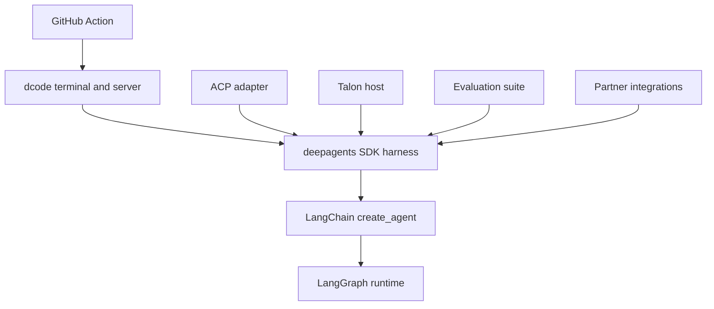

# Source Map and Change Routing

Start at the user-visible contract—an SDK import, command, ACP operation, Action input, or package release—and follow it to the component that assembles or owns that behavior. This page is a practical routing guide, not a directory inventory. For component detail, see the [overview](/openwiki/architecture/overview.md), [code-agent map](/openwiki/architecture/code-agent.md), [runtime behavior](/openwiki/architecture/runtime-behavior.md), [development guide](/openwiki/operations/development.md), [quickstart](/openwiki/quickstart.md), and [testing guide](/openwiki/testing/testing-guide.md).

## First choose the ownership boundary

`libs/` is a monorepo of independently versioned packages. Each package owns its `pyproject.toml`, `Makefile`, README, and tests; there is no root `pyproject.toml`. Work from the package being changed, use its `make help` and focused test target, and cross into another package only when changing a public contract. The release manifest currently tracks `deepagents` 0.7.15, ACP 0.0.11, dcode 0.1.71, Talon 0.0.8, and the listed partner packages; it does not list `evals`.

This shows dependency and responsibility direction: general agent policy belongs in the SDK; terminal presentation, protocol translation, host lifecycle, evaluation, vendor behavior, and workflow orchestration belong to their consuming surfaces.

## Change-routing table

| Change the observable behavior of… | Own it here | Trace this seam and preserve this invariant | Focused regression coverage |
| --- | --- | --- | --- |
| Agent defaults, tools, backends, prompts, state, subagents, middleware, or checkpoint wiring | `libs/deepagents`; `create_deep_agent()` | `deepagents/graph.py` is the assembly point before LangChain `create_agent()`. Deep Agents is the harness, LangChain owns the generic loop, and LangGraph owns state, checkpoints, streaming, and interrupts. | Start at `libs/deepagents/tests/unit_tests/test_graph.py`, then use the nearest backend, middleware, profile, or subagent test. |
| A supported SDK import or profile extension | `libs/deepagents`; `deepagents/__init__.py` and `deepagents.profiles` | Keep the root import surface deliberate. Put model-construction differences in provider profiles and prompt/tool/middleware/subagent differences in harness profiles; registrations merge with prior registrations for the same provider or `provider:model` key. | Test the public import or registration outcome and the selected profile behavior. |
| dcode command parsing, terminal UI, startup, or shutdown | `libs/code`; `dcode` / `deepagents-code` and `deepagents_code:cli_main` | Both console scripts resolve `cli_main` lazily. Keep presentation and input in the terminal client; follow the client-to-agent-server streaming boundary before changing graph behavior. | Use the closest unit test under `libs/code/tests/unit_tests/`; select command/client tests for CLI behavior. |
| dcode graph composition, server config, MCP, sandbox, extension, or offload behavior | `libs/code`; `ServerConfig` and `server_graph.py` | The CLI serializes config with `ServerConfig.to_env()` and the server reconstructs it with `from_env()`. `make_graph()` requires a thread ID and validated workspace context when executing in a LangGraph server. Do not bypass binding, policy/fingerprint drift checks, or the process-wide sandbox restriction. | Start with `tests/unit_tests/test_server_config.py` and `tests/unit_tests/test_server_graph.py`; add the closest MCP, sandbox, extension, or offload test. |
| Editor-facing ACP session creation, prompt streaming, model/mode options, approvals, or durable loading | `libs/acp`; `AgentServerACP` | This is a protocol adapter around a compiled graph or graph factory, not a second SDK policy layer. Durable `session/load` is explicitly enabled and must retain the checkpointer, persisted ACP marker, original working directory, and replay behavior. | Start with `libs/acp/tests/test_agent.py`; use `test_model_switching.py`, `test_command_allowlist.py`, or `test_dangerous_patterns.py` for those contracts. |
| Long-running channels, cron, local persistence, MCP lifecycle, or Talon commands | `libs/talon`; `deepagents-talon`, `__main__.py`, and `runtime.py` | The CLI owns config, cron storage, channel selection, and host lifecycle. The runtime owns Talon-specific agent composition and execution policy. Talon is experimental and is not a production isolation or multi-tenant boundary. | Start with `tests/test_main.py`, `tests/test_runtime.py`, `tests/test_host.py`, or `tests/test_data_lifecycle.py`; use channel, cron, MCP, or history tests for the affected edge. |
| Measured end-to-end agent quality or generated eval metadata | `libs/evals`; `deepagents-evals` | The eval CLI owns trial runs, aggregation, charts, catalog/model-group generation, and discovery. First fix and deterministically test the owning runtime package; add eval coverage when trajectory under a real model is the contract. | Run the applicable eval/report workflow and interpret its exit code. `evals` is not release-please managed. |
| A vendor backend or sandbox integration | `libs/partners/<partner>` plus repository wiring | Keep vendor mechanics in the partner package. A new partner also needs release, CI/change detection, labels/scopes, secrets, and applicable Harbor/integration wiring. | Run the partner package tests and relevant sandbox integration workflow. |
| Headless dcode GitHub automation | repository-root `action.yml` | Treat Action inputs, their validation, CLI flags, outputs, and memory cache scope as a public workflow API. The action installs dcode separately, so an Action option may require a compatible CLI version. | Exercise the relevant workflow scenario, including invalid input or cache-scope behavior when changing validation. |

## SDK assembly: put generic agent behavior in `graph.py`

`deepagents/__init__.py` is the supported import boundary. It re-exports `create_deep_agent`, `DeepAgentState`, key middleware and subagent types, and profile registration helpers. `create_deep_agent()` resolves the model and applicable profiles, backend, main middleware, default and supplied subagents, and composed system prompt before delegating to LangChain.

Profiles split two otherwise easy-to-confuse responsibilities. A **provider profile** controls chat-model construction, including `init_chat_model` arguments and pre-initialization effects. A **harness profile** shapes the built agent: prompt assembly, tool visibility, middleware, and default subagent behavior. Re-registering either profile kind augments the existing registration rather than replacing it.

Do not solve a required-capability problem by excluding its middleware: `FilesystemMiddleware` and `SubAgentMiddleware` are required because they respectively back built-in file tools and permissions, and the `task` tool. Excluding either is rejected with `ValueError`. When a behavior occurs only in delegated work, also inspect the subagent stack: declarative, compiled, and async subagents need not share the main-agent stack.

## dcode: respect process, resource, and workspace lifecycles

dcode is a prebuilt terminal coding agent built on the SDK. It has a terminal client and agent-server process connected by streaming. Its two console-script names, `dcode` and `deepagents-code`, target the lazy `deepagents_code:cli_main` entrypoint, so importing a normal package submodule does not load terminal startup machinery.

The server runtime cache is a correctness constraint, not a speed optimization. The interactive graph and offload operation share one agent, backend, and offload policy because reconstructing them would repeat MCP discovery, leak sandbox sessions, and stack duplicate process-exit handlers. MCP sessions are managed process-wide on the server event loop; sandbox construction/startup failures are emitted as a machine-readable startup error for the parent process.

Workspace execution is a separate security and correctness boundary. On every bound request, the server resolves the current workspace policy and rejects project-policy or configuration-fingerprint drift. When the request is for another project, `ServerConfig.resolve_workspace()` drops the launch project's MCP and sandbox setup rather than applying trusted-project configuration to another checkout. One configured process-wide sandbox can be claimed only by its first workspace.

## ACP: translation boundary and persistence condition

`AgentServerACP` adapts a compiled Deep Agent or an agent factory to ACP. It maintains per-session working directory, MCP settings, modes, models, command allowances, plans, and cancellation state; it converts ACP content to LangChain content and graph events back to ACP updates. Mode or model changes reset the session agent so the factory can apply the changed options.

The adapter advertises loading only when `load_sessions=True`. A load obtains the checkpointed graph thread, verifies that ACP metadata identifies it as a persisted ACP session and that the caller supplied its original working directory, restores options as appropriate, then replays conversation updates. `python -m deepagents_acp` is a test-server entrypoint using `asyncio`; production code constructs `AgentServerACP` around an agent and serves it with ACP's `run_agent` API.

## Talon: host lifecycle and runtime policy

The `deepagents-talon` distribution (version 0.0.8) installs `deepagents-talon`, targeting `deepagents_talon.__main__:main`. Its package root exposes host, configuration, cron, interface, and speech types and lazy-loads `DeepAgentRuntime` / `EchoAgentRuntime`.

The normal CLI path reads `TalonConfig`, creates persistent cron storage, ensures the home directory, cleans sensitive state, selects WhatsApp, Telegram, and Discord channels, and runs the host. `import-fleet` and `mcp` are management paths and return before host startup. With no model, the host deliberately uses `EchoAgentRuntime`, which is useful for lifecycle and channel wiring. With a model, the path accepts a supplied checkpointer or opens SQLite checkpoints and history, wraps persistence in `ConversationSaver`, loads MCP tools, and creates `DeepAgentRuntime`. A persistent scheduler is attached only if channels exist; `--once` starts then stops the host, otherwise it runs until stopped.

`DeepAgentRuntime` is the Talon-specific SDK consumer: it calls `create_deep_agent()` with Talon's local shell backend, runtime tools, assistant materials, subagents, cron facilities, persistence, and approval/retry policy. Keep Talon's stated security posture explicit: it lacks production-grade complete approval policy, channel administrator controls, sandbox-backed execution isolation, and multi-tenant boundaries. Channel access should therefore be treated as direct access to the operator's local agent, credentials, tools, and host resources.

## Evals, partners, Action, and releases

`deepagents-evals` owns `run`, `trials`, `aggregate`, `radar`, `catalog`, `model-groups`, and `list`, with JSON and dry-run modes. It uses exit status 1 for evaluation failures, 2 for configuration/generation drift, and 3 when reports are unavailable—preserve those distinctions in automation.

Partner integrations are independently versioned. Adding a partner is a repository-level operation as well as a package implementation: release configuration and manifest, CI paths and jobs, issue/PR labels and scope validation, secrets, release notes, and sandbox-specific Harbor/integration configuration must agree.

The composite Deep Agents Code Action installs a selected or latest dcode version, optionally restores memory and installs repository skills, then runs headless dcode. Its public outputs are `response`, `exit_code`, and `cache_hit`. It validates numeric, boolean, and JSON-object inputs; rejects an empty prompt and `stdin: true` combined with `skill`; and maps unknown memory scope to a PR/ref cache key rather than a repository-wide key.

## Safe change sequence

1. Identify the public contract and its package/release boundary in the table.
2. Trace to the assembly or lifecycle owner, rather than implementing generic behavior in a consumer that merely exposes the symptom.
3. Preserve the governing invariant: SDK layer ownership and required middleware, dcode shared-runtime and workspace policy, ACP durable-session checks, Talon's security posture, or Action input/cache validation.
4. Add the smallest observable focused test in the owning package. Escalate to integration, eval, or workflow coverage only if the contract crosses that boundary.
5. From the owner package run its documented `make` target; use `make help` to confirm supported commands.
