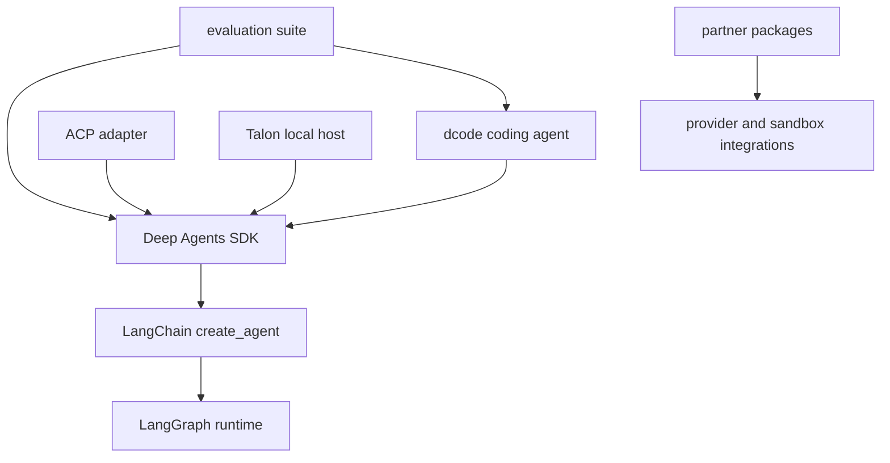

# Source Map

This is an ownership and change-entry navigator, not a directory inventory. Begin with [Architecture Overview](/openwiki/architecture/overview.md) for the system model, [Code Agent](/openwiki/architecture/code-agent.md) for dcode behavior, and the package README and Makefile for the package being changed.

## Start at the owning package

`libs/` is a monorepo of independently versioned packages. Each package owns its `pyproject.toml`, `Makefile`, README, and tests; there is no root `pyproject.toml`. Work and run `make help` in the affected package, using `libs/` fan-out targets only for repository-wide checks.

The primary package dependencies and the SDK runtime layers. Partner packages are separately owned integration boundaries rather than a single runtime layer.

Deep Agents owns the opinionated harness—defaults, middleware, backends, and profiles—over LangChain's `create_agent()`. LangChain owns the agent abstraction and loop; LangGraph owns graph execution, state, checkpoints, streaming, and interrupts. Establish that layer before changing behavior: a harness policy belongs in `libs/deepagents`, while runtime semantics do not.

## SDK: supported surface and assembly

**Consumer seam — `libs/deepagents/deepagents/__init__.py`.** The package root re-exports `create_deep_agent`, `DeepAgentState`, filesystem, memory, rubric, and subagent middleware types, plus provider and harness profile registration helpers. Treat these imports as the supported public surface; internal-module imports are an intentional compatibility commitment only when exported here.

**Assembly owner — `graph.py:create_deep_agent()`.** This is the construction seam for model, extra tools, system prompt, middleware, subagents, skills, memory, filesystem permissions, backend, interrupts, schema, checkpointing, store, and runtime options. It resolves the model/profile/backend, builds the middleware and subagent stack, composes the prompt, and delegates to LangChain `create_agent()`. Extra `tools=` are additive. Core `FilesystemMiddleware` and `SubAgentMiddleware` cannot be excluded by a harness profile: exclusion raises `ValueError`, protecting the file-tool and `task` capabilities they implement.

**Extension boundary — profiles.** Provider profiles affect model construction and pre-initialization effects. Harness profiles affect the runtime-facing harness: prompt assembly, tool visibility, middleware, and default subagent behavior. Use a profile for model/provider adaptation, rather than branching an application agent; use middleware or a backend when the behavior must participate in a model request, tool execution, or graph state.

**Tests.** Start with the smallest SDK unit test covering the assembly, middleware, backend, or profile seam. Escalate to an integration test only for model- or service-dependent behavior. [Build a Deep Agent](/openwiki/workflows/build-a-deep-agent.md) describes the consumer entrypoint.

## dcode: client/server and server-graph ownership

`deepagents-code` is the prebuilt terminal coding agent over the SDK. Its terminal client owns presentation and input; the agent server owns graph execution, tools, model setup, memory, and checkpoints, joined by a streaming protocol. Change the side that owns the state or behavior rather than duplicating it across the boundary.

**Public command seam.** `deepagents_code.__init__` exposes `cli_main` lazily, avoiding `main.py` startup machinery when consumers import other submodules. `agent.py` is the coding-agent assembly module and imports `create_deep_agent` from the SDK.

**LangGraph server seam — `server_graph.py:make_graph()`.** This async factory is referenced by generated `langgraph.json`. It reads `ServerConfig.from_env()`, the schema that the CLI writes with `ServerConfig.to_env()`. For an execution runtime, it requires both a nonempty thread ID and workspace context, resolves the thread's workspace binding, and selects a workspace runtime; without execution context it returns the process server runtime.

**Lifecycle and failure boundary.** Runtime construction is cached because MCP discovery, sandbox creation, and exit cleanup must occur once, and the graph and server-side offload operation must share the same agent, backend, and compaction policy. Built-in and configured MCP tools are loaded asynchronously; runtime sessions are lazily bound to the server event loop through a process-wide session manager. Workspace runtimes are bounded to 32 cached entries, reject a changed workspace configuration, and permit a process-wide sandbox for only one workspace. Startup/configuration failures emit the machine-readable startup marker and exit; configured sandbox construction reports a machine-readable error before exit.

**Tests.** Begin with `libs/code/tests/unit_tests/test_server_graph.py` for graph factory, caching, workspace, MCP, or startup behavior. Add a client/server regression only when behavior crosses the streaming boundary. See [Run a dcode session](/openwiki/workflows/run-dcode-session.md).

## ACP: protocol adapter, not dcode

`AgentServerACP` in `libs/acp/deepagents_acp/server.py` adapts a compiled Deep Agent—or a session-context agent factory—to the Agent Client Protocol. It owns ACP capability negotiation, session state, mode/model configuration, client updates, and ACP-supplied MCP configuration. It advertises `session/load` only when `load_sessions=True`; a load restores the checkpointed thread, rejects an unknown session or a mismatched working directory, restores saved options, and replays the conversation before replying. Durable cross-restart load therefore depends on the supplied graph's checkpointer.

`python -m deepagents_acp` runs the test ACP server with `asyncio`. A production adapter constructs an agent and serves `AgentServerACP` through ACP's `run_agent` API. `dcode --acp` is instead the prebuilt coding-agent integration; do not move a general protocol adapter concern into dcode. Use ACP protocol tests at this adapter boundary.

## Evaluations: separate behavioral validation

`libs/evals` packages the `deepagents-evals` CLI and Harbor integration. Its declared local development sources link it to both `../deepagents` and `../code`, while its runtime dependencies include Deep Agents, dcode, Harbor/LangSmith, sandbox runtimes, and model providers. This is the change entrypoint for end-to-end evaluation and benchmark infrastructure, rather than ordinary package-unit behavior. Use the package's evaluation workflow and credentials requirements when validating externally dependent behavior.

## Talon: local-host composition and operational boundary

Talon is an experimental local host for long-running Deep Agents. The CLI composition root is `deepagents_talon.__main__:main`: it loads `TalonConfig`, handles `import-fleet` and MCP-management commands, initializes persistent cron storage and state cleanup for host execution, selects enabled WhatsApp, Telegram, and Discord adapters, and starts the host. `_run_host` uses an `AsyncSqliteSaver` checkpoint database unless a checkpointer is injected; `_agent_runtime` selects `EchoAgentRuntime` without a configured model, otherwise loads MCP tools and builds `DeepAgentRuntime`. When channels are attached, the host receives a persistent scheduler that calls `host.run_scheduled_job`; `--once` starts then stops the host, otherwise it runs until stopped.

Talon is alpha, not a production or enterprise security boundary. It explicitly lacks complete HITL policy, channel administrator controls, sandbox-backed execution isolation, and multi-tenant isolation; channel access must be treated as access to the operator's agent, credentials, MCP tools, and local resources. Test host lifecycle, runtime, channel, and scheduler changes at their owning boundary. See [Talon integration](/openwiki/integrations/talon.md).

## Partner packages: vendor code plus repository wiring

Keep vendor-specific provider or sandbox behavior in its independently versioned package under `libs/partners`. A new partner requires more than package code and tests: release configuration, CI/change detection, scope and label wiring, secrets, and—when sandbox-backed—Harbor and integration-test workflow updates. `libs/partners/AGENTS.md` is the required repository-wiring checklist.

## Focused change checklist

1. Find the public import, CLI command, or server factory, then follow it to its assembly owner.
2. Preserve boundaries: SDK owns harness policy; dcode owns its client/server implementation; ACP translates protocol; Talon owns local host lifecycle; evals own end-to-end measurement; partners own vendor integration.
3. Start with the focused owning-package test; cross protocol, streaming, or external-service boundaries only when the changed behavior crosses them.
4. Use the package-local README, `pyproject.toml`, and Makefile for supported configuration and commands.
