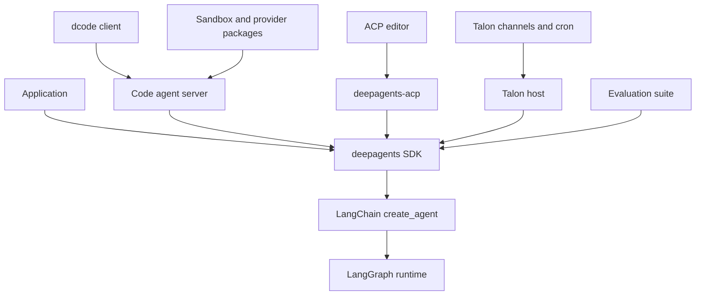
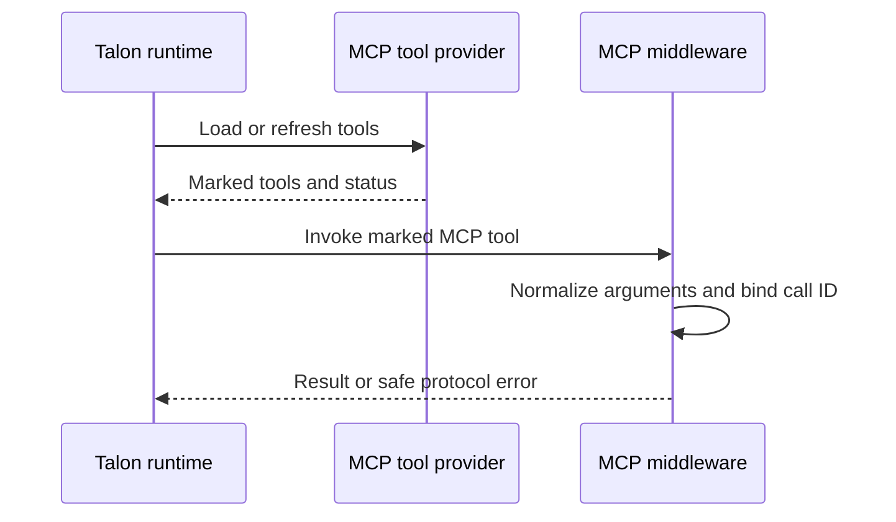

# Repository Source Map

Use this page to choose the owning boundary before changing behavior. The repository is a monorepo of independently versioned packages: the SDK owns reusable agent-harness composition, while Code, ACP, Talon, evaluations, and partners own their product or integration concerns. For the architectural rationale, see the [overview](./overview.md); for package-local commands and release operations, see [Development, CI, and Releases](../operations/development.md).

## Package and dependency boundaries

This shows dependency direction and the boundary at which a behavior should normally be changed.

`deepagents` is an opinionated harness over LangChain's `create_agent()` and LangGraph; it does not replace the LangGraph runtime. Start reusable graph-construction work in `libs/deepagents/deepagents/graph.py` at `create_deep_agent()`: it accepts the model, tools, middleware, subagents, backend, permissions, persistence, and response configuration, then assembles the agent. Built-in filesystem, shell, and delegation tools are part of that surface; the `execute` tool only succeeds when the chosen backend is sandbox-capable.

The consuming packages deliberately retain their distinct responsibilities:

| Surface or change | Owner and first seam | Focused validation |
| --- | --- | --- |
| Reusable model/profile behavior, prompts, middleware ordering, backends, SDK subagents, permissions, or graph/checkpointer options | **SDK** — `libs/deepagents/deepagents/graph.py` and the appropriate `middleware/`, `backends/`, or `profiles/` module. | `libs/deepagents/tests/`, beginning with graph and feature-specific tests. |
| Terminal commands, TUI rendering, headless interaction, Code-only approval/configuration, client/server execution, sandbox selection, extensions, or skills | **Deep Agents Code** — `libs/code/deepagents_code/`; console scripts enter through `deepagents_code:cli_main`. Follow from `main.py` into `agent.py`, `server_graph.py`, `tui/`, or the relevant product subsystem. | `libs/code/tests/unit_tests/`, including the focused CLI, server, TUI, MCP, or sandbox test. |
| Editor protocol conversion, ACP sessions/options, graph-event streaming, session loading, or replay | **ACP** — `libs/acp/deepagents_acp/server.py`, centered on `AgentServerACP`. | `libs/acp/tests/`, especially agent/session, model-switching, and command-policy coverage. |
| Long-running local channels, cron, host lifecycle, conversation persistence, approval UX, Talon MCP lifecycle, or Talon delegation | **Talon** — `libs/talon/deepagents_talon/__main__.py`, `host.py`, `runtime.py`, and the focused `mcp*.py`, `subagents.py`, `background.py`, or `cron/` module. | `libs/talon/tests/`, selecting host, runtime, MCP, authorization, background, cron, or subagent tests. |
| Benchmark trajectories, reports, catalog/model groups, or Harbor evaluation integration | **Evals** — `libs/evals/`; product behavior still needs an owning-package regression test. | `libs/evals/tests/` plus the affected package test. |
| Provider-specific sandbox or JavaScript REPL mechanics | **Partner package** — `libs/partners/<provider>/`. QuickJS, for example, ships `langchain-quickjs`, a JavaScript REPL middleware for Deep Agents. | That partner's tests and required integration workflow. |
| Headless GitHub Action inputs, cache, outputs, and orchestration | **Repository Action** — `action.yml`, consuming dcode rather than becoming SDK policy. | Action/workflow scenario plus compatible Code behavior. |

## Release-unit navigation

The release manifest records nine managed release baselines. These are release units—not merely directories—and their distribution/component names determine release PR and tag navigation.

| Path | Distribution and component | Manifest baseline |
| --- | --- | --- |
| `libs/deepagents` | `deepagents` / `deepagents` | `0.7.15` |
| `libs/acp` | `deepagents-acp` / `deepagents-acp` | `0.0.12` |
| `libs/code` | `deepagents-code` / `deepagents-code` | `0.1.72` |
| `libs/talon` | `deepagents-talon` / `deepagents-talon` | `0.0.8` |
| `libs/partners/daytona` | `langchain-daytona` / `langchain-daytona` | `0.0.8` |
| `libs/partners/modal` | `langchain-modal` / `langchain-modal` | `0.0.6` |
| `libs/partners/runloop` | `langchain-runloop` / `langchain-runloop` | `0.0.7` |
| `libs/partners/vercel` | `langchain-vercel-sandbox` / `langchain-vercel-sandbox` | `0.0.2` |
| `libs/partners/quickjs` | `langchain-quickjs` / `langchain-quickjs` | `0.3.7` |

Release Please creates separate draft Python-package release PRs. Each configured unit supplies its changelog and version-bearing files, and package test paths are excluded from release analysis; tags include the component, use `==` as the separator, and have no `v` prefix. `libs/evals` is a package in the monorepo but is not a manifest release unit.

Do not infer compatibility from the manifest alone. The source package metadata is the install contract: Code currently declares `deepagents==0.7.15`, while Talon accepts `deepagents>=0.7.0` and uses `deepagents-code>=0.1.71,<1.0.0`; QuickJS accepts `deepagents>=0.7.0,<0.8.0`. When Code needs an SDK capability, update and validate its exact SDK pin with the consuming release change.

## Entrypoints and lifecycle seams

**Code.** `deepagents-code` and `dcode` both resolve to `deepagents_code:cli_main`, so command parsing and terminal behavior belong to Code. Its package has a client/server architecture and depends on the SDK, ACP, and partner integrations; avoid moving terminal interaction or product-specific runtime policy into the generic SDK.

**ACP.** `deepagents-acp` is the editor-facing adapter. Keep ACP session identity, working-directory/options policy, event translation, and replay in ACP, using a graph factory rather than SDK-global state when session context changes graph construction.

**Talon.** `deepagents-talon` enters at `deepagents_talon.__main__:main` and is explicitly an experimental local runtime host. Keep channel, scheduler, local persistence, operator-mediated authorization, MCP configuration, and local/background delegation there. Consult the [Talon integration guide](../integrations/talon.md) before changing host lifecycle or security-sensitive behavior, and the [sandbox partners guide](../integrations/sandbox-partners.md) for vendor execution boundaries.

### dcode debug logging

dcode debug logging is opt-in and per-thread: configured loggers attach a tagged file handler only after the debug directory and file are secured, and rebinding a thread replaces stale tagged handlers rather than stacking them.

dcode refuses unsafe debug-log destinations: POSIX debug directories must be current-user-owned real directories and files are opened without following symlinks and tightened to owner-only access; on hardening failure it removes debug handlers and warns rather than continuing to log.

### Talon MCP and subagent seams

Talon's MCP provider loads each available server independently, prefixes and metadata-marks its tools, adds management capabilities, rejects tool-name conflicts, and serializes revision-gated refreshes so a configuration change is applied before a later agent turn.

This is the Talon-owned call path; ordinary tools bypass the MCP middleware.

Talon's MCP middleware only wraps metadata-marked MCP tools, normalizes empty optional string arguments, scopes authorization to the exact tool-call ID, and converts MCP protocol errors to a safe ToolMessage while allowing other exceptions to propagate.

Talon local subagents run as fresh graphs with selected tools, Talon MCP middleware, applicable approval middleware, and no checkpointer; unsupported fork mode is rejected, while malformed async-subagent configuration fails closed rather than silently omitting definitions.

## Safe change sequence

1. Identify the user-visible contract in the table and enter its package rather than treating `libs/` as one Python project.
2. Trace to the component that assembles or owns the lifecycle; preserve the SDK-versus-consumer responsibility boundary.
3. Check the release table and the package's `pyproject.toml` before altering dependency pins or release-facing files.
4. Add the smallest observable test at the owning package, escalating to integration, UI, workflow, or evaluation coverage only when the contract crosses that boundary.
5. Run the package-local target documented by `make help`; use the development guide for aggregate lock or release validation.
