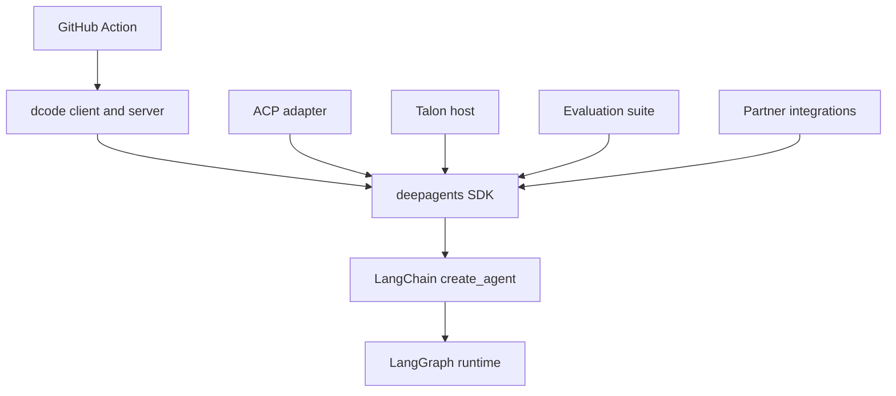

# Source Map and Ownership Boundaries

Start from the user-facing contract—an SDK import, command, ACP operation, Action input, or release package—and follow it to the component that assembles or owns its lifecycle. This page complements the [architecture overview](/openwiki/architecture/overview.md), [development guide](/openwiki/operations/development.md), [quickstart](/openwiki/quickstart.md), and [testing guide](/openwiki/testing/testing-guide.md).

## How ownership is divided

`libs/` is a monorepo of independently versioned packages. Work from the package being changed: it owns its `pyproject.toml`, `Makefile`, README, Python range, and tests; sibling dependencies are editable locally. Use `make help` in that package and start with its network-free focused test before escalating to an integration test. The SDK, ACP, dcode, Talon, and the listed partner packages are separate release-please units; `deepagents-evals` is a package but is not listed in the release manifest.

Review ownership is narrower than product ownership. `.github/CODEOWNERS` requests review for `libs/sdk/`, `libs/talon/`, and `libs/partners/` (with an additional QuickJS owner), plus `.github/`; absence from that file does not make another package ownerless or exempt it from its own tests and release wiring.

This diagram shows dependency and responsibility direction: generic harness policy belongs in the SDK; terminal presentation, ACP translation, host lifecycle, evaluation, vendor integration, and CI orchestration belong to the consuming surface.

## Change-routing map

| Change starts at | Owning public surface and implementation seam | Start validation and release boundary |
| --- | --- | --- |
| Agent defaults, tools, backend, prompt, subagents, middleware, or durable graph behavior | **SDK**: `deepagents` and `create_deep_agent()`; trace to `libs/deepagents/deepagents/graph.py`. Put model construction differences in provider profiles and post-model agent shaping in harness profiles. | `libs/deepagents/tests/unit_tests/test_graph.py`, then the closest middleware, backend, or profile test. `libs/deepagents` is release-managed. |
| A supported SDK import or type | **SDK**: `libs/deepagents/deepagents/__init__.py` is the import boundary. Follow the export to its implementation; do not make a consumer package the canonical API owner. | Test the observable import/signature contract. SDK release boundary applies. |
| Terminal startup, flags, TUI/headless input, rendering, or client interaction | **dcode**: `dcode`, `deepagents-code`, and `python -m deepagents_code` all reach `deepagents_code:cli_main`. Client owns presentation and input. | Closest test in `libs/code/tests/unit_tests/`, especially `test_main.py`, `test_args.py`, `test_non_interactive.py`, or UI/client tests. `libs/code` is release-managed. |
| dcode agent composition, server config, MCP startup, sandboxing, offload, or workspace binding | **dcode server**: follow `ServerConfig.to_env()`/`from_env()` into `server_graph.py:make_graph()` and its runtime factory. Server owns the agent, backend, tools, memory, and server lifecycle. | `test_server_config.py`, `test_server_graph.py`, and the relevant MCP/sandbox/offload test. Preserve workspace validation and shared-runtime lifecycle constraints. dcode release boundary applies. |
| Editor protocol session, streamed update, model/mode switch, or ACP persistence | **ACP**: `AgentServerACP` in `libs/acp/deepagents_acp/server.py` translates ACP to a compiled Deep Agent and back. | `libs/acp/tests/test_agent.py`, `test_main.py`, or the targeted allowlist, dangerous-pattern, or model-switching test. `libs/acp` is release-managed. |
| Channel, cron, host persistence, MCP management, or Talon command lifecycle | **Talon**: `deepagents-talon` invokes `deepagents_talon.__main__:main`; the CLI composes config, state, channels, runtime, and `TalonHost`. | `libs/talon/tests/test_main.py`, `test_host.py`, `test_runtime.py`, `test_data_lifecycle.py`, or channel/cron/MCP tests. `libs/talon` is release-managed. |
| End-to-end behavioral measurement, reports, catalog/model groups, or charts | **Evals**: `deepagents-evals` invokes `deepagents_evals.cli:main`. Add deterministic coverage to the behavior owner first; use evals when the evaluated trajectory is itself the contract. | `libs/evals/tests/unit_tests/test_cli.py` and the relevant eval/unit test. No release-please entry currently exists for evals. |
| Vendor sandbox or provider integration | **Partner package**: keep vendor mechanics under `libs/partners/<partner>`, rather than in the SDK or dcode. | Package unit/integration tests plus repository CI, secrets, labels, change detection, and release wiring. Listed partners are release-managed. |
| Workflow automation around headless coding | **Repository Action**: `action.yml` maps Action inputs to dcode execution and owns cache/output behavior. | Test the changed input validation and workflow scenario; account for the separately installed dcode version and its flag compatibility. |
| A documented implementation pattern or deployable use case | **Examples**: select the focused project under `examples/` rather than changing an example to alter product behavior. Examples own their setup and should pin a compatible `deepagents` range; reusable/non-trivial helpers need tests. | Use the example's README and its own test setup. Examples are not release-please units. |

## SDK: assembly and extension boundaries

The package root re-exports `create_deep_agent`, `DeepAgentState`, middleware and subagent types, and profile registration helpers. `create_deep_agent()` is the assembly point: it resolves the model and profiles, backend, main middleware, default and caller subagents, and system prompt, then calls LangChain's `create_agent()`.

Route a problem by layer: Deep Agents is the opinionated harness; LangChain owns the generic model/tool/middleware loop; LangGraph owns graph state, checkpoints, streaming, and interrupts. `create_deep_agent()` supplies filesystem, shell, and delegation tools by default; shell execution returns an error when the selected backend is not sandbox-capable. This makes backend capability, rather than merely tool visibility, the decisive seam for execution failures.

Profiles are beta extension points with separate responsibilities. Provider profiles configure model creation, including initialization kwargs and pre-initialization effects. Harness profiles shape the agent after model construction: prompt assembly, visible tools, middleware, and default subagents. Both registries merge a repeated `provider` or `provider:model` registration with the earlier entry, so extensions must be assessed for merge interactions rather than assumed to replace defaults.

## dcode: entrypoints, process boundary, and server invariants

`deepagents-code` is a prebuilt coding-agent product built on the SDK. Its terminal client and agent server are separate processes joined by a streaming protocol: the client owns presentation and approvals/input; the server owns the graph, model, tools, memory, skills, and backend. Both console script names target the lazily resolved `deepagents_code:cli_main`; `python -m deepagents_code` calls that same entrypoint. The lazy package attribute avoids pulling terminal startup machinery into ordinary submodule imports and converts an invalid Deep Agents home into a user-facing exit 2.

The server configuration crosses the process boundary through `ServerConfig.to_env()` in the CLI side and `ServerConfig.from_env()` in the server. When an execution runtime supplies context, `make_graph()` requires both a non-empty thread ID and validated workspace binding. It re-resolves policy and rejects project-policy or configuration-fingerprint drift. A different project deliberately drops the launch project's MCP, sandbox setup, extension paths, and related trust instead of applying trusted settings to another checkout.

The runtime factory is intentionally shared and cached: the interactive graph and offload operation must use the same agent, backend, and compaction policy. Reconstructing it per request would repeat MCP discovery, leak sandbox sessions, and register duplicate exit handlers. MCP discovery is asynchronous; its process-wide session manager is bound to the server event loop. Startup construction failures emit the machine-readable marker consumed by the parent process; request-scoped offload callers must contain the resulting `SystemExit` and map it to service unavailability rather than terminate the server.

## ACP and Talon: lifecycle owners

`AgentServerACP` is an adapter rather than a second harness-policy layer. It tracks session working directories and options, converts ACP content to the compiled agent's content, and streams graph events and interrupts as ACP updates. Durable `session/load` is available only when enabled with `load_sessions=True` and backed by a checkpointer that survives process restarts. Loading verifies ACP metadata and the original working directory, restores applicable options, and replays the conversation. `python -m deepagents_acp` starts the test server with `asyncio`; production code constructs `AgentServerACP(agent)` and serves it through ACP's `run_agent` API.

Talon is an experimental local host, not a production security boundary. Its root exposes host, config, cron, channel/interface, and speech types while runtime classes load lazily. Its CLI returns early for `import-fleet` and `mcp` management; otherwise it loads config, creates persistent cron storage, ensures/cleans its home state, selects channels, and runs the host. With no model it selects `EchoAgentRuntime`; with a model it loads MCP tools and uses a supplied checkpointer or SQLite/history-backed `ConversationSaver`. A persistent scheduler exists only when channels exist; `--once` bootstraps then stops, otherwise the host runs until stopped. Talon lacks complete approval policy, administrator controls, sandbox isolation, and multi-tenant boundaries, so channel access must be treated as access to the operator's agent, credentials, tools, and local resources.

## Evals, partners, examples, and the Action

`deepagents-evals` centralizes single and repeated trials, aggregation, radar charts, catalog/model-group generation or drift checks, and discovery. Its JSON and dry-run modes support automation. Exit code 1 represents evaluation failure, 2 configuration or generated-file drift, and 3 absence of usable reports—preserve those distinctions for callers.

Partner code is independently versioned and must be integrated beyond its package: release configuration and manifest, CI/change detection, label scopes, secrets, release notes, and, where applicable, Harbor sandbox and integration-test matrix wiring all form the ownership boundary. Examples are intentionally focused demonstrations, including research, coding, content, deployable-service, and advanced-pattern projects; use them to locate a pattern, not as a substitute for tested package behavior.

The composite **Deep Agents Code** Action installs a requested (minimum `0.1.0`) or latest dcode, can restore agent memory and install a skills repository, then runs headless dcode. It publishes `response`, `exit_code`, and `cache_hit`. Its inputs are a workflow API: it validates numeric, boolean, and JSON-object values; rejects an empty prompt and `stdin` combined with `skill`; and falls back from an unknown memory scope to a PR/ref cache key rather than repo-wide sharing.

## Safe change sequence

1. Identify the contract in the table and its package/release boundary.
2. Trace to the assembly or lifecycle owner; do not relocate generic SDK policy into a consumer that merely exposes the symptom.
3. Preserve the governing invariant—SDK layer ownership, dcode workspace and runtime isolation, ACP durable-session checks, Talon's explicit security posture, or Action input validation.
4. Add the smallest observable test in the owning package. Escalate to integration, evaluation, example, or workflow coverage only when the altered contract crosses that boundary.
5. Run the package's documented `make` target; use `make help` inside it to discover supported commands.
