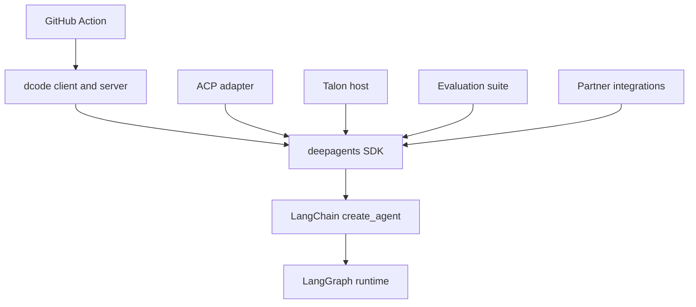

# Source Map and Change Routing

Start with the user-visible contract—an SDK import, command, protocol operation, Action input, or release package—then trace to the assembly or lifecycle owner. This page complements the [architecture overview](/openwiki/architecture/overview.md), [SDK construction and execution guide](/openwiki/architecture/sdk-construction-execution.md), [code-agent map](/openwiki/architecture/code-agent.md), [development guide](/openwiki/operations/development.md), and [testing guide](/openwiki/testing/testing-guide.md).

## Boundaries that determine ownership

`libs/` is a monorepo of independently versioned packages. Enter the package being changed, use its `Makefile` targets, and add the narrowest network-free test in its `tests/unit_tests/` directory when practical; cross package boundaries only where a public contract does. The release manifest separately tracks the SDK, ACP, dcode, Talon, and partner packages; `evals` is a package but is absent from that manifest.

This is the dependency and responsibility direction: generic agent policy belongs in the SDK, while terminal presentation, ACP translation, host lifecycle, evaluation, vendor integration, and CI orchestration belong to the consuming surface.

## Change-routing table

| Intended behavior change | Owning package and public surface | Follow the seam | Focused validation and release boundary |
| --- | --- | --- | --- |
| Build an agent; change default graph capabilities, tools, backends, prompts, subagents, or middleware | `libs/deepagents`; `deepagents` imports and `create_deep_agent()` | `deepagents/graph.py:create_deep_agent()` assembles the harness before delegating to LangChain. Put provider construction in provider profiles and runtime shaping in harness profiles. | Begin with `tests/unit_tests/test_graph.py`; use the closest middleware, backend, or profile test. SDK is independently release-managed. |
| Change the public SDK import contract | `libs/deepagents`; `deepagents/__init__.py` | Re-export only supported API, then trace the exported object to its implementation and existing uses. | Test the observable API and preserve signatures and keyword compatibility. SDK release boundary applies. |
| Change dcode invocation or terminal behavior | `libs/code`; `dcode` and `deepagents-code` commands | Both scripts lazily resolve `deepagents_code:cli_main`. Keep UI/input work on the client side and model, tools, memory, and graph startup on the server side. | Start with the closest unit test under `libs/code/tests/unit_tests/`; use client or command tests for presentation and parsing, and server tests for runtime behavior. dcode is independently release-managed. |
| Change dcode agent composition, server configuration, MCP startup, sandboxing, or offload | `libs/code`; server graph and server-config boundary | Follow `ServerConfig.to_env()`/`from_env()`, then `server_graph.py:make_graph()` and its cached runtime factory. Execution context must bind a thread to a workspace; workspace policy drift is rejected rather than applied to another checkout. | Use `test_server_config.py`, `test_server_graph.py`, and the closest MCP, sandbox, or offload test. Preserve shared runtime construction and startup-failure handling. |
| Change editor/protocol sessions, streamed updates, approval behavior, or ACP model/mode options | `libs/acp`; `AgentServerACP` | `deepagents_acp/server.py` translates ACP sessions and content to a compiled Deep Agent. Durable `session/load` is opt-in and validates the session's original working directory before replay. | Start with `libs/acp/tests/test_agent.py`; use command-allowlist, dangerous-pattern, model-switching, or module-entrypoint tests for those contracts. ACP is independently release-managed. |
| Change long-running local channels, cron, host persistence, MCP management, or Talon CLI lifecycle | `libs/talon`; `deepagents-talon` and `deepagents_talon` imports | `__main__.py` selects channels, runtime, persistence, and `TalonHost`; no model deliberately selects the echo runtime. Keep experimental-security limitations explicit rather than treating Talon as an isolation boundary. | Start with `test_main.py`, `test_host.py`, `test_runtime.py`, or `test_data_lifecycle.py`; use `channels/`, `cron/`, MCP, or history tests for that edge. Talon is independently release-managed. |
| Measure an end-to-end behavioral regression | `libs/evals`; `deepagents-evals` | The CLI owns trials, report aggregation, charts, discovery, and generated catalog/model-group checks. First add deterministic coverage to the owning runtime package; add eval coverage when real-model trajectory is the contract. | Run the appropriate eval command/report workflow. Do not assume an evals change is release-please managed. |
| Add or change a vendor backend/integration | `libs/partners/<partner>` | Keep vendor mechanics in the partner package and preserve its SDK contract. | Package tests are necessary but insufficient: update CI, release/change detection, labels, secrets, and applicable Harbor sandbox wiring. Each listed partner has its own release version. |
| Change GitHub workflow automation around dcode | repository-root `action.yml` | Treat Action inputs and outputs as the workflow contract; map each changed option to the invoked dcode flag and preserve validation before execution. | Exercise the relevant workflow scenario. The Action installs dcode separately, so account for CLI version/flag compatibility. |

## Core SDK: assembly, profiles, and exports

The `deepagents` root is the supported import boundary: it re-exports `create_deep_agent`, `DeepAgentState`, middleware classes, subagent types, and profile registration helpers. `create_deep_agent()` resolves model and profiles, backend, middleware, default and caller subagents, and prompt content before calling LangChain's `create_agent()`.

The layer boundary is important when routing a fix: Deep Agents is the opinionated harness, LangChain owns the generic agent loop, and LangGraph owns runtime state, checkpoints, streaming, and interrupts. Provider profiles affect model construction (including initialization arguments and pre-initialization effects); harness profiles affect the already-built agent's prompt, visible tools, middleware, and default subagent behavior. Registrations are additive, so a profile extension should be checked for its merge interaction rather than presumed to replace an earlier profile.

## dcode: process boundary and server invariants

dcode is a prebuilt terminal coding agent with a terminal client and an agent-server process connected by streaming. `deepagents_code:cli_main` is intentionally lazy so ordinary submodule imports do not load startup machinery. Use `agent.py` for dcode-specific graph composition, and use `server_graph.py` when the behavior is server-owned.

The server factory has two load-bearing protections:

- It caches the agent, backend, and offload operation shared by the interactive graph and offload routes. Rebuilding them per request would repeat MCP discovery, leak sandbox sessions, and install duplicate process-exit handlers.
- A request carrying execution context must provide a non-empty thread ID and a validated workspace binding. The server re-resolves project policy and rejects drift; when resolving a different project, it drops launch-project MCP and sandbox setup rather than reusing potentially untrusted policy.

MCP discovery is asynchronous on the server event loop. The process-wide MCP session manager is tied to that loop, and sandbox/runtime construction failures are surfaced with a machine-readable startup marker for the parent process. These are lifecycle constraints, not implementation details to bypass in a feature change.

## ACP: session translation and persistence condition

`AgentServerACP` is the protocol adapter, not a second SDK-policy layer. It accepts either a compiled graph or an agent factory, maintains session-specific working directories and options, turns ACP content into LangChain content, and streams graph events and interruptions back as ACP updates.

It advertises and implements `session/load` only when `load_sessions=True` and the graph's checkpointer survives restarts. On load, it confirms persisted ACP metadata and the original working directory, restores session options where applicable, and replays the saved conversation before responding. `python -m deepagents_acp` runs the test server via `asyncio`; a production adapter is built around an agent and served using ACP's `run_agent` API.

## Talon: lifecycle owner, not a security boundary

Talon's package root publishes host, configuration, channel, cron, interface, and speech types, while runtime classes are lazy-loaded. The installed command is `deepagents-talon`, not `talon`. Its main path loads configuration, initializes persistent cron state, ensures the home directory, cleans sensitive state, selects requested channels, and then runs the host. `import-fleet` and `mcp` management commands return before host startup.

For host startup, an unset model selects `EchoAgentRuntime`; otherwise Talon uses a supplied checkpointer or opens SQLite checkpoints and history, wraps persistence with `ConversationSaver`, loads MCP tools, and creates the deep-agent runtime. A persistent scheduler is installed only if channels exist, then `--once` bootstraps and stops or the host runs until stopped. Talon remains alpha and lacks production-grade approval, administrator, sandbox-isolation, and multi-tenant controls; channel access is effectively access to the operator's local agent and resources.

## Evals, partners, and the GitHub Action

`deepagents-evals` centralizes run, repeated-trial, aggregation, radar chart, catalog, model-group, and discovery operations. It provides JSON and dry-run modes and differentiates evaluation failures, configuration/drift errors, and no-report outcomes with exit codes. Use it for behavioral measurement, not as a substitute for focused deterministic regression coverage.

Partner packages are independently versioned. Adding one requires repository-wide operational wiring—release configuration, CI/change detection, label scopes, secrets, and, for sandbox-backed integrations, Harbor and integration-test configuration—in addition to package code and tests.

The composite **Deep Agents Code** Action installs a selected or latest dcode, optionally restores agent memory and clones repository skills, then runs headless dcode. Its outputs are `response`, `exit_code`, and `cache_hit`. It validates booleans, positive/non-negative numeric fields, and JSON-object options; rejects an empty prompt and `stdin: true` combined with `skill`; and falls back from an unknown memory scope to a PR/ref key instead of repo-wide sharing.

## Safe change sequence

1. Identify the public contract and its package/release boundary in the table.
2. Trace to the named assembly or lifecycle owner; do not move generic behavior into a consumer merely because it exposes the symptom.
3. Preserve the governing invariant: SDK layer ownership, dcode runtime/workspace isolation, ACP durable-session and working-directory checks, Talon's experimental-security posture, or Action input validation.
4. Add the smallest observable focused test in the owner package. Escalate to integration, eval, or workflow coverage only when the changed contract crosses that boundary.
5. Run the owning package's documented `make` target; use `make help` inside that package for its supported commands.
