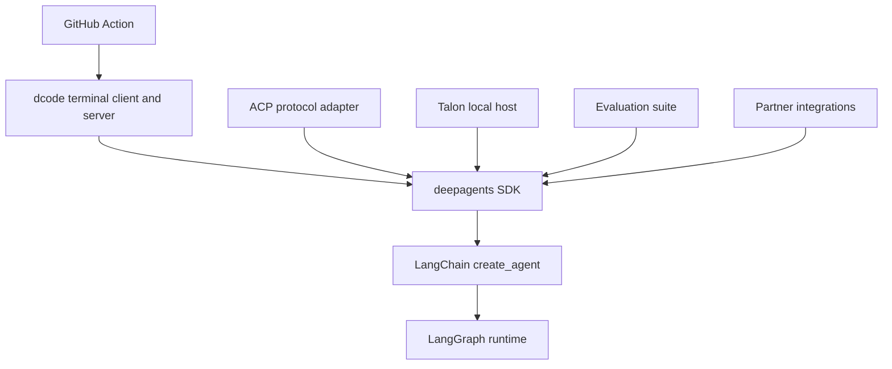

# Source Map and Public Surfaces

Use this page to identify the public surface first, then follow it to the assembly or lifecycle owner and its focused tests. It complements the [architecture overview](/openwiki/architecture/overview.md), [quickstart](/openwiki/quickstart.md), [development guide](/openwiki/operations/development.md), [testing guide](/openwiki/testing/testing-guide.md), and [GitHub Action guide](/openwiki/integrations/github-action.md).

## Package and release boundary

`libs/` is a monorepo of independently versioned packages. Each package has its own `pyproject.toml`, `Makefile`, and `README.md`; there is no root `pyproject.toml`. Work and run the narrow test from the owning package. Local sibling dependencies are editable, so cross into a dependent package only when a public contract crosses that package boundary.

The supported runtime domains are the core `deepagents` SDK, `deepagents-code` (`dcode`), `deepagents-acp`, `deepagents-evals`, and experimental `deepagents-talon`; partner packages supply vendor integrations. The release manifest independently tracks versions for the SDK, ACP, dcode, Talon, and each listed partner package. Evals is a package but is not present in that release manifest, so do not assume every package follows the same release path.

This shows the high-level consumer and runtime dependency direction. Put generic graph policy in the SDK; keep terminal presentation, protocol adaptation, host lifecycle, behavioral measurement, vendor behavior, and workflow orchestration in their respective consumers.

## SDK: supported imports and graph assembly

The `deepagents` package root is the supported import boundary. It re-exports `create_deep_agent`, `DeepAgentState`, middleware types for filesystem, memory, rubric, and subagents, plus provider and harness profile registration helpers. Add a symbol here only when it is a supported SDK API.

`deepagents/graph.py:create_deep_agent()` is the SDK assembly point. It resolves the model and profile, resolves the backend, assembles main-agent middleware, builds default and caller subagents, composes the prompt, and delegates to LangChain `create_agent()`. The layering matters: the harness is above LangChain's generic agent loop, which is above the LangGraph runtime. Start at the layer that owns the behavior rather than patching a consumer.

Provider profiles tune model construction, including `init_chat_model` arguments and pre-initialization effects. Harness profiles tune the runtime phase—prompt assembly, tool visibility, middleware, and default subagent behavior. That split is an extension boundary: changing provider setup should not silently change harness policy.

**Focused tests.** Start with `libs/deepagents/tests/unit_tests/test_graph.py` for construction and validation, `test_harness_profiles.py` for profile behavior, and the closest middleware or backend test for policy or persistence. Use integration tests only when a real model or external backend is part of the contract.

## dcode: terminal public surface and server-owned runtime

`deepagents-code` is the prebuilt terminal coding agent. Both `dcode` and `deepagents-code` console scripts target `deepagents_code:cli_main`; the package resolves that attribute lazily, avoiding terminal startup imports for ordinary package-submodule use. The terminal client owns presentation and input, while the agent server owns agent runtime resources and communicates through a streaming protocol.

`deepagents_code/agent.py:create_cli_agent()` is the dcode-specific SDK composition seam. `deepagents_code/server_graph.py:make_graph()` is the LangGraph server factory: with execution context it validates the thread/workspace binding before choosing a workspace runtime. Configuration crosses the CLI/server boundary through `ServerConfig.to_env()` and `ServerConfig.from_env()`.

The server runtime factory is deliberately cached. The interactive graph and offload operation routes share one agent, backend, and offload operation, avoiding repeated MCP discovery, sandbox session leaks, and duplicate process-exit handlers. MCP setup is asynchronous and tied to the server event loop; sandbox construction failure emits a machine-readable startup error.

**Focused tests.** Use `libs/code/tests/unit_tests/test_server_graph.py` for factory, MCP, and startup behavior; `test_server_config.py` for environment transfer; `test_agent.py` for dcode graph composition; and the closest `test_mcp_*.py`, `test_sandbox_*.py`, `test_offload_*.py`, or client test for the changed boundary.

## ACP: protocol adapter surface

`deepagents-acp` packages the Agent Client Protocol integration and depends on `deepagents`. `AgentServerACP` adapts a compiled Deep Agent to ACP; it is the owner for protocol messages, session behavior, and client updates rather than generic SDK policy.

Persistent session loading is conditional on a durable checkpointer. When enabled, loading restores the LangGraph thread, verifies the original working directory, and replays conversation updates to the client. `python -m deepagents_acp` runs the test ACP server via `asyncio`; production integration constructs an adapter around an agent and serves it with ACP's `run_agent` API.

**Focused tests.** Start in `libs/acp/tests/test_agent.py` for sessions and protocol updates. Use `test_command_allowlist.py` and `test_dangerous_patterns.py` for execution-safety changes, `test_model_switching.py` for options, and `test_main.py` for the module entrypoint.

## Talon: package API, command, and host lifecycle

`deepagents-talon` is an alpha, experimental local host for long-running channels and schedules. Its distribution installs exactly the `deepagents-talon` console command, targeting `deepagents_talon.__main__:main`; it does not install a `talon` command. The package root is also a public Python surface: it exports configuration, host, cron, channel and agent interface types, speech types, and version. `DeepAgentRuntime` and `EchoAgentRuntime` are lazily resolved from `runtime` when accessed.

The command parses `--once` and optional WhatsApp, Telegram, and Discord channel flags, then loads `TalonConfig`, creates persistent cron storage, ensures the assistant home, cleans sensitive state, selects channels, and runs the host. `import-fleet` and `mcp` are management commands that return before host startup; the MCP command provides `config` and OAuth `login` operations.

For a host run, no configured model selects `EchoAgentRuntime`; otherwise Talon accepts a supplied checkpointer or opens SQLite checkpoints and history, wraps them in `ConversationSaver`, and builds the deep-agent runtime. It attaches `PersistentCronScheduler` only when channels exist, then either starts and stops once or runs until stopped. This is the lifecycle owner for local persistence, channel delivery, scheduling, and cancellation.

Talon is not a production isolation boundary: it lacks complete HITL approval policy, channel administrator controls, sandbox-backed execution isolation, and multi-tenant boundaries. Treat channel access as access to the operator's agent, credentials, MCP tools, and local host resources.

**Focused tests.** Use `libs/talon/tests/test_main.py`, `test_host.py`, `test_runtime.py`, and `test_data_lifecycle.py` for the lifecycle. Use `tests/channels/`, `tests/cron/`, `test_mcp.py`, or the relevant history integration test when changing those edges.

## Evaluation and partner surfaces

`deepagents-evals` is the evaluation suite and Harbor integration. Its `deepagents-evals` command centralizes one-run and repeated-trial execution, aggregation, charts, catalog and model-group generation/checks, and discovery. It supports JSON and dry-run modes and uses separate exit codes for evaluation failures, configuration or drift errors, and missing reports. Treat evals as end-to-end behavioral measurement; first place deterministic regressions in the owning SDK or dcode package, then add a category eval when real-model trajectory or measurement is required.

Partner integrations are separately versioned packages. New or changed partner work includes repository wiring—not just package code and tests—including release, CI, change detection, secret, label, and applicable sandbox workflow updates.

## GitHub Action: workflow wrapper around dcode

The repository-root `action.yml` exposes a composite GitHub Action named **Deep Agents Code**. It installs `uv` and `deepagents-code` (latest by default or a requested version), optionally restores and saves agent memory through `actions/cache`, can clone a skills repository into `.deepagents/skills`, and invokes headless `dcode` with mapped model, MCP, sandbox, interpreter, rubric, streaming, and input options.

The Action validates boolean, JSON-object, and numeric inputs before launch; it rejects an empty prompt and the incompatible combination of `stdin: true` with `skill`. It returns the captured full response and agent exit code as outputs. Memory cache scope is `pr`, `branch`, or `repo`; an unknown scope falls back to the conservative PR/ref key rather than repo-wide sharing. Treat Action inputs as the stable workflow contract and change `action.yml` together with the dcode flags it maps.

## Safe change path

1. Start with the exposed import, console command, ACP method, Action input, or release package.
2. Follow it to the assembly or lifecycle owner above, preserving the SDK/consumer boundary.
3. Preserve invariants: dcode's shared server runtime, ACP durable-session and working-directory checks, Talon's explicit experimental security posture, and Action input validation.
4. Add the smallest focused regression in the owning package; cross into integration or workflow tests only for behavior that actually crosses that boundary.
5. Use the owning package's Make targets or documented commands.
