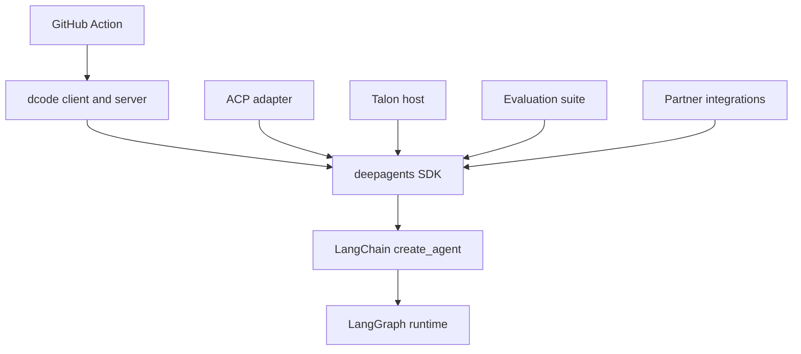
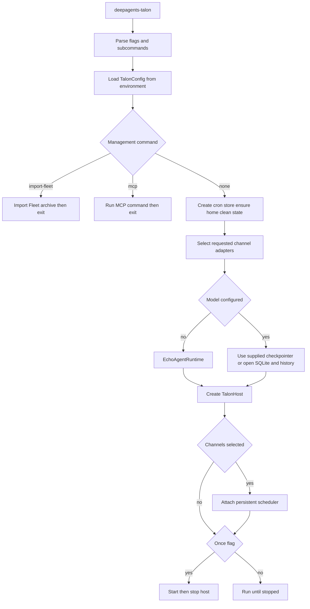

# Source Map and Change Routing

Start with the user-visible contract—an SDK import, command, protocol operation, Action input, or released distribution—then trace to the assembly or lifecycle owner. This page complements the [architecture overview](/openwiki/architecture/overview.md), [development guide](/openwiki/operations/development.md), [quickstart](/openwiki/quickstart.md), and [testing guide](/openwiki/testing/testing-guide.md).

## Boundaries that determine ownership

`libs/` is a monorepo of independently versioned packages. Work inside the package being changed: each package owns its `pyproject.toml`, `Makefile`, and README, while editable local dependencies make a sibling change visible during development. Use that package's `make help` and targets; use `libs/` fan-out targets only for repository-wide checks.

The diagram shows dependency and responsibility direction: generic agent policy belongs in the SDK, while terminal presentation, ACP translation, host lifecycle, evaluation, vendor integration, and CI orchestration belong to their consuming surfaces.

## Change-routing table

| Intended behavior change | Owning package and public surface | Follow the seam | Focused validation and release boundary |
| --- | --- | --- | --- |
| Build an agent; alter default graph capabilities, tools, backends, prompts, subagents, or middleware | `libs/deepagents`; `deepagents` imports and `create_deep_agent()` | `deepagents/graph.py:create_deep_agent()` is the assembly point before delegation to LangChain. Put model construction in provider profiles and runtime shaping in harness profiles. | Begin with `tests/unit_tests/test_graph.py`, then the closest middleware, backend, or profile test. The SDK is release-managed. |
| Change the public SDK import contract | `libs/deepagents`; `deepagents/__init__.py` | Re-export only supported API, then trace the exported object to its implementation and existing uses. | Test the observable API and preserve signatures and keyword compatibility. The SDK release boundary applies. |
| Change dcode invocation or terminal behavior | `libs/code`; `dcode` and `deepagents-code` commands | Both scripts lazily resolve `deepagents_code:cli_main`. Keep UI/input work in the client and model, tools, memory, and graph startup in the server. | Start with the closest unit test under `libs/code/tests/unit_tests/`; use command tests for parsing/presentation and server tests for runtime behavior. dcode is release-managed. |
| Change dcode graph composition, server configuration, MCP startup, sandboxing, or offload | `libs/code`; server graph and server-config boundary | Follow `ServerConfig.to_env()`/`from_env()`, then `server_graph.py:make_graph()` and its cached runtime factory. Execution context requires a thread and workspace binding; policy drift is rejected. | Use `test_server_config.py`, `test_server_graph.py`, and the closest MCP, sandbox, or offload test. Preserve shared runtime construction and startup-failure handling. |
| Change editor/protocol sessions, streamed updates, approval behavior, or ACP model/mode options | `libs/acp`; `AgentServerACP` | `deepagents_acp/server.py` translates ACP sessions and content to a compiled Deep Agent. Durable `session/load` is conditional and validates the original working directory before replay. | Start with `libs/acp/tests/test_agent.py`; use targeted command-allowlist, dangerous-pattern, model-switching, or module-entrypoint tests where applicable. ACP is release-managed. |
| Change long-running local channels, cron, host persistence, MCP management, or Talon CLI lifecycle | `libs/talon`; `deepagents-talon` and `deepagents_talon` imports | `__main__.py` selects management commands, config, cron storage, channel adapters, persistence, runtime, and `TalonHost`. No model deliberately selects the echo runtime. | Start with `tests/test_main.py`, `tests/test_host.py`, `tests/test_runtime.py`, or `tests/test_data_lifecycle.py`; use channel, cron, MCP, or history tests for the affected edge. Talon is release-managed. |
| Measure end-to-end behavioral regression | `libs/evals`; `deepagents-evals` | The CLI owns trials, report aggregation, charts, discovery, and generated catalog/model-group checks. First add deterministic coverage to the runtime owner; add eval coverage when a real-model trajectory is the contract. | Run the applicable eval/report command. `evals` is not listed in the release manifest. |
| Add or change a vendor backend/integration | `libs/partners/<partner>` | Keep vendor mechanics in the partner package and preserve its SDK contract. | Package tests are necessary but insufficient: update CI, release/change detection, labels, secrets, and applicable Harbor sandbox wiring. Listed partners are independently release-managed. |
| Change GitHub workflow automation around dcode | repository-root `action.yml` | Treat Action inputs and outputs as the workflow contract; map every changed input to its dcode flag and validate before execution. | Exercise the matching workflow scenario. The Action installs dcode separately, so account for CLI version/flag compatibility. |

## Core SDK: assembly, profiles, and exports

The `deepagents` package root is the supported import boundary. It re-exports `create_deep_agent`, `DeepAgentState`, middleware classes, subagent types, and profile registration helpers. `create_deep_agent()` resolves the model and profiles, backend, middleware, default and caller subagents, and prompt content before calling LangChain's `create_agent()`.

The layer boundary directs fixes: Deep Agents is the opinionated harness; LangChain owns the generic agent loop; LangGraph owns runtime state, checkpoints, streaming, and interrupts. Provider profiles control model construction—including `init_chat_model` arguments and pre-initialization effects—while harness profiles shape prompt assembly, visible tools, middleware, and default subagent behavior after the model is built. Registrations are additive, so test the merge interaction rather than assuming a later registration replaces the earlier one.

## dcode: process boundary and server invariants

`deepagents-code` is a prebuilt terminal coding agent comprising a terminal client and an agent-server process connected by streaming. The client owns presentation and input; the server owns the agent runtime. `deepagents_code:cli_main` is lazy so importing ordinary submodules does not also load CLI startup machinery. Use `agent.py` for dcode-specific graph composition and `server_graph.py` for server-owned behavior.

The server factory caches the agent, backend, and offload operation shared by the interactive graph and server operation routes. This is a lifecycle requirement: reconstruction would repeat MCP discovery, leak sandbox sessions, and register duplicate process-exit handlers. MCP discovery is asynchronous on the server event loop; its process-wide session manager is bound to that loop, and sandbox/runtime construction failures emit a machine-readable startup marker for the parent process.

For a request with execution context, `make_graph()` requires a non-empty thread ID and workspace context, validates the thread binding, then obtains the workspace runtime. The server re-resolves project policy on requests and refuses a changed policy or configuration fingerprint. When resolving a different project, `ServerConfig.resolve_workspace()` drops launch-project MCP and sandbox setup instead of transferring a possibly untrusted project's policy.

## ACP: session translation and persistence condition

`AgentServerACP` is the protocol adapter, not a second SDK-policy layer. It adapts a compiled Deep Agent to ACP, tracks session working directories and options, converts ACP content to LangChain content, and streams graph events and interrupts as ACP updates.

`session/load` is available only when session loading is enabled and the graph has a checkpointer that survives process restarts. Load restores the LangGraph thread, rejects a request whose working directory differs from the persisted one, restores session options if necessary, and replays conversation updates before responding. `python -m deepagents_acp` runs the test ACP server through `asyncio`; a production adapter is constructed around an agent and served with ACP's `run_agent` API.

## Talon: CLI and lifecycle owner, not a security boundary

The `deepagents-talon` distribution installs `deepagents-talon`, targeting `deepagents_talon.__main__:main`; the package root exposes configuration, host, cron, interface, and speech types while lazy-loading runtime classes. Talon is explicitly experimental and alpha-status, not a production isolation boundary: it lacks complete approval policy, channel-administrator controls, sandbox-backed execution isolation, and multi-tenant boundaries. Channel access must therefore be treated as access to the operator's agent, credentials, MCP tools, and local resources.

The diagram follows the Talon command path: management commands exit before host startup, while host mode selects runtime and persistence, conditionally attaches scheduling, and then bootstraps or serves.

In host mode, `main()` loads configuration, creates persistent cron storage, ensures the state home, cleans sensitive state, and selects WhatsApp, Telegram, and Discord adapters from flags or environment. With no configured model, `_agent_runtime()` returns `EchoAgentRuntime`. With a model, Talon either uses the supplied checkpointer or opens SQLite checkpoints and history, wraps persistence in `ConversationSaver`, loads MCP tools, and constructs `DeepAgentRuntime`. A `PersistentCronScheduler` is attached only when channels exist; `--once` starts and stops the host, otherwise it runs until stopped.

## Evals, partners, and the GitHub Action

`deepagents-evals` owns single runs, repeated trials, aggregation, radar charts, catalog and model-group generation/checks, and discovery. It supports JSON and dry-run output, and uses distinct exit codes for evaluation failures, configuration/drift errors, and missing usable reports. Use it to measure behavioral outcomes, not instead of focused deterministic regression tests.

Partner packages are independently versioned. Adding one requires repository-wide release configuration, CI/change detection, labels, secrets, and—where relevant—Harbor sandbox and integration-test wiring, in addition to package code and tests.

The composite **Deep Agents Code** Action installs a selected or latest dcode version, can restore agent memory and install repository skills, then runs headless dcode. It exposes `response`, `exit_code`, and `cache_hit`. It validates boolean, numeric, and JSON-object inputs; rejects an empty prompt and `stdin: true` with `skill`; and uses a PR/ref cache key rather than repo-wide sharing for an unknown memory scope.

## Current release boundary

The release manifest independently records `libs/deepagents` `0.7.13`, `libs/acp` `0.0.11`, `libs/code` `0.1.68`, and `libs/talon` `0.0.8`. It also records Daytona `0.0.8`, Modal `0.0.6`, Runloop `0.0.7`, Vercel `0.0.2`, and QuickJS `0.3.7` partner packages. `libs/evals` has no manifest entry. A release-relevant change must be routed by this manifest rather than inferred from package existence or a PyPI-facing README.

## Safe change sequence

1. Identify the public contract and package/release boundary in the table.
2. Trace to the named assembly or lifecycle owner; do not move generic behavior into a consumer merely because it exposes the symptom.
3. Preserve the governing invariant: SDK layer ownership, dcode runtime/workspace isolation, ACP durable-session and working-directory checks, Talon's experimental-security posture, or Action input validation.
4. Add the smallest observable focused test in the owner package. Escalate to integration, eval, or workflow coverage only when the changed contract crosses that boundary.
5. Run the owning package's documented `make` target; use `make help` inside that package for supported commands.
