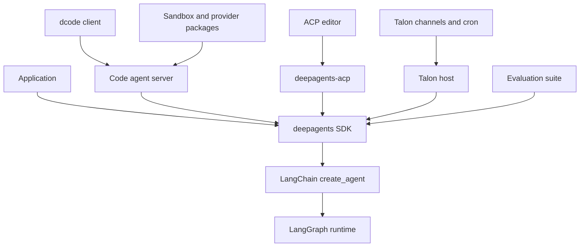
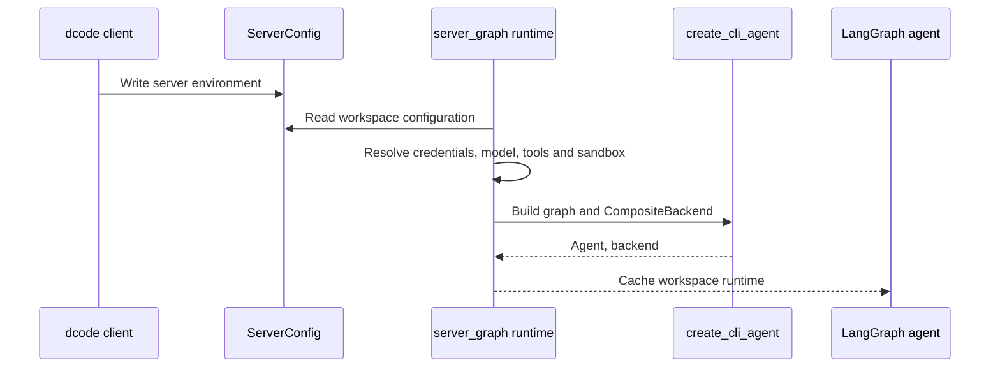
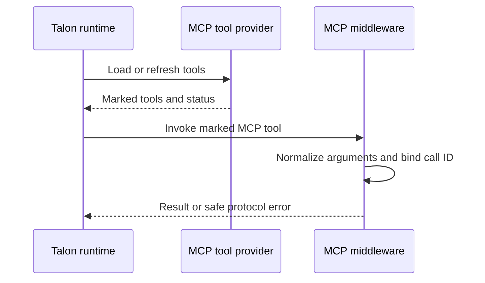

# Repository Source Map

Use this page to choose the owning boundary before changing behavior. The repository is a monorepo of independently versioned packages: the SDK owns reusable agent-harness composition, while Code, ACP, Talon, evaluations, and partners own their product or integration concerns. For architecture within the SDK, see the [overview](./overview.md); for local commands and release operations, see [Development, CI, and Releases](../operations/development.md).

## Package and dependency boundaries

This shows dependency direction and the boundary at which a behavior should normally be changed.

`deepagents` is an opinionated harness over LangChain's `create_agent()` and LangGraph; it does not replace the LangGraph runtime. Start reusable graph-construction work in `libs/deepagents/deepagents/graph.py` at `create_deep_agent()`: it accepts the model, tools, middleware, subagents, backend, permissions, persistence, and response configuration, then assembles the agent. Built-in filesystem, shell, and delegation tools are part of that surface; the `execute` tool only succeeds when the chosen backend is sandbox-capable.

The consuming packages deliberately retain their distinct responsibilities:

| Surface or change | Owner and first seam | Focused validation |
| --- | --- | --- |
| Reusable model/profile behavior, prompts, middleware ordering, backends, SDK subagents, permissions, or graph/checkpointer options | **SDK** — `libs/deepagents/deepagents/graph.py` and the appropriate `middleware/`, `backends/`, or `profiles/` module. | `libs/deepagents/tests/`, beginning with graph and feature-specific tests. |
| Terminal commands, TUI rendering, headless interaction, Code-only approval/configuration, client/server execution, sandbox selection, extensions, skills, or interpreter policy | **Deep Agents Code** — `libs/code/deepagents_code/`; console scripts enter through `deepagents_code:cli_main`. Follow from `main.py` into `agent.py`, `server_graph.py`, `tui/`, or the relevant product subsystem. | `libs/code/tests/unit_tests/`, including the focused CLI, agent, server, TUI, MCP, sandbox, or runtime-support test. |
| Editor protocol conversion, ACP sessions/options, graph-event streaming, session loading, or replay | **ACP** — `libs/acp/deepagents_acp/server.py`, centered on `AgentServerACP`. | `libs/acp/tests/`, especially agent/session, model-switching, and command-policy coverage. |
| Long-running local channels, cron, host lifecycle, conversation persistence, approval UX, Talon MCP lifecycle, or Talon delegation | **Talon** — `libs/talon/deepagents_talon/__main__.py`, `host.py`, `runtime.py`, and the focused `mcp*.py`, `subagents.py`, `background.py`, or `cron/` module. | `libs/talon/tests/`, selecting host, runtime, MCP, authorization, background, cron, or subagent tests. |
| Benchmark trajectories, reports, catalog/model groups, or Harbor evaluation integration | **Evals** — `libs/evals/`; product behavior still needs an owning-package regression test. | `libs/evals/tests/` plus the affected package test. |
| Provider-specific sandbox or JavaScript REPL mechanics | **Partner package** — `libs/partners/<provider>/`. QuickJS, for example, ships `langchain-quickjs`, a JavaScript REPL middleware for Deep Agents. | That partner's tests and required integration workflow. |
| Headless GitHub Action inputs, cache, outputs, and orchestration | **Repository Action** — `action.yml`, consuming dcode rather than becoming SDK policy. | Action/workflow scenario plus compatible Code behavior. |

## Release-unit navigation

The release manifest records nine managed release baselines. These are release units—not merely directories—and their distribution/component names determine release PR and tag navigation.

| Path | Distribution and component | Manifest baseline |
| --- | --- | --- |
| `libs/deepagents` | `deepagents` / `deepagents` | `0.7.17` |
| `libs/acp` | `deepagents-acp` / `deepagents-acp` | `0.0.12` |
| `libs/code` | `deepagents-code` / `deepagents-code` | `0.1.73` |
| `libs/talon` | `deepagents-talon` / `deepagents-talon` | `0.0.8` |
| `libs/partners/daytona` | `langchain-daytona` / `langchain-daytona` | `0.0.8` |
| `libs/partners/modal` | `langchain-modal` / `langchain-modal` | `0.0.6` |
| `libs/partners/runloop` | `langchain-runloop` / `langchain-runloop` | `0.0.7` |
| `libs/partners/vercel` | `langchain-vercel-sandbox` / `langchain-vercel-sandbox` | `0.0.2` |
| `libs/partners/quickjs` | `langchain-quickjs` / `langchain-quickjs` | `0.3.7` |

Release Please creates separate draft Python-package release PRs. Each configured unit supplies its changelog and version-bearing files, and package test paths are excluded from release analysis; tags include the component, use `==` as the separator, and have no `v` prefix. `libs/evals` is a package in the monorepo but is not a manifest release unit.

Do not infer compatibility from the manifest alone. Package metadata is the install contract: Code pins `deepagents==0.7.17`, requires `langchain-quickjs>=0.3.4,<0.4.0`, and develops ACP and partner packages as editable sibling sources. Talon accepts `deepagents>=0.7.0` and `deepagents-code>=0.1.71,<1.0.0`; QuickJS accepts `deepagents>=0.7.0,<0.8.0`. When Code needs an SDK capability, update and validate its exact SDK pin with the consuming release change.

## Entrypoints and lifecycle seams

**Code.** `deepagents-code` and `dcode` both resolve to `deepagents_code:cli_main`; `python -m deepagents_code` delegates to that same lazy package export. Keep parsing, terminal interactions, product approval policy, and startup behavior in Code rather than the generic SDK. `create_cli_agent()` is Code's composition seam for the interactive TUI, headless execution, ACP, and server mode: it constructs the product graph and returns its shared `CompositeBackend`.

**ACP.** `deepagents-acp` is the editor-facing adapter. Keep ACP session identity, working-directory/options policy, event translation, and replay in ACP, using a graph factory rather than SDK-global state when session context changes graph construction.

**Talon.** `deepagents-talon` enters at `deepagents_talon.__main__:main` and is explicitly an experimental local runtime host. Keep channel, scheduler, local persistence, operator-mediated authorization, MCP configuration, and local/background delegation there. Consult the [sandbox partners guide](../integrations/sandbox-partners.md) for vendor execution boundaries.

### dcode runtime construction

This is the server-mode construction path: one cached runtime owns the graph and backend resources for its workspace identity.

`server_graph.make_graph()` is the LangGraph-server factory. It validates a supplied execution context against the thread's workspace binding before selecting a workspace runtime; without execution context it returns the default server runtime. Construction reads the shared `ServerConfig` environment schema, resolves credentials and configuration without blocking the server loop, builds tool and MCP discovery, optionally opens a sandbox, and delegates graph assembly to `create_cli_agent()` in a worker thread. The runtime cache is load-bearing: it prevents repeated MCP discovery, sandbox creation, and `atexit` registration, while workspace runtime identity changes when its effective configuration changes. Failures at the startup barrier emit the machine-readable startup marker and exit nonzero. Start with `test_server_graph.py` when changing this lifecycle.

For criteria generation and rubric grading, server graph construction exposes only known read-only built-ins and MCP tools explicitly annotated read-only without contradictory destructive metadata. Do not widen that selection based on a tool name or arbitrary metadata; it is the boundary that prevents evaluation helpers from receiving mutating external tools.

`create_cli_agent()` owns Code-specific policy layered over `create_deep_agent()`: local versus sandbox backends, approvals, filesystem-tool allowlists, memory and skills, MCP metadata, subagents, retry/compaction settings, and optional QuickJS interpreter wiring. A filesystem allowlist is propagated to the main agent and synchronous subagents so delegation cannot bypass it; compiled subagent specifications fail rather than silently evading that restriction. The interpreter is local-only, and its host-tool bridge is governed by explicit interpreter configuration because bridge calls do not pass through ordinary HITL approval.

### Editable dependency-floor support

`_dep_floor_check.py` protects developers running an editable dcode checkout after dependency floors change. It reads the checkout's live `pyproject.toml` and compares applicable `>=`, compatible-release, and exact-pin floors with installed distribution metadata, but only after PEP 610 metadata identifies the Code install as editable; released installs skip the check entirely. This is advisory and fail-open: unexpected inspection failures only produce debug logging.

An answerable interactive TUI launch can refresh, continue once, mute, or abort before the TUI mounts. Headless launches, subcommands, and piped-stdin launches instead get one stderr warning and never block. A stored mute is keyed by checkout and a fingerprint of the actual mismatches, so a changed dependency version, floor, or offender re-arms the warning. Refresh uses a fixed `uv pip install --directory <checkout> --python <interpreter> -e <checkout> ... --upgrade` argument list, includes only sibling workspace sources actually installed editable, rechecks the result, then re-execs so the process cannot retain stale imported modules. Use `test_dep_floor_check.py` for the editable gate, version semantics, warnings, refresh, and mute behavior.

### dcode debug logging

dcode debug logging is opt-in and per-thread: configured loggers attach a tagged file handler only after the debug directory and file are secured, and rebinding a thread replaces stale tagged handlers rather than stacking them.

dcode refuses unsafe debug-log destinations: POSIX debug directories must be current-user-owned real directories and files are opened without following symlinks and tightened to owner-only access; on hardening failure it removes debug handlers and warns rather than continuing to log.

### Talon MCP and subagent seams

Talon's MCP provider loads each available server independently, prefixes and metadata-marks its tools, adds management capabilities, rejects tool-name conflicts, and serializes revision-gated refreshes so a configuration change is applied before a later agent turn.

This is the Talon-owned call path; ordinary tools bypass the MCP middleware.

Talon's MCP middleware only wraps metadata-marked MCP tools, normalizes empty optional string arguments, scopes authorization to the exact tool-call ID, and converts MCP protocol errors to a safe ToolMessage while allowing other exceptions to propagate.

Talon local subagents run as fresh graphs with selected tools, Talon MCP middleware, applicable approval middleware, and no checkpointer; unsupported fork mode is rejected, while malformed async-subagent configuration fails closed rather than silently omitting definitions.

## Safe change sequence

1. Identify the user-visible contract in the table and enter its package rather than treating `libs/` as one Python project.
2. Trace to the component that assembles or owns the lifecycle; preserve the SDK-versus-consumer responsibility boundary.
3. For dcode server changes, trace the configuration snapshot, workspace binding, cached runtime, and backend together; changing only the graph factory can leak or misroute process-lifetime resources.
4. Check the release table and the package's `pyproject.toml` before altering dependency pins or release-facing files.
5. Add the smallest observable test at the owning package, escalating to integration, UI, workflow, or evaluation coverage only when the contract crosses that boundary.
6. Run the package-local target documented by `make help`; use the development guide for aggregate lock or release validation.
