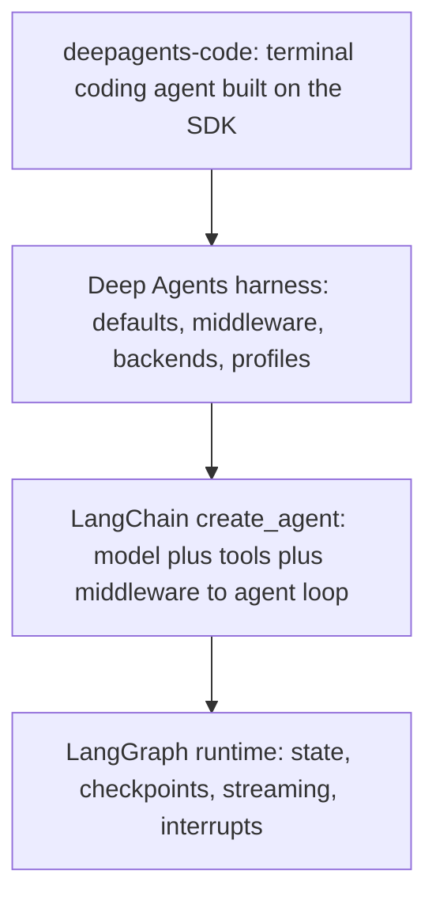

# Source Map

This page is a navigational index, not a reimplementation of each module. It maps
directories and key files to the behavior they own so an agent can jump to the
right place fast. For how the pieces fit together at runtime, read
[Architecture Overview](/openwiki/architecture/overview.md) and the
[Code Agent](/openwiki/architecture/code-agent.md). For deeper treatment of the
pluggable storage layer and the middleware list, see
[Backends](/openwiki/concepts/backends.md) and the
[Middleware Catalog](/openwiki/concepts/middleware-catalog.md).

The authoritative, in-repo maps are `libs/ARCHITECTURE.md` (SDK) and
`libs/code/ARCHITECTURE.md` (coding agent); prefer those and the per-package
`README.md` files over any duplicated detail here.

## How to navigate this codebase

The repository is a monorepo of independently versioned packages under `libs/`,
each with its own `pyproject.toml`, `Makefile`, and `README.md`; there is no root
`pyproject.toml`, and you work inside the package you are changing.

The single most useful navigation heuristic comes from `libs/ARCHITECTURE.md`:
**trace from a `create_deep_agent()` argument to the middleware or backend it
installs, then follow how that component participates during execution.** If a
tool is missing, look at middleware assembly and profile exclusions; if a tool is
visible but fails, look at backend capability and permission enforcement.

Deep Agents sits in three layers. Knowing which layer owns a behavior narrows the
search before you open a file.

Layered dependency map: `deepagents-code` builds on the `deepagents` SDK, which builds on LangChain's `create_agent`, which builds on the LangGraph runtime.

## Core SDK: `libs/deepagents/deepagents/`

Most Deep Agents-specific code lives here. The package root exposes the public
surface (`create_deep_agent`, `DeepAgentState`, middleware, backends, and profile
registration helpers) through `__init__.py`.

### Assembly entrypoint — `graph.py`

`graph.py` is the assembly point. `create_deep_agent()` resolves the model and any
provider/harness profile, resolves the backend, assembles the main-agent
middleware stack, builds the default and caller-supplied subagents, composes the
system prompt, and delegates to LangChain's `create_agent(...)`. It is the file to
open first for middleware ordering, prompt assembly, and default model behavior.

### Middleware — `middleware/`

Middleware adds harness behavior to the agent loop: it can filter tools per model
call, inject system-prompt context, transform messages, and maintain typed
cross-turn state — things a plain `tools=` callable cannot do because that
callable only runs *after* the model chooses it.

| Module | Responsibility |
| --- | --- |
| `filesystem.py` | Built-in filesystem tools (`ls`, `read_file`, `write_file`, `edit_file`, `glob`, `grep`), removal of `execute` when the backend lacks shell support, and `FilesystemPermission` policy types. |
| `summarization.py` | Token counting, tool-argument truncation, and history summarization/compaction as the context window fills. |
| `skills.py` | `SkillsMiddleware`: injects skill instructions and loads reusable behaviors on demand. |
| `subagents.py` | `SubAgentMiddleware`, declarative `SubAgent`, and `CompiledSubAgent`; runs nested `create_agent` delegation via the `task` tool. |
| `async_subagents.py` | `AsyncSubAgentMiddleware` / `AsyncSubAgent` for asynchronous or remote delegated work. |
| `memory.py` | `MemoryMiddleware`: injects memory instructions and wires long-term recall. |
| `rubric.py` | `RubricMiddleware` and grader types for evaluating outputs against rubrics. |
| `permissions.py` | Backward-compatible re-export of `FilesystemPermission` from `filesystem.py`. |
| `_tool_exclusion.py` | `_ToolExclusionMiddleware`: hides tools a harness profile lists in `excluded_tools`. |
| `patch_tool_calls.py`, `_prompt_caching.py`, `_fs_interrupt.py`, `_message_eviction.py`, `_overflow_clip.py` | Tail/support behaviors: tool-call patching, prompt caching, filesystem human-in-the-loop interrupts, and history clipping/eviction. |

### Backends — `backends/`

Backends decide where files, memory, and shell execution live behind one uniform
interface. `protocol.py` defines `BackendProtocol` (and `SandboxBackendProtocol`
for shell-capable backends) that every implementation follows.

| Module | Responsibility |
| --- | --- |
| `protocol.py` | `BackendProtocol` / `SandboxBackendProtocol`, standardized file-operation error codes, and result types. |
| `state.py` | `StateBackend`: default thread-scoped storage in LangGraph state. |
| `store.py` | `StoreBackend` and `NamespaceFactory`: durable store-backed files across threads. |
| `filesystem.py` | `FilesystemBackend`: maps files to local disk, including ripgrep-backed grep. |
| `sandbox.py` | Sandboxed/remote execution backends implementing shell `execute`. |
| `composite.py` | `CompositeBackend`: routes operations to different backends by path prefix. |
| `langsmith.py` | `LangSmithSandbox` integration. |
| `local_shell.py` | `LocalShellBackend` and `DEFAULT_EXECUTE_TIMEOUT` for local command execution. |
| `context_hub.py` | `ContextHubBackend`: stores files in a LangSmith Hub agent repo. |

### Profiles — `profiles/`

Profiles tune the harness for a provider or model spec across two orthogonal
phases. **Provider profiles** (`provider/provider_profiles.py`) control
model construction (`init_chat_model` kwargs and pre-init side effects).
**Harness profiles** (`harness/harness_profiles.py`) control the runtime phase —
prompt assembly, tool visibility, extra middleware, and default subagent
behavior. `_builtin_profiles.py` registers built-ins and lazily loads third-party
plugins on first registry access; `_keys.py` validates the `provider` /
`provider:model` registry keys. Built-in modules live under `provider/` (e.g.
`_openai`, `_openrouter`, `_nvidia`) and `harness/` (e.g. `_anthropic_sonnet_4_6`,
`_openai_codex`).

## Coding agent: `libs/code/deepagents_code/`

`deepagents-code` is a prebuilt terminal coding agent (the `dcode` CLI) built on
the SDK. It runs as two halves in separate processes: a **terminal client** that
owns presentation and input, and an **agent server** that owns the agent runtime,
connected by a streaming protocol. When debugging, first decide which half owns
the failure. The package is large; the table below sketches the major modules by
domain rather than listing every file.

| Domain | Key modules | Responsibility |
| --- | --- | --- |
| Runtime & entry | `__init__.py`, `__main__.py`, `main.py`, `agent.py`, `server_graph.py` | `cli_main` startup and the main loop (`main.py`); coding-agent construction over `create_deep_agent` (`agent.py`); the `make_graph()` factory served to `langgraph dev` via `ServerConfig` (`server_graph.py`). |
| Application/UI | `app.py`, `ui.py`, `tui/`, `input.py`, `theme.py` | Textual terminal application, the `textual_adapter`, screens/modals/widgets, input handling, and theming. |
| Configuration | `config.py`, `model_config.py`, `config_manifest.py`, `configuration/` | Layered user/project/session/runtime configuration, model/provider definitions loaded from TOML, and the shared config resolver/generation model. |
| Tools & MCP | `tools.py`, `tool_catalog.py`, `managed_tools.py`, `mcp_tools.py`, `mcp_config.py`, `mcp_providers/` | Consumer-provided tools, the tool catalog behind `dcode tools list` / `/tools` read from real bound tools, and MCP server discovery/loading. |
| Cost & stats | `cost_tracking.py`, `_session_stats.py` | Durable per-thread cost accumulation via `CostTrackingMiddleware` riding graph checkpoints, and lightweight session/usage statistics and token formatting. |
| Sessions & resume | `sessions.py`, `resume_state.py`, `state_migration.py` | Thread management over LangGraph checkpoints, per-checkpoint `ResumeState` channels for `dcode -r`, and state migration. |
| Context offload | `offload.py`, `offload_api.py`, `offload_middleware.py` | Storage paths for offloaded conversation history and CLI-specific compaction/offload middleware. |
| Modes & approval | `auto_mode.py`, `approval_mode.py`, `ask_user.py` | Classifier-backed Auto mode, per-thread approval-mode state shared by the client and server, and human-in-the-loop prompting. |
| Goals & rubric | `goal_tools.py`, `goal_rubric.py`, `goal_state_*.py`, `reliable_rubric.py` | Goal tracking, rubric grading, and goal-state limits/notices. |
| Skills & subagents | `skills/`, `built_in_skills/`, `subagents.py` | Bundled skills and coding-agent subagent definitions. |

## Other packages under `libs/`

Beyond the core SDK and the coding agent, `libs/` hosts sibling packages that are
useful to know exist but out of scope for detailed mapping here: `acp/` (Agent
Client Protocol integration), `evals/` and `harbor/` (evaluation suite and
Harbor integration), `talon/` (local runtime host for long-running agents),
`cli/`, and `partners/` (provider/sandbox integrations such as `daytona`,
`modal`, `vercel`, `runloop`, and `quickjs`).

## Where authoritative detail lives

Treat these as the source of truth and follow them rather than duplicating their
contents:

- `libs/ARCHITECTURE.md` — SDK layers, construction/execution, middleware stack,
  and "Common starting points".
- `libs/DEVELOPMENT.md` — monorepo layout, `uv`/`make` workflows, and commands.
- `libs/code/ARCHITECTURE.md` — the coding agent's client/server split, request
  flow, and configuration model.
- Per-package `README.md` and `pyproject.toml` — package scope and supported
  Python range.
