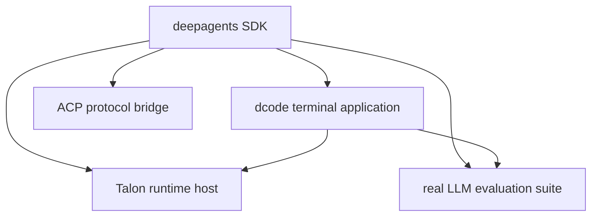
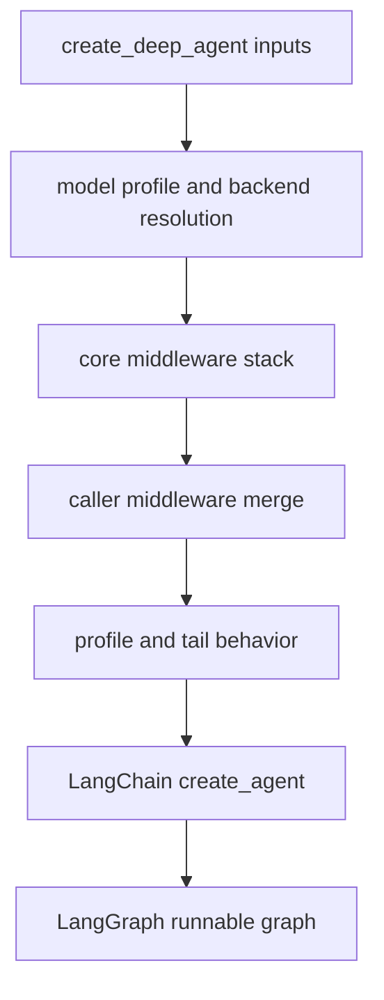
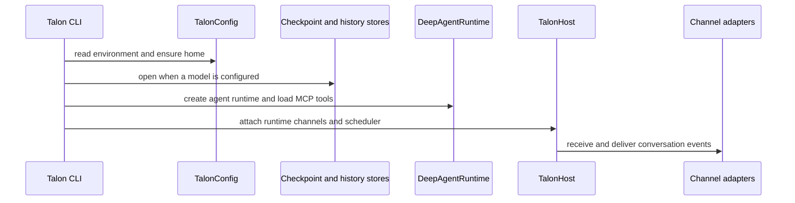

# Source Map and Ownership Boundaries

Use this page to route a change to the component that owns its contract, rather than to the first UI or integration that exposes it. The repository is a set of independently versioned packages under `libs/`; each has its own environment, `pyproject.toml`, `Makefile`, and test suite. Work in the package being changed and use its `make help` targets; sibling dependencies are editable in development. For the core execution model see [architecture overview](./overview.md), for ACP usage see [ACP integration](../integrations/acp.md), and for commands see the [development guide](../operations/development.md) and [testing guide](../testing/testing-guide.md).

## Route a change

| Change intent | Owning package and entrypoint | Runtime/state boundary | Start with |
| --- | --- | --- | --- |
| Agent defaults, graph assembly, built-in tools, backends, profiles, or middleware | `libs/deepagents`; public `deepagents.create_deep_agent` | Deep Agents harness over LangChain agent construction and LangGraph execution/checkpoints | `libs/deepagents/tests/unit_tests/test_graph.py`, then the owning middleware/backend/profile test |
| Terminal coding UX, commands, Textual lifecycle, local thread metadata, or completion | `libs/code`; `dcode` / `deepagents-code` scripts resolve `deepagents_code:cli_main` lazily | Textual app plus local SQLite metadata/checkpoint access | `libs/code/tests/unit_tests/`, especially `test_command_registry.py`, `test_sessions.py`, or `tui/widgets/test_autocomplete.py` |
| Agent Client Protocol bridge, ACP sessions, streamed updates, or ACP approval rendering | `libs/acp`; embed `AgentServerACP`, or module entrypoint `python -m deepagents_acp` for its test server | ACP client connection and a per-session LangGraph thread | `libs/acp/tests/test_agent.py`, with `test_command_allowlist.py` for approval reuse |
| Long-running channel host, chat commands, cron, runtime policy, MCP, sandbox, or channel delivery | `libs/talon`; `deepagents-talon = deepagents_talon.__main__:main` | One asyncio host owns adapters, runtime, scheduler, state home, and configured persistence | `libs/talon/tests/test_main.py`, `test_host.py`, `test_runtime.py`, and the focused subsystem test |
| Behavioral quality, model comparison, eval categories, reports, or Harbor benchmarks | `libs/evals`; `deepagents-evals = deepagents_evals.cli:main` | Real-LLM trajectories and LangSmith reporting, optionally Harbor sandboxes | `libs/evals/tests/evals/` for behavior; `tests/unit_tests/` for framework, category, and catalog drift |
| Provider or sandbox adapter implementation | `libs/partners/<provider>` | Optional integration dependency consumed by SDK, dcode, or Talon | The adapter package’s own tests plus the consuming-package regression |

```mermaid
flowchart TD
  SDK["deepagents SDK"] --> Code["dcode terminal application"]
  SDK --> ACP["ACP protocol bridge"]
  SDK --> Talon["Talon runtime host"]
  Code --> Talon
  SDK --> Evals["real LLM evaluation suite"]
  Code --> Evals
```

This diagram shows dependency direction: user surfaces and evaluation consume the SDK; Talon also uses dcode-provided integrations.

## Core SDK: graph construction is the public compatibility boundary

`libs/deepagents/deepagents/__init__.py` is the supported import surface. It re-exports `create_deep_agent`, `DeepAgentState`, filesystem and subagent middleware/types, memory and rubric middleware, and harness/provider profile registration. Route a request for a new caller-facing harness capability through this API and the underlying graph, middleware, backend, or profile owner—not through a particular dcode or Talon frontend.

`create_deep_agent` is the single construction seam. It resolves the model profile and backend, assembles subagent and middleware behavior, then delegates to LangChain `create_agent`. The compiled graph executes on LangGraph, which owns checkpoints, streaming, and interrupts. `DeepAgentState.messages` uses a `DeltaChannel`, so message checkpoint growth stays linear. Backend capability, profile tool exclusion, and filesystem permission are separate questions: a missing tool is generally an assembly/visibility concern, while a visible tool denied at execution is a backend or permission concern.

```mermaid
flowchart TD
  Request["create_deep_agent inputs"] --> Resolve["model profile and backend resolution"]
  Resolve --> Stack["core middleware stack"]
  Stack --> Merge["caller middleware merge"]
  Merge --> Tail["profile and tail behavior"]
  Tail --> Build["LangChain create_agent"]
  Build --> Graph["LangGraph runnable graph"]
```

This diagram separates construction-time ownership from the runtime that invokes the resulting graph.

Middleware ordering is a contract: a same-named caller middleware replaces its base entry in place, while novel caller middleware is inserted between the core stack and tail. Tool exclusion happens last. `FilesystemMiddleware` and `SubAgentMiddleware` are protected scaffolding because they respectively enforce built-in filesystem permissions and provide the `task` delegation tool; a harness profile cannot remove either and leave a deceptively degraded graph. Change the core graph and `test_graph.py` together when modifying these rules.

## dcode: app orchestration versus durable local state

`deepagents_code.__init__` installs its log buffer/configuration on package import but intentionally lazy-loads `cli_main`, avoiding CLI startup machinery for library submodule imports. The package scripts `dcode` and `deepagents-code` both point to that public lazy entrypoint. `app.py` is the Textual orchestration boundary; it should consume policies and state services rather than duplicate them.

### Commands and queue decisions

`command_registry.py` is the canonical registry for slash-command metadata, aliases, autocomplete, and queue-bypass tiers. It derives the dispatch and completion sets. `TextualApp` in `app.py` applies those derived classifications to live connection, startup-failure, and active-work state. In particular, a normally queued recovery command can bypass only after server startup has failed and while no agent, shell, or modal command is active. Update the registry first; then add a narrow registry test and an app test only if the live-state predicate changes.

### Thread metadata, ownership, and cache

`sessions.py` owns dcode’s SQLite-facing session layer, not the Textual modal. It lists checkpoint metadata through SQLite with a covering index, caches details based on latest-checkpoint freshness, and stores durable thread names separately from checkpoint revisions. Renames use an immediate transaction; deletion acquires ownership before removing local records and then attempts offloaded-history cleanup. The checkpointer wrapper supplies ownership and fencing, and remote-handoff seeding will not overwrite an existing owned lease. The app’s startup and turn paths only prewarm or refresh presentation cache; they are not the persistence source of truth.

### Completion controllers

`ChatInput` mounts slash, thread-reference, and file controllers. Keep matching/replacement policy in `tui/widgets/autocomplete.py` and popup wiring in `tui/widgets/chat_input.py`. Slash completion may display a label but inserts a canonical command. A selected thread becomes an ID-only `@@(thread:<id>)` reference with a safe label. File completion prefers Git tracked and non-ignored untracked paths, falls back to a bounded glob, refuses paths outside its project scope, and protects its async cache with generation checks.

## ACP: protocol adapter, not a second agent implementation

`AgentServerACP` bridges an existing compiled Deep Agents graph, or a factory that builds one from `AgentSessionContext`, to ACP. It holds ACP-specific per-session cwd, mode, model, MCP server, cancellation, plan, and command-approval state. `new_session` creates the ID and records context. Durable `session/load` is optional: it is advertised only when enabled, requires a persistent graph checkpointer, validates that persisted ACP metadata and cwd match, then replays stored messages and tool calls before returning.

The `prompt` implementation converts ACP text/image/audio/resource blocks to LangChain content, streams the graph’s `messages` and `updates`, emits only top-level graph content to the client, and resumes LangGraph interrupts using ACP permission decisions. It returns a cancelled response when cancellation is observed. Free-form LangGraph interrupts are rejected because ACP can represent only fixed approval-style decisions. Treat the conversion, replay, and permission behavior as one protocol contract; cover it in `test_agent.py` rather than testing a Deep Agents behavior only through ACP.

## Talon: process host and operator-controlled runtime

Talon is explicitly experimental. It owns the single-process lifecycle for channel adapters, cron schedules, and an `AgentRuntime`; core agent behavior remains in Deep Agents. `deepagents_talon.__main__.main` parses channel and management commands, loads `TalonConfig`, ensures and cleans state, creates optional adapters, and runs the host. With no configured model it uses `EchoAgentRuntime`; with a model it opens sandbox, checkpoint, and history resources, builds `DeepAgentRuntime`, loads MCP tools, and passes the host its runtime and channels.

```mermaid
sequenceDiagram
  participant CLI as Talon CLI
  participant Config as TalonConfig
  participant Store as Checkpoint and history stores
  participant Runtime as DeepAgentRuntime
  participant Host as TalonHost
  participant Channel as Channel adapters
  CLI->>Config: read environment and ensure home
  CLI->>Store: open when a model is configured
  CLI->>Runtime: create agent runtime and load MCP tools
  CLI->>Host: attach runtime channels and scheduler
  Host->>Channel: receive and deliver conversation events
```

This sequence identifies the host lifecycle boundary; a channel adapter does not own agent construction or persistence setup.

`TalonConfig` validates the assistant ID, filters runtime environment, and namespaces its home by assistant ID. `ensure_home` creates restrictive directories and initializes defaults and the tool-approval store. The configured sandbox is a backend choice, not an authorization or multi-tenant boundary; failures to start it exit rather than silently falling back to host execution. Use `config.py` for environment/home semantics, `runtime.py` for agent/tool/policy composition, `host.py` for conversation lifecycle, and the specialized modules for MCP, channels, cron, histories, or approvals.

## Evals: behavioral signal is separate from unit coverage

`libs/evals` runs agents against real LLMs, captures tool calls, file mutations, and final responses, and scores correctness plus efficiency. A `TrajectoryScorer.success(...)` assertion hard-fails an evaluation; `.expect(...)` records a trajectory-shape expectation without failing it. Eval definitions should build the SDK agent, invoke the shared `run_agent` helper, tag an `eval_category`, and use success assertions for required behavior. The categories JSON is a shared source of truth for reporting and drift tests, and `make eval-catalog` must follow catalog-affecting changes.

Use unit tests for deterministic implementation invariants and evals for regressions in observed model-driven behavior. Evals require real model credentials and LangSmith tracing when configured, so they are not a replacement for the focused package tests above.

## Change checklist

- **Change a core option, tool visibility, middleware ordering, profile, backend, or graph state:** start at `deepagents.create_deep_agent`; update `test_graph.py` and the owning component’s test.
- **Add or reclassify a dcode command:** update `command_registry.py`; cover registry metadata, queue behavior, and completion only where their contracts changed.
- **Change thread list, rename, delete, ownership, or checkpoint wrapping:** start in `sessions.py` and `test_sessions.py`; include ownership transition tests when another client can hold the thread.
- **Change a completion trigger, label, or replacement token:** update its controller in `tui/widgets/autocomplete.py`; change `ChatInput` only for mounting or event routing.
- **Change ACP input/output, replay, cancellation, or approval semantics:** change `AgentServerACP` and its ACP tests; retain graph-level coverage in the SDK if graph behavior itself changed.
- **Change Talon boot, persistence, sandbox, channel, or cron behavior:** route to `__main__.py`, `config.py`, `runtime.py`, `host.py`, or the focused subsystem, then run its paired Talon tests.
- **Change quality expectations:** add or revise a real-LLM eval with hard correctness assertions and optional soft efficiency expectations; preserve the category/catalog invariants.
