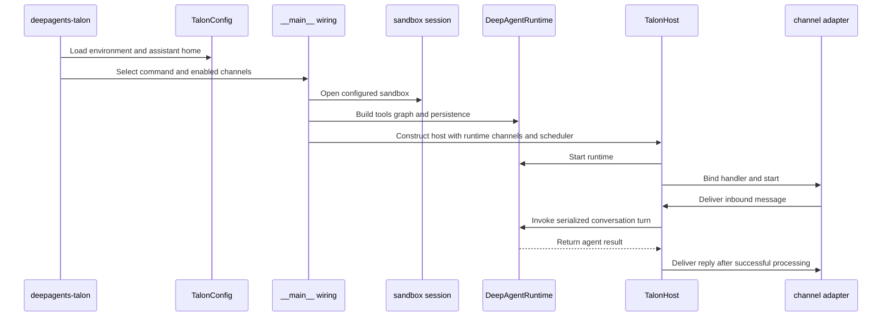

# Source Map and Ownership Boundaries

Talon is the experimental `deepagents-talon` package for hosting a long-running Deep Agents assistant over local channels and schedules. This page is a **change map**, not a file inventory: start at the public boundary, follow the owning seam, and add the narrowest test that observes the behavior. For the conceptual model and user-facing setup, see the [architecture overview](./overview.md), [runtime behavior](./runtime-behavior.md), [Talon integration guide](../integrations/talon.md), and [testing guide](../testing/testing-guide.md).

## Public surface versus implementation seams

| Boundary | Supported surface | Where to change behavior | Focused tests |
| --- | --- | --- | --- |
| **Package API** | `deepagents_talon` exports `TalonConfig`, `TalonHost`, channel and runtime protocols, request/result data types, cron types, approval types, speech types, and `__version__`. `DeepAgentRuntime` and `EchoAgentRuntime` are lazy exports. | Add or intentionally remove public symbols in `libs/talon/deepagents_talon/__init__.py`; keep implementation imports lazy when package-import cost matters. | The feature-specific test; `test_main.py` for bootstrap wiring. |
| **Console entrypoint** | The `deepagents-talon` console script calls `deepagents_talon.__main__:main`. | `__main__.py` owns CLI parsing, environment configuration, channel selection, `import-fleet`, `mcp`, and `pairing` subcommands, then wires the host. | `tests/test_main.py`, plus the owning feature test. |
| **Host contract** | `TalonHost` manages any implementations of `AgentRuntime`, `ChannelAdapter`, `ReactionChannelAdapter`, and `CronScheduler`. | Put cross-channel routing, command interception, cancellation, approval/authorization routing, lifecycle ordering, and scheduled delivery in `host.py`; keep provider API mechanics in `channels/`. | `tests/test_host.py`; channel-specific tests only for transport behavior. |
| **Agent runtime** | `DeepAgentRuntime` is the Deep Agents implementation of `AgentRuntime`; `AgentRequest` carries host-resolved conversation identity, handlers, metadata, and optional selected model. | `runtime.py` composes the graph, tools, middleware, persistence, retries, local manifests, and runtime reloads. | `tests/test_runtime.py`, `unit_tests/test_tool_approval_runtime.py`, `unit_tests/test_background_runtime.py`. |
| **Channel adapters** | Discord, Slack, Telegram, and WhatsApp adapters implement the common channel protocol. The `channels` package also exports shared exposure, formatting, retry, chunking, and media validation helpers. | Common policy belongs in `channels/base.py`; provider conversion, connection, and send mechanics belong in that provider module. | `tests/channels/test_base.py` and the matching `test_discord.py`, `test_slack.py`, `test_telegram.py`, or `test_whatsapp.py`. |
| **Pairing and access** | Adapters may compose a `SenderPairing` policy with their exposure policy. | `pairing.py` owns secure persistent admission, pairing codes, operator commands, and revocation semantics; `host.py` owns stopping a revoked sender's live work and jobs. | `unit_tests/test_pairing.py`, `unit_tests/test_pairing_slack.py`, and `tests/test_host.py`. |
| **History and search** | History is configured by `TalonConfig`; runtime wiring supplies a checkpoint saver backed by the conversation archive. | `history_backends.py` selects and opens stores; `store_archive.py`, `archive_saver.py`, and vector modules own archival/index semantics. | `unit_tests/test_history_backends.py`, `test_archive_saver.py`, `test_archive.py`, `test_archive_search.py`, `test_history_vectors.py`, and `test_history_profiles.py`. |
| **Model selection** | `/model` is host-mediated and only available when the runtime implements `ModelSelectableRuntime`. | `host.py` persists per-conversation choices; `model_selection.py` discovers credentialed providers, validates exact specs, caches models, and applies the selected model per turn. | `unit_tests/test_model_selection.py` and `tests/test_host.py`. |
| **Sandbox execution** | Sandbox selection is environment-driven through `TalonConfig.sandbox`. | `sandbox.py` owns startup, ownership cleanup, and the composite routing policy; do not bypass it by constructing a provider backend in a channel or host. | `unit_tests/test_sandbox.py` and `tests/test_main.py`. |

The distribution requires Python 3.12 or newer, is explicitly alpha/experimental, and depends on the core `deepagents` SDK plus `deepagents-code`; do not treat it as a replacement for either package's ownership boundary.

## Bootstrap and runtime ownership

`main()` loads `TalonConfig` from the environment, creates the cron store, ensures the assistant home, performs sensitive-state cleanup, selects requested or enabled channel adapters, and enters `_run_host()`. Non-host subcommands return before host startup. With no configured model the CLI uses `EchoAgentRuntime`; with a model it opens any configured sandbox, opens SQLite checkpointing and the selected history archive, builds `DeepAgentRuntime`, and starts `TalonHost`. The scheduler is installed only when a channel is present, so scheduled output has a channel route.

```mermaid
sequenceDiagram
  participant CLI as deepagents-talon
  participant Config as TalonConfig
  participant Bootstrap as __main__ wiring
  participant Sandbox as sandbox session
  participant Runtime as DeepAgentRuntime
  participant Host as TalonHost
  participant Channel as channel adapter
  CLI->>Config: Load environment and assistant home
  CLI->>Bootstrap: Select command and enabled channels
  Bootstrap->>Sandbox: Open configured sandbox
  Bootstrap->>Runtime: Build tools graph and persistence
  Bootstrap->>Host: Construct host with runtime channels and scheduler
  Host->>Runtime: Start runtime
  Host->>Channel: Bind handler and start
  Channel->>Host: Deliver inbound message
  Host->>Runtime: Invoke serialized conversation turn
  Runtime-->>Host: Return agent result
  Host->>Channel: Deliver reply after successful processing
```
This is the ownership flow: CLI wiring creates resources, the host owns their lifetime and routing, and the runtime owns graph invocation.

`TalonConfig` namespaces state under `<DEEPAGENTS_TALON_HOME or ~/.deepagents>/<assistant-id>`. It validates the assistant identifier and optional history URI, filters runtime environment values, creates the home and its state directories with restrictive permissions, and constrains generated checkpoint, model-selection, conversation-state, and vector-index paths to that assistant home. Preserve this boundary when adding any state file.

`TalonHost.start()` creates the home, starts the runtime, binds and starts channels, then starts the scheduler. A partial start unwinds already-started components in reverse order. `stop()` cancels active work and attempts every channel, scheduler, and runtime stop even if another shutdown step fails. Per-conversation locks serialize turns; conversation roots include the channel/provider boundary so unrelated chats do not share a thread.

## Inbound messages, operator commands, and channel policy

`interfaces.py` is the adapter boundary. New adapters should normalize provider events into `ChannelMessage` and optionally `ChannelReaction`, implement lifecycle/send/status operations, and register host callbacks through `ChannelAdapter`; they should not know how to invoke the graph. `AgentRequest` is the explicit handoff to a runtime, while `AgentResult` permits the host to decide delivery and recovery behavior.

The host processes help and host commands before model invocation. It handles new/reset/stop, MCP reload, context diagnostics, pairing, and model selection while holding the conversation lock; pending approval replies and OAuth callback messages are likewise intercepted before the model sees ordinary input. Model switches require an operator, are validated/prepared by the runtime before persistence, and are stored per conversation in `models.json`.

Shared channel policy belongs in `channels/base.py`. Exposure defaults to `self`, can be allowlist- or mention-pattern-based, and permits `open` only with an explicit risk acknowledgement because arbitrary senders could otherwise trigger the agent with local credentials. Outbound media is constrained to an optional trusted root after resolution, checked for matching type and size, and text is split to channel limits. Provider modules own their provider-specific event conversion, attachment handling, formatting, retry behavior, and connection lifecycle.

## Pairing is an admission and revocation boundary

DM pairing extends access only for a sender that is paired on that provider and in the DM where pairing was established; environment-listed sender IDs remain authoritative and cannot be revoked through pairing. The store reads without following the final path component, rejects non-regular, oversized, or invalid files, and fails closed if unreadable. Mutations use an exclusive sidecar lock and atomic replacement; cache identity includes the inode so an atomic revocation is observed rather than hidden by a stale read.

Only a configured operator may run `/pair`, and only in a direct message. On revocation, the host cancels the sender's active conversation work and pauses/cancels cron work originating from that DM. Pairing changes therefore need tests at both the store/policy seam and the host action seam.

## Graph, tools, and model seams

`DeepAgentRuntime.start()` resolves local and async subagents, creates the approval snapshot, and builds a `create_deep_agent()` graph. Runtime graph composition is the correct seam for tool additions, custom middleware, assistant manifests (`AGENTS.md`, skills, memory, and local subagent definitions), cron tools, attachments, retries, and checkpoint behavior. Do not add these to a provider adapter.

Talon's MCP provider independently loads available servers, prefixes and metadata-marks tools, adds management capabilities, rejects tool-name conflicts, and serializes revision-gated refreshes so a configuration change is applied before a later agent turn. Its middleware only wraps metadata-marked MCP tools, normalizes empty optional string arguments, scopes authorization to the exact tool-call ID, and converts MCP protocol errors to a safe `ToolMessage` while allowing other exceptions to propagate. Start with `tests/test_mcp.py`, `tests/test_mcp_middleware.py`, `unit_tests/test_mcp_adapter.py`, `unit_tests/test_mcp_config.py`, and `tests/test_mcp_auth.py` according to the changed seam.

Talon local subagents run as fresh graphs with selected tools, Talon MCP middleware, applicable approval middleware, and no checkpointer; unsupported fork mode is rejected, while malformed async-subagent configuration fails closed rather than silently omitting definitions. Use `tests/test_async_subagents.py`, `unit_tests/test_research_subagents.py`, and `unit_tests/test_subagent_reload.py` for delegation changes.

Model choice does not recompile the graph. `ModelSelection` discovers only credentialed providers from Talon's own environment, requires an exact catalog match before construction, and caches selected models. `ModelSelectionMiddleware` applies the turn-bound model to main-agent calls, while `SelectedModelSummarization` uses the selected model's context budget; subagents retain the startup summarizer.

## Persistence, history, and sandbox boundaries

The normal modeled-host path combines SQLite LangGraph checkpoints with `ConversationSaver` and `open_history()`. History defaults to the local checkpoint SQLite URI, otherwise chooses a built-in backend or exactly one `deepagents_talon.history_backends` plugin for the configured URI scheme. Initialization is timeout-bounded and turns backend failures into configuration-safe errors rather than exposing URI details. The archive namespace includes the assistant ID; vector indexing is optional and its generation is prepared separately from transcripts.

`open_sandbox()` is a host-lifetime context manager. If sandboxing is unset, runtime defaults remain local; if configured sandbox startup fails, Talon raises `SandboxStartupError` rather than falling back to host execution. An owned sandbox is closed on exit, while an attached `SANDBOX_ID` is retained. The sandbox composite routes only assistant `skills/` and `memory/` paths to host filesystem backends and routes everything else, including execution, to the sandbox, preventing a sandboxed agent from rewriting `tools.json` or other assistant state.

## Safe change plan

1. Confirm whether the change alters a public export, the CLI contract, or an internal seam; update `__init__.py` or `pyproject.toml` only for the first two.
2. Trace the lifecycle owner. Host changes must preserve start/unwind/stop ordering and per-conversation serialization; adapter changes must remain within the protocol boundary.
3. Keep assistant state inside `TalonConfig.home` and use the existing secure store patterns for authorization-adjacent files.
4. For a new channel capability, first place common policy in `channels/base.py`, then add provider behavior and provider-local tests.
5. For runtime composition, test graph behavior in `test_runtime.py`; add approval, MCP, model, history, sandbox, or subagent coverage only at the affected seam.
6. Run the focused test module before the Talon package suite; changes crossing into `deepagents` or `deepagents-code` require validation in the owning package as well.
