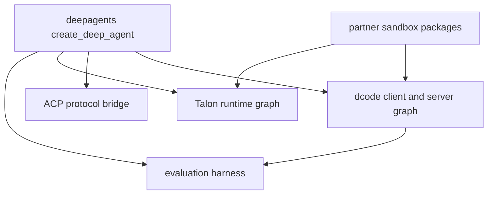
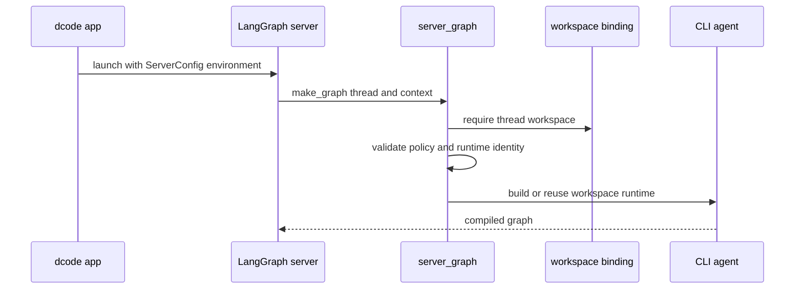
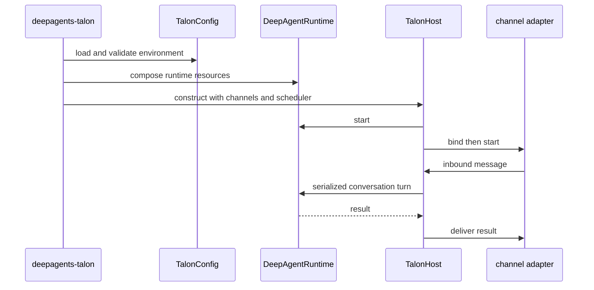

# System Ownership Map

This is a **change map**, not a directory listing. Start at the public entrypoint, then change the component that owns the relevant lifecycle or policy. The [overview](./overview.md), [SDK construction and execution](./sdk-construction-execution.md), [dcode architecture](./code-agent.md), [development guide](../operations/development.md), and [testing guide](../testing/testing-guide.md) provide the surrounding concepts and commands.

## Boundaries at a glance

| Area | Public entrypoint | Owner of behavior | High-value regression seam |
| --- | --- | --- | --- |
| SDK | `deepagents.create_deep_agent` and re-exported middleware/profile types | `libs/deepagents/deepagents/graph.py` assembles the graph and middleware contract | `libs/deepagents/tests/unit_tests/test_graph.py`, `test_subagents.py`, `test_permissions.py`, then an integration test for observable graph behavior |
| dcode client | `deepagents-code` / `dcode` -> `deepagents_code:cli_main` | `main.py` owns command dispatch and startup gates; the TUI/app owns interactive process lifetime | `libs/code/tests/unit_tests/test_main.py` for dispatch/startup and the feature's owner test |
| dcode server | LangGraph loads `deepagents_code.server_graph:make_graph` | `server_graph.py` owns server-scoped resources, workspace binding, graph construction, and server cache policy | `libs/code/tests/unit_tests/test_server_graph.py`, plus `test_offload_api.py` for operation routes |
| ACP | `AgentServerACP` or `python -m deepagents_acp` test server | `deepagents_acp/server.py` adapts protocol sessions, content, interrupts, and graph streaming | `libs/acp/tests/test_agent.py`, `test_command_allowlist.py`, and `test_model_switching.py` |
| Talon | `deepagents-talon` -> `deepagents_talon.__main__:main` | CLI wires resources; `TalonHost` owns routing and lifecycle; `DeepAgentRuntime` owns graph invocation | `libs/talon/tests/test_host.py`, `test_runtime.py`, and the narrow subsystem test |
| Partner packages | separate `langchain-*` packages | each package adapts one external sandbox or execution integration to the SDK boundary | the package's `tests/`; validate from dcode only when the factory/extra wiring changes |
| Evaluations | `deepagents-evals` -> `deepagents_evals.cli:main` | CLI delegates evaluation discovery, pytest trials, aggregation, and chart/catalog commands | `libs/evals/tests/` plus the changed harness or adapter tests |

```mermaid
flowchart TD
  SDK["deepagents create_deep_agent"] --> Code["dcode client and server graph"]
  SDK --> ACP["ACP protocol bridge"]
  SDK --> Talon["Talon runtime graph"]
  Partners["partner sandbox packages"] --> Code
  Partners --> Talon
  Code --> Evals["evaluation harness"]
  SDK --> Evals
```

The diagram shows dependency and composition direction, not an invocation path: the SDK is the graph-construction boundary; hosts and protocol adapters compose it; partner packages supply optional integrations; evals exercise the products.

## SDK graph construction

The `deepagents` package root is the stable Python surface: it exports `create_deep_agent`, `DeepAgentState`, filesystem and subagent middleware/types, memory and rubric middleware, and harness/provider profile registration. Keep import compatibility work there; put graph semantics in `graph.py`.

`create_deep_agent()` is the composition seam for model resolution, backend selection, caller tools, state/checkpoint/store wiring, prompt/profile policy, filesystem permissions, and synchronous or asynchronous subagents. It starts from `StateBackend` when no backend is supplied, and produces a LangGraph compiled agent through `create_agent`. The default tool suite is filesystem operations, `execute`, and `task`; `execute` returns an error unless the chosen backend implements the sandbox protocol.

Middleware ordering is a behavioral contract. The main stack conditionally includes skills, then filesystem and task/subagent support, summarization, patched tool calls, and async-subagent support; caller middleware is inserted before the profile/prompt-caching/memory/approval/unsupported-content tail. A harness profile can replace or exclude configured middleware and tools, but cannot exclude `FilesystemMiddleware` or `SubAgentMiddleware`: those are protected scaffolding for file tools, permission enforcement, and `task`. Invalid or unmatched exclusions fail rather than compiling a silently degraded agent. Permission rules are first-match-wins; `deny` returns a tool error and `interrupt` installs human approval, while a declarative subagent either inherits them or replaces them with its own rules.

**Change safely.** Extend a backend or tool via the middleware/backend boundary rather than a host. Change ordering, profiles, or subagent inheritance in `graph.py`, with `test_graph.py` for assembly invariants and `test_subagents.py`/`test_permissions.py` for the resulting capability and approval behavior. Use integration tests when checkpointing, streaming, or actual tool execution is material.

## dcode: client entry and server workspace policy

`deepagents_code.__init__` deliberately lazy-loads `cli_main`, so package consumers do not pay for terminal startup machinery. The console aliases `deepagents-code` and `dcode` both call it. `cli_main()` fast-paths version/help-like commands, installs termination cleanup, parses arguments, lets diagnostic `config`, `doctor`, and `auth path` bypass the managed-policy gate, and refuses all other policy-aware commands when managed configuration cannot be enforced. Only after that does it migrate legacy state and bootstrap credentials before dispatching commands or the interactive app.

The client/server split matters: the app writes a `ServerConfig` environment contract and starts a LangGraph server; `server_graph.make_graph()` reads that same contract. Server graph construction snapshots workspace environment and credentials away from the event loop, pins process-wide tracing compatibility, discovers MCP tools, opens an optional sandbox for the process lifetime, and passes the assembled tools, sandbox, configuration, and project context to `create_cli_agent`. Criteria drafting and rubric grading receive only built-in or explicitly annotated read-only MCP tools; missing or ambiguous MCP annotations are not treated as read-only.

A server runtime is not safely interchangeable across workspaces. `make_graph()` requires both a thread ID and execution workspace context in server execution mode, resolves the thread's durable workspace binding, and gets a workspace runtime. On every access it rejects project/access-policy drift (including vanished extension trust) instead of silently changing a bound thread. A model, prompt, or other runtime-identity change with unchanged access policy rebuilds the runtime while retaining the binding and its durable state. The workspace-runtime cache is LRU-bounded, and a process-wide sandbox can be claimed by only one workspace. The non-workspace factory is also cached because MCP discovery, sandbox creation, and cleanup registration must happen once, not per request.

```mermaid
sequenceDiagram
  participant Client as dcode app
  participant Server as LangGraph server
  participant Graph as server_graph
  participant Binding as workspace binding
  participant Agent as CLI agent
  Client->>Server: launch with ServerConfig environment
  Server->>Graph: make_graph thread and context
  Graph->>Binding: require thread workspace
  Graph->>Graph: validate policy and runtime identity
  Graph->>Agent: build or reuse workspace runtime
  Agent-->>Server: compiled graph
```

This sequence highlights the enforcement point: server-side graph selection validates the bound workspace before the agent executes.

## ACP, partners, and evaluation ownership

`deepagents-acp` is an integration package, not the SDK graph owner. `AgentServerACP` adapts a compiled graph or an `AgentSessionContext` factory to Agent Client Protocol requests. Its context contains the working directory, mode, and optional model; session loading is advertised only when requested and requires a checkpointer that survives a server restart. The adapter owns protocol content conversion and streamed/replayed visible updates, including supported text, image, audio, and plaintext reasoning blocks. `python -m deepagents_acp` starts the bundled test server, not a general configurable production launcher.

The partner directories are independent distributions: Daytona, Modal, Runloop, and Vercel package sandbox integrations, while QuickJS packages JavaScript REPL middleware. They depend on the SDK rather than being folded into `deepagents`; dcode lists sandbox packages as optional extras and resolves them through its sandbox factory. Keep provider SDK quirks, credentials, and lifecycle in the relevant partner package; change dcode only for selection, installation, or factory-level behavior.

`deepagents-evals` is a separate Harbor-oriented evaluation suite. Its console CLI is a stable operator boundary over existing scripts and Make targets: it runs one or multiple pytest trials, aggregates reports, generates charts, regenerates/checks catalogs and model groups, and discovers categories, tiers, models, and evals. Its documented exit statuses distinguish evaluation failures, configuration or generated-file drift, and the absence of usable reports. Evals intentionally depend on both the SDK and `deepagents-code`; use the suite to measure product behavior, not as a replacement for focused unit coverage.

## Talon host, state, and channel boundaries

Talon exposes `deepagents-talon` through `deepagents_talon.__main__:main` and is an experimental local runtime host; its package metadata depends on `deepagents >=0.7.0` and `deepagents-code >=0.1.71,<1.0.0`. The package root is its public Python surface: it re-exports host and configuration types, channel and agent protocols, request/result data, cron, approval, and speech APIs, while loading `DeepAgentRuntime` and `EchoAgentRuntime` lazily on access.

The CLI loads validated configuration, creates assistant state and cron storage, cleans sensitive state, selects requested or enabled channel adapters, dispatches non-host subcommands before startup, and wires modeled hosts through sandbox, checkpoint, history, MCP, and runtime construction. With a configured model it opens the sandbox, SQLite checkpointer, and history archive before creating the runtime; without one it runs `EchoAgentRuntime`. It installs the persistent scheduler only when a channel is available to deliver results.

```mermaid
sequenceDiagram
  participant CLI as deepagents-talon
  participant Config as TalonConfig
  participant Runtime as DeepAgentRuntime
  participant Host as TalonHost
  participant Channel as channel adapter
  CLI->>Config: load and validate environment
  CLI->>Runtime: compose runtime resources
  CLI->>Host: construct with channels and scheduler
  Host->>Runtime: start
  Host->>Channel: bind then start
  Channel->>Host: inbound message
  Host->>Runtime: serialized conversation turn
  Runtime-->>Host: result
  Host->>Channel: deliver result
```

This is the Talon ownership flow: bootstrap creates resources, the host owns their lifetime and routing, and the runtime owns graph composition and invocation.

`TalonConfig` namespaces assistant state below a validated assistant-specific home, creates state directories with restrictive permissions, and rejects generated checkpoint, conversation, model, and vector paths that escape that home. History defaults to local SQLite and otherwise selects a built-in or uniquely installed entry-point backend; it namespaces archives by assistant, bounds initialization, and replaces backend failures with configuration-safe errors. A configured Talon sandbox never falls back to host execution on startup failure; its host-lifetime session cleans up owned sandboxes but retains attached ones, and its backend exposes only assistant skills and memory on the host while routing other operations to the sandbox.

`TalonHost` serializes work by provider-scoped conversation roots, starts runtime then channels then scheduler with reverse-order unwind on partial startup, and on shutdown cancels active work while attempting every component stop. `ChannelAdapter` is the transport boundary between provider adapters and TalonHost; shared channel policy defaults to self exposure, requires an explicit acknowledgement for open exposure, and validates outbound media paths, type, and size before provider delivery. Put transport-neutral exposure and media policy in `channels/base.py`; provider conversion and connection mechanics remain in provider adapters.

Talon pairing fails closed when its persisted store is unreadable or invalid, limits pairing admission to the paired sender's originating DM while environment-listed senders remain authoritative, and uses locked atomic updates with inode-aware caching so revocations are observed. `TalonHost` permits `/pair` only from a configured operator in a direct message and, after a revocation, cancels that sender's active work and pauses or cancels cron work created in the revoked DM.

`DeepAgentRuntime` owns Talon's `create_deep_agent` graph composition: startup resolves subagents and approvals, combines runtime tools, model selection and summarization middleware, task and background middleware, backend, skills, memory, and a checkpointer. Talon model selection discovers only providers credentialed in Talon's environment, validates exact `provider:model` selections before constructing and caching them, and applies a selected model and matching summarization budget per main-agent turn without recompiling the graph.

Talon's MCP provider loads each available server independently, prefixes and metadata-marks its tools, adds management capabilities, rejects tool-name conflicts, and serializes revision-gated refreshes so a configuration change is applied before a later agent turn. Its middleware only wraps metadata-marked MCP tools, normalizes empty optional string arguments, scopes authorization to the exact tool-call ID, and converts MCP protocol errors to a safe `ToolMessage` while allowing other exceptions to propagate. Talon local subagents run as fresh graphs with selected tools, Talon MCP middleware, applicable approval middleware, and no checkpointer; unsupported fork mode is rejected, while malformed async-subagent configuration fails closed rather than silently omitting definitions.

## Focused test selection

- **SDK graph contract:** `libs/deepagents/tests/unit_tests/test_graph.py`; use `test_subagents.py`, `test_permissions.py`, and filesystem or middleware tests for the affected contract.
- **dcode command or policy:** `libs/code/tests/unit_tests/test_main.py`, `test_server_graph.py`, workspace/configuration tests, and `test_offload_api.py` when an operation route shares runtime resources.
- **ACP protocol mapping:** `libs/acp/tests/test_agent.py`; add command allowlist or model-switch coverage when changing those APIs.
- **Talon lifecycle/configuration:** `libs/talon/tests/test_host.py`, `test_config.py`, `unit_tests/test_configuration_hardening.py`, and `test_runtime.py`.
- **Talon integrations:** `tests/channels/test_base.py`, `unit_tests/test_pairing.py`, `tests/test_mcp_middleware.py`, `tests/test_async_subagents.py`, `unit_tests/test_model_selection.py`, `unit_tests/test_history_backends.py`, or `unit_tests/test_sandbox.py` according to the changed owner.
- **Partner/eval code:** run the package-local `tests/`; use the eval CLI and Harbor suite for evaluation workflow changes, not as the first regression test for an SDK primitive.
