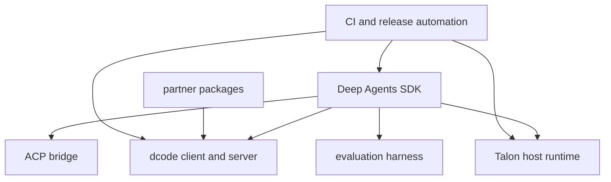
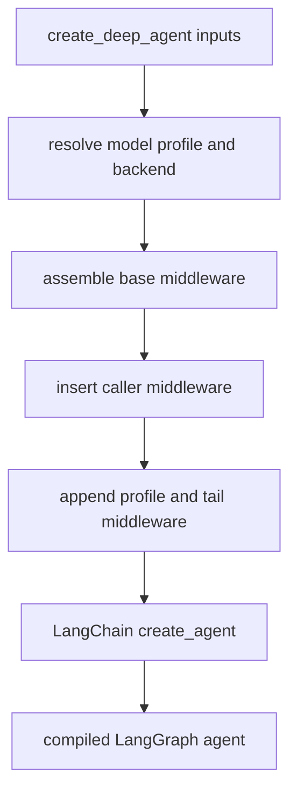
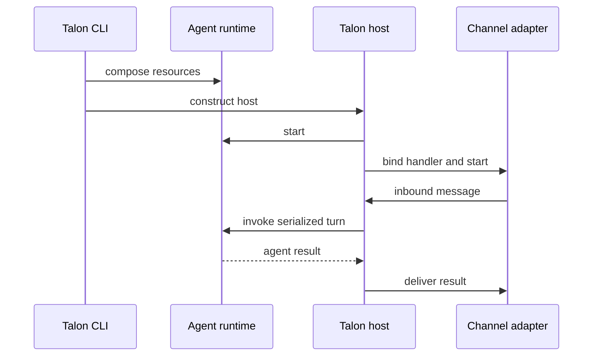

# System Source Map

Use this page to find the **owner of a behavior** and its smallest useful regression neighborhood. It is not a file inventory. Start at a supported public boundary, trace through the lifecycle owner, and test the contract at that boundary before expanding to integration coverage. See [architecture overview](./overview.md), [middleware stack](./middleware-stack.md), [runtime behavior](./runtime-behavior.md), [development](../operations/development.md), and the [testing guide](../testing/testing-guide.md) for complementary detail.

## Route a change to its owner

| Concern | Public entrypoint | Primary owner | Start with |
| --- | --- | --- | --- |
| SDK graph and default tools | `deepagents.create_deep_agent` | `libs/deepagents/deepagents/graph.py` | `libs/deepagents/tests/unit_tests/test_graph.py` |
| SDK middleware behavior | `create_deep_agent(..., middleware=...)` | `libs/deepagents/deepagents/middleware/` | the feature's unit test plus `test_graph.py` |
| Terminal client startup and commands | `dcode` / `deepagents-code` -> `deepagents_code:cli_main` | `libs/code/deepagents_code/main.py` and `client/` | `libs/code/tests/unit_tests/test_main.py` |
| dcode agent construction and server workspace ownership | client -> local LangGraph server | `libs/code/deepagents_code/agent.py`, `server_graph.py` | `test_agent.py`, `test_server_graph.py` |
| dcode TUI stream projection | Textual adapter and widgets | `libs/code/deepagents_code/tui/` | the corresponding `tests/unit_tests/tui/` test |
| Talon bootstrap and long-running coordination | `deepagents-talon` -> `deepagents_talon.__main__:main` | `__main__.py`, `host.py` | `libs/talon/tests/test_host.py`, `test_runtime.py` |
| Talon channel policy | `ChannelAdapter` | `interfaces.py`, `channels/base.py`, provider adapter | `tests/channels/test_base.py` and provider tests |
| Talon checkpoint, history, sandbox, MCP, and cron resources | model-host bootstrap | `checkpoint_backends.py`, `history_backends.py`, `sandbox.py`, `mcp.py`, `cron/` | resource-specific unit tests |
| ACP protocol bridge | `AgentServerACP` | `libs/acp/deepagents_acp/server.py` | `libs/acp/tests/test_agent.py` |
| Evaluation CLI and harness | `deepagents-evals` | `libs/evals/deepagents_evals/` | `libs/evals/tests/` and the applicable workflow test |
| Sandbox partner behavior | partner distribution | `libs/partners/<provider>/` | that package's tests |
| CI/release routing | GitHub Actions entry workflow | `.github/workflows/ci.yml` and reusable workflows | `.github/scripts/tests/` where applicable |

```mermaid
flowchart TD
  SDK["Deep Agents SDK"] --> Code["dcode client and server"]
  SDK --> Talon["Talon host runtime"]
  SDK --> ACP["ACP bridge"]
  SDK --> Evals["evaluation harness"]
  Partners["partner packages"] --> Code
  Automation["CI and release automation"] --> SDK
  Automation --> Code
  Automation --> Talon
```

The dependency map shows that products and protocol adapters compose the SDK, while partner packages and automation remain separate ownership boundaries.

## SDK: graph assembly is the harness boundary

`libs/deepagents/deepagents/__init__.py` is the stable import surface. It re-exports `create_deep_agent`, `DeepAgentState`, subagent, filesystem, memory, rubric, and profile registration types; preserve that surface when relocating implementation.

`create_deep_agent` in `graph.py` is where a Deep Agents graph is assembled. It resolves the model/profile and backend, merges caller tools, selects subagents, builds middleware, and delegates the resulting graph to LangChain `create_agent`. This is the correct starting point for a change that affects the default tool surface, prompt composition, state schema, checkpointer, or ordering of harness behavior—not a product-specific CLI module.

The meaningful ordering invariant is that caller middleware is placed between the base scaffolding and tail behavior. Filesystem and synchronous-subagent middleware are protected scaffolding: profiles cannot exclude them because filesystem permissions and the `task` implementation depend on them. The default suite exposes filesystem operations, `execute`, and `task`; `execute` reports an error rather than running a shell when the selected backend lacks sandbox capability. Use `test_graph.py` first, then add the narrow tests for the middleware or backend whose contract changed.

```mermaid
flowchart TD
  Input["create_deep_agent inputs"] --> Resolve["resolve model profile and backend"]
  Resolve --> Base["assemble base middleware"]
  Base --> Custom["insert caller middleware"]
  Custom --> Tail["append profile and tail middleware"]
  Tail --> Compile["LangChain create_agent"]
  Compile --> Graph["compiled LangGraph agent"]
```

This construction flow is the central extension boundary: use middleware and profiles to alter harness behavior instead of copying graph assembly into a product.

## dcode: client presentation versus server-owned execution

`deepagents-code` and `dcode` both resolve to the lazily exported `deepagents_code.cli_main`. The lazy package export avoids importing command startup machinery during ordinary imports; an unresolvable Deep Agents home is converted into an actionable message and exit status 2. Command parsing and policy gates belong in `main.py`; agent composition, persistence routes, and tool/middleware policy belong in `agent.py` and server-side modules.

The dcode client and server are separate processes: the client owns terminal input, rendering, and human responses, while the server owns the agent graph, model/tool execution, streaming, checkpointing, and resume behavior. For a symptom, first identify that side of the boundary. `server_graph.py` is the neighborhood for workspace-bound runtime construction and server-scoped policy; `agent.py` is the neighborhood for composed agent behavior. Do not repair a server workspace invariant in a Textual widget.

For `/offload` and `/handoff`, start with `offload_api.py`, `offload_middleware.py`, and `offload.py`. These are server/storage lifecycle work, not merely UI commands; use `test_offload_api.py`, `test_offload.py`, and then `integration_tests/test_offload_server_side.py` when a change crosses the live server boundary.

### TUI fan-out and prompt seams

QuickJS `task()` dispatches occur inside one `js_eval` tool call, so the normal message stream cannot describe individual subagents. `SubagentPanel` consumes the custom lifecycle stream and renders the fan-out state. dcode's SubagentPanel turns custom QuickJS subagent lifecycle events into phase-grouped live UI, preserves timing across replayed starts, surfaces orphan errors, cancels only live rows on interrupted turns, and sanitizes untrusted event text before plain-text rendering. Change the event producer and widget together; `test_subagent_panel.py` mounts the real Textual component and covers selection, reset, cancellation, replay timing, narrow layouts, and hostile labels.

The system-prompt smoke test is a distinct contract from UI rendering. dcode's system-prompt smoke test captures the first composed SystemMessage with deterministic runtime and path inputs, snapshots interactive and headless prompts, and asserts interaction and memory guidance remain appropriate to the mode. Update its golden files only for intentional prompt policy changes.

## Talon: CLI composes resources, host owns lifecycle

Talon is an experimental local runtime. Its command entrypoint parses host flags and administrative `import-fleet`, MCP, and pairing commands before a host is launched. A normal launch creates cron storage and selected channel adapters; a configured model opens the sandbox, checkpointer, and history archive, constructs `DeepAgentRuntime`, and wraps persistence with `ConversationSaver`. Without a configured model it uses `EchoAgentRuntime`. A persistent scheduler is installed only when a channel can receive results.

```mermaid
sequenceDiagram
  participant CLI as Talon CLI
  participant Runtime as Agent runtime
  participant Host as Talon host
  participant Channel as Channel adapter
  CLI->>Runtime: compose resources
  CLI->>Host: construct host
  Host->>Runtime: start
  Host->>Channel: bind handler and start
  Channel->>Host: inbound message
  Host->>Runtime: invoke serialized turn
  Runtime-->>Host: agent result
  Host->>Channel: deliver result
```

This lifecycle divides responsibility: `__main__.py` selects and scopes resources, `TalonHost` starts/stops them and routes provider messages, and the runtime owns graph invocation. `TalonHost.start()` starts runtime, then channels, then scheduler and unwinds in reverse after a partial-start failure. Shutdown cancels active work and attempts every component stop. Per-conversation locking serializes work for a provider-scoped conversation root; changes to concurrency or cancellation belong in `host.py` and `test_host.py`.

`interfaces.py` is the compatibility boundary between a runtime and a channel: `AgentRequest` carries the trusted conversation identity and host callbacks, `AgentResult` returns the outcome, and `ChannelAdapter` defines lifecycle and delivery. Put cross-provider exposure and outbound-media policy in `channels/base.py`; provider modules should translate their protocol without silently weakening that policy.

### Talon persistence, scheduling, and Slack

Checkpoint construction is independent from history. Talon opens an independently configured checkpointer from a checkpoint URI or assistant-local SQLite path, accepts built-in schemes or exactly one backend entry point, and sanitizes unexpected backend-startup failures to avoid disclosing URI credentials. The model bootstrap passes this saver into `ConversationSaver`, so a custom backend changes live graph persistence. Exercise `test_checkpoint_backends.py` whenever URI validation, optional drivers, or startup errors change.

`CronJobStore` is intentionally an in-process store, not a distributed scheduler. CronJobStore serializes complete in-process mutations among stores resolving to the same jobs file, refreshes cached reads by inode-aware file identity, but deliberately does not coordinate external writers or multiple processes; competing claims yield one claimed run. Use `test_cron_concurrency.py` for every mutation/claim change, and keep operational tooling consistent with its single-writer limitation.

Slack configuration requires a bot token and app token. Slack construction requires bot and app tokens; its adapter applies exposure or pairing admission before dispatch, issues unknown public senders' pairing offers through a DM, and restricts public-thread context to trusted senders while safely degrading when history retrieval fails. The implementation and channel tests are the authoritative pair for changing this security boundary: inspect `channels/slack.py` with `tests/channels/test_slack.py` and `integration_tests/test_slack_host.py`.

For other Talon extension boundaries, follow this path: MCP server loading and refresh are in `mcp.py` with tool-call shaping in `mcp_middleware.py`; Talon subagents are in `subagents.py` and `async_subagents.py`; model selection is in `model_selection.py`; sandbox startup and cleanup are in `sandbox.py`; pairing/revocation is in `pairing.py` plus `host.py`. Start from the focused matching test rather than the full host suite.

## ACP, evals, partners, and automation

`AgentServerACP` projects a compiled Deep Agents graph—or a session-context graph factory—onto ACP. It owns ACP sessions, per-session mode/model/cwd state, stream projection, MCP configuration, and permission negotiation. Durable `session/load` is explicitly optional and requires a checkpointer that survives server restart. Live stream and replay use shared content conversion, preventing their block ordering and supported content types from drifting. Use `libs/acp/tests/test_agent.py` for protocol behavior before exercising a consumer.

The `deepagents-evals` console script targets `deepagents_evals.cli:main`. Keep evaluation-harness changes inside `libs/evals`, where package tests, catalog documentation, and workflow contracts live; use end-to-end evaluations to measure product behavior, not as the first regression test for an SDK primitive.

Each directory in `libs/partners/` is independently versioned and owns its own environment, `pyproject.toml`, Makefile, and tests. A new partner is also a repository-automation change: the onboarding checklist requires issue forms, Dependabot, labels, CI path detection, release configuration, and—in relevant cases—Harbor and integration-test wiring. Follow `libs/partners/AGENTS.md` rather than adding only a package directory.

`.github/workflows/ci.yml` performs change detection and runs only affected package jobs on pull requests; SDK changes intentionally trigger dependent dcode, Talon, ACP, eval, and partner coverage. Reusable `_lint.yml` and `_test.yml` centralize setup and test matrices. Place workflow helpers under the existing `.github/scripts/` domain folders and mirror their tests under `.github/scripts/tests/`, as described in `.github/LAYOUT.md`.

## Focused regression checklist

- **SDK assembly:** `libs/deepagents/tests/unit_tests/test_graph.py`, then the feature-specific middleware/backend/subagent test.
- **dcode command or client/server boundary:** `libs/code/tests/unit_tests/test_main.py`, `test_agent.py`, or `test_server_graph.py` according to owner.
- **dcode TUI:** `libs/code/tests/unit_tests/tui/widgets/test_subagent_panel.py` for QuickJS fan-out lifecycle; use the widget-specific test for another component.
- **dcode prompt:** `libs/code/tests/unit_tests/smoke_tests/test_system_prompt.py` plus snapshot review.
- **dcode offload:** `test_offload_api.py`, `test_offload.py`, then `integration_tests/test_offload_server_side.py`.
- **Talon lifecycle/protocol:** `libs/talon/tests/test_host.py`, `test_runtime.py`, channel tests, and the focused resource test such as `unit_tests/test_checkpoint_backends.py` or `unit_tests/test_cron_concurrency.py`.
- **ACP:** `libs/acp/tests/test_agent.py`.
- **Partner/eval/automation:** begin in the changed package; for automation, run the helper/workflow contract test closest to the edited script or workflow.
