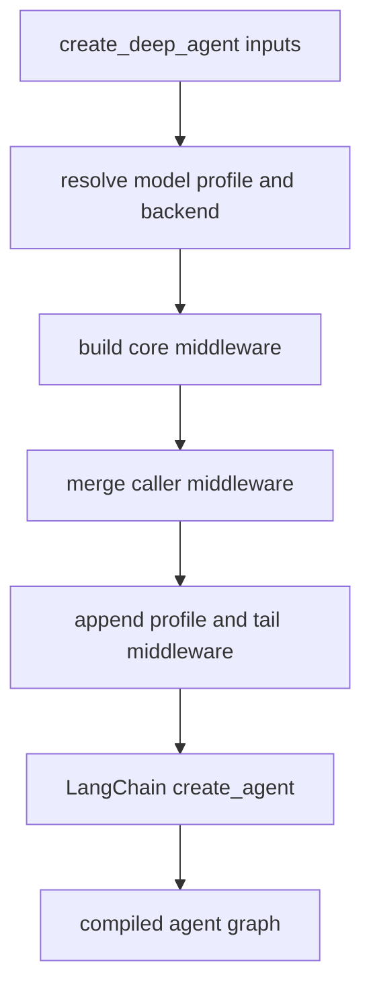
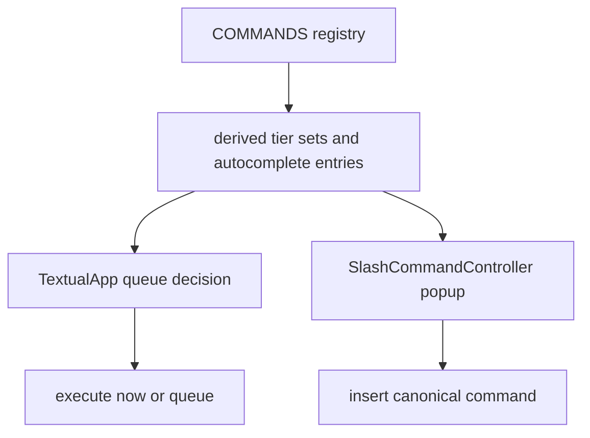
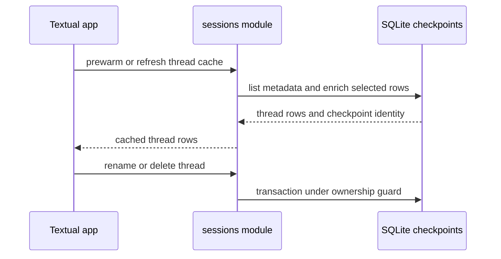

# System Source Map

Use this map to find the owner of a behavior and the smallest useful regression neighborhood. It deliberately follows control and state boundaries rather than listing the tree. For the SDK design, see [middleware stack](./middleware-stack.md) and [architecture overview](./overview.md); for user-facing dcode setup, see the [quickstart](../quickstart.md); for persistence concepts, see [state persistence](../concepts/state-persistence.md); and for test commands, see the [testing guide](../testing/testing-guide.md).

## Route a change

| Concern | Owner and boundary | Start with |
| --- | --- | --- |
| SDK graph assembly, built-in tools, profiles, or middleware ordering | `libs/deepagents/deepagents/graph.py` via `create_deep_agent` | `libs/deepagents/tests/unit_tests/test_graph.py` |
| dcode command metadata and busy-state classification | `libs/code/deepagents_code/command_registry.py`; `app.py` consumes its derived sets | `libs/code/tests/unit_tests/test_command_registry.py`, then relevant `test_app.py` coverage |
| Thread listing, durable names, deletion, and checkpoint access | `libs/code/deepagents_code/sessions.py` | `libs/code/tests/unit_tests/test_sessions.py` |
| Command, thread, and file completion behavior | `tui/widgets/autocomplete.py`, mounted by `tui/widgets/chat_input.py` | `libs/code/tests/unit_tests/tui/widgets/test_autocomplete.py` |
| Textual lifecycle, queue decisions, and thread-cache refresh | `libs/code/deepagents_code/app.py` | the narrow `test_app*.py` test, plus `test_sessions.py` if persistence is involved |

## SDK assembly: preserve the graph harness boundary

`deepagents.create_deep_agent` is the public construction seam. It resolves the model and harness profile, chooses the supplied backend or a `StateBackend`, prepares caller tools and the system prompt, constructs synchronous and asynchronous subagent support, and finally passes the assembled middleware and graph options to LangChain `create_agent`. Change default graph behavior here rather than duplicating graph assembly in a dcode surface. `DeepAgentState` also makes the `messages` channel a `DeltaChannel`, bounding checkpoint growth to linear rather than quadratic behavior.

```mermaid
flowchart TD
  Input["create_deep_agent inputs"] --> Resolve["resolve model profile and backend"]
  Resolve --> Base["build core middleware"]
  Base --> Custom["merge caller middleware"]
  Custom --> Tail["append profile and tail middleware"]
  Tail --> Agent["LangChain create_agent"]
  Agent --> Graph["compiled agent graph"]
```

This flow shows the construction ownership boundary and the intended middleware extension point.

The ordering contract is more precise than “append custom middleware.” A caller middleware with the same name replaces a base entry in place; a new one is inserted after the core stack and before the profile, skills, prompt-cache, memory, approval, and unsupported-content tail. Profile tool exclusion runs last, so custom middleware cannot restore an excluded tool. The default general-purpose synchronous subagent supplies the `task` tool unless a profile disables it and no synchronous subagent was supplied.

Filesystem and synchronous subagent middleware are protected scaffolding. Filesystem middleware backs built-in file tools and their permissions; subagent middleware backs `task`. Profile exclusion of either is rejected rather than allowing a graph with silently broken security or delegation behavior. Start in `test_graph.py` for a change to this composition or failure rule, then add the narrow test for the middleware, backend, or profile that owns the changed contract.

## dcode command dispatch: one registry, two consumers

`command_registry.py` is the canonical declaration point for slash-command name, description, aliases, argument hint, discoverability keywords, experimental status, and queue-bypass tier. Derived sets include aliases, so adding an alias or changing a tier there changes both dispatch policy and completion metadata. Do not create a competing hard-coded list in the app or a widget.

`TextualApp._can_bypass_queue` in `app.py` translates those classifications into live application state. Always-immediate commands are handled elsewhere in the app flow; this method permits connecting-tier commands only during initial connection with no active work, accepts exact selector-opening forms, and permits immediate-UI commands only in their bare form. Recovery commands remain normally queue-bound but escape a failed server startup only when no agent, shell, or modal command is active. That separation prevents a repair action from being parked behind the failure it fixes without allowing a package-changing action mid-turn.

```mermaid
flowchart TD
  Registry["COMMANDS registry"] --> Sets["derived tier sets and autocomplete entries"]
  Sets --> Queue["TextualApp queue decision"]
  Sets --> Popup["SlashCommandController popup"]
  Queue --> Dispatch["execute now or queue"]
  Popup --> Input["insert canonical command"]
```

This flow shows why command metadata, queue policy, and completion must change together.

Focused tests: use `test_command_registry.py` to protect registry invariants such as recovery commands remaining queue-bound and hidden commands staying out of autocomplete. Add or update `test_app.py` when the app-state predicate or dispatch outcome changes. Use `tui/widgets/test_autocomplete.py` for matching, display, or insertion behavior.

## Thread inspection and persistence: SQLite metadata around LangGraph checkpoints

`sessions.py` owns dcode’s local thread index and checkpoint access. The session database path is initialized under the hardened state directory. `list_threads` reads checkpoint metadata, supports agent, branch, and exact-cwd filters, and creates a covering index so common listings avoid reading checkpoint blobs. It enriches rows with durable names and, only when requested, checkpoint-derived message counts and initial prompts. The app prewarms this cache off the startup path and refreshes it after checkpoint-producing turns, allowing the `/threads` selector to paint cached recent rows before its fuller query completes.

Thread detail caches are keyed by latest checkpoint identity. This makes unchanged rows cheap to redisplay but intentionally permits a count to lag while a live superstep is still writing; the next checkpoint refresh invalidates it. Do not treat this selector cache as a source of truth for resumability or concurrent ownership.

Durable thread names are stored separately in `dcode_thread_names` and copied into the latest checkpoint metadata for compatibility. `rename_thread` validates a printable, single-line name of at most 50 characters, begins an immediate SQLite transaction, and can atomically refuse to overwrite a name when `only_if_unnamed=True`. Thread deletion first acquires the thread ownership lease, removes checkpoint, write, name, and side-question-cost records, invalidates in-memory listings, and then attempts offloaded-history cleanup. The return value reflects checkpoint deletion; archive-cleanup failure is logged but does not reverse a successful deletion. A live reservation makes deletion fail with `BlockingIOError` rather than racing a writer.

`get_checkpointer` provides the SQLite saver wrapped with dcode’s ownership and fencing rules, while `save_thread_seed` writes only absent remote-handoff seeds and preserves an existing owned lease. Consequently, changes to persistence must preserve both database cleanup and the thread-ownership protocol; changing only a Textual modal is insufficient.

```mermaid
sequenceDiagram
  participant App as Textual app
  participant Sessions as sessions module
  participant DB as SQLite checkpoints
  App->>Sessions: prewarm or refresh thread cache
  Sessions->>DB: list metadata and enrich selected rows
  DB-->>Sessions: thread rows and checkpoint identity
  Sessions-->>App: cached thread rows
  App->>Sessions: rename or delete thread
  Sessions->>DB: transaction under ownership guard
```

This sequence distinguishes display caching from the ownership-guarded persistence mutations.

Focused tests: begin with `test_sessions.py` for query filters, name races, deletion semantics, seed behavior, checkpoint cleanup, and cache freshness. Use `test_app_thread_ownership.py`, `test_thread_ownership.py`, or `test_thread_ownership_transitions.py` when the change crosses client ownership transitions. Use `test_thread_naming_app.py` or `test_threads_resume.py` only when the UI integration itself changes.

## Textual completion: canonical tokens, scoped files, and safe labels

`ChatInput` owns the Textual wiring: at mount it creates slash-command, thread-reference, and file controllers and places them in a `MultiCompletionManager`. The controllers render through a small view adapter, so controller code owns selection and replacement semantics while the widget owns popup presentation. Keep this split when adding a trigger or changing keyboard behavior.

`SlashCommandController` searches only when input begins with `/`; it ranks canonical names first, then hidden keywords and descriptions, and keeps the display label separate from the inserted machine name. This permits a namespaced plugin skill to appear as a short label while completion still inserts its full `/skill:<namespace>:<name>` command.

`ThreadCompletionController` reserves `@@` for recent-thread references. It searches cached thread ID, name, initial prompt, agent, branch, and cwd metadata, but replaces the query with an ID-only `@@(thread:<id>)` token. Labels prefer a saved name, then initial prompt, then an ID prefix; control characters are sanitized and labels are length-limited before rendering. The file controller explicitly refuses `@@`, preventing a thread reference from becoming a file-completion request.

For `@` files, `FuzzyFileController` prefers Git’s tracked list plus non-ignored untracked files. If Git is unavailable or unusable it falls back to a bounded shallow glob. A nested cwd is scoped to its project subtree; a cwd outside the discovered project root returns no paths rather than offering paths relative to the wrong base. File-cache warming and project-root discovery run off the event loop, and a generation check prevents an older asynchronous warm from overwriting a newer cwd’s cache.

Focused tests: `tui/widgets/test_autocomplete.py` covers the trigger separation, canonical insertion, label sanitization, Git and glob behavior, cwd scoping, and stale warmer protection. Add `chat_input.py` or app tests only for mounting, event routing, or popup presentation changes.

## Change checklist

- **Default SDK behavior or graph options:** update `graph.py` and start with `libs/deepagents/tests/unit_tests/test_graph.py`.
- **New or reclassified slash command:** edit `command_registry.py`; protect metadata with `test_command_registry.py`, app queue behavior with `test_app.py`, and completion behavior with `tui/widgets/test_autocomplete.py` as applicable.
- **Thread list, resume metadata, name, deletion, or checkpointer change:** begin in `sessions.py` and `test_sessions.py`; expand to ownership tests when another client can hold the thread.
- **Completion change:** update the responsible controller in `tui/widgets/autocomplete.py`, not the command registry unless command metadata changed; run `tui/widgets/test_autocomplete.py`.
- **Textual lifecycle or cache timing:** make `app.py` the primary owner and verify the related persistence and ownership tests when the behavior crosses that boundary.
