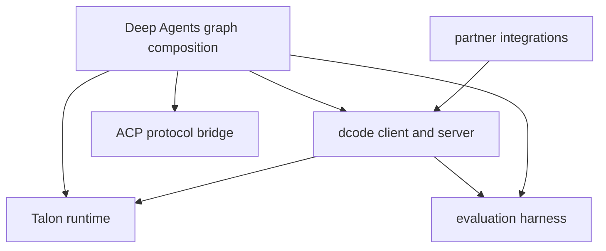
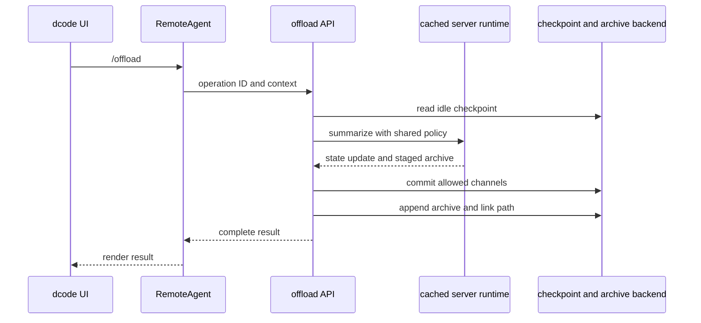
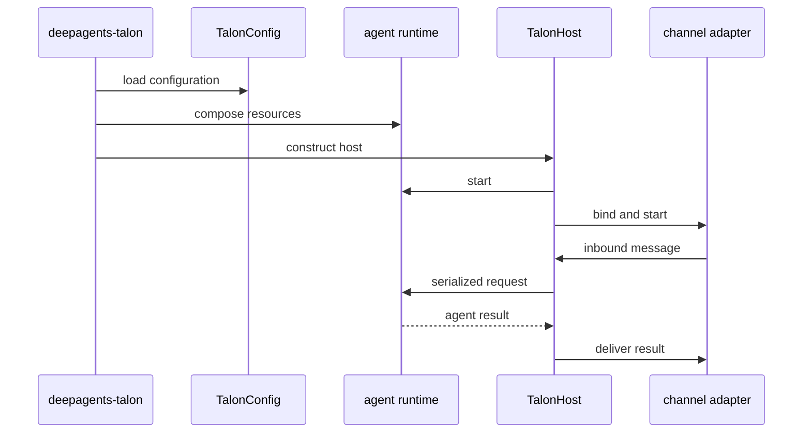

# System Source Map

This is a **change map**, not a source-tree inventory. Begin at the public boundary, then modify the owner of the relevant lifecycle, policy, or protocol contract. For execution details, see [overview](./overview.md), [dcode architecture](./code-agent.md), [runtime behavior](./runtime-behavior.md), [sandbox partners](../integrations/sandbox-partners.md), and the [testing guide](../testing/testing-guide.md).

## Change-routing table

| Change concern | Entrypoint or public surface | Owner to change | First focused regression seam |
| --- | --- | --- | --- |
| SDK graph composition | `deepagents.create_deep_agent` | `libs/deepagents/deepagents/graph.py` | `libs/deepagents/tests/unit_tests/test_graph.py`, then subagent or permission tests |
| dcode command startup | `deepagents-code` / `dcode` -> `deepagents_code:cli_main` | `libs/code/deepagents_code/main.py` | `libs/code/tests/unit_tests/test_main.py` |
| dcode server workspace policy | LangGraph `server_graph:make_graph` | `libs/code/deepagents_code/server_graph.py` | `libs/code/tests/unit_tests/test_server_graph.py` |
| dcode filesystem blob offload | `/offload` / `/handoff` on the built-in dcode server | HTTP coordination in `offload_api.py`; compaction in `offload_middleware.py`; storage routes in `agent.py` and `offload.py` | `libs/code/tests/unit_tests/test_offload_api.py`, `test_offload.py`, then `integration_tests/test_offload_server_side.py` |
| ACP protocol projection | `AgentServerACP` | `libs/acp/deepagents_acp/server.py` | `libs/acp/tests/test_agent.py` |
| Talon host | `deepagents-talon` -> `deepagents_talon.__main__:main` | CLI bootstraps, `TalonHost` routes and owns lifetime, runtime composes the graph | `libs/talon/tests/test_host.py`, `test_runtime.py` |
| Channel transport contract | `ChannelAdapter` and request/result records | `deepagents_talon/interfaces.py`, shared policy in `channels/base.py` | `libs/talon/tests/channels/test_base.py` plus provider tests |
| Pairing and scheduled revocation | host `/pair` plus `pairing` CLI | `pairing.py`, `host.py`, and cron store | `libs/talon/tests/unit_tests/test_pairing.py`, `tests/test_host.py` |
| MCP and subagent behavior | Talon runtime construction | `mcp.py`, `mcp_middleware.py`, `subagents.py`, `async_subagents.py` | `test_mcp_middleware.py`, `test_async_subagents.py` |
| Partner execution | partner distribution and dcode sandbox factory | provider package; dcode only for selection/install wiring | package-local tests |

```mermaid
flowchart TD
  SDK["Deep Agents graph composition"] --> Dcode["dcode client and server"]
  SDK --> ACP["ACP protocol bridge"]
  SDK --> Talon["Talon runtime"]
  Partners["partner integrations"] --> Dcode
  Dcode --> Talon
  Dcode --> Evals["evaluation harness"]
  SDK --> Evals
```

The diagram shows composition and dependency direction rather than a request sequence: products and adapters compose the SDK, while optional integrations are selected outside the SDK.

## SDK and dcode: composition versus product lifecycle

The `deepagents` package root is the stable Python import surface: it exports `create_deep_agent`, state, filesystem, subagent, async-subagent, memory, rubric, and harness/provider profile registration types. Keep import compatibility there; put graph semantics in `graph.py`.

`create_deep_agent` is the SDK graph-composition boundary: it resolves the model and profile, selects a default `StateBackend`, assembles built-in and caller tools with middleware, and compiles the resulting agent through LangChain's `create_agent`. Its default suite includes filesystem operations, `execute`, and `task`; `execute` returns an error when the selected backend does not implement the sandbox protocol. Harness profiles may tailor the stack, but cannot exclude `FilesystemMiddleware` or `SubAgentMiddleware`, because those supply filesystem tools and permission enforcement and the task tool; invalid or unmatched exclusions raise instead of silently degrading the agent.

`dcode` is a product host rather than a second graph owner. Both console aliases call the lazily exported `cli_main`; the lazy export keeps terminal startup imports out of ordinary package imports and turns an unresolvable Deep Agents home into a message and exit status 2. Its policy gate blocks policy-aware commands when managed configuration is unhealthy, but deliberately leaves `config`, `doctor`, and `auth path` available for diagnosis.

The server graph owns server-scoped resources and workspace isolation. It constructs and caches workspace-bound runtimes, rejects workspace policy and extension-trust drift on each access, rebuilds on runtime-identity changes without policy drift, and permits a process-wide sandbox to be claimed by only one workspace. Do not “fix” a workspace issue in the interactive client if the invariant belongs in this server-side binding and cache.

### dcode filesystem blob offload

`/offload` is a **server-owned** compaction transaction, not a client-side checkpoint edit. `RemoteAgent.aoffload` first ensures the thread and its workspace binding, posts one operation ID, and loops only to fulfill hook interrupts. The Starlette boundary rehydrates the checkpoint itself, rejects active, interrupted, or pending graph work, rechecks the checkpoint immediately before commit, and uses a per-thread lock plus an operation registry so conflicting, duplicate, and cancellation requests have defined outcomes. It writes only the allowlisted summarization and cost channels—never `messages`—then persists the archive through the same backend that the live agent uses. `/handoff` deliberately archives and returns a full-context summary for a new thread while leaving the source thread uncompacted.

```mermaid
sequenceDiagram
  participant UI as dcode UI
  participant Client as RemoteAgent
  participant API as offload API
  participant Runtime as cached server runtime
  participant Store as checkpoint and archive backend
  UI->>Client: /offload
  Client->>API: operation ID and context
  API->>Store: read idle checkpoint
  API->>Runtime: summarize with shared policy
  Runtime-->>API: state update and staged archive
  API->>Store: commit allowed channels
  API->>Store: append archive and link path
  API-->>Client: complete result
  Client-->>UI: render result
```

This sequence shows the normal server-side compaction path. Hook interrupts return to the client for fulfillment and restart the operation with accumulated responses; a changed checkpoint is rejected rather than overwritten.

Local mode maps large tool-result blobs and conversation archives through `CompositeBackend` routes. The normal artifacts directory is hardened; if it cannot be used, a stable virtual prefix routes large results to a private temporary directory. Conversation archives prefer `DEEPAGENTS_HOME` under `conversation_history` with a private subdirectory and writable probe, fall back to private temporary storage when necessary, and report that fallback as ephemeral. Retention cleanup deletes only expired regular Markdown archives, while session deletion removes both the per-thread archive and source-owned handoff snapshots. Preserve these routes when changing extensions: `agent.py` reserves them before extension routes are validated, so an extension cannot shadow the history or artifacts storage boundary.

## Talon: bootstrap, host protocols, and runtime boundaries

Talon is an experimental local runtime host. The `deepagents-talon` script targets `deepagents_talon.__main__:main`; package metadata currently identifies version `0.0.8`, requires Python 3.12 or newer, depends on `deepagents >=0.7.0` and `deepagents-code >=0.1.71,<1.0.0`, and exposes optional history, database, and media extras. The package root is Talon's public Python surface: it re-exports host/configuration, channel and agent protocol, request/result, cron, approval, and speech APIs, while loading `DeepAgentRuntime` and `EchoAgentRuntime` lazily.

The CLI first parses flags and command groups, loads `TalonConfig`, and dispatches `import-fleet`, MCP, and pairing administration without launching the host. For a host launch it creates and cleans assistant state, selects explicit or enabled WhatsApp, Telegram, Discord, and Slack adapters, and creates cron storage. A configured model opens the optional sandbox plus SQLite checkpoint and history resources before building `DeepAgentRuntime`; no model selects `EchoAgentRuntime`. A persistent scheduler is installed only if an output channel exists.

```mermaid
sequenceDiagram
  participant CLI as deepagents-talon
  participant Config as TalonConfig
  participant Runtime as agent runtime
  participant Host as TalonHost
  participant Channel as channel adapter
  CLI->>Config: load configuration
  CLI->>Runtime: compose resources
  CLI->>Host: construct host
  Host->>Runtime: start
  Host->>Channel: bind and start
  Channel->>Host: inbound message
  Host->>Runtime: serialized request
  Runtime-->>Host: agent result
  Host->>Channel: deliver result
```

This is the ownership sequence: the CLI obtains resources, `TalonHost` owns their start/stop and routing lifecycle, and the runtime owns graph composition and invocation.

`interfaces.py` is the integration seam, not an implementation detail. `ChannelAdapter` defines lifecycle, inbound handler registration, text/media delivery, editing, typing, and status; optional protocols add threaded conversations and reactions. The host passes an `AgentRequest` with trusted conversation ID, optional approval, authorization, and progress handlers, and an optional host-selected model; the runtime returns `AgentResult`, including background results that must be requeued if the host cannot deliver the reply. Change these records and protocols compatibly because every channel and runtime crosses this boundary.

`TalonConfig` namespaces assistant state below a validated assistant-specific home, creates state directories with restrictive permissions, and rejects generated checkpoint, conversation, model, and vector paths that escape that home. History defaults to local SQLite and otherwise selects a built-in or uniquely installed entry-point backend; it namespaces archives by assistant, bounds initialization, and replaces backend failures with configuration-safe errors. A configured Talon sandbox never falls back to host execution on startup failure; its host-lifetime session cleans up owned sandboxes but retains attached ones, and its backend exposes only assistant skills and memory on the host while routing other operations to the sandbox.

`TalonHost` serializes work by provider-scoped conversation roots, starts runtime then channels then scheduler with reverse-order unwind on partial startup, and on shutdown cancels active work while attempting every component stop. `ChannelAdapter` is the transport boundary between provider adapters and `TalonHost`; shared channel policy defaults to self exposure, requires an explicit acknowledgement for open exposure, and validates outbound media paths, type, and size before provider delivery. Put cross-provider exposure and media policy in `channels/base.py`, not in a provider adapter.

## Talon authorization, scheduling, and extensions

Pairing is a persistence and revocation boundary. It fails closed when its persisted store is unreadable or invalid, admits a paired sender only from the originating DM while environment-listed senders remain authoritative, and uses locked atomic updates with inode-aware caching so revocations are observed. `/pair` is accepted only from a configured operator in a direct message; after revocation, the host cancels the sender's active work and pauses or cancels cron work created in the revoked DM. Test the store and the host path together whenever changing revocation semantics.

`DeepAgentRuntime` owns Talon's `create_deep_agent` graph composition: startup resolves subagents and approvals, combines runtime tools, model selection and summarization middleware, task and background middleware, backend, skills, memory, and a checkpointer. Model selection discovers only providers credentialed in Talon's environment, validates exact `provider:model` selections before constructing and caching them, and applies a selected model and matching summarization budget per main-agent turn without recompiling the graph.

MCP is split deliberately. The provider independently loads available servers, prefixes and metadata-marks tools, adds management capabilities, rejects tool-name conflicts, and serializes revision-gated refreshes so a configuration change precedes a later agent turn. Middleware then wraps only those metadata-marked tools, removes empty optional string arguments, scopes authorization to one tool-call ID, and converts MCP protocol errors into a safe `ToolMessage`; unexpected exceptions remain visible to the caller. Local subagents run as fresh graphs with selected tools, MCP and applicable approval middleware, and no checkpointer; unsupported fork mode is rejected. Async-subagent configuration also fails closed, so one malformed definition cannot silently remove part of the configured capability set.

## Partner and evaluation surfaces

Sandbox integrations are independent partner distributions that depend on the Deep Agents SDK, and dcode exposes their providers as optional sandbox extras rather than owning provider-specific implementations. `langchain-quickjs` is a separate alpha distribution for JavaScript REPL middleware, currently version `0.3.8`, with a `deepagents>=0.7.0,<0.8.0` dependency; dcode retains an empty `quickjs` extra only for backwards-compatible install commands. Treat QuickJS changes as middleware-product changes, not sandbox-provider wiring.

`AgentServerACP` bridges a compiled Deep Agents graph or session-context factory to ACP; durable session loading is optional and requires a restart-surviving checkpointer, while shared conversion functions project streamed and replayed content consistently. The `deepagents-evals` distribution exposes a unified CLI for pytest evaluation trials, aggregation, drift reporting, chart generation, and discovery, with distinct exit statuses for evaluation failure, configuration failure, and no-report outcomes.

## Focused regression selection

- **SDK composition:** `libs/deepagents/tests/unit_tests/test_graph.py`; add `test_subagents.py` or `test_permissions.py` for those contracts.
- **dcode startup or policy:** `libs/code/tests/unit_tests/test_main.py`; use `test_server_graph.py` and `test_offload_api.py` when server resources or routes change.
- **dcode blob offload:** start with `libs/code/tests/unit_tests/test_offload_api.py` for request, checkpoint, conflict, cancellation, hook, and commit behavior; use `test_offload.py` for local storage, retention, cleanup, and UI behavior; then `libs/code/integration_tests/test_offload_server_side.py` for the built-in server path.
- **Talon host and protocol:** `libs/talon/tests/test_host.py`, `test_runtime.py`, `test_config.py`, and `unit_tests/test_configuration_hardening.py`.
- **Talon integration boundaries:** `tests/channels/test_base.py`, `unit_tests/test_pairing.py`, `tests/test_mcp_middleware.py`, `tests/test_async_subagents.py`, `unit_tests/test_model_selection.py`, `unit_tests/test_history_backends.py`, or `unit_tests/test_sandbox.py`, selected by owner.
- **ACP, partners, and evaluations:** start with each package's local tests; use evaluations to measure end-to-end product behavior rather than as the first test for an SDK primitive.
