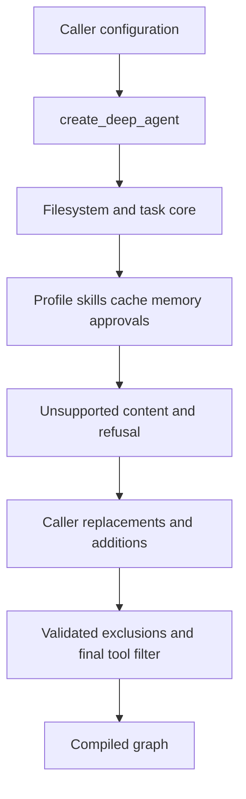
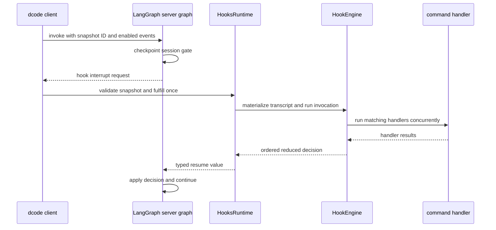
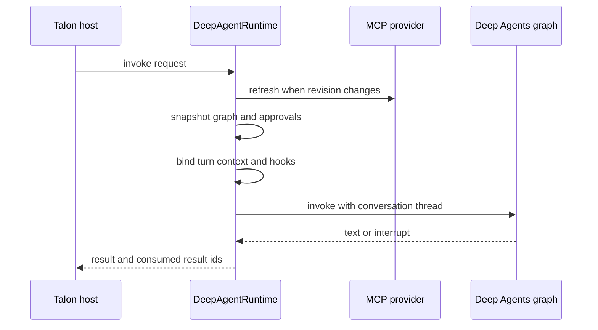

# Repository Source Map

Route a change to the component that owns its state and lifetime, not merely the API that exposes it. This map follows SDK and dcode entrypoints into graph construction, hook execution, terminal status, non-interactive and ACP-facing execution, Talon's long-lived runtime and archives, and release gates. See [Code Agent Architecture](./code-agent.md), [Hooks Lifecycle](../concepts/hooks-lifecycle.md), [Run a dcode Session](../workflows/run-dcode-session.md), [CI Labeling](../operations/ci-labeling.md), [Quickstart](../quickstart.md), and the [testing guide](../testing/testing-guide.md).

## Change routing

| Change affects… | Start at | Owner and boundary | Focused tests |
| --- | --- | --- | --- |
| SDK tools, profiles, middleware order, state schema, or injected persistence | `libs/deepagents/deepagents/graph.py` — `create_deep_agent` | The compiled graph; callers retain checkpointer, store, and cache ownership | `libs/deepagents/tests/unit_tests/test_graph.py` |
| Persistent store-backed filesystem behavior or tenant scoping | `libs/deepagents/deepagents/backends/store.py` — `StoreBackend` | Caller-owned `BaseStore` and validated namespace factory | `unit_tests/backends/test_store_backend.py`, `test_store_backend_async.py` |
| Synchronous or forked SDK subagent input, private-state filtering, result projection, or refusals | `middleware/subagents.py` — `SubAgentMiddleware` | The `task` boundary translates child output into parent state | `test_subagents.py`, `test_subagent_refusal.py` |
| Remote async SDK subagent lifecycle or notifications | `middleware/async_subagents.py` | Persisted `async_tasks` state and Agent Protocol lifecycle tools | `test_async_subagents.py` |
| dcode CLI launch, command dispatch, diagnostics, managed-policy admission, or headless final status | `libs/code/deepagents_code/main.py` — `cli_main` | Process-level bootstrap selects TUI, ACP, non-interactive, or command paths; headless status is finalized at the process boundary | `test_main.py`, `test_main_args.py`, `test_program_status.py` |
| dcode graph assembly, shell/approval policy, subagent middleware, hooks, skills, model selection, or checkout attribution | `libs/code/deepagents_code/agent.py` — `create_cli_agent` | The configured graph and its paired main/subagent middleware stacks | `test_agent.py`, `hooks/test_server_lifecycle.py`, `test_git_trace.py` |
| Hook configuration snapshot, transcript projection, client command execution, or handler reduction | `hooks/runtime.py`, then `hooks/engine.py` | A client-owned immutable `HooksRuntime` snapshot, transcript store, fulfillment ledger, and `HookEngine` | `hooks/test_engine.py`, hook runtime/client tests |
| Server lifecycle-event transport, hook state, tool denial/rewrite, post-tool behavior, or stop continuation | `hooks/server_middleware.py` — `ServerHooksMiddleware` | Private checkpointed hook fields and a per-turn snapshot/event gate; server emits interrupts but client executes handlers | `hooks/test_server_lifecycle.py` |
| Terminal program-status wire format, UI status precedence, prompt blocking, or cleanup | `program_status.py` | `ProgramStatusReporter` owns best-effort OSC 7501 records; `AgentStatusTracker` owns TUI activity state | `test_program_status.py` |
| dcode headless streaming, hook trust, approval loop, or script exit semantics | `client/non_interactive.py` | One headless thread/run and its client-owned stream state | `test_non_interactive.py` |
| dcode graph serving, offload operations, or local server lifecycle | `client/launch/server.py`; `offload_api.py` | Generated `langgraph.json`, private Starlette boundary, and `ServerProcess` | dcode server-launch and offload API tests |
| Talon graph wiring, tool replacement, approvals, MCP reload, or shutdown | `libs/talon/deepagents_talon/runtime.py` — `DeepAgentRuntime` | Runtime graph snapshot and invocation context variables | `libs/talon/tests/test_runtime.py`, `test_subagent_reload.py`, `test_mcp_config.py` |
| MCP configuration or loading | `mcp_config.py`, then `mcp.py` | Redacted revisioned configuration and provider refresh revisions | `test_mcp_config.py`, `test_mcp_enabled.py`, `test_mcp_adapter.py` |
| Fresh local children, task attachments, approvals, or follow-ups | `subagents.py`, `subagent_control.py` | Isolated child graph plus in-memory worker control | `test_research_subagents.py`, `test_subagent_control.py` |
| Detached task capacity, delivery, cancellation, or scheduled delegation | `background.py` | Process-memory job table keyed by owner conversation | `test_background.py`, `test_background_runtime.py` |
| Durable Store conversation history, retrieval scope, vectors, or deletion recovery | `store_archive.py` | One-writer archive records, optional separate vector Store, and deletion journal | `test_store_archive.py`, `store_archive_contract.py` |
| Conversation checkpoint/archive coordination, hook transcripts, voice, or host lifecycle | `archive_saver.py`, `hooks.py`, `speech.py`, then `host.py` | Caller-owned stores, trusted hook snapshot, inbound preparation, and host lifecycle | `test_archive_saver.py`, `test_hooks.py`, `test_speech.py`, `test_host.py` |
| Release-PR dependency metadata and installability | `.github/scripts/release/check_wheel_dep_freshness.py`, then `.github/workflows/check_dep_freshness.yml` | Built-wheel metadata compared with PyPI and sibling source metadata; workflow owns the release gate | release-script tests and workflow validation |
| Unintended multi-package release fan-out | `.github/scripts/release/check_lockfile_release_scope.py`, then `.github/workflows/release_please_scope_check.yml` | The script analyzes trusted release-please configuration; the workflow makes the blocking/comment decision | `scripts/tests/release/test_check_lockfile_release_scope.py` |

## SDK graph, state, and delegation boundary

`create_deep_agent` is the SDK construction seam: it accepts caller-provided backend, middleware, subagents, checkpointer, store, and cache dependencies, then passes persistence and state schema to the compiled graph. Its default `DeepAgentState.messages` uses `DeltaChannel` to avoid quadratic checkpoint growth. Treat middleware order and names as behavioral API: filesystem and optional synchronous task middleware form the core, followed by parent notification, summarization, patched tool calls, and optional remote delegation; profile extras, skills, caching, memory, approvals, unsupported-content handling, and refusal handling form the tail. A profile exclusion is validated against main and general-purpose stacks, and tool exclusion runs last so custom middleware cannot restore an excluded tool.

```mermaid
flowchart TD
  Input["Caller configuration"] --> Build["create_deep_agent"]
  Build --> Core["Filesystem and task core"]
  Core --> Tail["Profile skills cache memory approvals"]
  Tail --> Guard["Unsupported content and refusal"]
  Guard --> Custom["Caller replacements and additions"]
  Custom --> Exclude["Validated exclusions and final tool filter"]
  Exclude --> Graph["Compiled graph"]
```

*Graph assembly makes ordering, replacement, and final filtering explicit.*

Caller middleware with a matching name replaces its stack slot; a novel name is appended. Private fields declared by participating state schemas are added to `SubAgentMiddleware` only after caller replacements. `SubAgentMiddleware` owns synchronous child execution: ordinary children receive a task-only `HumanMessage`; forked children receive eligible parent state and reconstructed history; private keys are excluded in both cases and a compiled child without messages is rejected. Completion applies changed non-private state and projects one parent `ToolMessage`: structured response JSON, then a refusal notice, then the last non-empty AI text. Refusal errors are translated on both sync and async paths, while other structured-output validation failures propagate.

`ModelRefusalMiddleware` sits after unsupported-content handling, so caller fallback middleware sees a refusal first. By default a top-level refusal raises; excluding it leaves the refusal message observable. `RubricMiddleware` is inactive without a rubric; otherwise private state drives post-agent grading and revision without replacing the final visible response on a grading failure. Keep `test_graph.py` for assembly, schema, private-key, ordering, replacement, and exclusion invariants; use `test_subagents.py` and `test_subagent_refusal.py` for parent/child behavior and refusal projection.

`StoreBackend` is the persistent, cross-thread filesystem adapter. It uses an explicit `BaseStore` or obtains one from the LangGraph execution context, resolves a caller namespace factory against the runtime, and rejects empty, unsafe, or wildcard-like namespace components. Its Store values preserve text/binary encoding and metadata; sync and async CRUD/search paths paginate Store searches. Recursive deletion deliberately treats wildcard characters literally and removes only the exact key and descendants. Use both Store backend test modules when changing shared behavior or native async implementations.

Remote async SDK tasks are separate from Talon workers. `AsyncSubAgentMiddleware` exposes start, check, update, cancel, and list tools for Agent Protocol tasks, persists records under `async_tasks`, and polls unfinished tasks around async model calls. New terminal or waiting outcomes become labeled notifications; failed status reads are logged and retried on a later check. Completion projects terminal content blocks, with explicit no-output and string fallbacks plus normalized refusal handling.

## dcode process, hooks, and headless execution

`cli_main()` is the dcode process entrypoint. It keeps `--version` and selected help/diagnostic paths ahead of costly bootstrap, installs termination handlers before launch, and rejects policy-dependent commands when managed configuration is unhealthy while preserving diagnostic paths. For a non-interactive invocation it starts a `ProgramStatusReporter` in `working` state, runs `run_non_interactive()` under the optional wall-clock timeout, and reports the final `done`, `error`, or `clear` status in `finally`. Thus status output is an observational process concern, not a source of exit semantics.

`create_cli_agent()` turns CLI/server snapshots into a Deep Agents graph and composite backend, resolves local subagents and approval policy, and composes feature middleware. Main and declarative-subagent stacks are coupled: policy or telemetry installed on only one path can make child behavior diverge. `ServerHooksMiddleware` is deliberately present on both stacks; subagents disable their own `Stop` event while the parent wrapper produces `SubagentStart` and `SubagentStop`. When enabled, `GitTraceMiddleware` is also installed in both stacks; it excludes known read-only operations, attributes checkout changes to the initiating turn, never changes tool results, and backs off then disables optional probes after repeated failures.

### Hook execution and enforcement boundary

`HooksRuntime.create()` resolves workspace trust, loads and freezes a configuration snapshot, creates the client transcript store and `HookEngine`, and exposes the snapshot ID plus the configured server-event names. Project hooks are only loaded for trusted workspaces, and `HooksRuntime.invoke()` rejects execution if a project source somehow exists without that trust. A fulfillment ledger deduplicates concurrent or repeated deliveries by `(snapshot_id, invocation_id)`; the client also rejects a server request whose snapshot ID does not match its runtime.

`HookEngine` serializes the native invocation into the hook envelope, starts every matching command handler concurrently with independent timeout and output limits, and reduces results in stable configuration order rather than completion order. Its command environment is sanitized; plugin handlers add their declared environment. Projection failures become diagnostics and only fail closed when a matching handler has `onError: deny`; progress callback failures are logged rather than allowed to affect the hook decision.

```mermaid
sequenceDiagram
  participant Client as dcode client
  participant Graph as LangGraph server graph
  participant Hooks as HooksRuntime
  participant Engine as HookEngine
  participant Handler as command handler
  Client->>Graph: invoke with snapshot ID and enabled events
  Graph->>Graph: checkpoint session gate
  Graph-->>Client: hook interrupt request
  Client->>Hooks: validate snapshot and fulfill once
  Hooks->>Engine: materialize transcript and run invocation
  Engine->>Handler: run matching handlers concurrently
  Handler-->>Engine: handler results
  Engine-->>Hooks: ordered reduced decision
  Hooks-->>Graph: typed resume value
  Graph->>Graph: apply decision and continue
```

*The server owns graph-safe lifecycle placement; the trusted client snapshot owns handler execution and response fulfillment.*

`ServerHooksMiddleware` is the graph-side bridge. At each independent turn it checkpoints a private gate containing the expected snapshot ID and enabled events; every resume must carry the same values or the middleware raises rather than mixing hook configurations mid-turn. Its private state is excluded from public graph I/O and subagent result merges, but remains checkpointed to survive interrupts and resumes. It emits `PreCompact`, `PreToolUse`, `PostToolUse`, `PostToolUseFailure`, `Stop`, `SubagentStart`, and `SubagentStop` only when enabled by that gate.

The lifecycle ordering is intentional: pre-tool decisions are calculated after the model and before downstream approval routing; a deny returns an error `ToolMessage`, while an explicit allow prevents duplicate stock approval. A hook may rewrite only a local `execute` command under the allowed decision conditions. After a tool result is checkpointed, pending duration bookkeeping causes post-tool or post-failure handlers to run before the next model call; post handlers must preserve the committed `ToolMessage`. `Stop` can add feedback and jump back to the model while maintaining a turn-local continuation count. Server operations outside a graph use a `BaseException` transport signal and replay answered invocation IDs from a context-local map, preserving resumability across HTTP boundaries.

`run_non_interactive()` owns a single headless task: it selects or reserves its thread, optionally runs startup work and prepares skill metadata, starts the sandbox and local LangGraph server session, then streams the remote graph. Default headless policy disables shell access when no allow-list is configured and otherwise gates shell commands; project hooks require explicit trust. The stream loop holds client-side hook/transcript/tool-call state, resumes HITL and hook interrupts, and caps total turns at `--max-turns` or the internal 50-turn default to prevent rejection loops. Quiet mode directs diagnostics to stderr while response text remains on stdout; a turn-budget failure returns 124.

`ServerProcess` owns the `langgraph dev` subprocess. Generated LangGraph configuration always registers the agent graph, while only dcode's built-in graph adds the authenticated, thread-scoped offload Starlette application. The lifespan wakes queued runs, prebuilds a default runtime during health polling, cancels that work before extension shutdown, and makes a bounded best-effort trace flush.

### Terminal status is cosmetic, bounded, and separate from the graph

`program_status.py` implements OSC 7501 status records for compatible terminals. `ProgramStatus` validates protocol combinations and IDs; the encoder sanitizes control characters, truncates UTF-8 safely within field budgets, base64-encodes text, and enforces the whole-sequence cap. `ProgramStatusReporter` is thread-safe, de-duplicates unchanged per-record reports, tracks subtree clears, registers cleanup after its first successful record unless configured to preserve a one-shot result, and never lets invalid input or a write failure crash dcode. Its shared writer prefers `/dev/tty`, falls back only to a real stderr TTY, and honors `DEEPAGENTS_CODE_NO_TERMINAL_ESCAPE=1`.

The TUI owns an `AgentStatusTracker`, not the graph. It derives the root record from `AgentActivity`: the newest outstanding user prompt takes precedence over working, which takes precedence over the prior outcome. Starting work clears the prior outcome; closing a blocker returns a non-error outcome to idle but leaves an error visible; a new conversation drops transcript-mounted prompts. `refresh()` deliberately re-sends the current value after terminal suspension, and `close()` clears records then prevents later writes. Headless mode uses `clear_on_exit=False`, so a final success or failure survives process exit while unknown or interrupted exits clear the status.

## Talon runtime: compile first, swap after success

`DeepAgentRuntime.start()` resolves subagents and approvals before building the initial graph. `_create_graph()` builds the current tool catalog, resolves local names, prepares subagents, then provides Talon middleware and dependencies to `create_deep_agent`. Invocation refreshes tools before the tool lock, reconstructs for an approval change under that lock, and snapshots graph and approvals into context variables before binding authorization, background results, cron origin, breakout handling, and hook snapshot.

```mermaid
sequenceDiagram
  participant Host as Talon host
  participant Runtime as DeepAgentRuntime
  participant Provider as MCP provider
  participant Graph as Deep Agents graph
  Host->>Runtime: invoke request
  Runtime->>Provider: refresh when revision changes
  Runtime->>Runtime: snapshot graph and approvals
  Runtime->>Runtime: bind turn context and hooks
  Runtime->>Graph: invoke with conversation thread
  Graph-->>Runtime: text or interrupt
  Runtime-->>Host: result and consumed result ids
```

*Reload precedes the stable per-turn snapshot, so a turn cannot observe a mid-turn replacement.*

`_replace_runtime_tools()` compiles replacement tools before assigning `tools` and `_graph`; failed explicit or automatic reloads retain the old graph. `MCPToolProvider` uses refresh revisions to defer loading until a later turn or forced reload. `MCPConfigStore` serves redacted, revisioned configuration and atomically replaces a validated server under a sidecar lock; automatic approval cannot reuse a redacted secret while changing a field that could redirect it.

`ConversationSaver` bridges caller-owned checkpoint and archive stores. It checkpoints before appending changed top-level scoped messages, leaves archive failure retryable because no cross-store transaction exists, waits for both writes on cancellation, and refuses active-session deletion. Hook transcripts reside in a hashed owner directory guarded against symlink and revocation-marker races; `TalonHooks` snapshots trust per turn, assigns child identities, and validates interrupt ownership before caching responses.

`StoreConversationArchive` is the Store-native history owner. It requires a caller-owned metadata Store with read-after-write consistency and, when semantic search is used, a separate vector Store. Archive setup recovers durable records before retrieval or indexing; append registers the trusted scope, deduplicates message revisions, and only indexes user text or host-confirmed delivered replies. Reads recheck live scope/session ownership and enforce a bounded scan rather than claiming an incomplete page. Deletion removes vectors before text and records an in-progress deletion marker, so interrupted deletion can resume without exposing a deleting session.

## Talon delegation and host lifecycle

Local Talon subagents come from `AGENTS.md` frontmatter, resolve exact tools from the current catalog, and run fresh rather than forked. `TaskTools` is the only parent task tool: it validates per-task tool attachments and compiles an isolated child graph with only applicable approvals.

`BackgroundSubagents` detaches ordinary main-agent task calls into owner-scoped in-memory workers with capacity and ownership controls. It runs scheduled-turn delegation inline under a timeout so the same unattended turn receives the result; nested delegation is refused. Detached workers use a distinct task thread, clear authorization and approval-operator state, convert interruption, timeout, or failure into safe results, and acknowledge delivery only after parent consumption. `SubagentControl` keeps bounded metadata and coordinator receipts outside graph state; only Talon-built workers accept queued follow-ups at a later model boundary.

`TalonHost` starts runtime before channels and scheduler, reverses partial startup on failure, and during shutdown cancels host work before stopping channels, scheduler, and runtime while isolating stop failures. Voice transcription is best effort before media staging: it preserves the original message on disabled, failed, or empty transcription and appends successful text with `voice_transcribed`.

## Package compatibility and release touchpoints

The dcode and Talon manifests define the published compatibility envelope and workspace edge between packages. dcode pins `deepagents` exactly; Talon consumes `deepagents` and `deepagents-code`, maps both to editable sibling sources locally, and defines mutually exclusive `media` and `media-cpu` extras. Change a package API with corresponding consumer floors, pins, extras, and lockfiles in view.

For a release-please PR, `check_dep_freshness.yml` first identifies the release target, reports dependency-minimum freshness, builds exactly one wheel with its release Python version, then invokes `check_wheel_dep_freshness.py validate` and performs a PyPI-only installation. The wheel validator parses `METADATA`, ignores self-dependencies and inapplicable markers, rejects direct URL requirements, fetches PyPI metadata concurrently, and requires compatible published Python coverage. Repo-managed sibling dependencies must match their current source `Requires-Python`; a third-party gap only on unreleased future CPython minors is a warning, while missing metadata, direct URLs, released-version gaps, or stale sibling metadata fail the gate. It returns 2 for indeterminate PyPI queries and 1 for incompatible metadata.

The separate release-please scope gate protects against accidental multi-component releases. The detector derives bump-worthy conventional-commit types, managed package paths, components, and exclusion paths from `release-please-config.json`; a bump-worthy title paired with release-relevant changes in two or more packages is reported as `multi_component`. Files under a package's `exclude-paths`, including package tests and lockfiles, do not count. The detector prints a report and leaves blocking to the workflow. That workflow checks out the PR base revision before executing the detector and reading configuration, obtains the changed-file list from the GitHub API, fails closed when the list is incomplete, and supports an explicit `ci:allow-lockfile-release` acknowledgement label for intentional fan-out. Keep workflow edits and branch protection in the threat model: base checkout prevents detector/config self-bypass, but the PR-head workflow still needs review and required-check enforcement.

## Focused test plan

- For graph construction, begin with `libs/deepagents/tests/unit_tests/test_graph.py`; select schema/private-state and ordering/replacement cases.
- For Store-backed files, pair `unit_tests/backends/test_store_backend.py` with `test_store_backend_async.py`; cover context/explicit stores, namespace rejection, pagination, binary encoding, literal recursive delete, and parity.
- For child semantics, begin with `test_subagents.py`; add `test_subagent_refusal.py` and `test_async_subagents.py` when changing projection, refusal, or remote task lifecycle.
- For hook execution, begin with `libs/code/tests/unit_tests/hooks/test_engine.py` for concurrent ordered reduction, handler error policy, timeouts, projection, environment, and output limits. Use `hooks/test_server_lifecycle.py` for actual graph boundaries: private state must not merge back from children, deny/rewrite and approval ordering, checkpoint/resume, MCP projection, post-tool dispatch, and stop/subagent events.
- For terminal status, use `libs/code/tests/unit_tests/test_program_status.py`; retain wire-format validation, byte-boundary sanitization, deduplication/clear behavior, no-terminal-escape operation, status precedence, blocker cleanup, and headless final-status coverage.
- For dcode headless changes, use `libs/code/tests/unit_tests/test_non_interactive.py` for streaming, hook trust, quiet routing, interrupt/resume, and turn-budget behavior; pair CLI admission or final-status changes with `test_main.py`, `test_main_args.py`, and `test_program_status.py`.
- For runtime or MCP edits, cover unsuccessful replacement and subsequent-turn activation in `libs/talon/tests/test_runtime.py`, then configuration redaction/CAS/secret-redirection in `test_mcp_config.py`.
- For durable history, begin with `libs/talon/tests/unit_tests/test_store_archive.py` and the shared `store_archive_contract.py`; retain scope isolation, deduplication, bounded retrieval, vector deletion, and restart recovery coverage.
- For detached work, use `test_background.py` for owner isolation, capacity, authorization stripping, acknowledgement/requeue, delivery failure limits, and scheduled inline semantics.
- For release-gate changes, exercise parser/metadata-comparison cases for `.github/scripts/release/check_wheel_dep_freshness.py` and preserve workflow coverage for target selection, built-wheel validation, and PyPI-only installation. For fan-out changes, pair `.github/scripts/tests/release/test_check_lockfile_release_scope.py` with the base-checkout, changed-file completeness, bypass-label, and fail-closed behavior in `release_please_scope_check.yml`.
