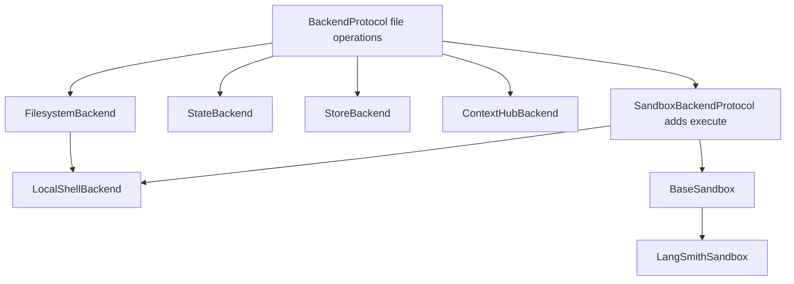
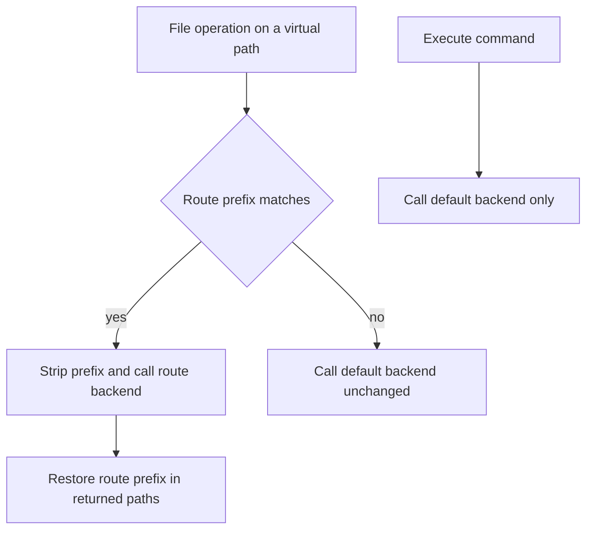

# Backends and Storage Routing

A **backend** is the implementation boundary behind agent file operations: it determines where files are stored, their persistence scope, and whether a shell is available. It is not itself a model-visible tool or a permission policy. [Filesystem middleware](/openwiki/concepts/tools-filesystem.md) exposes and dispatches model-visible file tools (`ls`, `read_file`, `write_file`, `edit_file`, `delete`, `glob`, and `grep`) to a backend; it exposes `execute` only when the selected backend supports execution. Tool allowlists and [permissions/HITL](/openwiki/concepts/permissions-hitl.md) are separate controls.

## Contract and capability boundary

All implementations use `BackendProtocol`, an abstract base whose operations default to `NotImplementedError`; an implementation may support only a subset. Its file-oriented surface includes listing, paginated reads, literal grep, glob, write, edit, delete, and file upload/download. These operations live on the base rather than on the shell-capable subtype because state and store implementations have no process to execute and implement searching in Python.

The contract returns typed result dataclasses rather than using exceptions for ordinary operational failures. For example, `ReadResult`, `WriteResult`, `EditResult`, `DeleteResult`, `LsResult`, `GrepResult`, and `GlobResult` carry data or an `error` string. `ReadResult` validates its pagination metadata at construction: a result cannot describe a backward or partial window, a file shorter than its shown range, or a resume offset that skips a line. A non-positive read limit is a distinct uninspected-window case (`no_lines_requested`), rather than evidence of an empty file.

`grep` searches a **literal** string, not a regular expression, and supports a total `max_count` cap; result types report incomplete searches with `truncated` (and glob additionally reports whether incompleteness came from `budget`, `unreadable`, or `transport`). Backends return raw content and metadata: line-number gutters are added later by middleware. This distinction matters when implementing a backend—do not replace the contract with arbitrary shell `grep` or `find` behavior. Upload and download return one typed response per input, in input order, allowing a batch to report partial success.

Every synchronous operation has an async twin. The default async wrappers use `asyncio.to_thread`; `agrep` additionally applies a 35-second wait bound and enforces `max_count` even for older concrete implementations that do not accept that keyword. The wait bound limits the caller's wait, not the already-started worker thread. `delete` is optional, so callers use `_supports_delete` rather than probing it by calling the base implementation.

### Search bounds

- `DEFAULT_GREP_TIMEOUT` is 15 seconds for one synchronous grep phase.
- `ASYNC_GREP_TIMEOUT` is 35 seconds: enough for the filesystem ripgrep phase plus its Python fallback, with headroom.
- `ASYNC_GLOB_TIMEOUT` is 30 seconds for a sandbox glob round trip.

The sandbox glob script independently limits its walk to 5 seconds, 1,000 brace expansions, and 10,000 matches. The outer async bound still matters because interpreter startup, remote transport, and result transfer are outside that script budget; a wedged remote sandbox must not block a tool caller indefinitely.

## Files versus shell execution

`SandboxBackendProtocol` extends the file protocol with an `id` and `execute()`/`aexecute()`. This is a capability marker: a backend that does not implement it has no shell. Middleware tests this capability before making `execute` available, and conditionally forwards a timeout after inspecting whether the backend's `execute` signature supports it for compatibility with older backend packages.

`BaseSandbox` is the extension point for execution environments. A concrete subclass supplies the execution primitive, `upload_files()`, `download_files()`, and `id`; the base derives file listing/searching/globbing, paginated reading, writing, and editing through commands and transfers. These helpers do **not** reduce the trust boundary of the subclass's `execute`. Sandbox reads cap rendered text at `MAX_OUTPUT_BYTES = 500 * 1024` and append `TRUNCATION_MSG`; binary previews have the corresponding size limit.

The file contract is universal; shell execution is an explicit additional capability.

## Storage implementations and persistence scope

| Backend | Storage and lifetime | Shell |
| --- | --- | --- |
| `StateBackend` | LangGraph `files` state; within a conversation thread, checkpointed after steps, not shared across threads | No |
| `StoreBackend` | LangGraph `BaseStore`, scoped by a namespace factory and persistent across threads/conversations | No |
| `FilesystemBackend` | Real files beneath a configured local root | No |
| `LocalShellBackend` | Local files plus the host process environment | Yes, unrestricted host shell |
| `LangSmithSandbox` | Files and commands in an isolated LangSmith sandbox | Yes |
| `ContextHubBackend` | Persistent remote LangSmith Hub agent repository | No |
| `CompositeBackend` | A routing layer over the above | Only if its default supports it |

### State and store

`StateBackend` is the default when `FilesystemMiddleware` receives no backend. It accesses the `files` channel through LangGraph's Pregel `CONFIG_KEY_READ` and `CONFIG_KEY_SEND`. Reading with `fresh=True` makes writes queued in a superstep visible to a later read in that same superstep; sends commit at the node boundary. It therefore requires graph execution context and fails clearly outside one. See [State & persistence](/openwiki/concepts/state-persistence.md) for the checkpointing model.

`StoreBackend` is the cross-thread alternative. Its caller supplies a `NamespaceFactory`, commonly to isolate a user or assistant. Namespace components are validated so wildcard/glob syntax cannot change store lookup scope. Supply a `BaseStore` directly for standalone use, or let the backend resolve it from LangGraph at call time; a runtime-dependent namespace factory likewise requires graph context. It uses native asynchronous store operations for read, write, edit, delete, and paginated search rather than the protocol's thread wrapper.

### Disk and execution environments

`FilesystemBackend(root_dir, virtual_mode=True)` maps virtual paths under `root_dir`, rejects traversal (`..`, `~`), and verifies resolved paths remain within that root. This is a path guardrail and stable virtual-path behavior—particularly useful under a composite—not a sandbox or process isolation boundary. Setting `virtual_mode=False` allows absolute paths and relative traversal beyond `root_dir`; use only in trusted workflows. Its configurable `max_file_size_mb` skips overly large files in the Python grep fallback.

`LocalShellBackend` combines `FilesystemBackend` with shell capability. Its default command timeout is 120 seconds and command output capture defaults to 100,000 bytes. It runs commands on the host with the user's permissions; virtual-mode file restrictions never constrain commands. By default its command environment is empty unless an `env` mapping is supplied; `inherit_env=True` copies the parent environment before applying that mapping. Do not treat it as a safe production sandbox: it can read secrets, alter the machine, and bypass tool-level path restrictions. Use a dedicated trusted environment and HITL where appropriate.

`LangSmithSandbox` is a `BaseSandbox` implementation wrapping an existing isolated LangSmith sandbox. It opts into BaseSandbox capture-at-source output offload, and caches its asynchronous SDK client for the event loop that first uses it. Consult [sandbox partners](/openwiki/integrations/sandbox-partners.md) for integration setup.

`ContextHubBackend(identifier, client=None)` maps paths to a LangSmith Hub agent repository (`owner/name` or `-/name`). It pulls a snapshot into a cache, recognizes linked agent/skill entries, and persists file mutations as commits. Accepted mutations are visible through a local overlay while a worker batches them briefly, then each mutating call waits for the commit outcome. On Hub conflicts it refreshes and rematerializes intents before retrying, so edits are checked against current content instead of blindly replayed. It has no `execute` implementation.

## Composite storage routes

`CompositeBackend` composes a default backend with a map of virtual path prefixes. Routes are sorted longest-prefix-first for path routing, so a more-specific mount wins. For a routed operation, the prefix is removed before delegation and returned file, grep, and glob paths are restored with that prefix. The exact route root (for example `/memories`) is passed to its backend as `/`; unmatched paths go unchanged to the default backend.

Composite file routing strips and restores virtual prefixes, while command execution always uses the default backend.

At `/`, `ls` combines entries from the default backend with synthetic directory entries for each route. Root `glob` merges and sorts results; root `grep` searches the default then routes while preserving that accumulation order. Both surface the first backend error rather than claiming partial success, and combine truncation state. For glob, `unreadable` takes precedence over a simultaneous `budget` reason because narrowing a query cannot recover unreadable files. A root-anchored glob pattern that does not explicitly target a route skips that route, preserving the shared anchoring semantics.

For a root-wide `grep`, `max_count` is global: the composite passes each route only the remaining budget and stops after it is exhausted. Because it cannot know whether unvisited routes would match, reaching the cap is conservatively marked truncated even if later routes would have contributed nothing.

Execution is deliberately **not** path-routable. `CompositeBackend.execute()` delegates only to `default` and raises `NotImplementedError` if it is not a `SandboxBackendProtocol`; middleware makes the same default-backend check. This allows a common design such as a sandbox default for working files and shell execution, plus a `StoreBackend` mounted at `/memories/` for durable memory. Do not assume a virtual route's file path is a shell path: a routed backend may have no host mapping at all.

Although a composite advertises delete support, a particular route may not implement deletion. In that case it converts the route's `NotImplementedError` into a `DeleteResult` error rather than leaking the exception. Composite upload and download batch paths by underlying backend, make one batch call per target backend, and restore the original input order and virtual paths in their responses.

## Middleware, tools, and permissions are separate layers

`FilesystemMiddleware` resolves `self.backend` to a local `resolved_backend` before a tool dispatch. It accepts initialized backend objects, not callable factories (removed in deepagents 0.7), selects the state schema when a state backend is present, and supports a tool allowlist. Listing `execute` or `delete` in that allowlist does not manufacture missing backend capability.

For a composite with `LocalShellBackend` as its default, a routed `FilesystemBackend` can be described to the model as a virtual-prefix-to-host-path mapping. A store route or a local filesystem route paired with a remote sandbox default has no shell-visible host mapping and must be accessed through file tools.

Permissions are enforced by middleware tool implementations, not by `BackendProtocol` as a general authorization system. Because shell commands can bypass path-level file checks, middleware rejects tool-level permissions when an execution-capable backend is in use unless every permission path is scoped to composite routes. Configure [permissions and HITL](/openwiki/concepts/permissions-hitl.md) independently; choose an isolated sandbox rather than relying on virtual paths or permissions to contain a host shell.

## Selection guide and verification focus

- Use the default `StateBackend` for scratch files that should follow one thread.
- Use `StoreBackend` for namespace-scoped memory shared across threads.
- Use `FilesystemBackend` for trusted local project files without a shell.
- Use `LocalShellBackend` only for trusted local development or tightly controlled CI.
- Use `LangSmithSandbox` or another properly implemented `BaseSandbox` subclass for isolated command execution.
- Use `ContextHubBackend` when files should be durable, remotely versioned Hub content.
- Use `CompositeBackend` when persistence scopes must coexist; deliberately choose the default because it determines command capability.

Focused coverage in `tests/unit_tests/backends/test_composite_backend.py` exercises prefix routing, route-root normalization, result remapping, root listings, aggregation errors and truncation, execution delegation, and batch transfer behavior. The companion async composite suite covers the asynchronous equivalents; protocol, filesystem, state, store, sandbox, local-shell, and context-hub suites cover each implementation and its edge cases.
