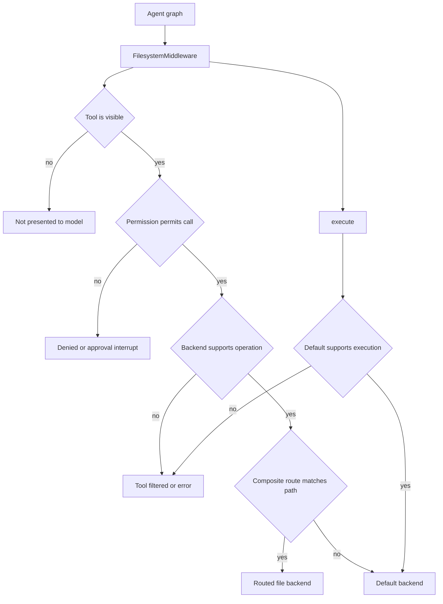

# Backends and Execution Environments

A **backend** is the implementation boundary for an agent's files: it selects their storage location and lifetime and, optionally, the command-execution environment. It is neither the list of tools presented to the model nor an authorization policy. `FilesystemMiddleware` dispatches filesystem tools to the selected backend, while `create_deep_agent` passes the same backend to skills, memory, summarization, and subagent facilities. Thus backend choice also determines where evicted tool output, offloaded conversation content, and backend-sourced skills can be retrieved. See [context management](/openwiki/concepts/context-management.md), [state persistence](/openwiki/concepts/state-persistence.md), and [filesystem tools](/openwiki/concepts/tools-filesystem.md).

## Three separate controls

1. **Tool visibility** — `FilesystemMiddleware(tools=...)` is an allowlist for model-visible filesystem tools. An explicit list must contain `read_file`; omitted tools are not offered. Capability-gated names do not manufacture a capability: `execute` and `delete` disappear when the resolved backend cannot serve them.
2. **Backend capability** — `BackendProtocol` provides file operations; `SandboxBackendProtocol` is the distinct marker for `id`, `execute()`, and `aexecute()`. A composite has execution only when its *default* backend is execution-capable.
3. **Authorization** — filesystem permissions are evaluated by middleware at the built-in tool boundary, not by direct `BackendProtocol` calls. Rules are ordered, first-match-wins; `deny` returns an error and `interrupt` invokes human approval. They do not confine a shell.

This routing flow separates what the model can call, what the backend can do, and whether middleware authorizes the call.

When permissions are configured with an execution-capable backend, middleware rejects the configuration unless all permission paths are scoped to composite routes. This avoids implying that path permissions constrain arbitrary commands. Use an isolated execution backend and approval policy rather than treating virtual paths as a security boundary; see [security](/openwiki/operations/security.md).

## Uniform contract and failure model

All backend implementations conform to `BackendProtocol`, an abstract base whose individual operations default to `NotImplementedError`; a backend can implement a subset. File operations (`ls`, paginated `read`, `write`, `edit`, optional `delete`, `glob`, `grep`, upload, and download) deliberately belong to this base contract rather than the shell subtype: `StateBackend` and `StoreBackend` have no process to execute and implement search in Python.

Expected operational failures use typed result dataclasses—such as `ReadResult`, `WriteResult`, `EditResult`, `DeleteResult`, `LsResult`, `GrepResult`, and `GlobResult`—with an `error` string, rather than exceptions. `ReadResult` enforces a coherent forward pagination window: start/end are paired, `total_lines` covers the displayed range, and `next_offset` is exactly the first unshown line. A non-positive limit is represented as `no_lines_requested`, distinguishing an uninspected window from an empty file.

Search behavior is shared across implementations. `grep` performs literal—not regex—matching, returns structured matches, and accepts `max_count`; `glob` returns a structured result with incomplete-search reasons where known. Both filesystem permissions and backend path rules still apply. Use `execute` only when shell-specific regex or command behavior is deliberately required, not as a replacement for the portable file contract.

Every synchronous method has an async twin. Default async implementations use `asyncio.to_thread`; `agrep` waits at most `ASYNC_GREP_TIMEOUT` (35 seconds), supports old implementations that lack `max_count`, and trims afterward. `DEFAULT_GREP_TIMEOUT` is 15 seconds, while `ASYNC_GLOB_TIMEOUT` is 30 seconds. The latter is necessary even though sandbox glob has a five-second walk budget and match/expansion caps: process startup, RPC, and transfer can still wedge. These timeouts bound the await, not necessarily a thread already running.

`delete` is explicitly optional; callers test `_supports_delete` instead of invoking the base method to probe it. Upload and download are batch APIs with one typed response per supplied input in the original order, so partial success is representable.

## Storage and execution choices

| Backend | Files and persistence | Execution boundary |
| --- | --- | --- |
| `StateBackend` | `files` in LangGraph state; checkpointed within one thread, not shared across threads | None |
| `StoreBackend` | `BaseStore`, namespace-scoped and cross-thread persistent | None |
| `FilesystemBackend` | Real files beneath a local root | None |
| `LocalShellBackend` | Local files plus host working directory | Unrestricted host shell |
| `LangSmithSandbox` | Files in an existing LangSmith sandbox | Isolated LangSmith sandbox |
| `ContextHubBackend` | Remote, commit-backed LangSmith Hub repository | None |
| `CompositeBackend` | Default storage plus prefix-mounted backends | Default backend only |

### State, durable memory, and artifacts

`StateBackend` is the default when no backend is supplied. It accesses the `files` state key through LangGraph Pregel's `CONFIG_KEY_READ` and `CONFIG_KEY_SEND`; reads use `fresh=True` so a write is visible within the same superstep, then the update commits at the node boundary. It requires graph execution context and raises `RuntimeError` outside it. This is appropriate for thread-local scratch data, including default artifact offload—not shared durable memory.

`StoreBackend` adapts `BaseStore` for durable, cross-thread data. Its `NamespaceFactory` is the isolation decision (for example, per user or assistant); components are validated to prevent glob/wildcard injection. It uses an explicitly supplied store or resolves one with `get_store()` at call time, and its native async APIs avoid unnecessary thread wrappers. A runtime-dependent namespace factory and an implicit store require graph context.

`CompositeBackend` additionally has `artifacts_root`, used by middleware for offloaded artifacts. Therefore, select an artifact path that resolves to a backend with the desired lifetime and access scope; model-visible paths are backend paths, not necessarily OS paths.

### Local filesystem and shells

`FilesystemBackend(root_dir, virtual_mode=True)` maps virtual paths below `root_dir`, blocks traversal, and confirms the resolved result remains below the root. It is a useful guardrail and stable path model for routing, **not** process isolation. With `virtual_mode=False`, absolute paths and relative traversal may escape `root_dir`. Its `max_file_size_mb` limits files examined by the Python grep fallback.

`LocalShellBackend` extends `FilesystemBackend` and `SandboxBackendProtocol`. Its default command timeout is 120 seconds; commands run through the host shell with the user’s permissions, and virtual mode constrains file operations only—not `execute`. Its environment starts empty unless `env` is supplied or `inherit_env=True`; inheritance copies `os.environ` before explicit overrides. It is appropriate only for trusted local development or controlled CI, never as an isolation mechanism.

`BaseSandbox` is the extension point for a real execution environment. Subclasses implement `execute()`, transfer methods, and `id`; the base derives filesystem functions with commands and transfers. The helpers inherit, rather than narrow, the execution trust boundary. Sandbox reads cap rendered text at 500 KiB and append `TRUNCATION_MSG`. `LangSmithSandbox` supplies this contract for an isolated LangSmith sandbox, enables capture-at-source execution-output offload, and caches its async client per event loop. See [sandbox partners](/openwiki/integrations/sandbox-partners.md).

`ContextHubBackend` supplies no shell. It overlays accepted pending and in-flight mutations over its local cache, batches changes briefly, waits for each mutation’s commit outcome, and refreshes/rematerializes intents before retrying a Hub conflict. This gives reads a coherent local view while retaining remote commit-backed persistence.

## Composite path routing

`CompositeBackend` takes a `default` backend and prefix routes. It sorts routes longest-prefix-first. For file operations, it selects a matching route, strips its prefix before delegation, and re-maps returned paths; the exact route root maps to `/`, while unmatched paths go to `default` unchanged.

At the virtual root, `ls` combines default entries with synthetic route directories. Root-wide `grep` and `glob` aggregate results but return the first backend error rather than partial success. `grep` shares a global `max_count` across backends, passing remaining capacity to each route and conservatively marking exhaustion truncated. A root-anchored glob skips a route unless the pattern explicitly targets that prefix; glob merging preserves an `unreadable` truncation reason over a simultaneous budget limit.

Execution is never path-routed: `CompositeBackend.execute()` delegates exclusively to `default` and raises `NotImplementedError` without a sandbox-capable default. A route may therefore hold durable `StoreBackend` memories while a sandbox default hosts commands. Do not pass a routed virtual path blindly to a shell. Middleware can describe a virtual-to-host mapping only when the default is `LocalShellBackend` and that route is a `FilesystemBackend`; remote sandbox and store routes remain file-tool-only. Composite delete turns a route's optional-operation `NotImplementedError` into `DeleteResult.error`, and transfers are grouped by backend before restoring input order and virtual paths.

## Entrypoints and operational integration

Pass an initialized backend instance to `create_deep_agent(backend=...)` or `FilesystemMiddleware(backend=...)`; raw callable factories were removed in deepagents 0.7. `create_deep_agent` uses `StateBackend()` if absent, threads the selected backend through its middleware stack, and passes its optional `store` to LangGraph—required when the selected topology uses `StoreBackend`.

The experimental Talon runtime instead defaults to `LocalShellBackend` with `virtual_mode=False`, rooted at `DEEPAGENTS_TALON_WORKSPACE` when set. It does not blindly inherit its server environment: it builds a child environment from an allowlist, scrubs secret, tracing, and loader-hijack variables, forces a safe `PATH`, and sets `inherit_env=False`. This is environment hygiene, not a substitute for isolating the host shell.

When implementing or changing a backend, test protocol result invariants and sync/async parity; route-root normalization, remapped paths, aggregation errors/truncation, global grep limits, execution delegation, and ordered batch transfers for composites; and the chosen persistence/context behavior. In particular, test capability filtering and permission behavior through middleware as well as direct backend behavior—those are intentionally separate layers.
