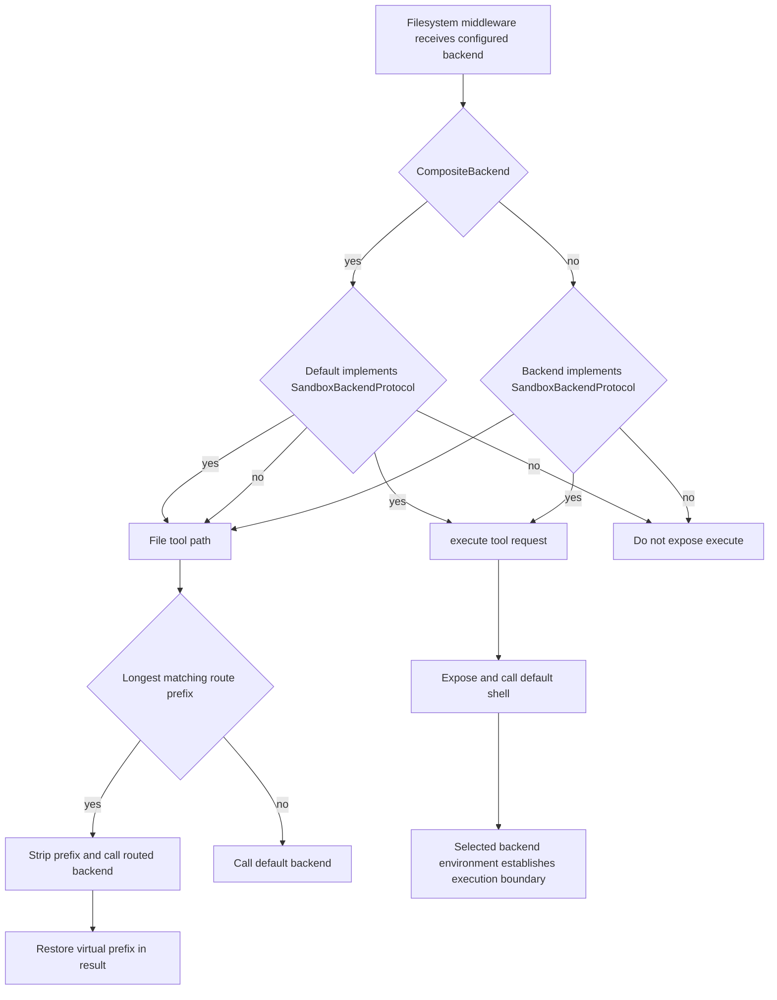

# Backends and Capability Routing

A **backend** is the implementation boundary behind agent file operations. It selects where files live, how long they persist, how virtual paths are routed, and whether a shell exists. It is not a model-visible tool or an authorization policy: [Filesystem middleware](/openwiki/concepts/tools-filesystem.md) registers and dispatches tools, while [permissions and HITL](/openwiki/concepts/permissions-hitl.md) are separate controls.

The important security rule is that **the backend's execution environment establishes the boundary, not model intent, a tool description, a virtual prefix, or a path allowlist**. A local shell remains a host shell even when its file API presents a virtual root. Choose a genuinely isolated sandbox for untrusted execution.

## Contract and result semantics

`BackendProtocol` is the uniform, deliberately partial interface. Its file operations—`ls`, `read`, `grep`, `glob`, `write`, `edit`, optional `delete`, and batch upload/download—default to `NotImplementedError`, so a backend may implement only the operations it can provide. File operations are on this base protocol rather than the shell subtype: `StateBackend` and `StoreBackend` have no process to execute and search in Python.

This is not a promise that tools can fall back to raw shell commands. The backend search contract is literal (not regex), produces structured `GrepResult` and `GlobResult`, honors `max_count`, and preserves filesystem permission behavior. `GlobResult.truncation_reason` distinguishes a recoverable search budget from unreadable paths or transport clipping. Shared glob matching applies relative to the search root: a pattern without `/` matches a basename at any depth; a leading `/` anchors it to the root; dot names require a dot-prefixed pattern. Invalid traversal in glob patterns is returned as an error rather than executed.

Operations report ordinary failures through typed result dataclasses such as `ReadResult`, `WriteResult`, `EditResult`, `DeleteResult`, `LsResult`, `GrepResult`, and `GlobResult`, rather than raising. Batch transfer likewise returns one `FileUploadResponse` or `FileDownloadResponse` per input in input order, allowing partial success and standardized errors such as `file_not_found`, `permission_denied`, `is_directory`, and `invalid_path`.

### Reads, edits, and asynchronous calls

Backends return raw file content; middleware adds model-facing line-number gutters. `ReadResult` enforces coherent pagination at construction: its shown line window is co-present and forward, `total_lines` covers the window, and `next_offset` is exactly the first unshown line. Read implementations clamp a negative offset to zero. A non-positive text limit produces an uninspected empty window (`no_lines_requested`); binary reads are not line-paginated. Exact edit requires a unique old string unless `replace_all=True`.

Every synchronous protocol method has an async counterpart. Default async methods use `asyncio.to_thread`; `agrep` additionally uses a 35-second outer wait and forwards `max_count` only when the concrete implementation accepts it, trimming after completion otherwise. That timeout bounds the caller's wait, not the already-running worker. `delete` is optional, so callers use `_supports_delete` rather than calling the base method to probe support.

Search limits are deliberate operational safeguards: a sync grep phase has `DEFAULT_GREP_TIMEOUT = 15`, `ASYNC_GREP_TIMEOUT = 35`, and a sandbox glob round trip has `ASYNC_GLOB_TIMEOUT = 30`. The sandbox-side glob walk separately caps itself at five seconds, 1,000 brace expansions, and 10,000 matches; the outer timeout also covers interpreter startup, transport, and transfer, preventing a wedged sandbox from indefinitely blocking the caller.

## Capability decision and routing path

`SandboxBackendProtocol` adds only `id`, `execute()`, and `aexecute()` to the file contract. Middleware's `supports_execution()` uses this marker—checking a composite's default backend—to decide whether `execute` is exposed. It inspects `execute` before forwarding a timeout to remain compatible with older backend packages that lack that keyword.

This decision path separates file-path routing from execution: file operations can be mounted; shell execution always goes to the default execution-capable backend. The selected local or remote environment—not the model's requested path—sets the execution boundary.

## Storage and execution choices

| Backend | Storage scope | Shell capability |
| --- | --- | --- |
| `StateBackend` | LangGraph `files` state, within one thread | No |
| `StoreBackend` | Namespaced LangGraph `BaseStore`, across threads | No |
| `FilesystemBackend` | Local disk beneath a configured root in virtual mode | No |
| `LocalShellBackend` | Local disk and host process environment | Yes—unrestricted host shell |
| `LangSmithSandbox` | Isolated LangSmith sandbox filesystem | Yes |
| `ContextHubBackend` | Remote LangSmith Hub agent repository with commits | No |
| `CompositeBackend` | Default plus mounted backend routes | Only when its default has it |

### State and persistent stores

`FilesystemMiddleware()` defaults to `StateBackend()`, and accepts initialized backend instances rather than callable factories (removed in deepagents 0.7). `StateBackend` stores files in LangGraph agent state under `files` through Pregel `CONFIG_KEY_READ` and `CONFIG_KEY_SEND`. Its `fresh=True` read gives read-your-writes behavior within a superstep; queued updates commit at the node boundary. State is checkpointed within a conversation thread, not shared across threads, and using it outside graph execution raises `RuntimeError`. See [State and persistence](/openwiki/concepts/state-persistence.md).

`StoreBackend` is the cross-thread option. A caller-supplied `NamespaceFactory` scopes its `BaseStore` data; namespace components are validated against a safe character set so wildcard/glob syntax cannot broaden lookup scope. It uses the explicitly supplied store or resolves one through `get_store()` at call time. A runtime-dependent namespace needs graph context, while a factory that ignores its runtime can work with an explicit store. Several async methods use the store's native async APIs rather than only protocol thread wrappers.

`ContextHubBackend` persists remote Hub repository content. It maintains a cached tree and overlays pending and in-flight accepted mutations so reads see local changes. A worker batches mutations briefly, each mutator waits for its commit outcome, and a Hub conflict refreshes the tree and rematerializes write, edit, or delete intents before retrying. It has no shell.

### Local filesystem versus a real sandbox

`FilesystemBackend(root_dir, virtual_mode=True)` maps virtual paths under `root_dir`, blocks traversal and verifies resolved containment. It is a virtual-path and path guardrail, **not** process isolation. With `virtual_mode=False`, absolute paths bypass `root_dir` and relative traversal can escape it; use that mode only in trusted local workflows. Its Python grep fallback skips files over configurable `max_file_size_mb`.

`LocalShellBackend` adds `SandboxBackendProtocol` to the filesystem backend, but runs commands on the host with the user's permissions. `virtual_mode` restricts only file operations and never `execute()`. Its default timeout is 120 seconds and its default output capture is 100,000 bytes. Its command environment is empty unless `env` is provided or `inherit_env=True`; inheritance copies `os.environ` and then applies explicit overrides. Do not rely on virtual paths or middleware permissions to contain this backend.

`BaseSandbox` is the extension point for a real execution environment. A subclass implements `id`, `execute()`, `upload_files()`, and `download_files()`; inherited file operations are built from execution and transfer helpers. Those helpers do not reduce the shell trust boundary. Sandbox file reads cap rendered text at `MAX_OUTPUT_BYTES = 500 * 1024` and append `TRUNCATION_MSG`. `LangSmithSandbox` is a `BaseSandbox` implementation over an isolated LangSmith sandbox; it opts into capture-at-source output offload and caches its async client per event loop. Partner packages provide the same adapter shape for Daytona, Modal, Runloop, and Vercel sandboxes; see [sandbox partners](/openwiki/integrations/sandbox-partners.md) for setup and provider-specific behavior.

## Composite mounts

`CompositeBackend` routes paths using prefixes pre-sorted longest-first. A matched prefix is stripped before delegation (the route root becomes `/`); unmatched paths go to `default`; returned paths are re-prefixed. `ls('/')` combines the default listing with synthetic route directories. Writes and edits restore the original path in their result. For batch uploads/downloads, the composite groups inputs by backend, issues one batch per target, then restores virtual paths and input order.

Root searches aggregate the default then routes. They surface the first backend error rather than pretending partial success and OR truncation; glob merging keeps `unreadable` ahead of a simultaneous `budget` reason. Root-wide composite `grep` treats `max_count` as a global cap, passes each route the remaining budget, and conservatively marks results truncated once later routes are skipped. A root-anchored glob skips routes unless its pattern explicitly targets their prefix, preserving root anchoring.

`execute` is intentionally not path-routable: it delegates only to `default` and raises `NotImplementedError` if that backend is not a `SandboxBackendProtocol`. A composite may therefore pair a sandbox default for working files and commands with a `StoreBackend` mounted at `/memories/`; that does not make `/memories/` a shell-visible directory. Only when the default is `LocalShellBackend` and a route is `FilesystemBackend` can middleware provide a virtual-to-host mapping. Store routes, and local routes paired with a remote sandbox default, must be accessed through file tools. If a routed backend lacks optional `delete`, composite converts its `NotImplementedError` to a `DeleteResult` error.

## Tool surface, permissions, and verification

Middleware resolves the chosen backend to a local `resolved_backend` before dispatching file and shell tools. The `tools` allowlist controls model visibility independently of capabilities: an explicit list must contain `read_file`, and listing `execute` or `delete` is a no-op if the backend cannot support it. It also evicts oversized tool or human-message content into backend storage, so the selected backend determines where those artifacts live.

Permissions are enforced in middleware tool implementations, not as a general `BackendProtocol` authorization system. Since a command can evade path-level checks, middleware rejects tool-level permissions for execution-capable backends unless every permission path is scoped to composite routes. Configure HITL separately, and select isolation rather than assuming a permission rule contains a host shell.

Use `StateBackend` for thread-local scratch files, `StoreBackend` for namespace-scoped durable memory, `FilesystemBackend` for trusted local files without shell access, and `LocalShellBackend` only for trusted development or controlled CI. Use an isolated `BaseSandbox` implementation for command execution, `ContextHubBackend` for versioned Hub content, and `CompositeBackend` when these scopes must coexist—choosing its default deliberately because it determines shell capability.

Focused filesystem tests cover virtual and non-virtual resolution, direct-child listings, literal grep including metacharacters, shared glob/dotfile semantics, line pagination, binary/video guards, symlink containment, and ordered partial-success transfers. Composite tests cover prefix normalization and remapping, root aggregation, global grep caps, anchored glob behavior, optional deletion, default-only execution, and batch ordering.
