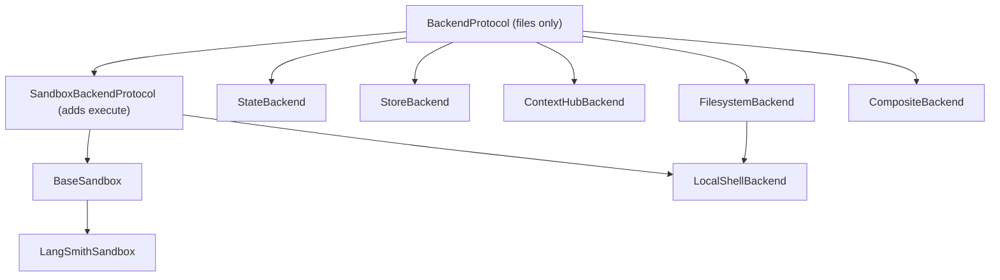

# Backends (Filesystem, State, Store, Sandbox)

A **backend** decides *where* an agent's files, memory, and shell execution
actually live. Every file tool the agent calls (`ls`, `read`, `write`, `edit`,
`delete`, `grep`, `glob`) and every shell command (`execute`) is dispatched by
the [Filesystem middleware](/openwiki/concepts/tools-filesystem.md) to a single
resolved backend object. Swapping that object changes durability (thread-scoped
vs cross-thread vs on-disk vs remote sandbox) and whether a shell exists at all,
without changing the tools the model sees.

All backends implement one uniform interface, `BackendProtocol`, defined in
`backends/protocol.py`. Concrete implementations are re-exported from
`backends/__init__.py`: `StateBackend`, `StoreBackend`, `FilesystemBackend`,
`LocalShellBackend`, `LangSmithSandbox`, `ContextHubBackend`, and
`CompositeBackend`.

## The `BackendProtocol` contract

`BackendProtocol` is an abstract base whose file operations default to
`NotImplementedError`, so a backend can implement any subset. File operations
(`grep`/`glob`/`ls`/`read`/`write`/`edit`/`delete`) live on this base rather
than only on the shell-capable subclass because not every backend has a
process to exec into: `StateBackend` and `StoreBackend` implement
`grep`/`glob` in pure Python and have no `execute` at all. Even where a shell
exists, the file tools are not thin wrappers around `execute` — they enforce
literal-only (non-regex) matching, return structured `GrepResult`/`GlobResult`
objects, support `max_count` truncation, and honor filesystem permission rules.

Results are returned as typed dataclasses (`ReadResult`, `WriteResult`,
`EditResult`, `DeleteResult`, `LsResult`, `GrepResult`, `GlobResult`) that carry
either data or an `error` string rather than raising for expected failures.
`ReadResult.__post_init__` enforces pagination invariants at construction: the
`start_line`/`end_line` window must be co-present and run forward, and
`next_offset` must equal `end_line` (the 0-indexed line after the last shown),
so a backend cannot emit a resume offset that silently skips unshown lines.

Every sync method has an `a`-prefixed async twin; the base implementations wrap
the sync call with `asyncio.to_thread`. `agrep` additionally wraps the call in
`asyncio.wait_for(..., timeout=ASYNC_GREP_TIMEOUT)` as a safety net and forwards
`max_count` only when the concrete `grep` accepts it (checked via
`_method_accepts_max_count`), trimming the result afterward with
`_apply_grep_max_count` either way.

`delete` is explicitly optional; callers use `_supports_delete` (which compares
`type(backend).delete` against the base method) to detect support without
triggering the `NotImplementedError` default.

### Concrete timeouts and bounds

The protocol module pins the timeout constants that bound long-running searches:

- `DEFAULT_GREP_TIMEOUT = 15` — one sync grep phase.
- `ASYNC_GREP_TIMEOUT = (2 * DEFAULT_GREP_TIMEOUT) + 5 = 35` — the async grep
  wrapper, sized to cover the worst-case sync path (ripgrep timeout, then the
  Python fallback timeout) in `FilesystemBackend`.
- `ASYNC_GLOB_TIMEOUT = 30` — the outer bound on a sandbox glob round-trip.

The outer glob timeout exists because the remote sandbox glob script bounds
only its own walk (`TIME_BUDGET = 5.0` seconds in `sandbox.py`, alongside
`MAX_EXPANSIONS = 1000` brace expansions and `MAX_MATCHES = 10000` results);
that budget covers neither interpreter startup, the sandbox round-trip, nor
transferring the matched records, so without an outer bound a wedged sandbox
would hang the caller indefinitely. When traces show timeout or truncation
behavior, cross-reference
[runtime behavior](/openwiki/architecture/overview.md) and the
[sandbox partners integration page](/openwiki/integrations/sandbox-partners.md).

## Shell execution: `SandboxBackendProtocol`

Shell execution is a separate capability layered on top via
`SandboxBackendProtocol`, which extends `BackendProtocol` with an `id` property
and `execute()`/`aexecute()`. A backend that is not an instance of
`SandboxBackendProtocol` has no shell, and the middleware's `supports_execution`
check gates whether the `execute` tool is offered at all. Because older backend
packages may predate the `timeout` keyword, callers guard with
`execute_accepts_timeout(type(backend))` before forwarding a timeout.

`BaseSandbox` (in `sandbox.py`) is the reusable base for remote/isolated
backends: concrete subclasses implement only `execute()` and `upload_files()`,
and all other operations (`ls`, `grep`, `glob`, `read`, `edit`) are derived by
running shell/`python3` scripts through `execute()`. `LangSmithSandbox` is the
partner implementation built on `BaseSandbox`. Sandbox `read()` output is capped
at `MAX_OUTPUT_BYTES = 500 * 1024` and appends `TRUNCATION_MSG` when the cap is
hit.



Which backends carry files only, and which add shell execution.

## Standard implementations and their durability

The resolved backend fixes where data survives:

- **`StateBackend` (thread-scoped default).** Stores files in LangGraph agent
  state under the `files` state key. Reads and writes go through Pregel
  internals (`CONFIG_KEY_READ` / `CONFIG_KEY_SEND`), so it can be constructed
  once and read/write state from any graph context. Reads use `fresh=True` for
  read-your-writes semantics within a superstep. Files persist within a
  conversation thread and are checkpointed after each step, but **not across
  threads**. It must run inside a graph execution or it raises a `RuntimeError`.
  This is the default: `FilesystemMiddleware` uses `StateBackend()` when no
  backend is supplied.
- **`StoreBackend` (cross-thread, persistent).** Adapts LangGraph's `BaseStore`
  for storage that persists across conversations and threads, scoped by a
  caller-supplied `NamespaceFactory` (e.g. per-user or per-assistant). Namespace
  components are validated against a strict character set to prevent wildcard or
  glob injection into store lookups. The store is taken from the constructor if
  provided, otherwise resolved at call time via `get_store()`.
- **`FilesystemBackend` (on-disk).** Reads and writes real files under a
  `root_dir`. With `virtual_mode=True` (default) it treats `root_dir` as a
  virtual root and blocks traversal (`..`, `~`) — useful for path semantics
  under `CompositeBackend` — but this is a guardrail, not sandboxing. It has no
  `execute`.
- **`LocalShellBackend` (on-disk + unrestricted shell).** Extends
  `FilesystemBackend` *and* `SandboxBackendProtocol`, adding shell execution
  directly on the host with no isolation. `virtual_mode` restricts only file
  operations, never `execute()`. Its default execute timeout is
  `DEFAULT_EXECUTE_TIMEOUT = 120` seconds. Intended for trusted local
  development/CI, strongly paired with Human-in-the-Loop review.
- **`LangSmithSandbox` (remote sandbox).** A `BaseSandbox` subclass that runs
  files and shell in an isolated LangSmith sandbox. See the
  [sandbox partners page](/openwiki/integrations/sandbox-partners.md).
- **`ContextHubBackend` (remote hub repo).** Stores files in a LangSmith Hub
  agent repository (persistent, remote), with commit-based versioning and no
  shell.
- **`CompositeBackend` (router).** Delegates to other backends by path prefix
  (below).

For deeper coverage of thread vs cross-thread durability see
[state and persistence](/openwiki/concepts/state-persistence.md).

## How `CompositeBackend` routes

`CompositeBackend` holds a `default` backend plus a `routes` map of path prefix
to backend (e.g. `{"/memories/": StoreBackend(...)}`). Routes are pre-sorted
longest-prefix-first (`sorted_routes`) so the most specific prefix wins. Every
file operation calls `_route_for_path`, which:

- routes `/memories` (the prefix without trailing slash) to that backend as `/`;
- routes `/memories/notes.txt` to that backend after stripping the prefix,
  yielding `/notes.txt`;
- otherwise falls back to `default` with the path unchanged.

Because a routed backend sees a *stripped* path, results are re-mapped back
under the route prefix before returning (paths, grep matches, glob matches). At
the root, `ls("/")` aggregates the default backend's entries plus a synthetic
directory entry for each route. Aggregating operations (`grep`, `glob`) merge
results across backends but surface the **first error** rather than masking it
as a partial success, and OR the `truncated` flag; the glob merge escalates
`truncation_reason` so `unreadable` (which narrowing cannot fix) is never masked
by a co-occurring `budget` truncation.

Crucially, **`execute` is not path-routable**: `CompositeBackend.execute` always
delegates to the `default` backend, and raises `NotImplementedError` if that
default is not a `SandboxBackendProtocol`. Consequently
`supports_execution(composite)` inspects the composite's *default* backend. This
is why choosing a shell-capable default (e.g. `LocalShellBackend` or a sandbox)
is what enables the `execute` tool, while routed backends still supply durable
per-prefix storage such as `/memories/` on a `StoreBackend`.

<!-- openwiki: mermaid parse failed and this diagram was converted to a text fence so it does not break rendering. Fix the diagram source and restore the mermaid fence. Parser error: Heuristic: an unescaped angle bracket inside a label breaks rendering; rephrase the label. -->
```text
flowchart TD
    Call["file op on /memories/note.txt"]
    Route{"matches a route prefix?"}
    Routed["routed backend (path stripped to /note.txt)"]
    Default["default backend (path unchanged)"]
    Remap["remap result paths under prefix"]
    Exec["execute(command)"]
    ExecDefault["always -> default backend"]

    Call --> Route
    Route -->|yes| Routed --> Remap
    Route -->|no| Default
    Exec --> ExecDefault
```

Composite routes file operations by longest-prefix match but always sends execute to the default backend.

## Choosing a backend

- Ephemeral scratch files within one conversation: `StateBackend` (the default).
- Memory that must survive across threads/sessions: `StoreBackend` with a
  namespace factory, typically mounted under a route like `/memories/`.
- Real project files on disk without a shell: `FilesystemBackend`.
- Local coding-assistant workflows needing a shell: `LocalShellBackend` (trusted
  environments + HITL only).
- Untrusted or production shell execution: a `BaseSandbox` implementation such as
  `LangSmithSandbox`.
- Mixed strategies (scratch in state, memory in a store, shell in a sandbox):
  `CompositeBackend`, choosing the shell-capable backend as `default`.

## Where the backend is resolved

`FilesystemMiddleware` stores the chosen backend on `self.backend`, defaulting
to `StateBackend()`, and rejects raw factory callables (backend factories were
removed in deepagents 0.7 — pass initialized instances). Its state schema is
selected from whether the backend is state-based, and every file/shell tool
reads `self.backend` into a local `resolved_backend` before dispatching. The
middleware also refuses tool-level permissions on execution-capable backends
unless all permission paths are scoped to composite routes.
