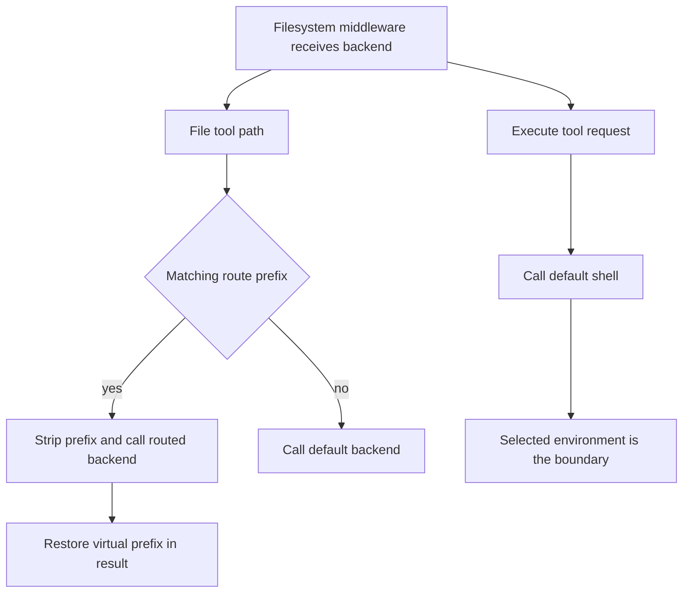

# Backends and Filesystem Routing

A **backend** is the implementation boundary behind agent file operations. It determines where files live, how long they persist, how virtual paths are routed, where middleware artifacts are written, and whether a shell exists. It is not a model-visible tool or an authorization policy: [filesystem tools](/openwiki/concepts/tools-filesystem.md) register and dispatch operations, while [security controls](/openwiki/operations/security.md) are separate concerns.

The important security rule is that **routing is not a filesystem-permission boundary**. A route selects a backend for file-tool calls; it neither authorizes access nor constrains a shell. The execution environment selected by the default backend establishes the command boundary. In particular, a local shell remains a host shell even if its file API exposes only a virtual root. Use an isolated sandbox for untrusted execution.

## Contract and result semantics

`BackendProtocol` is the uniform, deliberately partial interface. Its file operations—`ls`, `read`, `grep`, `glob`, `write`, `edit`, optional `delete`, and batch upload/download—default to `NotImplementedError`, so an implementation can provide only the operations it supports. File operations live on this base protocol rather than the shell subtype: `StateBackend` and `StoreBackend` can search their data in Python but have no process to execute.

This does not mean that registered file tools may fall back to raw shell commands. The search contract is literal, not regex; it produces structured `GrepResult` and `GlobResult`, honors `max_count`, and preserves filesystem permission behavior. `GlobResult.truncation_reason` differentiates a search budget from unreadable paths or transport clipping. Glob patterns are relative to the search root: a pattern without `/` matches a basename at any depth, a leading `/` anchors at that root, and dot names need a dot-prefixed pattern. Refused traversal in a glob is returned as an error rather than executed.

Operations report ordinary failures in typed result dataclasses such as `ReadResult`, `WriteResult`, `EditResult`, `DeleteResult`, `LsResult`, `GrepResult`, and `GlobResult`, rather than by raising. Batch transfer returns one `FileUploadResponse` or `FileDownloadResponse` per input in input order, so partial success is representable with standardized errors.

### Reads, edits, and asynchronous calls

Backends return raw file content; middleware adds the model-facing line-number gutters. `ReadResult` validates pagination at construction: its shown line window is co-present and forward, `total_lines` covers that window, and `next_offset` is exactly the first unshown line. A non-positive text limit produces an empty, uninspected window; binary reads are not line-paginated. Exact edit requires a unique old string unless `replace_all=True`.

Every synchronous protocol method has an async counterpart. Default async methods use `asyncio.to_thread`; `agrep` also bounds the caller wait, conditionally passes `max_count` to compatible concrete implementations, and trims afterward when needed. That timeout does not stop an already-running worker thread. `delete` is optional, so capability checks use `_supports_delete` instead of invoking the base method merely to discover its `NotImplementedError`.

## Capability decision and routing path

`SandboxBackendProtocol` adds `id`, `execute()`, and `aexecute()` to the file contract. Middleware uses that marker to decide whether `execute` is exposed; for a composite, it checks the default backend.

```mermaid
flowchart TD
    Start["Filesystem middleware receives backend"]
    FilePath["File tool path"]
    Route{"Matching route prefix"}
    Routed["Strip prefix and call routed backend"]
    Fallback["Call default backend"]
    Restore["Restore virtual prefix in result"]
    Execute["Execute tool request"]
    Shell["Call default shell"]
    Boundary["Selected environment is the boundary"]
    Start --> FilePath
    FilePath --> Route
    Route -->|yes| Routed --> Restore
    Route -->|no| Fallback
    Start --> Execute --> Shell --> Boundary
```

This flow distinguishes file-path routing from command execution. File operations may be mounted; `execute` goes only to the default execution-capable backend. A prefix does not grant permission and does not make a routed backend's files available to the default shell.

## Storage, lifecycle, and initialization

| Backend | Storage scope | Shell capability |
| --- | --- | --- |
| `StateBackend` | LangGraph `files` state, within one thread | No |
| `StoreBackend` | Namespaced LangGraph `BaseStore`, across threads | No |
| `FilesystemBackend` | Local disk beneath a configured root in virtual mode | No |
| `LocalShellBackend` | Local disk and host process environment | Yes—unrestricted host shell |
| `LangSmithSandbox` | Isolated LangSmith sandbox filesystem | Yes |
| `ContextHubBackend` | Remote LangSmith Hub agent repository with commits | No |
| `CompositeBackend` | Default backend plus mounted routes | Only when its default has it |

### State and durable stores

`FilesystemMiddleware()` defaults to `StateBackend()` and accepts initialized backend instances rather than callable factories. During initialization it recursively inspects a composite default and every nested route. If any branch is a `StateBackend`, it uses a state schema containing the `files` channel; a topology with no state-backed branch uses the base schema. See [State and persistence](/openwiki/concepts/state-persistence.md).

`StateBackend` is graph-context dependent: it stores files in LangGraph agent state under `files` through Pregel `CONFIG_KEY_READ` and `CONFIG_KEY_SEND`. Its `fresh=True` read provides read-your-writes within a superstep; queued updates commit at the node boundary. Checkpointed state persists within a conversation thread, not across threads. Direct use outside a graph execution context, or without the required graph config, raises `RuntimeError`; pre-populate files through agent invocation state rather than calling this backend outside the graph.

`StoreBackend` is the cross-thread option. A caller supplies a `NamespaceFactory` that scopes data in a `BaseStore`; each namespace component is validated as non-empty safe text, rejecting wildcard and glob syntax so a namespace cannot broaden a store lookup. The backend uses an explicit store when supplied or resolves one through `get_store()` at call time. A namespace factory that depends on `Runtime` still needs graph context; an explicit store plus a factory that does not inspect runtime can be used directly.

`ContextHubBackend` persists remote Hub repository content. It caches the tree and overlays accepted pending and in-flight mutations so reads see local changes. A worker batches mutations briefly, each mutator waits for its commit outcome, and a Hub conflict refreshes the tree and rematerializes write, edit, or delete intents before retrying. It has file semantics, not shell execution.

The file-format tests exercise the portable representation behind state and store backends: UTF-8 uploads remain text, non-UTF-8 uploads are base64 encoded, downloads restore the original bytes, and a subsequent text write changes an existing binary file back to `utf-8` while retaining its creation timestamp.

### Local filesystem versus a real sandbox

`FilesystemBackend(root_dir, virtual_mode=True)` maps virtual paths under `root_dir`, blocks traversal, and checks resolved containment. It is a virtual-path guardrail, **not** process isolation or a general permission system. With `virtual_mode=False`, absolute paths bypass `root_dir` and relative traversal can escape it; use that mode only in trusted local workflows.

`LocalShellBackend` combines the filesystem backend with `SandboxBackendProtocol`, but its commands run on the host with the user's permissions. `virtual_mode` applies only to file operations, never `execute()`. Its default execute timeout is 120 seconds; commands use `root_dir` as their working directory, but are not confined there. Do not rely on route prefixes, virtual paths, or middleware path rules to contain it.

`BaseSandbox` is the extension point for a real execution environment. Concrete subclasses implement `execute()` and `upload_files()`; the base derives other file operations from those capabilities. `LangSmithSandbox` is a `BaseSandbox` adapter over an isolated LangSmith sandbox. Partner packages provide the same adapter shape for Daytona, Modal, Runloop, and Vercel sandboxes; see [sandbox partners](/openwiki/integrations/sandbox-partners.md) for setup and provider behavior.

## Composite mounts and artifact placement

`CompositeBackend` routes paths by prefixes sorted longest-first. A matching prefix is stripped before delegation—the routed backend sees its root as `/`; unmatched paths go to `default`; returned paths are re-prefixed. `ls('/')` combines the default listing with synthetic route directories. Batch uploads and downloads group inputs by backend, then restore virtual paths and original input order.

Root searches aggregate the default and routes. They surface the first backend error rather than presenting partial success; glob merging ORs truncation and gives `unreadable` precedence over a simultaneous `budget` reason. Root-wide composite `grep` treats `max_count` as a global cap, gives each route the remaining budget, and conservatively marks output truncated when later routes are skipped. A root-anchored glob skips routes unless the pattern explicitly targets the route prefix, preserving the protocol's search-root anchoring semantics.

`execute` is intentionally not path-routable: it delegates only to `default` and raises `NotImplementedError` when that backend is not a `SandboxBackendProtocol`. A composite can mount a `StoreBackend` at `/memories/` beneath a sandbox default, but that does not make `/memories/` shell-visible. Middleware can provide a virtual-to-host mapping only when the default is `LocalShellBackend` and the route is a `FilesystemBackend`; store routes and local routes combined with a remote sandbox default must be accessed through file tools.

A `CompositeBackend` also owns `artifacts_root`, defaulting to `/`. `FilesystemMiddleware` normalizes this root and places large tool-result files, conversation-history files, and binary blobs below it. A non-composite backend uses `/`. Choose the artifact root because of the storage route it resolves to, not because routing by itself supplies a security policy.

### Binary payload persistence

Set `offload_binary_content=True` to keep binary `read_file` blocks and inline human-message media out of checkpoint history. Middleware writes decoded payloads with batch upload to `<artifacts_root>/blobs/<sha256>`, replaces a successful inline base64 value with a `deepagents_blob` digest reference in state, and hydrates references before a model call. The per-run base64 cache is private and untracked; persisted blobs allow a resumed thread to reload content.

This is best effort rather than a data-loss transformation: a failed upload leaves the payload inline. Hydration accepts only a 64-hex reference whose downloaded bytes hash to that digest. A missing, malformed, unreadable, or tampered blob is replaced with a text notice instead of being sent to the model. Middleware disables offload with a warning when the resolved `blobs/` route is a `StateBackend`, because that would retain bytes in checkpointed state and defeat the option.

## Tool surface, permissions, and operations

The `tools` allowlist controls model visibility independently of backend capability: an explicit list must contain `read_file`, and listing `execute` or `delete` has no effect when the selected backend does not support it. Middleware can also evict oversized textual tool or human-message content into backend storage, so the artifact route determines where those artifacts live.

Filesystem permissions are currently enforced by middleware tool implementations, not by `BackendProtocol` or `CompositeBackend` routing. Because commands can bypass path-level restrictions, middleware rejects tool-level permissions for execution-capable backends unless every permission path is scoped to composite routes; this still does not turn a shell into a restricted filesystem. Configure HITL separately and select an isolated execution environment rather than assuming a path rule, virtual mount, or backend route contains host execution.

Use `StateBackend` for thread-local scratch files, `StoreBackend` for namespace-scoped durable memory, `FilesystemBackend` for trusted local file access without a shell, and `LocalShellBackend` only for trusted development or controlled CI. Use an isolated `BaseSandbox` implementation for command execution, `ContextHubBackend` for versioned Hub content, and `CompositeBackend` when these scopes must coexist. Choose the composite default deliberately because it determines shell capability, and choose `artifacts_root` deliberately because it determines artifact persistence location.

Talon illustrates this split: sandbox mode builds a composite with the provider sandbox as default and host-backed skills and memory routes. Commands therefore go to the sandbox while only those mounted directories are host-backed; configured sandbox startup failure raises `SandboxStartupError` instead of falling back to host execution.

Focused tests cover state-schema selection for direct and nested state branches, artifact-root normalization, blob upload failure and tamper rejection, the shared state/store file format, and composite search/routing boundaries. They are useful safeguards when changing persistence, routing, or model-visible tool behavior.
