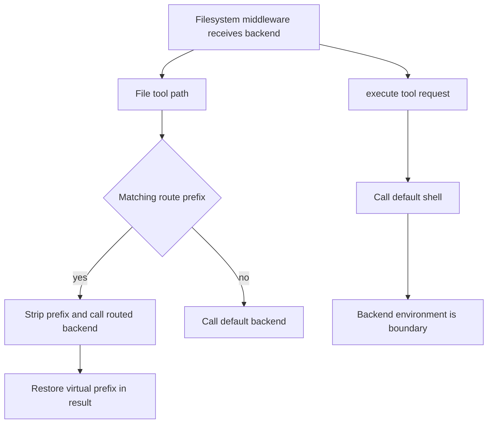

# Backends and Execution Boundaries

A **backend** is the implementation boundary behind agent file operations. It selects where files live, how long they persist, how virtual paths are routed, where middleware artifacts are written, and whether a shell exists. It is not a model-visible tool or an authorization policy: [Filesystem middleware](/openwiki/concepts/tools-filesystem.md) registers and dispatches tools, while [permissions and HITL](/openwiki/concepts/permissions-hitl.md) are separate controls.

The important security rule is that **the backend's execution environment establishes the boundary, not model intent, a tool description, a virtual prefix, or a path allowlist**. A local shell remains a host shell even when its file API presents a virtual root. Select an isolated sandbox for untrusted execution.

## Contract and result semantics

`BackendProtocol` is the uniform, deliberately partial interface. Its file operations—`ls`, `read`, `grep`, `glob`, `write`, `edit`, optional `delete`, and batch upload/download—default to `NotImplementedError`, so a backend can implement only the operations it can provide. File operations are on this base protocol rather than the shell subtype: `StateBackend` and `StoreBackend` have no process to execute and search in Python.

This is not a promise that tools can fall back to raw shell commands. The backend search contract is literal (not regex), produces structured `GrepResult` and `GlobResult`, honors `max_count`, and preserves filesystem permission behavior. `GlobResult.truncation_reason` distinguishes a recoverable search budget from unreadable paths or transport clipping. Shared glob matching applies relative to the search root: a pattern without `/` matches a basename at any depth; a leading `/` anchors it to the root; dot names require a dot-prefixed pattern. Invalid traversal in glob patterns is returned as an error rather than executed.

Operations report ordinary failures through typed result dataclasses such as `ReadResult`, `WriteResult`, `EditResult`, `DeleteResult`, `LsResult`, `GrepResult`, and `GlobResult`, rather than raising. Batch transfer returns one `FileUploadResponse` or `FileDownloadResponse` per input in input order, allowing partial success and standardized errors.

### Reads, edits, and asynchronous calls

Backends return raw file content; middleware adds model-facing line-number gutters. `ReadResult` enforces coherent pagination at construction: its shown line window is co-present and forward, `total_lines` covers the window, and `next_offset` is exactly the first unshown line. A non-positive text limit produces an empty window; binary reads are not line-paginated. Exact edit requires a unique old string unless `replace_all=True`.

Every synchronous protocol method has an async counterpart. Default async methods use `asyncio.to_thread`; `agrep` additionally uses a bounded outer wait, conditionally forwards `max_count` for compatibility, and trims afterward when necessary. That timeout bounds the caller's wait, not an already-running worker. `delete` is optional, so callers use `_supports_delete` rather than calling the base method to probe support.

## Capability decision and routing path

`SandboxBackendProtocol` adds `id`, `execute()`, and `aexecute()` to the file contract. Middleware's `supports_execution()` uses this marker—checking a composite's default backend—to decide whether `execute` is exposed.

```mermaid
flowchart TD
    Start["Filesystem middleware receives backend"]
    FilePath["File tool path"]
    Route{"Matching route prefix"}
    Routed["Strip prefix and call routed backend"]
    Fallback["Call default backend"]
    Restore["Restore virtual prefix in result"]
    Execute["execute tool request"]
    Shell["Call default shell"]
    Boundary["Backend environment is boundary"]
    Start --> FilePath
    FilePath --> Route
    Route -->|yes| Routed --> Restore
    Route -->|no| Fallback
    Start --> Execute --> Shell --> Boundary
```

This shows that file-path routing and execution are distinct: file operations can be mounted; shell execution always goes to the default execution-capable backend. The selected local or remote environment—not the requested path—sets the execution boundary.

## Storage, lifecycle, and initialization

| Backend | Storage scope | Shell capability |
| --- | --- | --- |
| `StateBackend` | LangGraph `files` state, within one thread | No |
| `StoreBackend` | Namespaced LangGraph `BaseStore`, across threads | No |
| `FilesystemBackend` | Local disk beneath a configured root in virtual mode | No |
| `LocalShellBackend` | Local disk and host process environment | Yes—unrestricted host shell |
| `LangSmithSandbox` | Isolated LangSmith sandbox filesystem | Yes |
| `ContextHubBackend` | Remote LangSmith Hub agent repository with commits | No |
| `CompositeBackend` | Default plus mounted backend routes | Only when its default has it |

### State and durable stores

`FilesystemMiddleware()` defaults to `StateBackend()`, and accepts initialized backend instances rather than callable factories (removed in deepagents 0.7). During initialization it recursively inspects the default and all composite routes. If any branch is a `StateBackend`, it selects a schema containing the `files` channel; a topology with no state-backed branch uses the base schema. Thus a state route remains usable even when the composite default is persistent storage. See [State and persistence](/openwiki/concepts/state-persistence.md).

`StateBackend` stores files in LangGraph agent state under `files` through Pregel `CONFIG_KEY_READ` and `CONFIG_KEY_SEND`. Its `fresh=True` read gives read-your-writes behavior within a superstep; queued updates commit at the node boundary. State is checkpointed within a conversation thread, not shared across threads, and using it outside graph execution raises `RuntimeError`.

`StoreBackend` is the cross-thread option. A caller-supplied `NamespaceFactory` scopes its `BaseStore` data; namespace components are validated against a safe character set so wildcard/glob syntax cannot broaden lookup scope. It uses the explicitly supplied store or resolves one through `get_store()` at call time.

`ContextHubBackend` persists remote Hub repository content. It maintains a cached tree and overlays pending and in-flight accepted mutations so reads see local changes. A worker batches mutations briefly, each mutator waits for its commit outcome, and a Hub conflict refreshes the tree and rematerializes write, edit, or delete intents before retrying. It has no shell.

### Local filesystem versus a real sandbox

`FilesystemBackend(root_dir, virtual_mode=True)` maps virtual paths under `root_dir`, blocks traversal, and verifies resolved containment. It is a virtual-path guardrail, **not** process isolation. With `virtual_mode=False`, absolute paths bypass `root_dir` and relative traversal can escape it; use that mode only in trusted local workflows.

`LocalShellBackend` adds `SandboxBackendProtocol` to the filesystem backend, but runs commands on the host with the user's permissions. `virtual_mode` restricts only file operations and never `execute()`. Its default timeout is 120 seconds. Do not rely on virtual paths or middleware permissions to contain this backend.

`BaseSandbox` is the extension point for a real execution environment. `LangSmithSandbox` is a `BaseSandbox` implementation over an isolated LangSmith sandbox. Partner packages provide the same adapter shape for Daytona, Modal, Runloop, and Vercel sandboxes; see [sandbox partners](/openwiki/integrations/sandbox-partners.md) for setup and provider-specific behavior.

## Composite mounts and artifact placement

`CompositeBackend` routes paths using prefixes pre-sorted longest-first. A matched prefix is stripped before delegation (the route root becomes `/`); unmatched paths go to `default`; returned paths are re-prefixed. `ls('/')` combines the default listing with synthetic route directories. Batch uploads/downloads group inputs by backend, then restore virtual paths and input order.

Root searches aggregate the default then routes. They surface the first backend error rather than pretending partial success and OR truncation; glob merging keeps `unreadable` ahead of a simultaneous `budget` reason. Root-wide composite `grep` treats `max_count` as a global cap, passes each route the remaining budget, and conservatively marks results truncated once later routes are skipped. A root-anchored glob skips routes unless its pattern explicitly targets their prefix.

`execute` is intentionally not path-routable: it delegates only to `default` and raises `NotImplementedError` if that backend is not a `SandboxBackendProtocol`. A composite may pair a sandbox default with a `StoreBackend` mounted at `/memories/`; that does not make `/memories/` shell-visible. Only when the default is `LocalShellBackend` and a route is `FilesystemBackend` can middleware provide a virtual-to-host mapping. Store routes, and local routes paired with a remote sandbox default, must be accessed through file tools.

A `CompositeBackend` also owns the optional `artifacts_root`, defaulting to `/`. `FilesystemMiddleware` normalizes that root and places its large tool-result files, conversation-history files, and binary blobs beneath it. A non-composite backend uses `/`; choose an artifact root that routes to the intended durable or sandbox storage rather than assuming artifacts follow the default backend by policy.

### Binary payload persistence

Set `offload_binary_content=True` to keep binary `read_file` blocks and inline human-message media out of checkpoint history. Middleware writes decoded payloads via batch upload to `<artifacts_root>/blobs/<sha256>`, replaces each successful inline base64 value with a `deepagents_blob` digest reference, and rehydrates references before model calls. The per-run base64 cache is private and untracked, while persisted blobs allow a resumed thread to reload content.

This is best-effort rather than a data-loss transformation: upload failures leave a payload inline. On hydration, the middleware accepts only a 64-hex reference whose downloaded bytes hash to that digest. A missing, malformed, unreadable, or tampered blob is replaced with a text notice instead of being supplied to the model. Offloading is disabled with a warning if the resolved `blobs/` route is a `StateBackend`, because that would retain bytes in checkpointed state and defeat the purpose.

## Tool surface, permissions, and operations

The `tools` allowlist controls model visibility independently of backend capability: an explicit list must contain `read_file`, and listing `execute` or `delete` is a no-op if the backend does not support it. Middleware can also evict oversized textual tool or human-message content into backend storage, so the selected artifact route determines where those artifacts live.

Permissions are enforced in middleware tool implementations, not as a general `BackendProtocol` authorization system. Since a command can evade path-level checks, middleware rejects tool-level permissions for execution-capable backends unless every permission path is scoped to composite routes. Configure HITL separately, and select isolation rather than assuming a permission rule contains a host shell.

Use `StateBackend` for thread-local scratch files, `StoreBackend` for namespace-scoped durable memory, `FilesystemBackend` for trusted local files without shell access, and `LocalShellBackend` only for trusted development or controlled CI. Use an isolated `BaseSandbox` implementation for command execution, `ContextHubBackend` for versioned Hub content, and `CompositeBackend` when these scopes must coexist—choosing its default deliberately because it determines shell capability and its artifact root deliberately because it determines persistence location.

Talon illustrates this boundary: when configured, it creates a `CompositeBackend` with the provider sandbox as default and host `skills/` and `memory/` as local routes. Commands therefore run in the sandbox while only those mounted directories are host-backed; startup failure raises `SandboxStartupError` rather than falling back to host execution. An attached sandbox is retained on shutdown, while an owned sandbox is closed.

Focused tests verify middleware schema selection for default, direct, and nested state backends; artifact-root normalization and paths; binary offload, upload failure, and tamper rejection; and sandbox file operations through a local subprocess test double. These tests are useful safeguards when changing routing or persistence behavior.
