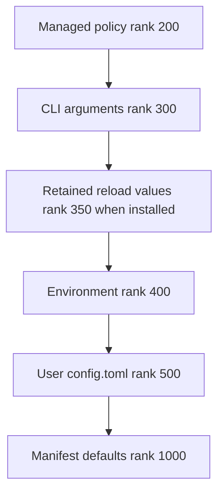
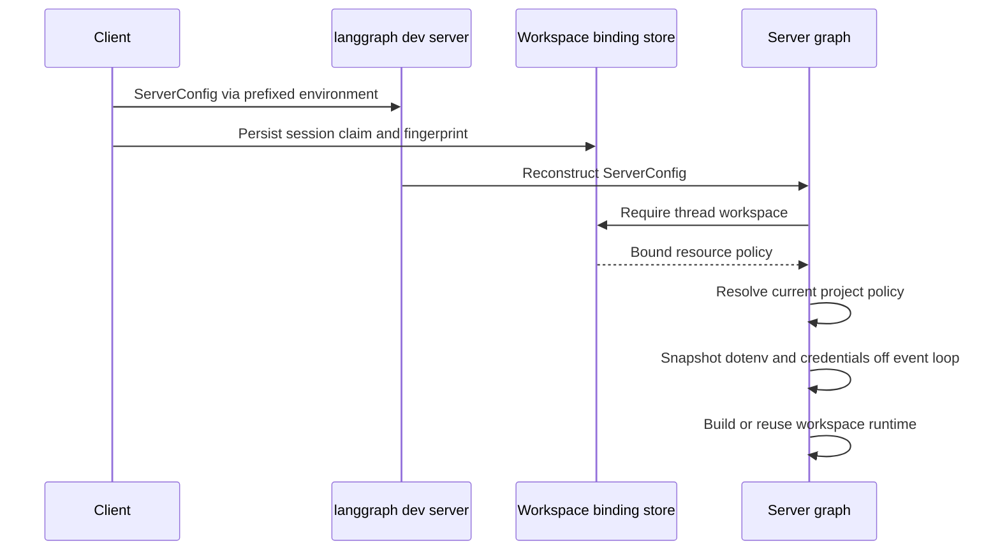

# dcode Configuration Layering

Deep Agents Code (`dcode`) resolves typed settings from ranked sources. Its central consistency choice is to serve one coherent file generation—even when that generation is stale—rather than mix a file edit into only some reads. Managed policy is additionally fail-closed: an unusable replacement must not remove a restriction and let a weaker source win.

For model-specific settings, see [profiles and models](/openwiki/concepts/profiles-models.md). For permission effects, see [permissions and HITL](/openwiki/concepts/permissions-hitl.md); for MCP-specific project trust, see [MCP](/openwiki/integrations/mcp.md).

## Configuration surface, sources, and precedence

`config_manifest.py` is the canonical surface for scalar user-tunable options: it defines each option's type, typed default, environment-variable name, and `config.toml` location. Providers coerce their own raw source values; the generic resolver only orders ranked results and records provenance and provider health. Invalid scalar values—such as malformed numeric, list, duration, boolean, or wrong-typed TOML values—are diagnosed and fall through to a weaker layer, rather than aborting all configuration or discarding valid siblings. Structured tables use dedicated typed loaders and are represented in the manifest for discovery; tables which can contain credentials are redacted by `dcode config`.

Configuration spans user, project, session, and runtime scopes. User `config.toml`, shell environment, and CLI flags describe a user's invocation; a managed policy is an administrator-controlled trust root. Project-derived inputs need separate scrutiny: a checkout can contribute project dotenv values and workspace policy, but it is not thereby trusted to set user-level authorization controls.

For replacement settings, lower rank wins:

The standard replacement precedence chain, including the conditional in-memory reload-retention tier.

Managed policy outranks CLI, runtime retention, environment, and the writable user file. `resolver_from_snapshots()` takes keyword-only `managed=` and `user=` arguments, preventing same-typed snapshots from being transposed and accidentally granting writable user data managed precedence. Provider ranks must be unique. Options select `replace`, `union`, or `deep_merge`; the accumulating strategies retain valid tier contributions while manifest defaults remain a fallback rather than an ordinary accumulated contribution.

The parsed command line becomes an immutable `CliProvider` snapshot of the `argparse` namespace. It can be installed before TOML is read, preserving command-help and group fast paths. A different CLI provider is rejected: one process has one argv. An ad-hoc resolver built from caller snapshots has no CLI tier unless its caller explicitly supplies the installed provider.

## Shared resolver generation and reload lifecycle

`get_config_resolver()` owns the ordinary process-wide resolver cache, keyed by the default user-config path and managed-policy path. On its first normal read it builds the chain from managed and user TOML snapshots, the active environment, manifest defaults, and any installed CLI provider. Ordinary readers using it observe the same file generation. dcode does not watch configuration files for edits.

There are three intentional read models:

- **Shared generation:** managed and user TOML providers retain parsed snapshots. An edit reaches ordinary readers only when the generation advances.
- **Direct snapshot:** a caller can read a file locally when it needs the exact file health it read or precedence the shared chain cannot express. This is a caller-level exception, not a setting-level live-cache option.
- **Active environment:** `EnvProvider` consults `active_environment()` at each resolution and is non-durable. Outside construction this is live `os.environ`; during workspace construction, `use_environment()` supplies an immutable context-local mapping.

A committed in-app write to the default config path refreshes the shared resolver; `/reload` also advances it. A write to another path does not. Since bytes have already been committed, refresh failures after an in-app write are logged and the process continues to serve prior values until a later refresh or restart.

The refresh path preserves a coherent managed and user generation while handling failed candidates.

`TomlFileProvider` retains its last usable snapshot when a reload candidate is missing, unreadable, or malformed, while reporting the failed on-disk status in diagnostics. Thus a malformed user `config.toml` on reload leaves its earlier values effective and produces a `Kept previous config.toml:` notice. On a first failed read, there is no usable snapshot to retain and resolution falls through.

Managed policy has an extra enforceability gate. Invalid enforced declarations, malformed known sections, and managed model selections inconsistent with the managed allowed-model ceiling cannot replace the served policy. The managed candidate is fetched before the resolver generation lock and installed as an already-refreshed replacement; this avoids remote I/O under the lock and prevents the user tier from advancing past policy. A failed managed candidate blocks runtime reload rather than weakening policy.

For the small set of resolver values owned by runtime reload, `_ReloadOverrideProvider` retains an accepted value when the refreshed resolver cannot reproduce it. It is non-durable, atomically replaces its mapping, and has rank 350: continuity state, not a persisted source. Reload preview reads a fresh user candidate to show the edit under review, but deliberately does not refresh the policy generation currently being enforced.

## Project dotenv is input, not policy

The dotenv stack is derived from an explicit environment mapping. Existing shell values win; enabled nearest-project and global-profile dotenv files can fill absent values. `resolve_read_project_dotenv()` runs before the project `.env` is applied, so it resolves locally: it needs a trusted global-dotenv tier between process environment and user TOML that the shared resolver cannot express, without making dotenv bootstrap establish the shared resolver generation as a side effect.

A repository-controlled project `.env` cannot inject the project-MCP allow/deny lists, Auto classifier model or timeout, forked-subagent mode, `LANGGRAPH_DEFAULT_RECURSION_LIMIT`, or `TERM_PROGRAM`. Those controls remain available from the launching shell and trusted global dotenv. `resolve_env_var()` gives a `DEEPAGENTS_CODE_{NAME}` credential or provider variable precedence over `{NAME}`; an explicitly empty prefixed variable suppresses the canonical value.

## Server handoff and workspace authority

The interactive client launches `langgraph dev` in a separate Python process, so it cannot share the client resolver's memory. `ServerConfig` is the typed handoff contract: the launcher derives it from CLI values, normalizes relative paths against captured project context, serializes it as `DEEPAGENTS_CODE_SERVER_*` variables, and clears a variable for `None` instead of serializing an empty string. The server reconstructs and validates this payload; an explicit filesystem-tool allowlist must be non-empty and contain `read_file`.

Not every value crossing this boundary has the same authority. Session workspace fields are client-supplied claims about the CLI invocation and are checked for agreement with the persisted binding. In contrast, project workspace fields—MCP configuration and trust, extension paths and trust, and sandbox setup—are resolved by the server for the target project directory. The server must never accept those code-execution-affecting decisions as a client claim, because doing so could apply one checkout's policy to another directory.

The subprocess handoff, client claim verification, and server-side project-policy resolution are distinct controls.

Workspace bindings are durable SQLite rows keyed by thread ID. A binding records canonical workspace identity, resource key, configuration fingerprint, and server-authoritative workspace policy. On execution, `make_graph()` requires both a thread ID and workspace context; the context must match the persisted binding. Before selecting a runtime, the server resolves current policy for that binding's workspace and rejects project-policy drift or a changed non-secret server-config fingerprint. This keeps a thread from silently changing its resource or execution authorization after it was bound.

The runtime cache is a 32-entry LRU keyed by binding resource key. A configured sandbox is process-wide and can be claimed by only one workspace. Before graph assembly, `_make_graphs()` creates a workspace-specific dotenv mapping and `CredentialsSnapshot` in a worker thread, freezes the mapping, and enters `use_environment(workspace_env)` for construction. Resolver and credential reads during construction use that workspace snapshot instead of mutable server `os.environ`; later parent reloads or environment changes do not rewrite an already-built runtime.

## Adding or changing a setting safely

1. **Define the scalar contract in the manifest.** Add its key, type/coercer, typed default, TOML location, environment and CLI metadata, merge strategy, and redaction behavior where appropriate. For structured configuration, extend its dedicated typed loader instead of flattening it into the generic scalar path.
2. **Choose source semantics deliberately.** Decide whether invalid input falls through, which rank and merge strategy apply, and whether a managed declaration must be enforceable. Do not weaken the keyword-only managed/user snapshot boundary or introduce a duplicate rank.
3. **Choose a read lifecycle.** Ordinary consumers should use `get_config_resolver()`. A direct snapshot reader must document why its precedence or health requirement cannot use the shared generation, and must choose explicitly whether it needs the installed CLI provider.
4. **Preserve reload safety.** Add tests for valid resolution, malformed source values, last-usable retention, and failed managed refresh. A bad managed refresh must never expose weaker settings.
5. **Maintain the project trust boundary.** Treat project `.env`, project MCP configuration, extension configuration, and sandbox setup as repository-controlled input. Do not allow them to override user-level security or authorization settings without the existing trusted resolution paths.
6. **Extend server and workspace contracts together.** For a server-facing setting, update `ServerConfig` construction, validation, `to_env()`/`from_env()`, and the launcher. Classify it as a checked session claim or as server-resolved project policy; include resource-affecting values in workspace payload/fingerprint and drift validation.
7. **Test the relevant boundary.** `test_configuration_resolution.py` covers enforced-policy and source-resolution behavior; `test_configuration_resolver.py` covers ranks, merges, and snapshot behavior; `test_reload.py` covers preview, retained user configuration, and notices; `test_server_config.py` and workspace/server graph tests cover the subprocess and workspace authority contracts.
