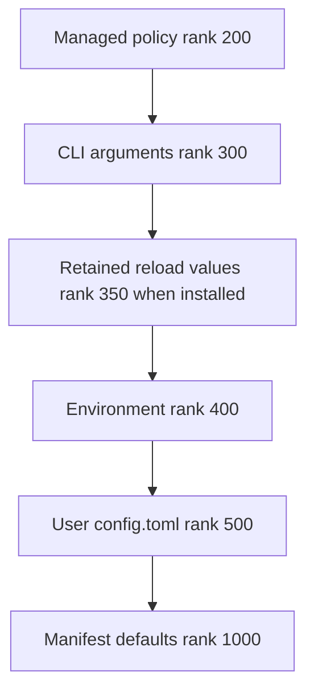
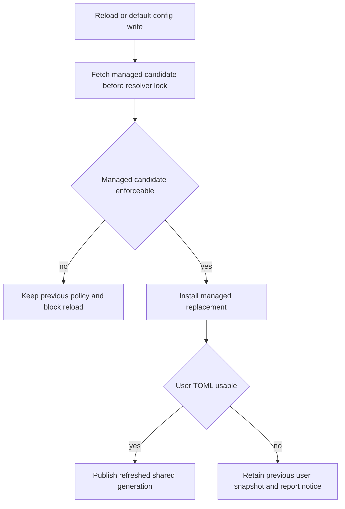
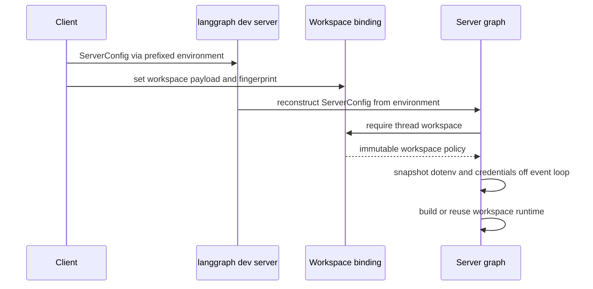

# dcode Configuration Layering

Deep Agents Code (`dcode`) resolves typed settings from ranked sources. Its central consistency choice is to serve one coherent file generation—even if it is stale—rather than mix an edit into only some reads. Managed policy is additionally fail-closed: a bad replacement must not remove a restriction and let a weaker source win.

For model-specific settings, see [profiles and models](/openwiki/concepts/profiles-models.md); for a session lifecycle, see [run a dcode session](/openwiki/workflows/run-dcode-session.md).

## Source model and precedence

Configuration spans user, project, session, and runtime scopes, letting a project share defaults and integrations while a user retains credentials, preferences, skills, and local settings. The generic resolver knows only ordered provider results (`Found`, `Unset`, or `Invalid`), provider health, and numeric provenance. Filesystem, environment, UI, model, and manifest-specific coercion belong to providers and their domains.

For replacement settings, lower rank wins:

The standard precedence chain, with the conditional in-memory reload-retention tier.

Managed policy is the trust root. It outranks CLI, runtime retention, environment, and the writable user file; consequently, environment normally overrides `config.toml`. `resolver_from_snapshots()` accepts `managed=` and `user=` as keyword-only arguments, preventing two same-typed snapshots from being accidentally swapped and thereby assigning user data managed precedence.

An option chooses `replace`, `union`, or `deep_merge`. The combining strategies retain valid contributions from tiers; if values cannot be combined, the strongest provider supplies the result. Provider ranks must be unique.

## Shared resolver generations

`get_config_resolver()` owns the normal process-wide resolver cache. It has one entry keyed by `DEFAULT_CONFIG_PATH` and the managed-policy path. On a cache miss it loads the user file and combines that snapshot with the current managed snapshot, an environment provider, manifest defaults, and the installed CLI provider when present. Reads through that resolver therefore share the same file generation.

The parsed command line is a separate `CliProvider` snapshot of the `argparse` namespace. It can be installed without loading TOML, preserving help and command-group fast paths; the first normal resolver read incorporates it. A different CLI provider cannot replace the installed one, because a process has one argv. Callers that create an ad-hoc resolver from snapshots must explicitly pass the installed CLI provider if they need CLI provenance.

### File snapshots versus the environment

There are three intentionally different read models:

- **Shared resolver generation:** managed and user TOML providers retain parsed snapshots. They change only when the generation is advanced, so shared readers cannot observe different file edits.
- **Direct file snapshot:** a caller may parse a file itself to report the exact value and health it inspected, or to implement precedence that the shared chain cannot express. This is a caller-level exception, not a per-setting choice.
- **Active environment:** `EnvProvider` has no cached value and reads `active_environment()` for each resolution. Outside runtime construction that is live `os.environ`; within `use_environment()` it is the construction-scoped immutable mapping. Thus “live environment” does not mean every server-construction read directly observes mutable process `os.environ`.

The environment provider is non-durable, whereas TOML and defaults are durable. This design accommodates dotenv bootstrap and cwd changes without making file snapshots live.

### Dotenv and credential trust boundary

A dotenv stack is derived from an explicit environment mapping: existing shell values win, then an enabled nearest project `.env` and the global profile `.env` can fill absent values. `resolve_read_project_dotenv()` must run before that project layer is applied, so it uses a local configuration read rather than bootstrapping the shared resolver as a side effect.

A cloned project's `.env` cannot set the project-MCP allow/deny lists, auto-classifier model or timeout, forked-subagent mode, `LANGGRAPH_DEFAULT_RECURSION_LIMIT`, or `TERM_PROGRAM`. Those are user-level security, execution, or tracing decisions and remain available through shell exports and the trusted global dotenv. Environment lookups that use `resolve_env_var()` additionally give `DEEPAGENTS_CODE_{NAME}` precedence over the canonical credential/provider variable; an explicitly empty prefixed value suppresses the canonical value.

## Reload and failure semantics

dcode does not watch files. Editing `config.toml` does not affect shared-resolver reads until a generation advance: an in-app write to `DEFAULT_CONFIG_PATH` or `/reload`. A committed write to another path deliberately does not refresh the shared resolver. If refresh after a default-path write fails, the failure is logged—not returned as a write failure—because the bytes are already committed; this process continues serving prior values until a later refresh or restart.

The reload path validates policy before publishing a new generation and preserves usable user settings on a failed user-file read.

`TomlFileProvider` retains its last usable snapshot if a refresh candidate is missing, unreadable, or malformed, while exposing the failed on-disk status in diagnostics. A first failed read has no prior snapshot and falls through. A malformed user file during reload produces `Kept previous config.toml: ...`; the old value remains effective.

Managed policy has a stronger enforceability gate: a parseable candidate with an invalid enforced value or malformed known section cannot replace served policy. Managed data is fetched before the resolver generation lock and installed as an already-refreshed replacement. This avoids remote I/O under the lock and prevents the user tier from advancing beyond the managed tier into a split generation. A managed failure blocks the runtime reload and reports a blocking “Kept previous settings” notice.

For the small set of reload-owned resolver values, `_ReloadOverrideProvider` can retain an accepted value the refreshed resolver cannot reproduce. It is non-durable, atomically replaces its mapping, and sits at rank 350. It is a narrow continuity mechanism, not another persisted configuration source.

## Intentional direct snapshots

Direct readers do not weaken the shared-generation contract; they make their own snapshot boundary explicit.

- `get_config_sources()` loads a user snapshot plus the current managed snapshot for source/health reporting. With an explicit `user_path`, it excludes managed policy so tooling cannot mistake a single-file inspection for effective configuration.
- `update_check` resolves freshly read managed and user snapshots so its result and health describe the same inspection rather than a process cache.
- `resolve_read_project_dotenv()` parses locally before project `.env` data is added to the environment; it needs a trusted global-dotenv tier the standard shared chain cannot express.
- `resolve_startup_mode_with_source()` needs the raw `[startup]` table for its `recent` fallback, which a `ResolvedValue` does not expose.
- Reload preview reads a fresh user candidate to show the edit under review, but does not refresh managed policy because a dry run must not mutate the policy generation. It uses its explicit preview environment rather than accepting a hit from the shared resolver’s active environment.

## Handoff and workspace isolation in the server process

The interactive app launches `langgraph dev` in a separate Python process, so it cannot share the client resolver’s memory. `ServerConfig` is the typed invocation payload: the launcher builds it from CLI-derived arguments, normalizes user-relative paths against the captured project context, and serializes it to `DEEPAGENTS_CODE_SERVER_*` variables. `None` clears a variable rather than becoming an empty string.

The client-to-server invocation handoff and the execution-time workspace binding are separate checks.

`make_graph()` requires a thread ID and valid workspace context for an execution request, obtains the thread's persisted binding, and selects its runtime from that binding. When it builds a workspace runtime, the server reads `ServerConfig.from_env()` again, substitutes the binding's cwd/project root, and rejects a changed server payload when its fingerprint or non-secret workspace policy differs from the binding. Cached workspace runtimes are keyed by immutable binding resource keys and bounded with an LRU; a configured sandbox is process-wide and can be claimed by only one workspace.

Before graph assembly, `_make_graphs()` creates a workspace-specific dotenv mapping and `CredentialsSnapshot` in a worker thread, freezes that mapping, and enters `use_environment(workspace_env)` for construction. Resolver reads, credential-dependent tool selection, extension gating, and explicit `environ=workspace_env` passed to agent construction therefore use that immutable workspace snapshot. This is neither a transfer of the parent resolver cache nor a promise that later parent reloads or mutable server environment changes update an already-built workspace runtime.

Security-sensitive payload fields are validated again at reconstruction. In particular, a present filesystem-tool allowlist must be a non-empty JSON list of recognized tool names and must include `read_file`; malformed or unsafe values raise rather than falling back to unrestricted access.

## Safe change checklist

1. Add coercion and source-specific behavior in a provider or manifest domain; do not teach the generic rank engine about a subsystem.
2. Choose rank and merge strategy deliberately, preserving managed-policy precedence and keyword-only managed/user snapshot construction.
3. Use `get_config_resolver()` for ordinary process reads. Document any direct snapshot as a caller-level exception and decide whether it needs the CLI tier.
4. Preserve last-usable behavior and test failed managed refreshes so lower-ranked settings cannot become effective.
5. Treat a project `.env` as untrusted for user-level security controls; preserve denylist enforcement and explicit environment snapshots.
6. When adding a server-facing setting, add it to the shared `ServerConfig` serialization/deserialization contract, include it deliberately in the workspace payload/fingerprint when it affects resources, and validate it at the subprocess boundary.
